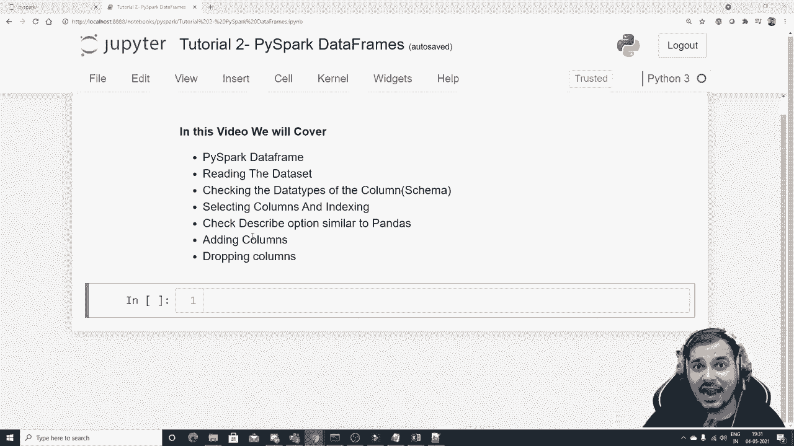
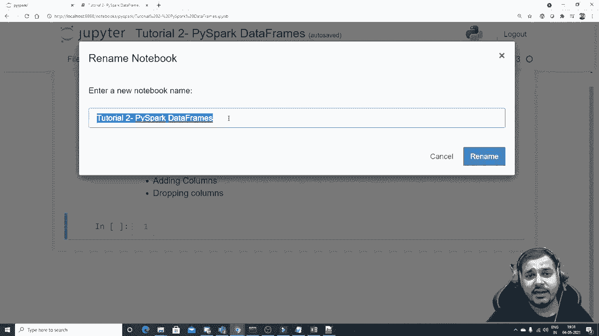
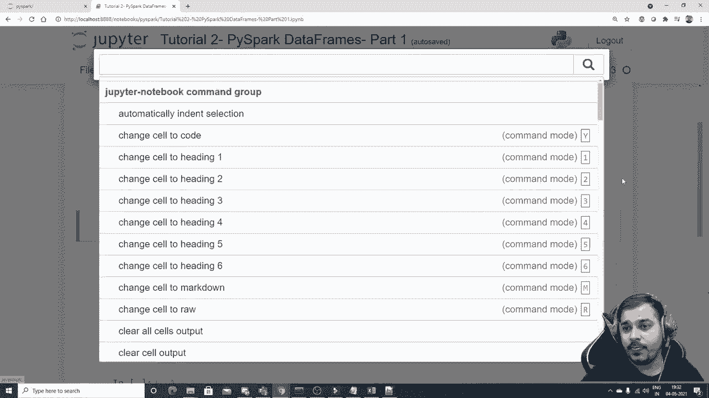
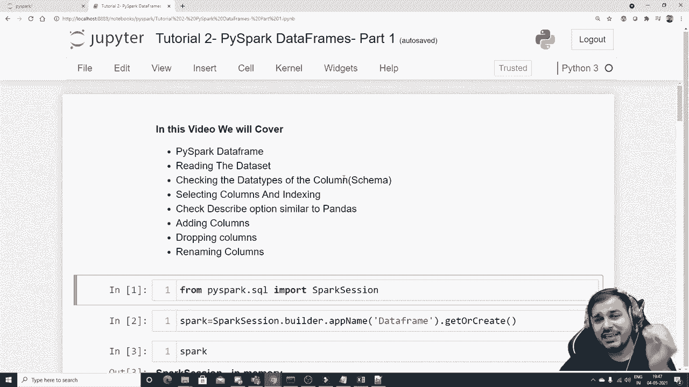

# 【双语字幕+资料下载】PySpark 大数据处理入门，带你玩转Python+Spark大数据操作与分析！＜实战教程系列＞ - P2：L2- Pyspark 数据帧 - ShowMeAI - BV1sL4y147dP

。

Hello all。 My name is Krisushnaak and welcome to my Udish channel。 So guys we will be continuing the Pipar series。 and in this tutorial we are actually going to see what Pispar data frames we try to read the data set。 check the data types of the columns we basically say in Pipar call a schema then well see that how we can select the columns and do indexing describe functionality that we have similar to pandas and then we'll try to see that how we can add new columns and probably drop columns this is just the part1 So let me just write it down as part one because after this they will also be one more part。

 why this video will be important because in Pipar。 Also if you are planning to apply M the machine learning libraries really need to do data precrosing initially probably in the part two will try to see how to handle missing values and will try to see how to alter the rows how we can probably put a filterer condition and all right So let's proceed before going ahead what I'm going to do is that we will first of all I have a。

😊。

set called as test1。 So I've taken three columns。 One is name， age and experience。 And then I have a data set like Kris 31，10 like this。 So the Sunny right。 So this is some data set。 which I have saved in the same location。 Now what I'm going to do， first of all， as usual。 the first step with respect to Pipar is to build the Pipar session。 Now。

 in order to build the Pipar session。 I will write the code line by line。 So please make sure that you also do along with me。 it will definitely be helpful。 So I'm going to write from Pipar。😊，Dot sqel。Import。Spark session。 and then I will create a variable Os， sorry。

Then I'll start to create a variable regarding my session。 So I'll write Sp is equal to Sp session dot。 We basically write builder dot app name。And here I'm just going to give my app name as practice。 I can just say or let me write data frame practice or data frame， right， something like this。

 since we are practicing data frame dot get or create function。 And this is how you actually start a session。 So once and again。 if you're executing for the first time， it will take some time。 Otherwise itll it is perfect to go。 So here is my entire spa， it is running in memory， the version that it is running over here。

 And obviously， when you're running in the local， you basically have one master node。 Okay。 and the app name is data frame。 So to begin with we' try to read the data set again。😊。So let's read the data set now reading the data set I have already shown you multiple ways one is through read option one is to and since this is a CV file we will try to read it first first option we try to see how we can actually read it and then I'll show you multiple ways of reading it okay so I'll write spark dot。

Re dot options。And here in this option， we basically say key value。 right。 So here I'll just make it as header physical to true so that， you know。 it should be considering my first row as the header。And here I'll write it has head true dot CSsv inside the CSv。

I' give my dataset name that is called test1 dot Cism right Now when I execute this probably I think you'll be able to see the data set。 So here you are able to see that。 Okay， it is a data frame and you have features like name age experience right So if I want to see the complete data I'll just write dot show So here is my entire data set over here very clearly I can see it Now let me just save this in a variable call Df underscoreco pipar。

 Okay so here is my entire data sets。 Now first thing， how do we check the schema。 let's check the schema。 Okay， schema basically means the data types like how we write in pandas Df dot info Similarlyly。 we can write over here。 So here you'll be able to see that I have written Df undercope Ipar dot。😊。Print。Think it should work print schemechema。No type has spring schema Oh sorry。

 So I had written dot showed and saved in a variable。 I'll remove this dot show。 let me execute it once again。 And now if I write print schema here you'll be able to see name age and experience。 but by default， it is taking a string。 even though in my Excel sheet。 what we have done is that we have written values， probably this should be string。

 this should be integers， then this should be integers。 But white it is taking it as string the reason it is probably taking a string guys because by default unless until we don't give one more option in Csv this Csv have one option call us infer schema。

 Okay if I don't make this as true right it will by default。 consider all the features as you know in the string values， string values。 So I'll execute this now。 And now if I go and see Df underscore P dot print schema。 you'll be able to see that I'm getting name as string age as integer experience as integer and the level is to do。

 that basically is it can have null values。 so this。😊。One way of reading it one more way Ill try to show you。 which is pretty much simple so I can include both header and infofer schema in one thing itself so Ill write B F underscorecope I spark is equal to spark dot read。Dot CS SV And inside this CS S V。 And， first of all， I will provide my test file， C SV。Okay。

 and then here I will go ahead and write header。Probably equal to true。And I can write in for schema I。 So when I write like this。 And if I write D F underscore。Picepar dot show。 here。 you'll be able to see all my data set。Okay， so here is my entire data set。 Now， if I go and see and execute this schema again， it will probably give me the same way。

Like how we have， we had over here。 Okay， so here you can see name is to string is is to integer。 experience inte to integer。 perfect。 So what all things we have done。 we have understood about this one。 And right， if I go and see the type of this。😊。If I go and see the type of this， this is basically a data frame。 Panda also have a data frame。

 So if somebody ask you an interview， what is a data frame。 you can basically say that data frame is a data structures， you know。 because inside this you can perform various kind of operations。 So this is also one kind of data structures。 Okay。 so what are things we have actually done I've given an introduction of data frame reading the data set。 Now checking the data types of the column。 in order to check the data types of the column。 we have already just written print schema。 Okay， now one more thing that I can do after this。 let's see selecting columns and indexing。 first of all， let's understand。

Whatatttle columns are basically present how you can get all the column names。 So in order to get the column names， you can just write dot。Columns， okay。 and when you execute over here， you'll be able to get the column name like name age experience。 perfect。 This is perfectly fine。 Now， this is my D。 Now。

 suppose if I want to pick up some head elements Also。 I will be able to pick up because in pandas Also you havet head。 supposeupp I see I want to get the top three records。 I will be getting in this particular format in the list format， usually in pandas when we are using。

 we usually get in a data frame format。 So here you'll be seeing the combination of name age and experience。 Okay， like this， This is my first row。 This is my second row。 This is my third row。 Okay。 now coming to the next thing that we are going to discuss now， how do I select a column， You know。 I probably want to pick up a column and see all the elements right， like how we do it in pandas。

 So first of all， let me just write it like this。😊。Pspar dot show here willll be able to see all the columns。 Now。 if I really want to pick up only name column。 Okay， so how do I do it， Okay， let's。 let's actually see now in order to pick up the name column。

 there is very simple functionality that we write， which is called as Pipar dot select。😊。And here I will just give my name column now once I execute this you will be able to see the return type is data frame okay the return type is data frame and name is basically a string now if I write dot show I will be able to see the entire column okay so when I do this I will be able to see this and if I try to find the type of this。

So sorry， if I remove this dot show and see the type of this， this is basically a data frame。 Pipar dot sql dot data frame， dot data frame， not pandas dot data frame。 Okay， pretty much simple。 now， suppose I want to pick up multiple rows。 like I sorry， multiple columns。 Like I want to pick up name and experience， probably two columns I want to pick up。 So what I'll do。

 I'll just make one changes here initially， I was providing my one column name like this after this。 what I'll do。 I will provide another column， which is like experience。😊，And I'll execute this。 Now。 once I execute this over here， you can see that case， I'm getting a data frame with two features。 One is name and experience。 Now， if I go and write dot show。😊。

Here you will be able to see my all my elements are basically present inside this particular data frame pretty much simple days how do you select multiple rows and yes here slicing definitely will not work because I tried doing slicing it was not working okay and okay whenever you have any kind of concerns always try to see the documentation。

😊，The Pi park documentation， Pre much simple。 Okay。 this is one way that how we can actually select the columns and probably see the rows。 Okay。 now let's show you， if I just want to pick up， there is also one way like the C。 if I write D of Pipar of name。If I execute this here， you'll be able to see column name。

 The return type will be column over here。 if I'm directly picking because in pandas。 we directly pick like this right and then we have this kind of columns。 definitely just not we are just able to understand what this particular feature。 It is basically a column it is saying okay nothing more we won't be able to get the data C。

 there will be no show function it will be saying that it is basically an error So usually what we do whenever we want to get or pick up any kind of columns and try to see it。 we basically need to select using this particular select operation， which is my function。

 Okay so these all things have been done guys what we try to understand。 Now let's see how we can check the data types。 So there is a functionality， which is called D types。 So here you'll be able to see name is called to string age is called to end experience it is to And again D types is pretty much similar because we also use this in pandas most of the functionality are similar to pandas guys So what are things we have actually done。

 Let's seepar data name reading the data。😊，Sa checking the data type。 selecting columns and indexing check the describe options similar to panda。 so we can also check out the describe options。 So lets see。Picepar dot describe。 and if I execute this you will be able to see it will give you a data frame summary is to string this this this information is there Now when I write dot show。

😊，Okay。You will be able to see all this this is basically in the form of data frame。😊。You may be thinking why this nug values is coming mean and standard deviation。 because understand even in this， it will take the string column also。 basically the values that are having the data type of string away here， obviously。

 you don't have anything。 So min and max is basically taken on the index because in the0 in the second index。 you will be able to see crashes then after that sun is there。 Okay。 in the fourth index and remaining all this information are actually present。 Okay。 so this is basically the same like the describe options that we are actually seen。😊，You know。

 probably in our pandas， right， So similarly， we have actually done that。 Okay。 so describe option is also done。 So now now， let's go and see adding columns， dropping columns。 Okay， adding columns and dropping columns is very， very simple。 guys。 If we need to add the columns。 So I'm just going to write the comment over here， adding columns。

In data frame and this data frame is pipar data frame。 Okay， now in order to add the column。 So we have an amazing functional function， which is called as Df Pi spark dot。 there is something called as width column Okay now this width column if I see the functionality it returns a new data frame by adding a class or replacing the existing column that has the same name Okay。 so here the first parameter that I am going to give is my column name。 supposeupp I want to pick up。

 let's see I'll pick up experience。😊，So I'll say experience okay。 and probably this will be my new column after two years。 what will happen if experience after two years， you know。 initially the candidate is 10 years experience after two years。 it will become 12 right so we'll try to put now the value This is my new column name and what value it should have so for that I'll write Df P spark and here I'll say probably I'll take that spa experience。😊，I will multiply by I will add by two because after two years， the experience will get added by two。

 just I'm taking one， one way of actually solving this。 I can put any values I want guys it is up to you。 Okay， and you can actually check it out。 Okay。 now after this， this is only the two things that is required。 And now if I execute it。 you'll be able to see that some operation will happen。 And now you in this data frame， you have1，2。

3 and 4 feature。 If I want to see the complete data set， I can write dot show。😊。Once I execute it now here we willll be seeing that experience after two years is nothing but 12，10。66 because 10 plus 2 12 you have very， very simple guys。 And this is what width column is basically told as and you can also do different different things with respect to this。

 So this is how you can add a column in a data frame。 And again， guys。 this is not an in place operation， you basically need to assign it to a variable in order to get reflected。 supposeupp if I want to get it reflected， I really need to assign like this And here now if I go and see my sorry first of all。 let me remove this show the show will not give us proper result。😊，Okay哦。

Has no attribute width column。Okay， sorry， so this， there was a problem with respect to this。 I'll。 I'll read this data set because I replaced it it completely， right。 Now I will execute it once again。Now is fine。 Now， if I go and write dot show here。 you will be able to see the elements all properly given。 Now。

 this was with respect to adding the columns with。Data frame。 Now。 I probably need to drop the columns also。So drop the columns。 Let's see how we can actually drop the columns。 Dping the columns is pretty much simple。 like how we usually drop this drop functionality by default， take column names。

 You can give a list of columns。 you can give a single column name。 So suppose Ill say experience after two years。 I want to drop this。Because who knows after two years what will happen。 So let's drop this in order to drop this。 just execute like this and just go and see dot show。

Here you will be able to find out without that specific column again。 this is not an in place operation you need to assign it to a variable very most simple。 so let me just assign it to a variable。Is it called to and please make sure that you remove this dot show。 dot show is a functionality right now， if I write this dot show。

Here you'll be able to see all the elements。Good， now let's go ahead and。See how to rename the column。So we are just doing this guys because you really need to be very good at data pre processing。 Okay， so I'll write thought and there is another function， which is called as width。😊，Column rename。 Okay， now in this， you just give your existing and the new column name。

 Suppose I my existing column name over here。 I'll say name， and I'll say new name。Okay and just execute it。 and now if I go and just write dot show and try to see the elements here you will be able to see instead of name there will be something called as new name right now this is what I had to actually discuss。

 I am just writing one more point over here。 we have also discussed about our renaming columns。Right。Yes， this is just the part one of data frames。 The part two will try to do something called as filter operation。 And in filter operation will try to see various operation guys， it'll be pretty much amazing。 You'll be able to learn a lot。 So I hope you like this particular video。

 Please just subscribe the channel if youre all this sky I see in the next video。 Have a great day。 Thank you on it all。 And guys， keep sharing。 Keep supporting I see in the next video。 Bye bye。😊。