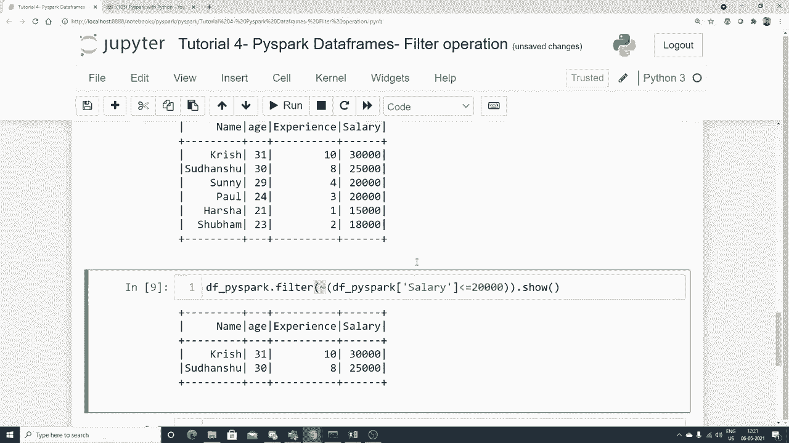

# 【双语字幕+资料下载】PySpark 大数据处理入门，带你玩转Python+Spark大数据操作与分析！＜实战教程系列＞ - P4：L4- Pyspark DataFrames 过滤操作 - ShowMeAI - BV1sL4y147dP

。

Hello all。 my name is Kushak and welcome to my YouTube channel。 So guys we will be continuing the Pispar playlist series and when I started this particular series guys。 they were request for many people to please also complete the MysQL with Python playlist also don't worry about it guys now since you have that specific request also what I'll do is that every day one Pipar video1 SQL videos at least I'll try to do it I also wanted to complete that particular playlist。

 but because of time I was not able to create much more materials So because of that it laggged but don't worry again。 the main aim is to upload more and more videos for you all so that you'll be able to follow them properly you'll be able to utilize them for your successful transition in any career that you're going ahead so please make sure that just be patient I'll try to upload parallelly both of this and I will try to complete the playlist。

 So yes enjoy this particular videos guysello my name is Krna and welcome to my YouTubetu channel。

Guys， today we are in the tutorial for of Pi Park data frames and here in this particular video we are going to discuss about filter operation。😊，AF up operation is pretty much important for data preprosing technique。 If you want to retrieve some of the records based on some kind of conditions。 some kind of boolean conditions， we can definitely do that with the help of filter operation。

 Now guys， please make sure that you follow this particular playlist with respect to Pipar I will be uploading more and more videos as we go ahead and remember one more thing there was a lot of complaint from people telling to upload sql with Python。 don't worry parallel I'll start uploading sql with Python。

 I make sure me sorry because of some delay because I was doing some kind of work busy with something but I'll make sure that I'll try to upload all the videos。 So parallel Sql with Python will also get uploaded。 So let's proceed。 Now first of all。 let me go and make some cell。 Now today for this， Ive taken a data set， a small data set。 which is called a test1 do csv Here I have some data set like name age experience and salary and I'm just going to use this and try to show you some of the example with respect to filter operation initially whenever you want to work with Pipar you have to make sure that you install all。

😊，Libraries， so I'm going to use pass spicepar dot sql import spark session and this will actually help us to create a spark session right and that is the first step whenever we want to basically work with Pipar right so we will be using spark session dot builder dot app name。

Then I'm just going to create my app name as data frame and basically write get or create function。 which will actually help me to quickly create a spark session。 I think this is pretty much familiar with every one of you。 Now let's proceed and let's try to read a specific data set。

 So over here what I'm going to do I'm just going to create a variable Df underscoreosco I spark and I'm going to use this spark variable dot read or dot csv And here I'm just going to consider my data set test one。😊，Dot csv。And here I'm just going to make sure that we have this particular option selected Hesical to true and in for schema。

 physical to true。 I think this all I've actually explained you。 then if I write D F dot pricepar dot show。 here you'll be able to see your data set。 Okay。 so it is reading， let's see how will get the output。 So this is my entire output。 Now， guys。 as I showed you that we will be working on。😊，Filter operation。

 I will try to retrieve some of the records based on some conditions。 Remember。 filters also are available in pandas， but there you try to write in a different way。 Let me just show you how we can perform filter operation by using pie spark。 Okay。 so filter operations。 Let me make this as a markdown。 So it looks big。 It looks amazing。

 let me make some more cells perfect。 Now， first step， how do I do a filter operation。 Supp I want to find out salary of the people who less than probably 20000。 Okay。 less than or equal to 20000。 I can write like that。 less than or equal to 20000。😊，Now for this。 there are two ways how we can write it first way。 I'll just try to use the filter operation。

 So you have like dot filter and here you just have to specify the condition that you want。 supposeupp I'll write salary is less than or equal to 20000。 remember this salary should be the same name of the column over here right and when I write dot show you will be able to see this specific records and you'll be able to see okay less than or equal to 20000 is this form four people Sunny Paul Herun Subumm here you'll be able to see all these things along with the experience right now this is one way probably I just want to pick up after putting this particular condition I want to pick up two columns So what I can do I can use this and then I can basically write dot select and here I'm going to specify my name probably I want the name and H。

Name comma H。 So dot shop。I do this。Now， this is how you can actually do it again。here you can see that name underscore age is actually there and you are able to get that specific information After this。 probably I want to do some of the operation。 you can actually do less than greater than whatever things you want。 Probably I want to put two different conditions。 Then how should I put it。

 Let's see let's see for that also， So I'll write D D F Ppar dot。😊，Fter。 And here I am going to specify my first condition。 Suppose this is one way。 this is one way by using filter operation。 Also， guys， and this conditions that I'm writing。 I can also write something like this。 see this。 Supp if I write D F pie spark of salary。

 suppose salary is。😊，Less than or equal to 20000。 I can also write like this。 I will also be able to get the same output。 So here you'll be able to see the same output over here。 Now， suppose I want to write multiple conditions。 How do I write， it's very simple。 I will take this。 This is first this is one of my condition。

 So I'm just going to use this condition。 and I can also use an and operation， you know。 So I'll say and or or any kind of operation that you want probably I want to say that Df underscorecope pi for salary is great less than or equal to 2000 20000 and probably I want a Df ppar of salary。

😊，Salary。Greater than or equal to 15000。 So I'll be able to get all those specific records。 Okay。 and again， I'll try to put this in another brackets。 Make sure that you do this。 otherwise。 you will be getting an error okay。😊，Very， very simple guys。 So let's see how Ive actually return。 It is something like this Df underscore Pi dot filter。

 Df Pipar of sal less than or equal to 20000 greater equal to 150 If I execute。 you'll be able to see between 15000 to 20000 you'll be able to find out。 you can also write or Then you'll be able to get all the different different values。 Now this is a kind of filter operation that you can basically specify remember。

 this will be pretty much handy when you are probably retrieving some of the records with respect to any kind of data sets。 and you can try different different things。 this is one way where you are actually directly providing your column name and putting a condition internally this Pi spark actually Pipar data frame。

 understand that， and you'll be able to get the output right， So yes。 this was it all about this particular video。 I hope you like it。 I hope you like this particular filter operation。 Just try to do it from your side。 Okay one more operation is basically pending。 I can also write like this C。

 everybody I can basically。😊，Say that， okay。Probably I can use this operation。 which is called as not operation， let's see。How this not operation will be coming。 Okay， basically。 the inverse condition operation， we basically say， So I'll be using this。Okay。And this。 and inside this， I can put a not condition， which like this。

 So I'll say this is a not of Df of5par salaries less than equal equal to 200。 So anything that is greater than 20000 will be given over here。 Okay， so inverse operation。 you can say inverse filter operation。 So yes， this was one of the thing I'll say inverse filter operation。 And I've actually shown you what things we have actually discussed over here。

 So I hope you like this particular video， please to subscribe the channel if you are not subscribe。 I'll see in the next video。 Have have a great day。 Thank you bye bye。😊。