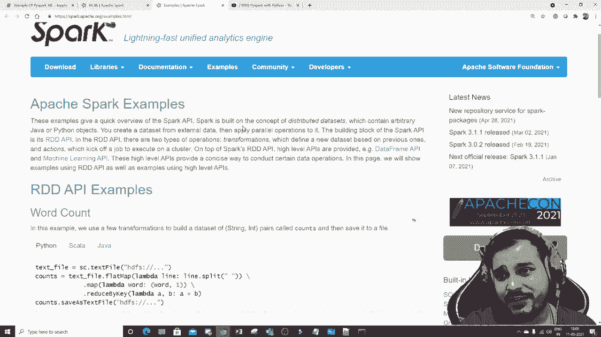
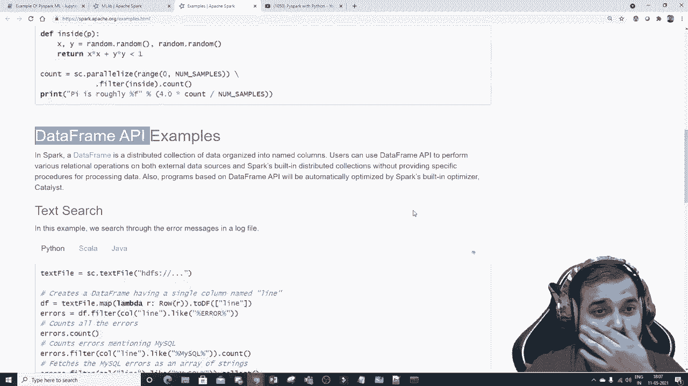
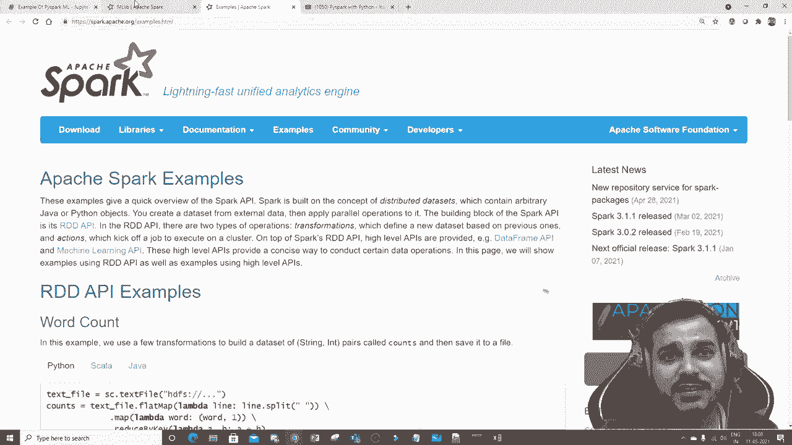
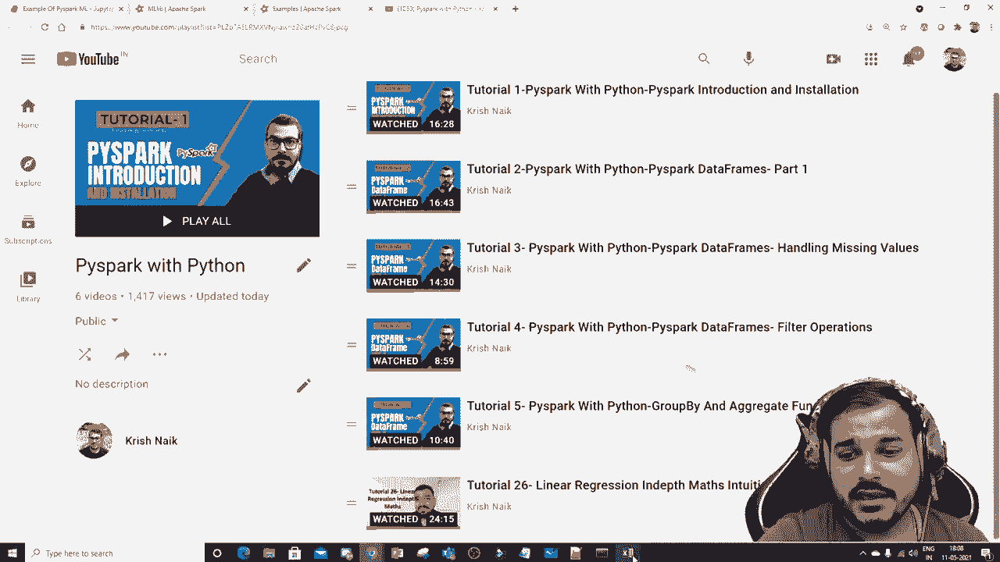
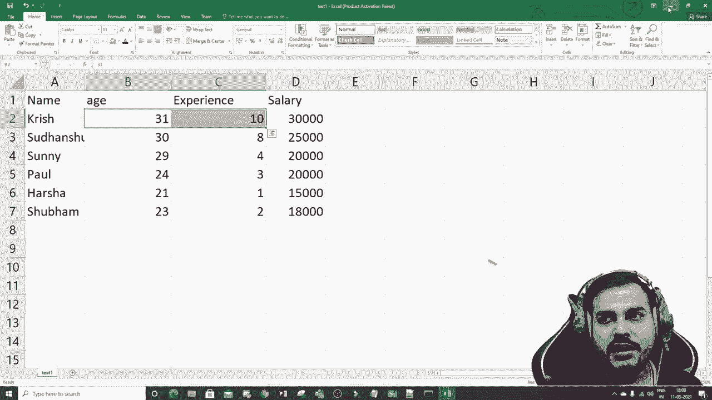

# 【双语字幕+资料下载】PySpark 大数据处理入门，带你玩转Python+Spark大数据操作与分析！＜实战教程系列＞ - P6：L6- Pyspark Mlib 简介 - ShowMeAI - BV1sL4y147dP

。

So guys， Spark Mlib also has an amazing documentation with respect to various examples。 so here you can go and click on examples and basically check out this particular documentation。 You can actually see different different kind of examples。 how it is basically done。 But with respect to Spar Ml。 there are two different techniques。

 One is the RdiD techniques and one is the data frame APIs。 Now what we are going to do guys。 data frame API is the most recent one。 you know and it is pretty much famously used everywhere。 So we'll be focusing on data frame API。 That is the reason why we learn data frame in Pipar very much nicely。 So we'll try to learn through data frame APIs and we'll try to see the technique how we can basically solve a machine learning use case。

 Now， let's go and see one very simple example guys。 and always remember the documentation is pretty much amazingly given you can actually check out over here and try to read all these things。 So let's proceed and let's try to see what are things we can actually do。😊。

In this particular example， I'm just going to take a simple machine learning problem statement。 So let me just open a specific data set for you all and then probably willll try to do it。 Okay。 so this is my data set， guys， I know there are not many records over here。 Okay。 so I have a data set which has like name， age， experience and salary。😊。

And this is just a simple problem statement to just show you that how powerful Sp actually is with respect to an MLla library。 just to show you a demo from the next video， I'll be showing you detailed explanation of the regression algorithms how we can basically do the implementation doll theoretical and all guys I have already uploaded。

 you can see over here I'll be doing see after this tutorial5。 This is basically the tutorial 6。 I'll try to add it after this and then。😊。

Whenever I will be uploading the linear regression algorithm before that。 please make sure that you watch this maths intuition。 Okay。 I've uploaded this specific video Also in the playlist。 So after this tutorial 26 white is seeing tutorial 26。 because Ive also added this in my machine learning playish。 So after this。 you'll also be able to find out when we'll be discussing about linear regression。 how we can implement in depth that video will also get uploaded。 So let's proceed。 and here is my entire data guys， this is my data。 Now what I have to do is that based on age and experience。

 I need to predict the salary， very simple use case， not not much data3 processinging。 not much transformation， not much standardization and all。 I'm just going to take up this to independent feature。 and I will be predicting the salary of this particular person based on age and experience。

 Okay so this is what I'm actually going to do。😊。

So here is a perfect example。 Again， detail， I'll try to show you how to basically implement line by line。 probably from the upcoming videos where I'll be discussing about linear regression and all。 And if I go see this particular problem， this is also a linear regression example。 So let's go away first of all， as usual， I will be creating a spark session。

 So I'll use frompar do sql import spa session and then I'm going to use spark session do builder dot app name here I'm actually creating a spark session or missing let me execute it I think this is pretty much familiar。 you are familiar with this then what I'm going to do over here is that we are just going to read this particular data set with test1 dot csv header is equal to true and in first schema is equal to true。

 So when I go and see my training do show this are all my features over here。 perfect。 I'll be giving you this data Also don't worry Now。 from this particular data if I go and check out my print schema So here you'll be able to see that I'm getting this particular information this is my entire print schema over here。😊，Teachatures like name， age， experience and salary。 Now， if I go and see training dot columns。

 this is my training dot columns。 Now， always remember， guys in Pipar。 we use a different funda or mechanism or a kind of data pre processingsing before C。 Usually what we do is that。And by using machine learning algorithms that are available in Ecala。 we basically do a train test split， right， And then we first of all。

 divide that into independent features， dependent features， right， which we use an x and y variable。 and then we do train test split by doing this in in Pipar， we just do some different techniques。 What we do is that yes， we have to basically create a way where I can group all my independent features。 So probably I'll try to create vector asmbler。 we basically say it as a vector assemb C the class Ive actually used the vector assembler will make sure that I have all my features together grouped like this grouped like this in the form of age and experience。

 over here my two main features are age and experience。 which are my independent feature right So itll be grouped like this for every record。 it will be grouped like this。 Okay， for every， it will be grouped like this。 And then what I will be doing is that I will be treating this grouped as。😊，Different feature。

 So this will basically be my new feature。Right， and remember。 this new feature is my independent feature。So my independent feature will look like this in a group of age comma experience。 which will be treated as a new feature。 and this is exactly my independent feature。 So I have to group this particular way。 So in order to group this what we do is that in Pipar。

 we use something called as vector asler。 So in this vector asmbr is basically present in pipar do ml dot feature。 we use this vector asmbler。 we use two things。 one is input column。 which all column we are basically taking to group it。 So two columns one is age and experience。 right we don't have to take name because name is fixed it is a string。 Yes。

 if category features are there。 what we do， what we need to do。 we will convert that into some numerical representation that I'll be showing you when I'm doing some inepth implementation in the upcoming videos of linear regression logistic regression and dot But here you'll be able to see that I'm going to take input columns H comma experience in the form of a list and then I will try to group this and create a new column。

 which is called。😊，Dedependent feature over here。 right That is what I'm actually doing。 So if I go and execute this vector in similar。 So here I'm got my feature in similar。 and then I do dot transform。 I do dot transform on my training data。 So this is basically my training data。 When I do this And when I do output dot show here。

 you'll be able to see I have this all features。 and a new feature has been created。 which is called as independent feature。 Okay， so we have actually created an independent feature。 And you can see over here age and experience age and experience， age and experience。 So this is my grouped rows that I've actually got in short， what I've done。

 I've combined this two column and made it as a single independent feature。 Okay。 now this will be my input feature。 Okay， and this will be my output feature and will try to train the model。 Okay， so over here now if I go and see output dot columns。 I have name age experience independent feature。 now what I do out of this。

 let's take which all data set I'm actually interested in。😊，So out of this。 I will just be interested in this two data set， right， In features and salary。 salary will be my output feature。 The y variable， right， and this will be my input feature。 So what I'm going to do， I am going to select output dot select independent features and salary。

 And I'm going to put that in my finalizer underscore data。 That is what I'm actually doing。 If I now go and see my dot show here， you will be able to see the entire thing。😊，Now， this are my。Independent feature。 These are my dependent feature。 Now， the first step， what we do。 we do a train test split， like how we do it in Scal。 So in order to do a train test split。

 I use a function inside my finalized data， which is called a random split。 Remember， guys。 I'll try to explain you line by line by implementing it when I'm doing a bigger project right now。 since this is just an introduction session。 I really want to explain you how things are actually done。 So this is basically my train test split。 So here let me write it down the comment。😊。

Rrain test split。And I will be using the linear regression like how we import a class from S scalelon similarly by using Pipar dot ml dot regression。 import linear regression。 And then I'm doing a random slip of 75 to 25%。 That basically means my training data will be having 75 percentage of the data and my test data will be having 25 percentage of the data right Then after that I'll be using this linear regression in this。 you have to important variables that we need to give。 One is feature columns。

 How many number of feature columns are there that is completely present in this independent feature。 So I'm giving it over here， Similarlyly in label column。 This is my second feature that I have to give。 this is my output feature。 So after I provide both these things and do a fit on train data。

 I will be able to find out my coefficient。 These are my coefficients。 This are my intercepts。 And here I can now evaluate and see my output。 right So by using this evaluate function。 we will be able to see the output。 and inside this there will be。😊，Addction variable。 which will have the output。 Okay， so this is my prediction。 This is my salary。 the real value。

 This is my other thing。 Now， if I really want to find out the other important parameters of metrics。 let's press tab here you'll be able to see mean absolute error underscore result dot mean square error。 Supp if I do see this particular word value， you'll be able to understand that how the model is actually performed。 So that's just a various very simple example， guys， don't worry， I'll be explaining in depth。

 probably in the upcoming videos when we'll be starting from linear regression。 now， remember。 the next video is about linear regression implementation in depth implementation right the theoretical part you can see over here。 I've already added the video。 Okay， so I hope you like this particular video。 please do subscribe the channel if you as youll in the next video have a great Thank you mobile。😊。

