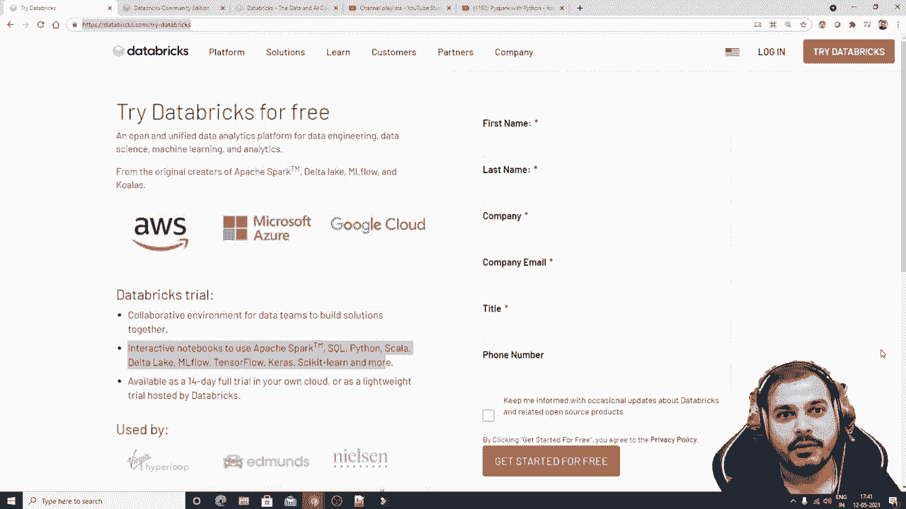
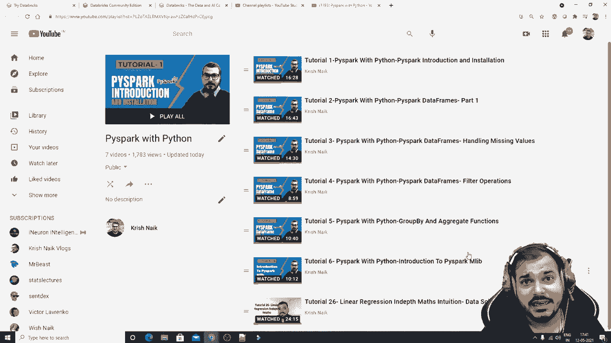
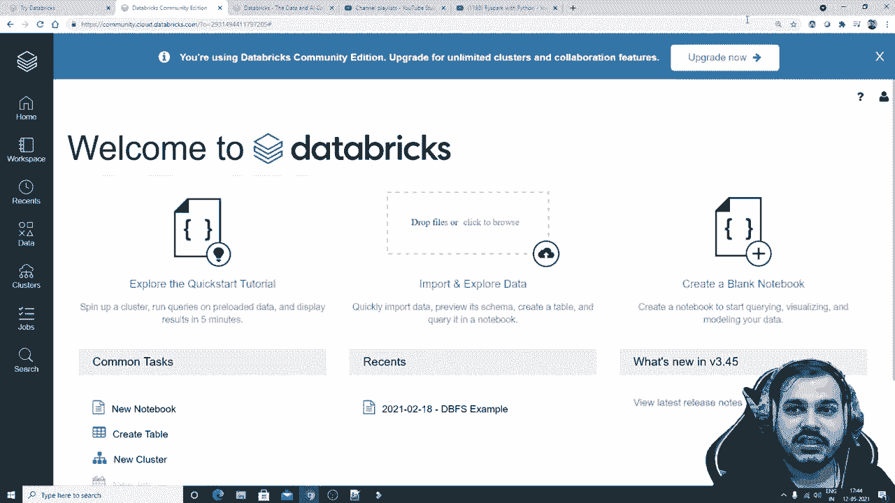
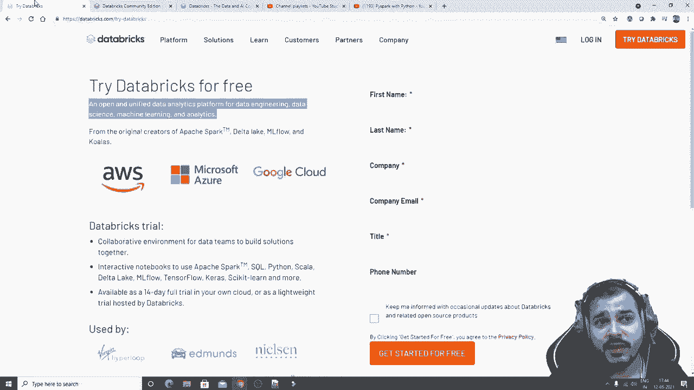
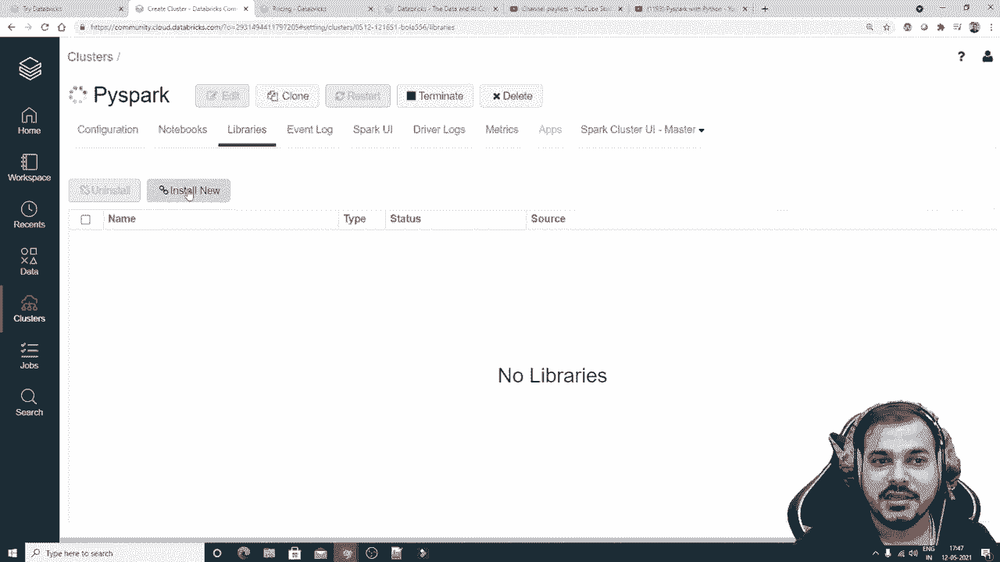
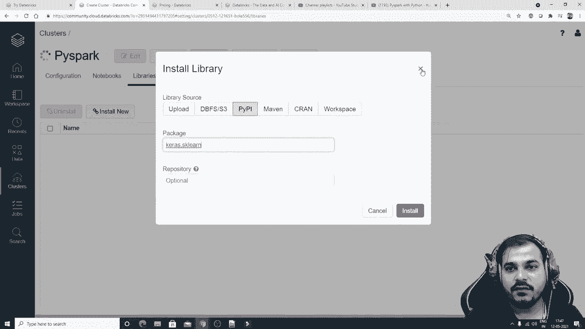
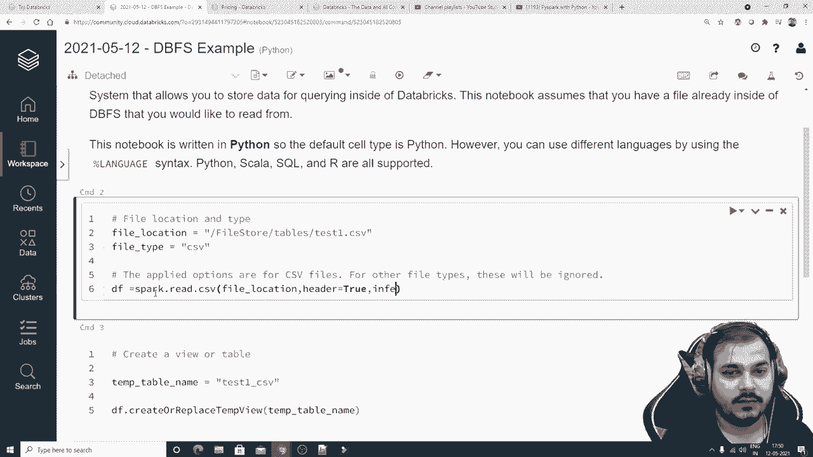
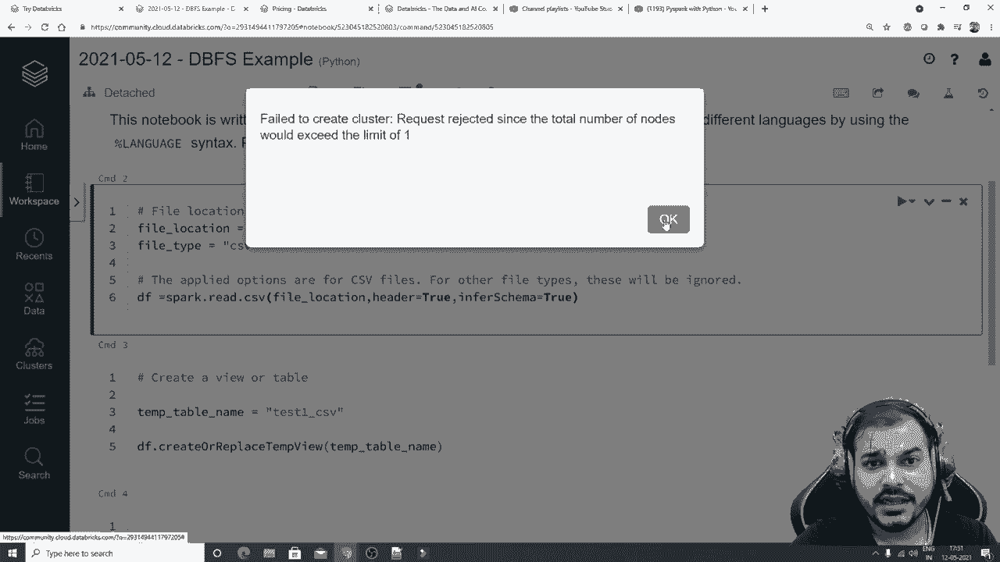
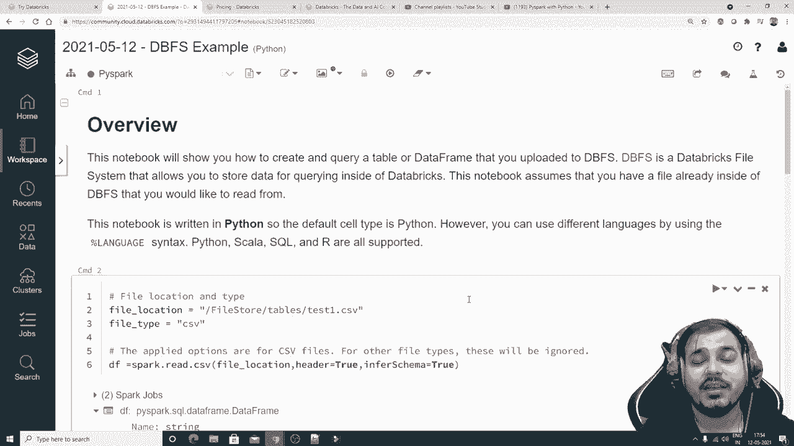

# 【双语字幕+资料下载】PySpark 大数据处理入门，带你玩转Python+Spark大数据操作与分析！＜实战教程系列＞ - P7：L7- **Databricks** 简介 - ShowMeAI - BV1sL4y147dP

。

大家好。我是**Krishna**，欢迎来到我的频道。所以大家，我们将继续**Pipark**系列。在这个特定的视频中，我们将了解这个**Databricks**平台。记住，大家，在我之前的视频中，我已经上传了所有关于**Pipark**与Python的内容，直到**Pipar M**。

我告诉过你，在这个特定的视频中，我们将讨论线性回归，以及如何借助**Pipark**实现线性回归。但在此之前，我真的想帮助你了解什么是**Databricks**平台。这是一个很棒的平台，你可以在这里使用**Pipark**，或者与**Apachepark**合作。

还有一个关于这个特定平台的惊人之处在于，他们还为你提供了集群实例。所以如果你有大量数据，想要进行并行处理，或者想要在多个集群中分配数据，你绝对可以借助**Databricks**做到这一点。

😊。

现在，如果我真的想使用这个平台，有两种方式：一种是社区版本，另一种是付费版本，例如**Azure**或**AWS**云，你实际上可以在后端使用它。**Dataricricks**还帮助你实现**ML flow**，而这个**ML flow**与**CICD**管道有关，所以你也可以进行这些实验。

总之，这是一个很棒的平台。我在我的YouTube频道上会专注于展示社区版本，并且在接下来的视频中会尝试使用**AWS**和**Azure**进行执行。

我们将尝试做的是，每当我们创建多个实例时，知道我们会尝试在这个特定的云平台上创建多个实例，我们还会尝试从**S3 bucket**中拉取数据，**S3 bucket**是**AWS**中的存储单元，并尝试向你展示如何处理庞大的数据集，所有这些内容会随着我们的进展而展示。现在让我们了解一下这个**Databricks**是什么。

它是一个开放和统一的数据分析平台，适用于数据工程、数据科学和机器学习分析。记住，**Databricks**实际上帮助我们执行数据工程，当我说数据工程时，可能是在处理大数据，它还帮助我们执行一些机器学习算法，可能是任何类型的数据科学问题陈述。

😊，你将能够做到这一点，可能会涉及三种云平台：一个是**AWS**，一个是**Microsoft Azure**，还有一个是**Google Cloud**。如果你真的想开始，可以先从社区版本开始，你只需访问这个特定的URL，输入“try databs”，然后输入所有你的详细信息以免费注册。

一旦你注册并开始免费使用，你将在右侧看到两个选项，你可以看到你想免费使用的社区版本，而在左侧则会有一个选项，告诉你需要与这三大云平台合作，你也可以选择那个。

现在，我将尝试向你展示一个社区版本，它会非常简单，非常容易。让我们进入社区版本。实际上，社区版本是这样的，如果你真的想使用云版本，可以点击升级，好的，点击升级，这就是社区版本的URL，注册社区版本时，你将能够获得这个URL，明天你可能会想使用云服务。

你只需点击这个升级，现在你将看到三个选项，一个是探索快速入门教程，导入和探索数据，创建一个空白笔记本，还有更多你可以在社区版本中完成的任务，比如创建新笔记本或创建表格。

创建一个集群，创建新的Mflow实验。我希望我已经向你展示了Mflow实验，我们还可以通过将其与后端数据库结合来创建这个MLflow实验，然后我们可以导入库，读取文档。😊！

可以完成很多任务。首先，我们需要做的可能是创建一个集群。现在，为了创建一个集群，我会点击这里的创建集群。你可以基本上写下任何集群名称。我会说Apache，或者我会说Py spark集群。假设这是我想要创建的集群。好的。

然后这里默认情况下，你可以看到8.2 scalar。选定的是spark 3.1.1。因此，我们将使用spark 3.1.1。如果你记得，我在本地也安装了这个特定版本，默认情况下，你会看到他们提供一个15 GB内存的实例和更多配置，如果你真的想升级你的配置。

你基本上可以点击这里。好的，记住在免费版本中，你将能够在一个实例中工作，除非它空闲超过两个小时，否则它将断开连接。所以在这里你可以看到一个驱动程序，15.3 GB内存，2核和一个D。

所有这些功能都在这里。你还可以理解什么是debut，de是数据砖单位。如果你想点击这里，你将能够理解debut究竟是什么，好的，你将能够选择一个云，并基本上与之合作，完美，到这里一切都很好。

让我们开始，创建集群。现在，一旦你看到集群正在创建。你这里还有很多选项，比如笔记本、库、事件日志。Spark UI驱动程序日志等等。这并不是说你只能在这里使用Python，你这里有很多选项。所以假设我去点击库。如果我点击安装新库，你将有一个选项来上传库。

你也可以从Mayn的Pi安装库。我们基本上在Java中使用这些库，然后你会有不同的工作空间。所以我将做的是，假设你选择管道，如果你想安装一些库。

我喜欢Tensorflow，或者你可能想选择ks，你可以这样写，我可能想要一个scale learn。你知道，所以我可以用逗号分隔并开始安装它们。好的，但默认情况下，我知道我将使用Pi Sp，所以我不打算安装任何库。让我们看看这可能需要多长时间，这里只是执行。

让我们回到我的主页。所以除了这一年，你还能够上传数据集。那个特定的数据将给你一个环境，像你如何在do中存储数据。好的，所以在集群创建之前，现在集群已经创建了，你可以看到Pi pocket处于运行状态，记住这个集群只有一个实例。如果你想创建多个集群，我们必须使用云平台1，这将是收费的。

好吧，所以我在这里将点击导出数据。现在大家看，你可以上传数据。你也可以从S3桶中获取。然后你也可以从S3桶中获取。这些我会试着给你展示。然后你也有Dfs，你知道。😊，还有D V F F。你基本上会存储在这个特定的格式中。

然后你有其他数据源，比如Amazon Re script Amazon kindnesses。Amazon Kinnesses主要用于实时流数据。好的，然后你有Cassandra。Cassandra也是一个No SQL数据库，还有JDBC最后搜索。因此，也有不同的数据源，我们还会尝试与合作伙伴的集成。

所以它们也像实时捕获在数据湖中，还有更多的东西在这里。因此，你绝对可以看看这个。现在我将做的是，点击这里尝试上传数据，让我看看。我将上传数据集。我会去我的Pipar文件夹。所以这里是我的路径，我将上传这个测试数据集。

或者我会尝试上传这个测试文件。现在，你可以看到数据集已经上传。现在它说要通过 UI 创建表格，在笔记本中创建表格。如果我去点击这个，你知道的。所以这里你将能够看到这是代码。这是创建表格的完整代码。

但我真正想做的是我不想创建表格，而是尝试执行一些我们到现在为止已经学过的 Pipar 代码。好的。所以我将做的就是删除这个。我不想要它。我将删除这个，好的。好的。

让我现在读取数据集。在这里，你会看到我的数据集路径基本上是这个。它是一个 CSV 文件，包含 schema 头部 schema，所有这些内容都在这里。所以让我也删除这个。让我开始读取数据。因此默认情况下，Sp 已经上传。所以我写 Sp dot。Sk dot。

阅读 dot cv。我希望它能正常工作。首先，请记住，这是我的文件位置。文件位置，好的，文件下划线位置。然后我还会使用两个选项。一个是将 header physicalical 设置为 true。然后我有 infer schema 一旦我执行这个，现在你会看到第一次菜单执行时会显示启动并运行，所以我们将启动集群并运行它。我将点击它，创建失败，拒绝请求，因为节点总数会超过限制。这是为什么呢？让我们看看我们的集群，我们只有一个集群。

好的，这里有一些示例已经被提取出来。所以让我删除其中一个。好的。让我执行这个。好的，我会去这里。空格让我删除它，好的。完美。现在我将尝试读取这个。让我们看看。

再次，它显示创建集群失败，拒绝请求被拒绝，因为节点总数会超过限制，并且它不允许我们执行超过一个文件，我想。正因为如此。我只是重新加载它。现在看看。

现在它已经执行了，C 伙计们，之前有两个文件。所以因为这个原因，它不允许我运行。现在我删除了一个文件并重新加载了一个文件。好的，现在你可以看到它正在运行，你也可以按 shift tab 基本上查看一些提示，就像我们在 Jupyter notebook 中所做的那样。现在在这里你会看到我的文件运行得非常顺利，显示了 Df，显示它是 pipar dot sql do data frame do data frame 现在让我执行其他内容。

现在假设我想D点打印。看，我只是使用那个选项卡功能打印架构。如果我去看这里，你将能够找到所有的值，对吧，简而言之。这基本上现在在我的集群实例中运行，对吧。我将能够上传任何大型数据，可能是50GB的数据集，也可以从S3桶上传，接下来的视频我会向你展示如何从S3桶做到这一点。

但我接下来要向大家展示的，将会尝试通过数据运行所有这类问题语句，以便你们能够学习。好吧，现在让我再做一件事。这是我的D点显示。好吧，这是我所有的数据。可能我只想选择某些列。我实际上可以写D点选择，在这里。我只想说薪资点显示。

我只是选择薪资点显示在这里，你将能够看到。所以你想做的一切，你都能做到。请记住，在这里，你将能够找到大约15GB。而且你绝对可以执行任何类型的事情。好吧，这里也有相同的选项，就像我们在😊，你知道的。

在Jupyter Notebook中，每个选项都有，你将能够在Jupyter Notebook中找到所有这些特定选项，对吧，所以这基本上在15.25GB的集群中运行。好吧，在那个特定集群中，你有两个核心，然后你有Spark 3.1.1和Spark 2。

12。你将能够看到所有这些特定信息。所以我想要的是，请尝试为自己创建一个特定的环境，然后尝试启动它，尽量把一切准备好，从接下来的视频中，我们将尝试看看如何执行，如何实现问题语句，如何实现不同的算法，可能我还会向你展示如何从云端上传数据集，比如AWS，我们将从AWS开始，因为它有很多功能。

而且随着我们继续学习，可能会学到更多的东西。所以我希望你喜欢这个视频。如果你还没有，请订阅频道，下周见，祝你有美好的一天。谢谢你。Manal，再见。😊。
