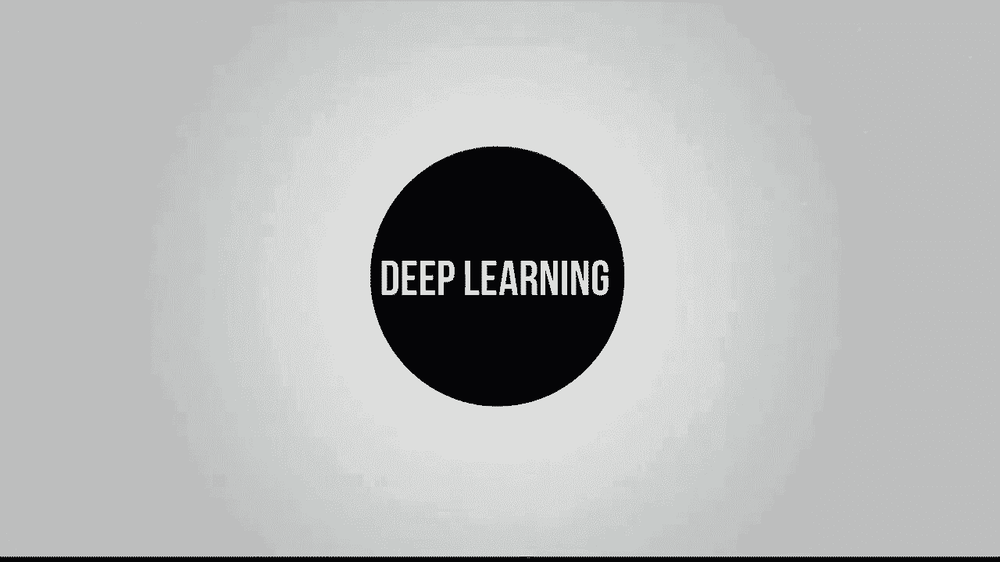
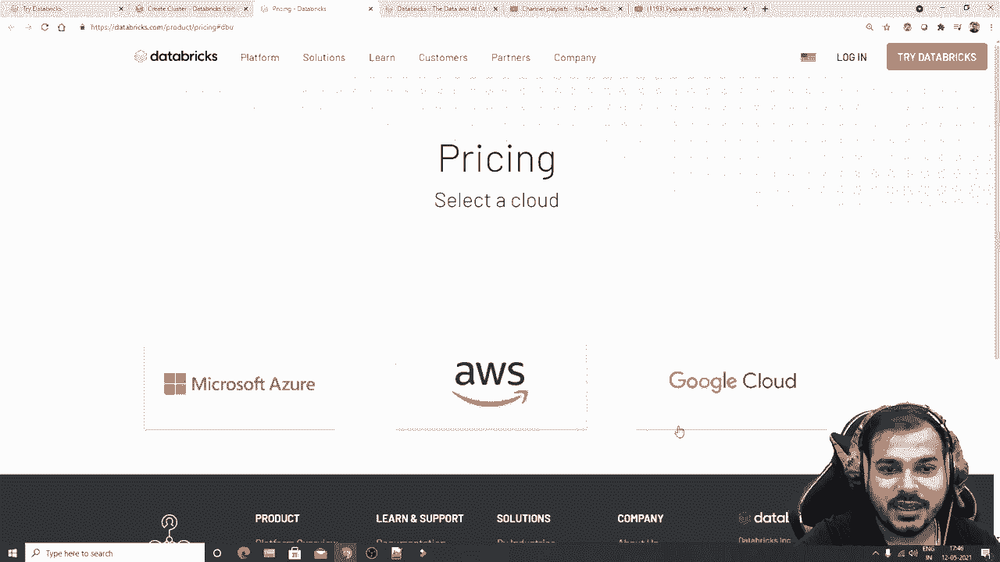
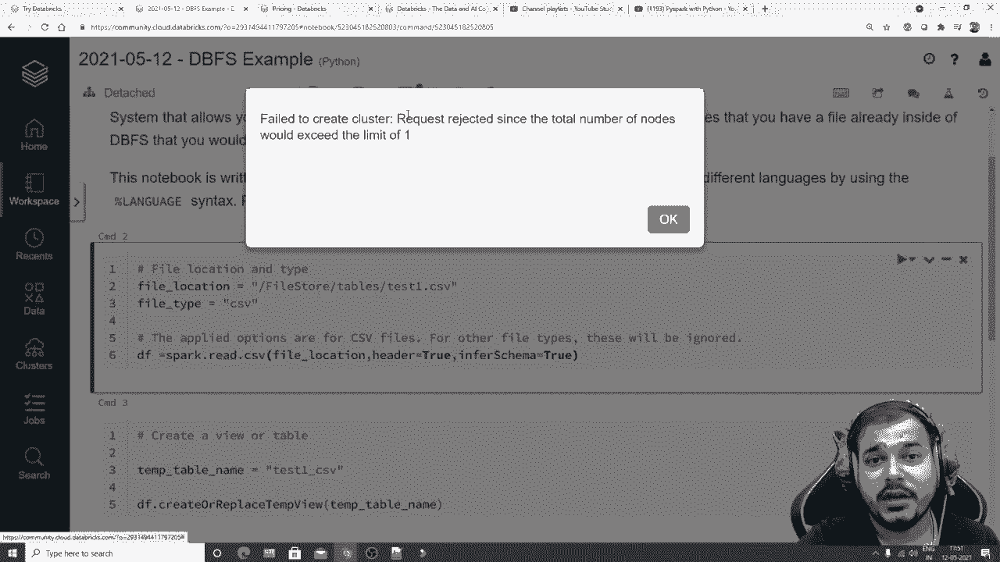
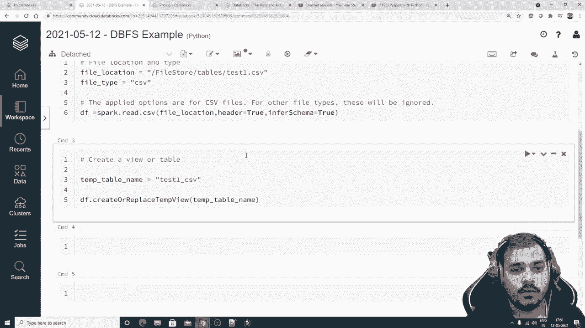

# 【双语字幕+资料下载】PySpark 大数据处理入门，带你玩转Python+Spark大数据操作与分析！＜实战教程系列＞ - P7：L7- Databricks 简介 - ShowMeAI - BV1sL4y147dP

。

Hello all。 My name is Krishna and welcome to my usual channel。 So guys。 we will be continuing the Pipark series。 And in this particular video。 we are going to understand what is this databs platform。 Now remember。 guys in my previous videos I've already uploaded all these particular videos with respect to Pipark with Python till the Pipar M。

 And I told you that in this particular video we were to discuss about linear regression。 how we can implement linear regression with the help of Pipark。 But before that。 I really want to help you know what exactly is a databricks platform。 And this is an amazing platform where you can actually use Pipark， or you can work with Apachepark。

 And one more amazing thing about this particular platform is that they also provide you cluster instances。 So suppose if you have a huge amount of data probably want to distribute the parallel processing or probably want to distribute it in multiple clusters you can definitely do with the help of databs。

😊。

Now， if I really want to use this particular platform。 there are two ways one is for community version and one is for the paid version。 which is like Azure or AWS cloud you can actually use in the back end。Dataricricks also helps you to implement ML flow okay and this ML flow is with respect to the CICD pipeline so you can also perform those kind of experiments also。

Altogether， an amazing platform。 What I will be focusing in my YouTube channel is that I will try to show you both with the community version also and in the upcoming videos will try to execute try to execute with both AWS and Azure when we are using AWS and Azure。

 what we will try to do is that whenever we create the instances。 multiple instances know that will try to create in this particular cloud platform we'll also try to pull the data from S3 bucket。 which is the storage unit in AWs and try to show you that how we can work with huge。 huge data sets all those things be actually showed as we go ahead Now let's understand what this databs is。

 it is an open and unified data analyticss platform for data engineering data science and machine learning analyticss remember databs actually helps us to perform data engineering When I say data engineering probably working with big data it also helps us to execute some machine learning algorithms probably any kind of data science problem statement。

😊，Willll be able to do it and probably it suppose three kind of platform cloud platforms。 one is AWS Microsoft Azure and Google Cloud Now if you really want to start start with this well start with the community version and you just have to go into this particular URL and just type try databs and then you just enter all your details to get registered for free。

Now once you are registered you once you get started for free。 youll get two options over there on the right hand side you will be seeing the community version which you really want to use it for free and in the left hand side you will be having an option where they will tell you that you need to work with this three cloud platforms and you can select that also。

So for right now I will try to show you a community version， which will be very simple。 very very easy。 So let's go to the community version。 So this is how the community version actually looks like if you really want to go into the cloud version you can just click on upgrade okay so just click on upgrade and this is the URL of the community version and this version this URL you'll be able to get when you register for the community version tomorrows you think that you probably want to work with the cloud。

 you just have to click on this upgrade now now in this you'll be able to see three things one is explore to the explore the quickstar tutorial。 import and explore data， create a blank notebook and many more things over here what kind of task you'll be able to do in the community version one is you can create a new notebook you can create a table。

 create a cluster create new Mflow experiment。 I hope I have actually showed you Mflow experiment we can also create this MLflow experiment by combining to a database in the backend then we can import libraries read document。😊。

Can do a lot of task。 Now， first of all， what we need to do is that probably I'll create a cluster。Now， in order to create a cluster， I will click on this， create a cluster here。 you can basically just write down any cluster name。 Supp I'll say Apache or I'll just say。Py spark cluster。 Suppose this is my。Cluster that I want to basically create。 Okay。

 and then here by default over here， you can see 8。2 scalar。 This one spark 3。1。1 is selected。 So we will be working with spark 3。1。1 If you remember in my local also I actually installed this particular version only okay by default you will be able to see that they will be providing you one instance with 15 gb memory and some more configuration if you really want to upgrade your configuration。

 you can basically go and click over here Okay and remember in the free version you will be able to work in an instance unless and until it is not idle for two hours otherwise it will get disconnected。So over here you can see one driver，15。3 Gb memory2 course and one D。 Okay。

 all these things are there。 You can also understand what debut is De is nothing but a data bricks unit。 If you want to click over here， youll be able to understand what exactly debut is okay and youll be able to select a cloud and basically work with that perfect till here everything is fine。

 let's start， let's create the cluster。 Now， once you you will be seeing that the cluster is basically getting created。 you also have lot of options over here， like notebook， libraries， event logs。 spark Ui driver logs and all It's not like you just have you' will be able to work with Python over here here you have lot of options。 so suppose if I go and click on libraries。 And if I click on install new here you will be having an option to upload the libraries。

 you can also install the libraries from Pi from Mayn。 which we basically use along a Java then you have different different workspace。 So here what I'm going to do is that suppose if you select pipe and suppose you want to install some of the library。

I like Tensorflow or probably you want to go with ks you can basically write like this probably I want a scale learn you know。 so I can just give comma separated and start installing them Okay but by default I know I'm going to work with Pi Sp so I'm not going to install any libraries so let's see how much time this will probably take this is just getting executed over here。

And let's go back to my home。 So apart from this year， you'll be also able to upload the data set。 and that particular data will give you an environment like how you're storing the data in the do。 Okay， so before the cluster is getting created。 now the cluster has got created here you can see Pi pocket is in running state now and remember this cluster only has one instance。 you want to create multiple clusters。 We have to use the cloud platform1， which will be chargeable。

 Okay so in here I'm going to click on export the data。 Now see guys， you can upload the data。 you can also bring from S 3 bucket。 you can also then bring from S3 bucket。 These all things I'll try to show you。 then you also have Dfs you know。😊，And D V F F。 you will basically be storing inside this particular format。

 Then you have other data sources like Amazon Re script Amazon kindnesses。 Amazon Kinnesses is basically used for live streaming data。 Okay， then you have cassandra。Cassra is also a no SQL database and JDBC last search。 So different different data data sources also there we'll also try to see with respect to partners integration。

 So they are also like real time capture in data lake。 and many more things are there。 So you can definitely have a look onto this。 Now what I'm going to do is that I'm just going to click over here and try to upload a data let me just see。Let me just upload the data sets。 I'll just go to my Pipar folder。So here is my pass well I'm just going to upload this test data set probably。

 or I'll try to upload this test one。Now， here you can see that the data set has been uploaded。 Now it is saying that create table with UI create table in note notebook。 supposeupp if I go and click this， you know。So here you will be able to see this is the code。 this is the entire code to basically create a table in the Ui。

 but what I really want to do is that I don't want to create a table instead I'll just try to execute some of the Pipar code which we have already learned till now Okay。 so what I' am going to do。I'll just remove this。 I don't want it。 I'll remove this， okay。Okay。

 let me read the data set now for reading the data set。Over here。 you'll be able to see that my dataset path is basically this。 It is a CSV file info schema header schema， all these things are there。 So let me remove this also。 So let me start reading the data。 So by default， Sp is already uploaded。 So I write Sp dot。Sk dot。

Read dot cv。I hope so it will work。 And for the first time， remember， this is my file location。File location， okay， file underscore location。 And then I will also be using two more option。 One is header physicalical to true。And then I have infer schema is once I execute this now you will be seeing that automatically the first time menu executing it will say that launch and run so we are going to launch the cluster and run it So I'm just going to click it fail to create reject requestquies since the total number of nodes would exit the limit one Why this is there let's see our clusters we just have one cluster。

Okay， there were some examples that has been taken over here。 So let me remove one of them。 Okay。 let me just execute this。Okay， I I'll go over here。Space let me delete it， okay。Perfect。 now I'll try to read this。 Let's see。

Again， it says fail to create the cluster reject request rejected since the total number of nodes would exceed the limit of one。 and it is not allowing us to execute more than one file， I guess。 So because of that。 I'm just reloading it。 Let's see now。

Now it has got executed C guys before there were two files。 So because of that it was not allowing me to run。 Now I just re I deleted one file and I I reloaded one file。 Okay， so now you can see that it is getting run now okay you can also press shift tab to basically see some hints and all same like how we do it in Jupyter notebook Now here you will be able to see that my file will be running absolutely fine and it shows it shows this Df it shows that okay is a pipar dot sql do data frame do data frame now let me just execute the other things。

 Now suppose if I want Df dot print。See， I'm just using that tab feature print schema。 If I go and see this here， you'll be able to see find out all the values， right， So in short。 this is basically now running in my instance of the cluster， right。 I will be able to upload any huge data probably a 50 gb data set also from S3 bucket and right that I'll try to show you how we can do it from S3 bucket in the upcoming videos。

 But what I'm going to show you guys in the upcoming future will try to run all this kind of problem statements through the data so that you'll be able to learn it。 Okay， now let me just go and do one more thing。 So this is my D dot show。 Okay so this is my entire data。 probably I will just want to select some column。 I can actually write D dot select and here。I just want to say salary dot show。

I'm just selecting salary dot show here， you will be able to see。 So everything that you want to do。 you will be able to do it。 And remember over here， you'll be able to find out around 15 G B。 And you can definitely perform any kind of things。 Okay， here also。 you have same options like how we have it in。😊，You know。

 in Jupiter notebook every option is there you will be able to find out all these particular options in Jupiter notebook also right so this is basically running in 15。25 gb2 course okay in that particular cluster you have two course， then you have spark 3。1。1 spark 2。

12。And you' will be able to see all this particular information So what I would like to want guys。 please try to make a specific environment for you and then try to start it try to keep everything ready and from the upcoming videos we will try to see how we can execute how we can implement problem statement how we can implement different algorithms and probably I'll also show you how we can upload a data set from the cloud like AWS and all will start with AWS because it has a lot of functionalities altogether。

And probably well be learning more things as we go it。 So I hope you like this particular video。 please just subscribe the channel if you are not as I see next week to have a great day。 Thank you。 Manal， bye bye。😊。