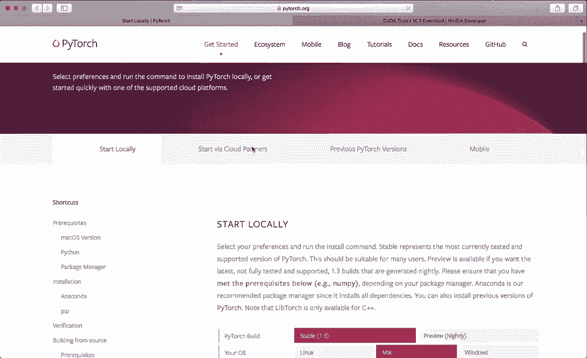
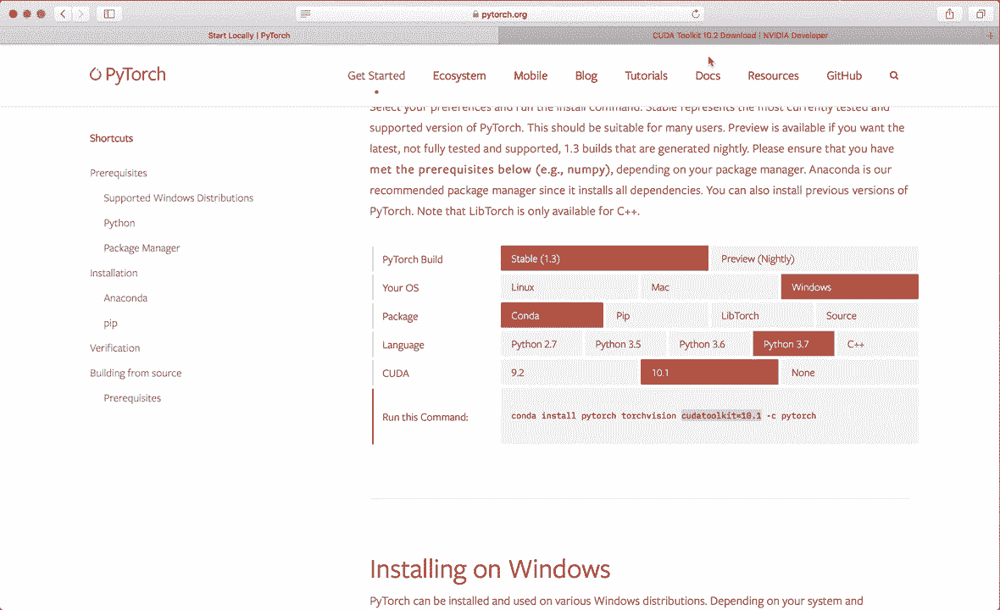
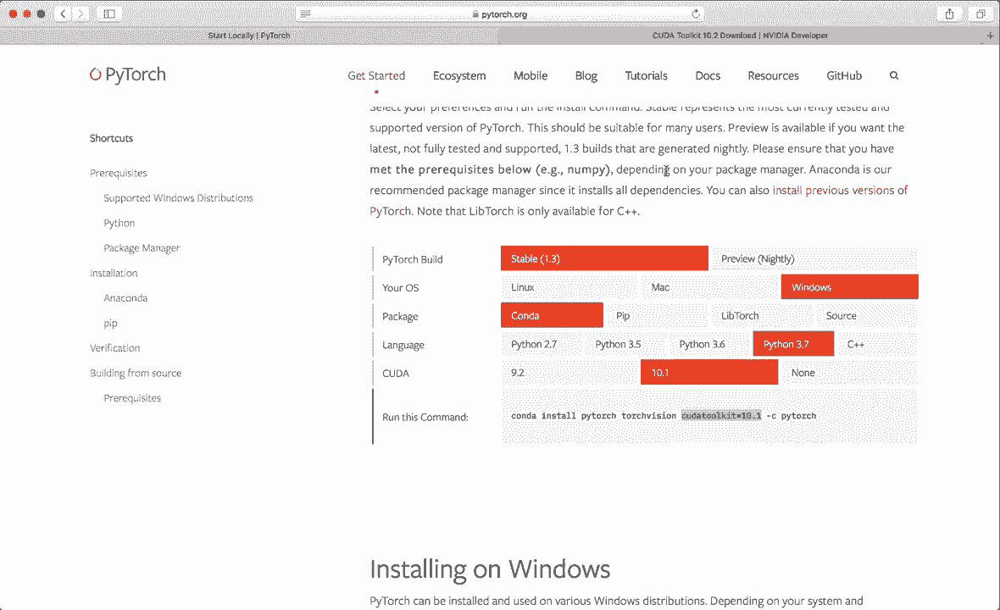
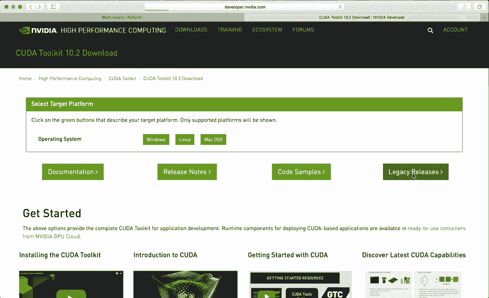
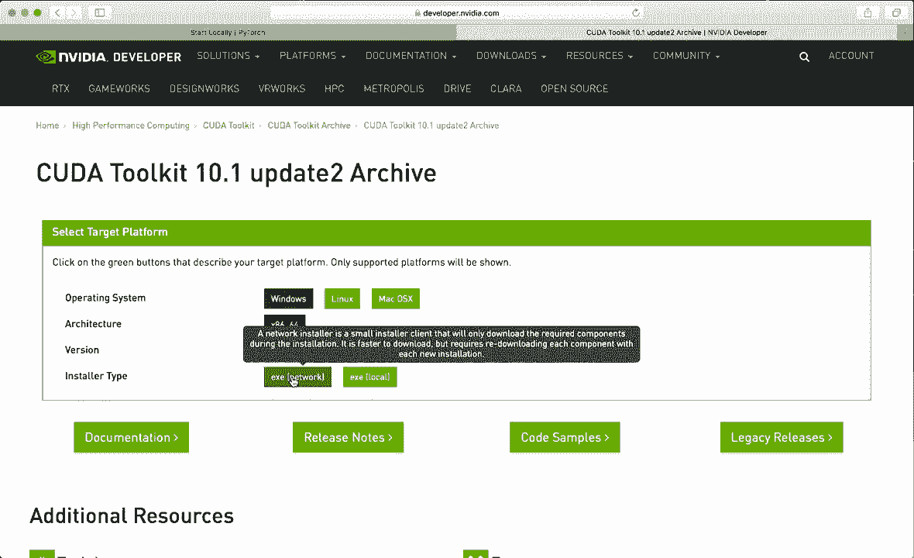
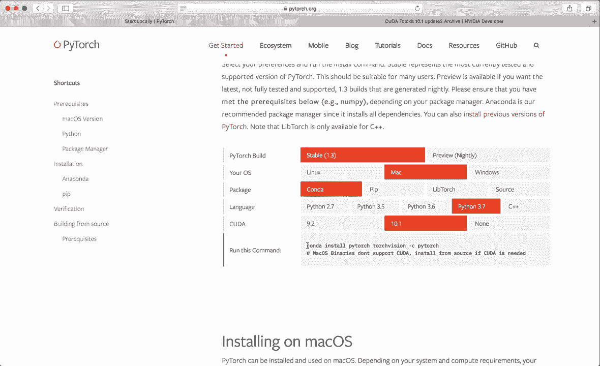

# 【双语字幕+资料下载】PyTorch 极简实战教程！全程代码讲解，在实践中掌握深度学习&搭建全pipeline！＜实战教程系列＞ - P1：L1- 安装 - ShowMeAI - BV12m4y1S7ix

Hi， everybody。 Welcome to your new tutorial series。 In this series。 we are going to learn how to work with pieytorch。 Pytorch is one of the most popular machine learning and deep learning frameworks。 It's really fun to work with it and develop cool applications。 So I hope you watch the series and learn all about the necessary basics for this framework。

 So in this first video， I show you how we install pieytorrch。 So let's start。😊，And for this。 we go to the official website， Pytorch dot org。Then click on get Start。Then select the newest pietoch built。 So right now， this is version 1。3。

Then select your operating systems。 In my case， it's a Mac。Then select the package manager with which you want to install Pytorch。 So I highly recommend to use Ananaconda。 And if you haven't installed Ananaconda yet and don't know how to use it。 then please watch my other tutorial about Ananaconda。

 So I will put the link in the description below。And then select the newest Python version。 So here I select Python 3。7。And unfortunately， on the Mac。 you can only install the CPU version right now。 But if you are on Linux or Windows and want to have GP support。 then you can also install or have to install the Kuda toolkit first。

 So the Kuda toolkit is a development environment for creating high performance GP accelerated applications。For this， you need an Nvidia GP in your machine。 And if you have that。 then you can go to the website， developer dot Nvidia dot com slash kuda minus downloads。

And then we have to be careful because right now， the newest supported Kuda version by Pytorch is Kuda 10。1。 So we have to get this version。 So right now， the newest version is 10。2。 So we have to go to legacy releases。

Then select the newest Ka toolkit 10。1。

Then select your operating system。 So for example， Windows， Windows 10。 then download the installer and follow the instructions。 And this will also check if your system is suitable for the Ka toolki。

So if this is successful， then we can go back。To the Py chart site and copy this command。 So in my case， on the Mac now， I need this command。 So let's copy this。

And now let's open up a terminal。 And first of all。 we want to create a virtual environment with Connda in which we want to install all of our packages and install pie torch。 So let's create an environment。 Let's say Conda create minus n and now give it a name。 So I call this pie torch。😊，Simply Pytorch and then also specify the Python version。

 So let's say Python equals 3。7。And then hit enter。 Now。 this will create your virtual environment with Python 3。7。 Let's hit enter again to proceed。And this will take a while。And now it's done。 So now we can activate this environment with Conda Act pytorch。 And now we are inside of this environment， and we can see this because here in the beginning。

 we have pytorch in parentheses。 So this is the name of the environment。😊，And now， let's paste our。In command from the website。 So this will install pietorrch in all the necessary packages。 So this will also take a couple of seconds。Now， again， let's hit enter to proceed。And now it done。 And now we have installed Pytorrch， and we can verify that by starting Python inside this environment。

 So let's say type Python and enter。 And now we have Python running。 and now we can import the torch module。 So。If the installation was not correct。 and right now。 you would get a module not found error。 But in this case， it is correct。 And now we can。 for example， create a torch tensor。 So let's say x equals torch dot R and of size 3。

And now we want to print our tensor。 So this also works。And now we can also check if kuda is available。 so we can say to torch dot kuda dot is underscore available。 So in my case， it says false。 But if you've installed the kuda toolkit and also the GP supported Pytorch packages。 then this should say true。So， yeah。 So no now we have installed in on pieytorch and can get started working with it。

 So I hope you enjoyed this and see you in the next tutorial bye。😊。