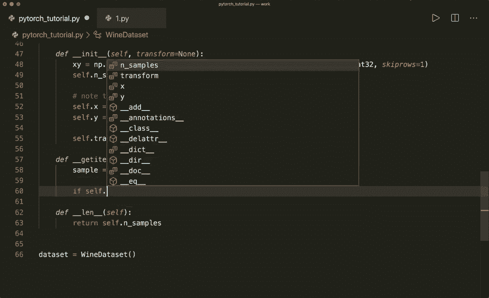

# 【双语字幕+资料下载】PyTorch 极简实战教程！全程代码讲解，在实践中掌握深度学习&搭建全pipeline！＜实战教程系列＞ - P10：L10- 数据集转换 - ShowMeAI - BV12m4y1S7ix

嗨，大家好，欢迎回到你们的新Pytorach教程。这次我们想谈谈我们数据的变换。在上一个教程中，我们使用了内置的数据和数据加载器类，如果我们使用像这里看到的内置数据，那么我们会看到可以将变换参数传递给这个数据集，然后应用一些变换。所以在这个例子中，我们建立了一个Ms数据集，然后我们应用了2tenzo变换。

这些将把图像或Nmpy数组转换为Tzos，Pytorch已经为我们实现了很多变换。所以请查看官方文档，你可以在这个链接找到。

在这里你可以看到所有可用的变换。例如，有可以应用于图像的变换。例如，中心裁剪或灰度或抚摸。然后还有可以应用于Tenzos的变换，比如线性变换或标准化。

然后还有转换变换，例如，Tu枕头图像和Tutenzoa变换。

然后还有一些通用变换，我们可以使用Lambdas，或者我们可以编写自己的自定义类。

然后我们还可以组合多个变换，所以我们可以使用transform.dot compose，然后传入一个列表，这将依次应用多个变换。是的，在上一个教程中，我们实现了一个自定义葡萄酒数据集。现在，让我们扩展这个类以支持我们的变换，并编写我们自己的变换类。让我们开始。

在这里，我复制了上一个教程中的代码，我们有自己的自定义葡萄酒数据集。它将加载数据。然后我们实现了get item和长度方法，这将允许索引和长度函数。所以让我们扩展这个数据集。现在这也应该支持变换参数。所以我们把这个放在我们的in it中，并说。

变换，哦，抱歉。变换等于。这是可选的。所以默认情况下，这是没有的。然后在里面，我们存储这个。所以我们说self.dot transform等于transform。

现在我们还需要对我们的get item函数做一些更改。所以在这里我们想要应用一个变换，如果它可用。那么我们假设，sample等于这个。然后我们说如果self.dot transform。所以如果这不是none。那么我们应用这个。所以我们说sample等于self.dot transform我们的sample。然后我们简单地返回我们的sample。

所以让我们回到正题。

样本。这就是我们数据集所需的所有更改。现在让我们继续，创建一些自定义变换类，例如。我们可以编写自己的to Tenor类。因此，在上一个教程中，我们已经在此步骤将其转换为Tensor，但我们不需要这样做，所以我们可以将其保留为nuy数组，然后实现一个to Tenor类。它将被传递到我们的数据集中，然后在后面使用。

将其转换为tenzo。

所以类twotenzor。我们需要实现的唯一内容是双下划线调用方法。它将接收self和一个样本。

所以现在这是一个可调用对象。我们在这里所做的是，首先解包我们的样本。所以我们说输入和标签或目标。

等于样本。然后我们说，返回。Torch从Numpai，和这里的输入。然后也torch从nuy目标。

所以这里我们也返回。我们仍然想返回一个元组，像我们这里做的那样。

这就是我们所需的所有内容，用于我们的2tenar变换。现在我们可以将其传入这里。所以现在我们可以说我们的葡萄酒数据集得到了变换。变换。等于。到Tenz。

这是一个函数。现在，让我们看看这个。所以让我们获取第一个项目。所以我们说第一个数据等于数据集的索引0。然后让我们解包我们的数据， 所以。第一个数据。所以我们说特征和标签等于第一个数据。现在让我们打印特征的类型以及标签的类型。所以现在如果我们运行这个。

然后我们应该看到这个现在是类torch Tenor。如果我们不把它传入这里。所以如果你说这个是none。没有变换，那么我们看到它仍然是一个nuy和D数组。这就是我们如何编写自己的Tenor，自己的变换，然后将其应用于我们的数据集。

现在让我们写另一个自定义变换。例如，称之为mule变换。所以一个乘法。我们在这里实现init方法。所以这里有self，并且这里有一个factor参数。所以在这里我们存储self.dot factor等于factor。然后再次。我们必须实现双下划线调用函数或调用方法。

这个函数接收self和这个样本。

这里再次，让我们解包我们的样本。所以假设输入和目标等于样本。然后我们只需将因子应用到我们的特征上。所以假设，输入。时间乘以我们的自点因子。现在让我们返回我们的输入，修改后的输入和目标仍然是一个元组。

所以这是乘法变换。现在。让我们应用这个。所以让我们应用一个。

并假设在这种情况下是复合变换，看看我们如何使用它。

所以。假设组合等于。这里我们需要torch vision dot transforms，dot compose。我们在这里放入一个变换列表。所以首先，我们想要有totenor。然后我们想要有mal变换。

并且。假设这需要一个因子。所以假设乘以2。现在让我们创建一个新的数据集等于葡萄酒数据集。它的变换等于我们的复合变换。

组成，现在再次，让我们来处理这个。所以获取，或者我们就从这里复制这个。

并运行这个来查看是否有效。

所以现在我们有一个Tenzoa。让我们也看看这个。所以让我们打印。

特征。这里也打印特征。

查看乘法是否已应用。所以现在我们应该看到每个值都被加倍。

现在让我们使用另一个因子。所以让我们乘以4并运行这个。现在我们应该看到每个值都应乘以4。

是的，这就是我们如何为数据集使用变换的方法，非常有用。

是的，大多数时候你会看到转换变换为Tensor。但在我们处理图像时，你可能会看到一些。

所以，是的，请查看文档网站。我希望你喜欢这个教程。请订阅频道，下次见，拜！
