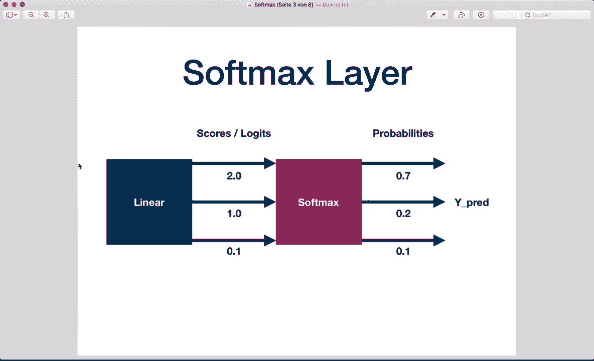
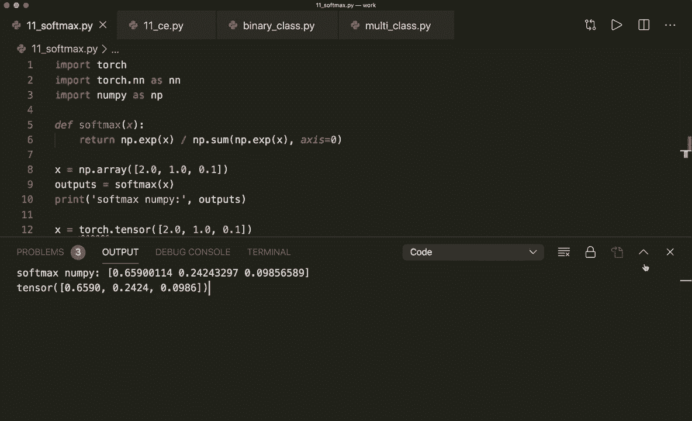
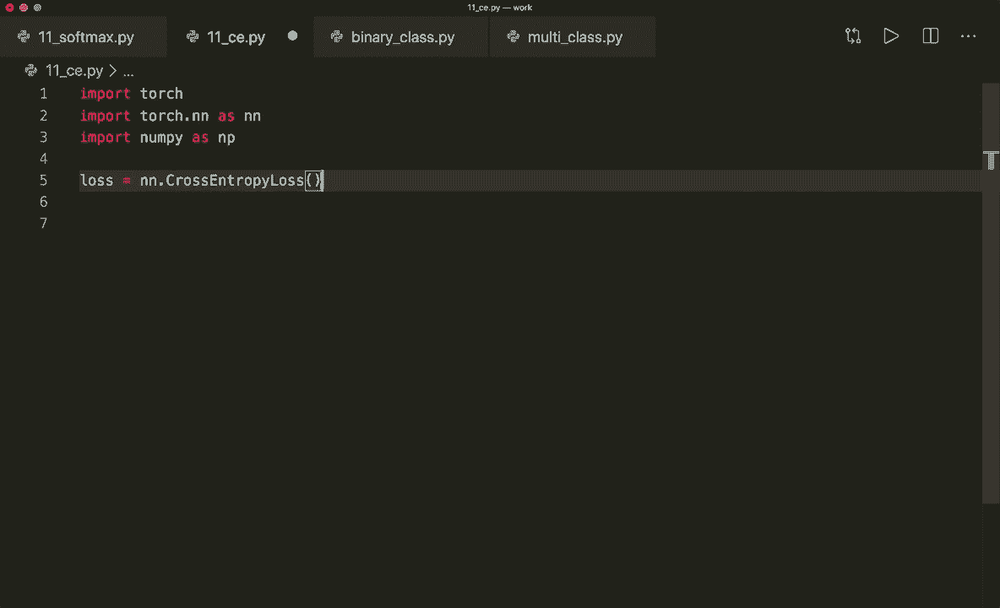
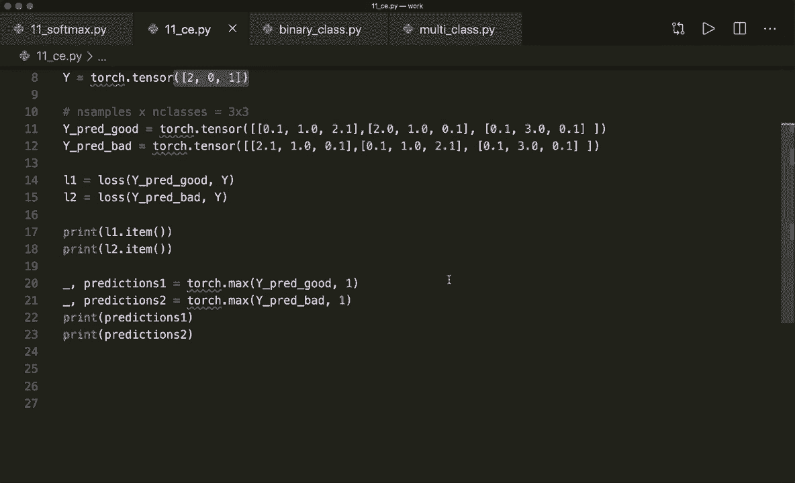
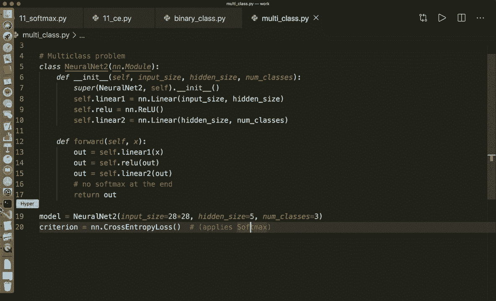
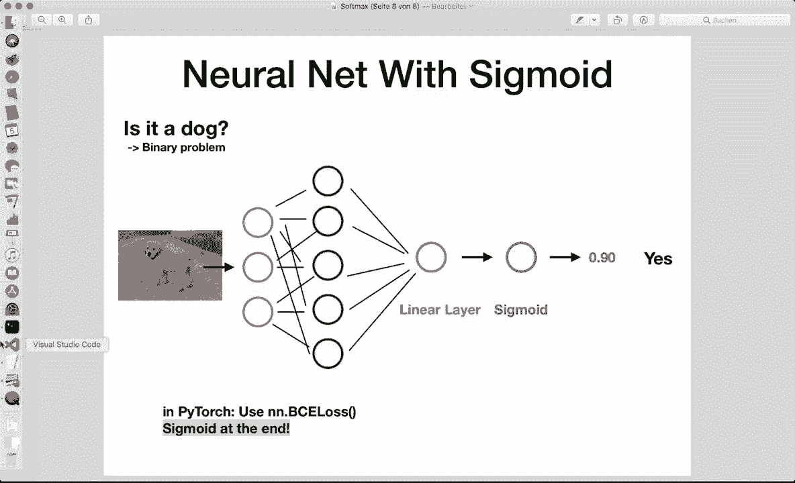
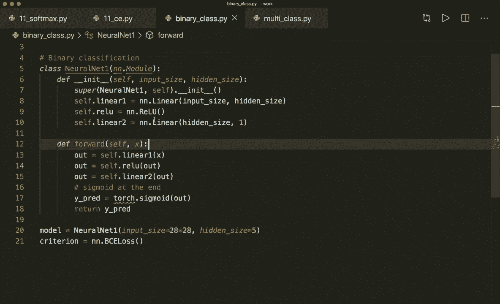
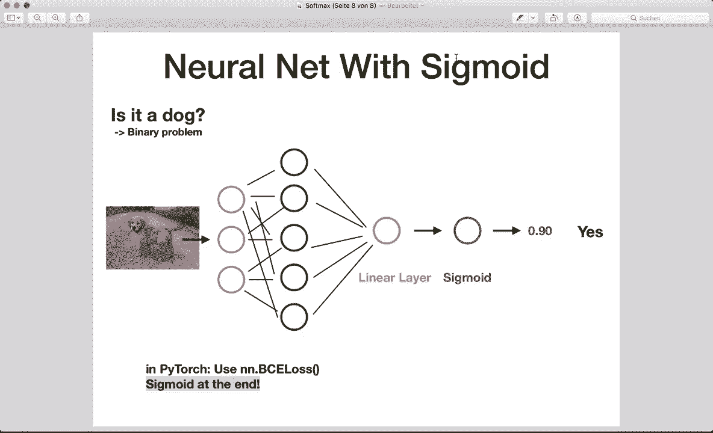

# 【双语字幕+资料下载】PyTorch 极简实战教程！全程代码讲解，在实践中掌握深度学习&搭建全pipeline！＜实战教程系列＞ - P11：L11- Softmax 和交叉熵 - ShowMeAI - BV12m4y1S7ix

Hi， everybody。 Welcome back to a new Pytorch tutorial。 This time。 we talk about the soft maxs function and the cross entropy loss。 These are one of the most common functions used in neural networks。 So you should know how they work。 Now， I will teach you the math behind these functions and how we can use them in nuy and then pytorrch。

 And at the end， I will show you how a typical classification neural network with those functions look like。 So let's start。😊，And this is the formula of the soft maxs。 So it applies the exponential function to each element and normalizes it by dividing by the sum of all these exponentials。 So what it does， it basically squashes the output to be between 0 and 1。 So we get probabilities。

So let's have a look at an example。😊，Let's say we have a linear layer， which has three output values。 And these values are so called scores or locks。 So they are raw values。And then we apply the soft marks and get probabilities。So each value is squash to be between 0 and 1。And the highest value here gets the highest probability here。And yeah。

 if we sum these three probabilities up， then we get one。And then this is our prediction。 And then we can choose for the。Classs with the highest probability。So， yeah。 that's how the soft mark works。 And now let's have a look at the code。 So here I already implemented it in numpy。 So we can calculate this in one line。 So first。

 we have the exponential， and then we divide by the sum。

Over all these exponentials。And。Now， let's run this。 This has the same values as in my slide。 And then here we also see that the highest value， the highest loet has the highest probability。I rounded them them in my slides。 So it's slightly different。 but basically。 we see that it's correct。And， of course， we can also calculate it in piytorrch。 And for this。

 we create a tenzoar。 So let's say x equals torch dot tenzor。 and it gets the same values as this one。And then we can say outputs equals torch dot soft max of x。 And we also must specify the dimensions。 So we say dim equals 0。 So it computes it along the first axis。 And now let's print these outputs。So yeah。

 here we see that the result is almost the same。

So， this works。And now let's continues。 So a lot of times。 the soft max function is combined with the so called cross entropy loss。So this measures the performance of our classification model。 whose output is a probability between 0 and 1。And it can be used in multi class problems。

 and the loss increases as the predicted probability diverges from the actual label。So the better our prediction， the lower is our loss。 So here we have two examples。So here。 this is a good prediction。 And then we have a low cross entropy loss。 And here this is a bad prediction。 And then we have a high across entropy loss。

And what we also must know is that in this case， our y must be hot， one hot and coated。So let's say we have three pro three possible classes， class 0，1 and 2。 And in this case。 the correct label is the class0。 So here we must put a one and for all the other classes。 we must put a 0。 So this is how we do one hot encoding。

And then for the predicted y we must have probabilities。 So， for example。 we applied the soft maxs here before。And yeah， so now again， let's have a look at the coat。 how we do this in nuy。 So we can calculate this here。 So we have the sum over the actual labels times。

The lock of the predicted labels。 And then we must put a -1 at the beginning。And to。 we can also normalize it， but we don't do this here so we could divide it by the number of samples。And then we create our y。 So as I said， this must be one hot encoded。 So here we have other examples。 So if it is class 1， then it must look like this， for example。And then down here。

 we put our two predictions。 So these are now probabilities。 So the first one has a good prediction because also here， the class 0 has the highest probability。And the second prediction is a bad prediction。 So here， class 0 gets a very low probability。 and class 2 gets a high probability。And now then I compute the entropy。

 the cross entropy and predict both of them。 So let's run this。 And here we see that the first prediction has a。Low loss。 And the second prediction has a high loss。And now again， let's see how we can do this in Pytorch。So for this， first， we create。The loss。 So we say loss equals N， N from the neural torch and N。Module， N， N dot cross entropy loss。

And now what we must know， let's have a look at the slides again。So here we have to be careful。Because the cross entropys already applies the lock soft marks。 and then the negative lock likelihood loss。 So we should not or must not implement the soft marks layer for ourselves。So this is the first thing we must know。 And the second thing is that here our y must not be one hot encoded。

 so we should only put the correct class label here。And also， the why predictions has raw scores。 So no soft mark here。

So be careful about this。 And now let's see this in practice。 So let's say。 let's create our actual labels。 And this is a torch dot tenzor。 And now here we only put the correct class labels。 So let's say in this case， it's class 0。 And not one hot encoded any more。 And then we have a good prediction。 Y prediction good equals。😊。

Torch dot tenzor。 And then here we must be careful about the size。 So this has the size number of samples times the number of classes。 So let's say， in our case。 we have one sample and 3 possible classes。 So this is an array of arrays。 And here we put in 2。01。0 and 0。1。And remember， this， these are the raw values。 So we didn't apply the soft max。 And here。

 the highest。Or对。The class 0 has the highest value。 So this is a good prediction。 And now let's make a bad prediction。 So prediction bad。 So here。 the very first value is a lower value， let's say， And the second value is high。 And let's change this also a little bit。And now we compute our loss like this。

 So now we call the loss function that we created here。 and then we put in the y prediction and the actual y and the same with our second。 Let's compute a second loss with y prediction bad and y。And now let's print them。 So let's print L1。Dot item。So it only has one value。 so we can call the item function and also L 2 dot item。

 So let's run this。 And yeah， here we see that our good prediction has a lower cross entropy loss。 So this works。And now to get the actual predictions， we can do it like this。 So let's say underscore because we don't need this。 and then predictions。Dicctions equals torch。 dot max。 And then here we put in the prediction。 So why prediction good。

 And then along the first dimension。And also， the same with the bad one。 So let's call this prediction 1 and prediction 2。嗯。And let's print our predictions。 So predictions 1 and print predictions 2。So this will here we see that we choose。The highest probability。 So in this case， we choose。This one， and in in the second case。

 we choose this one。 So class number one here。So this is how we get the predictions。And what's also very good is that the loss in Pyto allows for multiple samples。 So let's increase our samples here。 So let's say we have three samples。 So three possible classes。Then our tenzo must have three class labels， our actual y。 So， for example，2，0 and 1。And then， our。

Predictions must be here of size number of samples times the number of classes。 So now this is of size 3 by 3。So let's do this。 So here we must put in。Another。List with three values。So。嗯。Like this and like this。 So let's say this one is a good prediction。 So the first。Class， the first correct label is class number 2。

 So this one must have the highest value， and this one must be low。 So let's say 001。 And here。 the very first one， the first class must have a high value。 So like this。And then the value in the middle must have the highest raw values。 So， for example， like this。And then。We do the same for our bad prediction。And。Let's say here we have this one higher。

And also change this a little bit。And then we can again。 compute the cross the cross entropys with multiple samples。And now let's run this。 And then we also see here again， our first prediction is good and has a low loss。 And the second one is not so good。And yeah， here we get the correct predictions from the first。

Prediction tenor。 So here we also have 2，0，1， like in the actual y。So， yeah。 this is how we can use the cross entropylos in Pytorch。

And now， let's go back to our slides。So now I want to show you how a typical neural network looks like。 So here is a typical neural net in a multi class classification problem。 So here we want to find out what animal our image shows。 So we have an input layer and then some hidden layers and maybe some activation functions in between。

And then at the end， we have a linear layer with one output for each class。So here we have two outputs。 And then at the very end。 we apply our soft marks and get the probabilities。So now， as I said in Pytorch。 we must be careful because we use the cross entropy loss here。

 So we must not use the soft max layer in our neural net。 So we must not implement this for ourselves。 So let's have a look at how this code looks。 So in a multi class。

And classification， our net， for example。Looks like this。 So we define our layers。 So we have one linear layer， which gets an input size and then a hidden size。 Then we have activation function in between。 And then our last layer， it gets the hidden size。 and then the output size is the number of classes。 So for each。Possible class。 We have one output。

And then in the forward method。 So here we only apply our layers and then no softm here at the very end。 And then we create our model， and then we used the cross entropis， which then applies to softm。So yeah， be careful here。

And。So this example also works for more classes。 So if our image could， for example。 also be a bird or a mouse or whatever， then this is also the correct layout。 But if we just have a binary classification problem with two possible outputs。 Then we can change our layer like this。 so。Now， we rephrase our question。 So we just say。

 is it a doc， Yes or no。 And then here at the end， we have a linear layer with only one output。 And then we do not use the softm function， but we use the smoid function。 which then gets a probability。 And if this is higher than 05， then we say yes。And here in Pytorrch。 we use the。BC E loss or binary cross entropy loss。

 So here we must implement the sigmoid function at the end。 So let's have a look at our neural net in a binary classification case。 So again here first。 we set up our layers and our activation functions。 And the last layer has the output size 1。 So this is always fixed in this case。 And then in the forward pass Now here after we applied our layers。

 we also must implement the sigmoid function。 So yeah， and then here as a criterion。 we use the binary cross entropy loss。 So be very careful here about these two different。

Different possible neural nets。

And yeah， but that's basically what I wanted to show you。So the last structure is also what I used in the logistic regression tutorial so you can check that out if you haven't already。And for now， that's all I wanted to show you。 I hope you enjoyed it and understood everything。 If you have any questions， leave them in the comments below。 And if you like this tutorial。

 then please subscribe to the channel and see you next time， bye by。