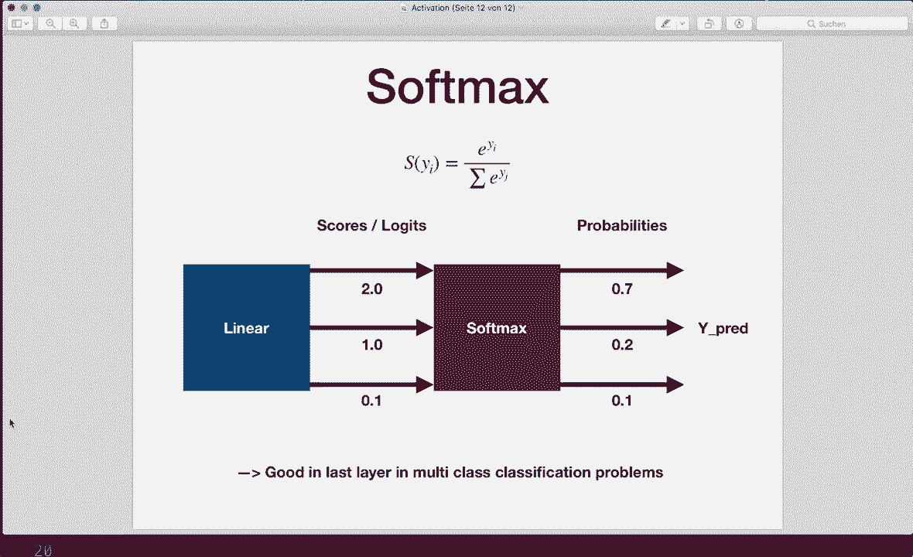

# 【双语字幕+资料下载】PyTorch 极简实战教程！全程代码讲解，在实践中掌握深度学习&搭建全pipeline！＜实战教程系列＞ - P12：L12- 激活函数 - ShowMeAI - BV12m4y1S7ix

嗨，大家好。欢迎来到新的PyTorch教程。这次，我想谈谈激活函数。激活函数是神经网络中极其重要的特性。让我们看看什么是激活函数，为什么使用它们，有哪些不同类型的函数，以及如何将它们纳入我们的PyTorch模型。

激活函数对层输出应用线性变换，并基本决定一个神经元是否应被激活。😊 那么，我们为什么使用它们呢？仅仅进行线性变换为什么不够好？通常，我们会在网络中有一个线性层，该层应用线性变换。在这里，它用某些权重乘以输入，并可能加上偏置，然后输出结果。

假设我们之间没有激活函数。那么，我们的整个网络从输入到输出实际上只是一个线性回归模型。而这个线性模型并不适合更复杂的任务。

结论是，通过在中间加入非线性变换，我们的网络可以更好地学习并执行更复杂的任务。因此，在每一层之后，我们通常希望应用这些激活函数。这里，首先是我们正常的线性层，然后应用这个激活函数。这样，我们的网络能够更好地学习。现在，让我们讨论最流行的激活函数。

我想展示的函数是二进制阶跃函数、sigmoid函数、双曲正切函数、ReLU函数、Leaky ReLU和softmax函数。首先，从简单的阶跃函数开始。当我们的输入大于一个阈值时，它将输出1。这里的阈值是0，否则输出0，这实际上在实践中并不常用。

但这应该演示一个神经元是否应该被激活的例子。而且，一个更流行的选择是sigmoid函数。如果你看过我关于逻辑回归的教程，你应该已经知道这个。它的公式是1除以1加上e的负x次方，这将输出一个介于0和1之间的概率。

这通常用于二分类问题的最后一层。那么，我们有双曲正切函数，也称为tanh。它基本上是一个缩放的sigmoid函数，并且稍微有点偏移。因此，它的输出值在-1和1之间。

实际上，这在隐藏层中是一个不错的选择。你应该了解tanh函数。接下来是ReLU函数，这是大多数网络中最流行的选择。ReLU函数对负值输出0，对正值则直接输出输入值。

这实际上是一个对大于0的值的线性函数，而对负值则为0。因此，它看起来与线性变换没有太大不同，但实际上它是非线性的，实际上是网络中最流行的选择，通常是激活函数的一个非常好的选择。

一条经验法则是，如果你不知道应该使用哪个函数，那么只需在隐藏层中使用ReLU。是的，这就是ReLU，非常受欢迎的选择。然后我们还有泄漏ReLU函数。这是ReLU的稍微修改和改进版本。因此，对于大于0的x，它仍然只输出输入。

但是这会对负数的输入乘以一个非常小的值。因此，我在这里为负数写了a乘以x，而这个a通常是非常小的。例如，0.0001。这是ReLU的改进版本，试图解决所谓的消失梯度问题。因为使用正常的ReLU时，我们这里的值为0。这也意味着在反向传播中，梯度也是0。

当梯度为0时，这意味着这些权重将永远不会被更新。因此，这些神经元不会学习任何东西。我们也称这些神经元为“死亡”。这就是为什么有时你想使用泄漏ReLU函数的原因。所以每当你注意到在训练过程中权重不会更新时。

然后尝试使用泄漏ReLU代替正常的ReLU。最后，我想向你展示Softmax函数。你也应该已经知道这一点，因为我有一个关于Softmax函数的完整教程。因此，这基本上会将输入压缩为0到1之间的输出，以便我们得到一个概率作为输出。这通常是多类分类问题最后一层的一个不错选择。

是的，这就是我想展示的不同激活函数。现在让我们跳到代码，看看如何在PyTorch中使用它们。因此，我们有两个选择。

第一个是将我们的函数创建为NN模块。在我们的网络的初始化函数中，首先定义我们想要的所有层。例如，这里，我们首先有一个线性层。然后，我们想要一个ReLU激活函数，所以我们在这里创建我们的ReLU模块。我们可以从torch的NN模块中获取。

这包含了我刚才展示的所有不同函数。接下来我们有这里的下一层，例如，下一层线性层。然后是下一个激活函数。在这里，我们在最后有一个Sigmoid函数。在前向传播中，我们简单地依次调用所有这些函数。因此，首先。

我们有线性，第一层线性，得到一个输出。然后我们使用这个输出并将其放入我们的relo中。接着，我们再次使用这个输出，将其放入下一个线性层，依此类推。这是我们可以使用它的第一种方式，而第二种方式是直接使用这些函数。

在init函数中，我们只定义我们的线性层。所以线性1和线性2，然后在前向传递中，我们应用这个线性层，然后也在这里调用torch dot relu函数，接着是torch dot sigmoid函数。所以这只是来自torch API的不同使用方式。没错，这两种方式将实现相同的效果。只是你喜欢你的代码方式而已。没错。

所有我刚刚给你展示的函数，你可以从N N模块中获得。所以这里我们有N relu，但我们也可以，比如说，拥有N dot sigmoid，还有N dot soft marks，以及N dot ton H。嗯。还有，N和dot leaky relu。所以所有这些函数在这里都是可用的。

它们在torch API中也可以这样使用。所以在这里我们有torch dot relo，还有torch dot sigmoid。我们也有torch dot soft max和torch dot1n H。但有时这些函数在torch API中不可用，但它们在torch do n n dot functional中是可以找到的。

所以在这里我导入了torch和n functional作为F。然后我可以在这里调用，比如说，F dot Relu。这和torch dot relu是一样的。但这里，比如说，torch的F dot leaky relu只在这个API中可用。所以，没错。这就是我们如何使用激活函数和pytorch。而且这实际上非常简单。

我希望你能理解所有内容，现在对激活函数感到舒适。如果你喜欢这个，请订阅频道，我们下次见！
