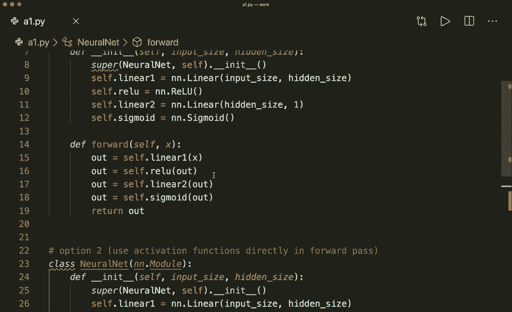

# 【双语字幕+资料下载】PyTorch 极简实战教程！全程代码讲解，在实践中掌握深度学习&搭建全pipeline！＜实战教程系列＞ - P12：L12- 激活函数 - ShowMeAI - BV12m4y1S7ix

Hi， everybody。 Welcome to your new Pytorch tutorial。 This time。 I want to talk about activationation functions。 Actation functions are an extremely important feature of neural networks。 So let's have a look at what activationation functions are。 why they are used what different types of functions there are and how we incorporate them into our pyt model。

 So activationation functions apply a linear transformation to the layer output and basically decide whether a neuron should be activated or not。😊，So why do we use them， Why is only a linear transformation not good enough。So typically。 we would have a linear layer in our network that applies a linear transformation。 So here it multiplies the input input with some weights and maybe add sub buyers and then delivers the output。

And let's suppose we don't have activationctuation functions in between。Then we would have only linear transformations after each other。 So our whole network from input to output is essentially just a linear regression model。 And this linear model is not suited for more complex tasks。

 So the conclusion is that with non nonlinear transformations in between our network can learn better and perform more complex tasks。 So after each layer， we typically want to apply this activation functions。 So here。First。 we have our normal linear layer， and then we also apply this activationctuaation function。And with this， our network can learn better。And now let's talk about the most popular activation functions。

 So the ones I want to show you is the binary step function， the smoid function。 the hyperbolic tangent function， the reallo， the leaky reulu and the softm。So let's start with the simple step function。 So this will just output one if our input is greater than a threshold。 So here the threshold is 0 and0 otherwise， this is not used in practice actually。

 but this should demonstrate the example of if the neuron should be activatedted or not。And yeah。 so a more popular choice is the sigoid function。 And you should already know this if you've watched my tutorial about logistic regression。 So the formula is  one over one plus E to the minus x。 and this will output a probability between 0 and1。

And this is typically used in the last layer of a binary classification problem。So， yeah。 then we have the hyperbolic tangent function or ton H。 This is basically a scaled sigmoid function and also a little bit shifted。 So this will output a value between-1 and plus one。

 And this is actually a good choice in hidden layers。 So you should know about the ton H function。Then we have the relo function， and this is the most popular choice in in most of the networks。 So the relu function will output 0 for negative values。 and it will simply output the input as output for positive values。

 So it is actually a linear function for values greater than 0， and it is just0 for negative values。 So it doesn't look that much different from just a linear transformation， but in fact。 it is nonlinearar， and it is actually the most popular choice in the networks。 and its typically a very good choice for an activationation function。

 So the rule of thumb is if you don't know which function you should use。 then just use a relo for hidden layers。Yeah， so this is the relu， very popular choice。 Then we also have the leaky relu function。 So this is a slightly modified and slightly improved version of the relu。 So this will still just output the input for x greater than 0。

 but this will multiply our input with a very small value for negative numbers。 So here I've written a times x for negative numbers。 and this a is typically very small。 So it's。 for example，0001。And this is an improved version of the relo that tries to solve the so called vanish ingredient problem。Because with a normal relu， our values here are 0。 And this means that also the gradient later in the back propagation is 0。

 And when the gradient is 0， then this means that these weights will never be updated。 So these neurons won't learn anything。 And we also say that these neurons are dead。And this is why sometimes you want to use the leaky relu function。 So whenever you notice that your weights won't update during training。

 then try to use the leaky relu instead of the normal relo。And yeah， then as a last function。 I want to show you the softmax function。 and you also should already know this because I have a whole tutorial about the soft softmax function。 So this will just this will basically squash the inputs to be outputs between 0 and one so that we have a probability as an output。 And this is typically a good choice in the last layer of a multi class classification problem。So。

 yeah， that's the different activationation functions I wanted to show you。 And now let's jump to the code and see how we can use them in Pytorch。 So we have two options。

And the first one is to create our functions as N N modules。 So in our network in the init function。 first， we define all the layers we want to have。 So here， for example， first。 we have a linear layer。And then after that， we want to have a relu activationctuaation function。 so we create our relu module here。And we can get that from the torch dot and N module。

 So this contains all the different functions I just showed you。And then we have the next layer for here， example， it's the next linear layer。 and then the next activationation function。 So here we have a sigoidid at the end。And then in the forward pass， we simply call all these functions after each other。 So first。

 we have the linear， the first linear layer， which gets an output。 And then we use this output and put it into our relo。 And then again。 we use this output and put it in the next linear layer and so on。So this is the first way how we can use it。 and the second way is to use these functions directly。

 So in the init function， we only define our linear layer。 So linear 1 and linear 2 and then in the forward pass we apply this linear layer and then also call this torch dot relu function here and then the torch dot seeoidoid function directly。 So this is just from the torch API。And yeah， this is a different way how we can use it。 Both ways will achieve the same thing。 It's just。How you prefer your code。 And yeah。

 so all the functions that I just showed you， you can get from the N N module。 So here we have an N relu， but we can， for example。 also have an N dot sigmoid and we have an N dot soft marks， and we have an N dot ton H。嗯。And also。 N and dot leaky relu。 So all these functions are available here。

And they are also available in the torch API like this。 So here we have torch dot relo。 and we have torch dot sigmoid。 We also have torch dot soft max。And torch dot1n H。And but sometimes they are not used in the the functions are not available in the torch API directly。 but they are available in torch do n n dot functional。

 So here I import a torch and n functional as F。 and then I can call here， for example， F dot Relu。 So this is the same as torch dot relu。 but here， for example。 is the torch is F dot leaky relu is only available in this API。So， yeah。 but that's how we can use the activation functions and pytorrch。 And it's actually very easy。

And I hope you understood everything and now feel comfortable with activationation functions。 If you like this， please subscribe to the channel and see you next time by。