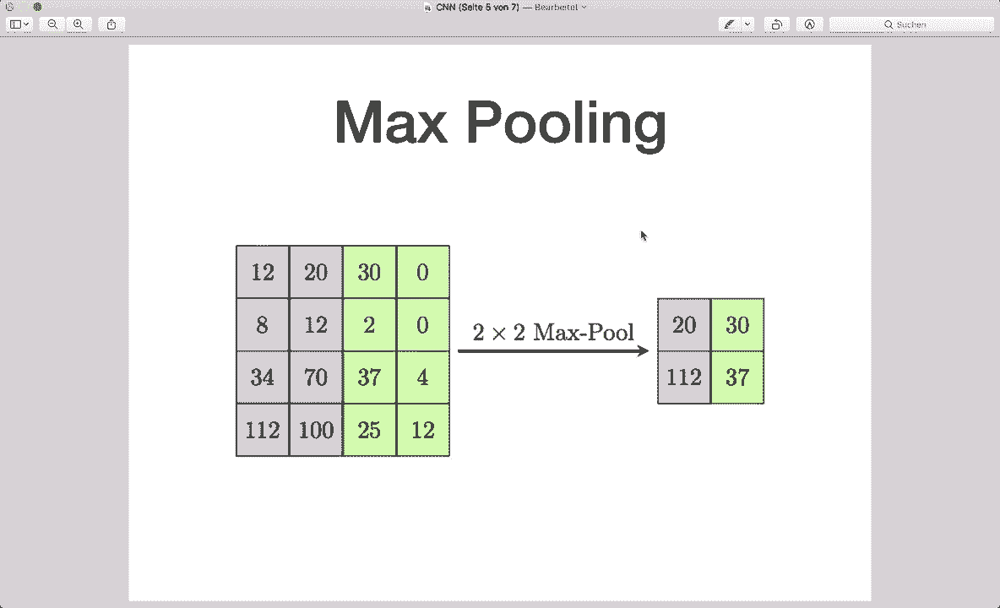
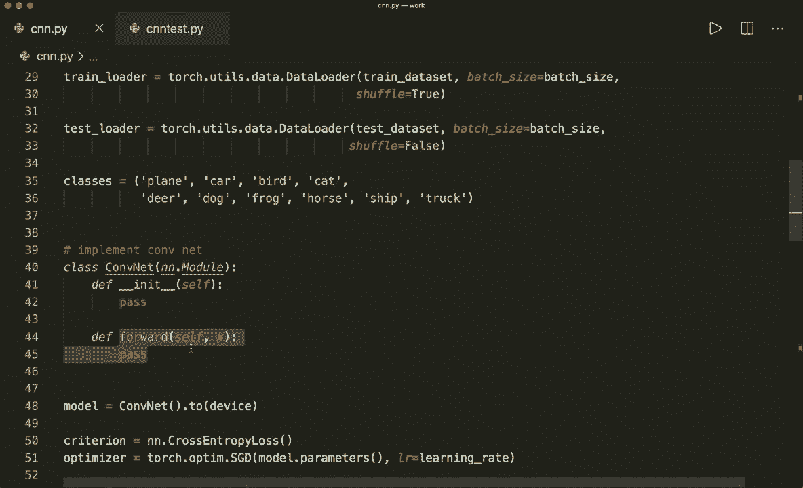
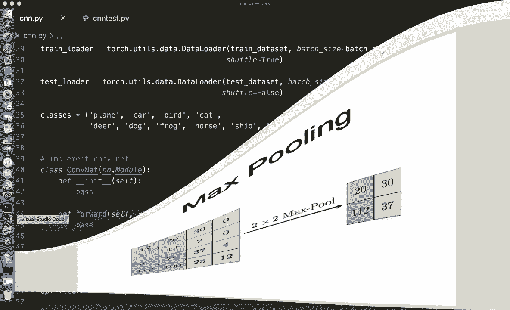
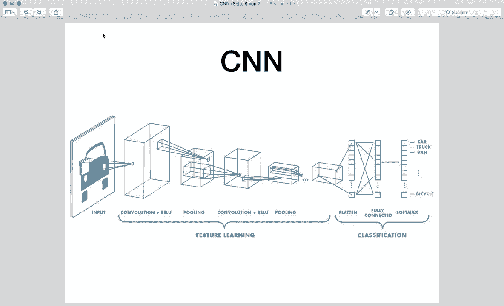
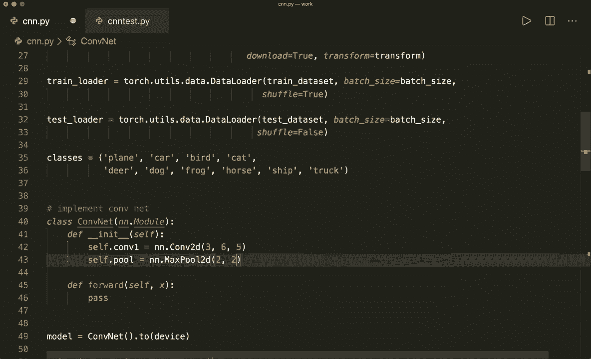
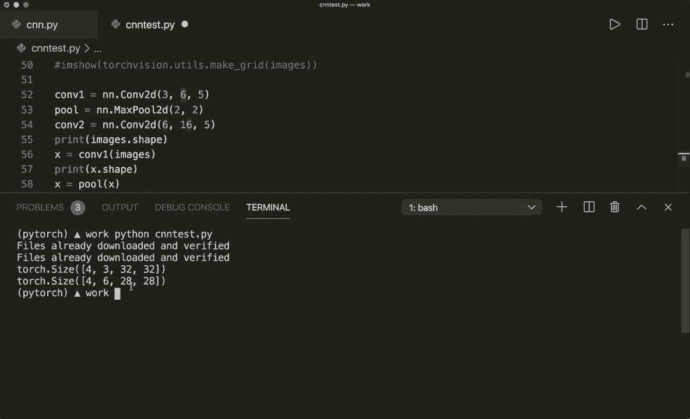
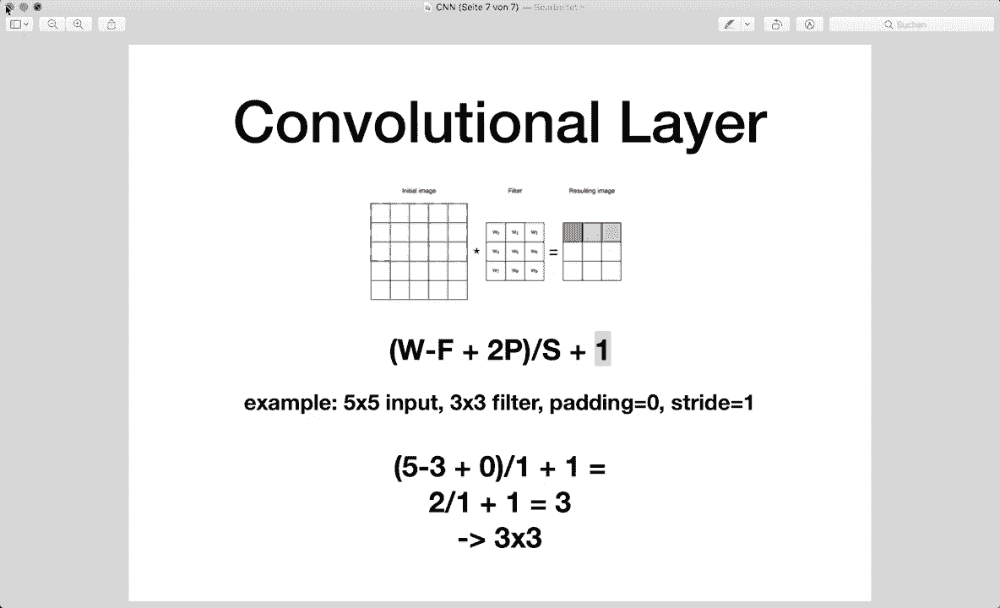
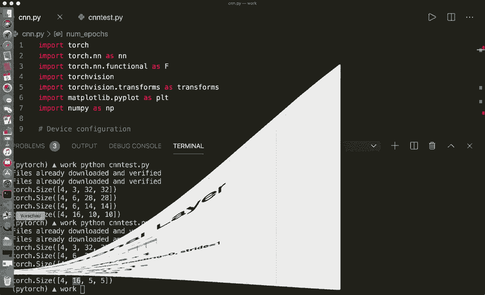
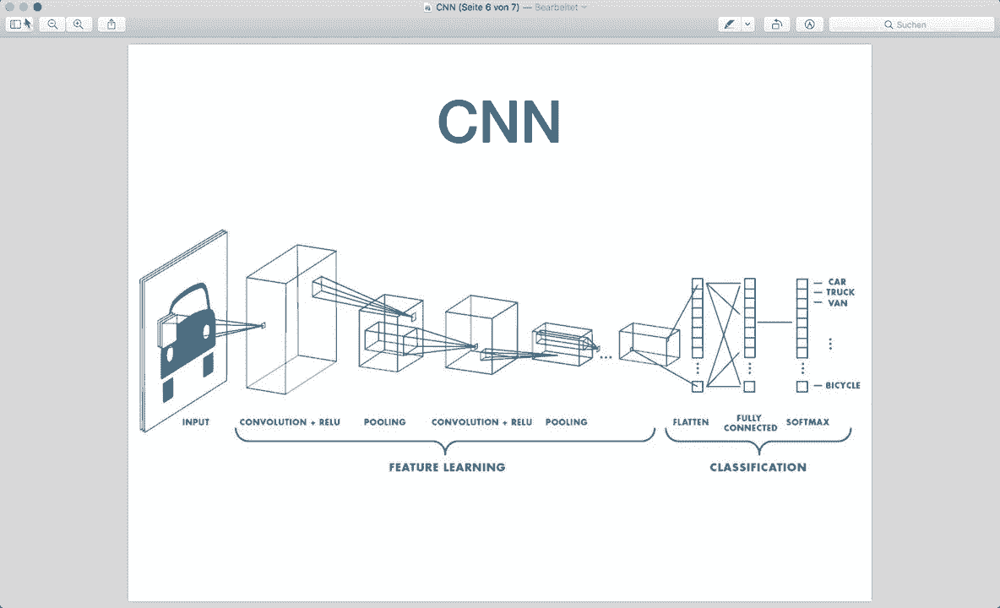

# 【双语字幕+资料下载】PyTorch 极简实战教程！全程代码讲解，在实践中掌握深度学习&搭建全pipeline！＜实战教程系列＞ - P14：L14- 卷积神经网络 (CNN) - ShowMeAI - BV12m4y1S7ix

大家好，欢迎来到新的 PyTorch 教程。今天，我们实现一个卷积神经网络，并基于 CIFAR-10 数据集进行图像分类。CIFAR-10 是一个非常流行的图像数据集，包含 10 种不同的类别，比如飞机、汽车、鸟类、猫以及其他类别。这个数据集在 PyTorch 中直接可用。

因此，我们将创建一个卷积神经网络，可以对这些图像进行分类。现在让我们简要谈谈卷积神经网络。我不会过多细节，因为本教程应该专注于 PyTorch 的实现，但如果你想更详细地了解，我会在描述中提供进一步的链接。😊

卷积神经网络或称为 confnets 与普通神经网络类似。它们由具有可学习权重和偏差的神经元组成。主要的区别在于卷积网络主要处理图像数据，并应用所谓的卷积滤波器。因此，典型的 conf 架构看起来是这样的。我们有我们的图像。

然后我们有不同的卷积层和可选的激活函数，接着是所谓的池化层。这些层用于自动学习一些图像特征。最后，我们有一个或多个全连接层用于实际分类任务。所以，这就是 CNN 的典型架构。而这些卷积滤波器，现在。

它们通过将滤波器内核应用于我们的图像来工作。因此我们把滤波器放在图像的第一个位置。这就是滤波器。这是输入图像。因此我们将其放在第一个位置，然后通过相乘并求和所有值来计算输出值。

然后我们将值写入输出图像。因此这里是红色位置。接着我们将滤波器滑动到下一个位置，即绿色位置。如果你能看到这里。然后我们做同样的事情和相同的滤波操作。接着我们在整个图像上滑动我们的滤波器，直到完成。

这就是卷积滤波器的工作原理。现在通过这个变换，我们的结果图像可能会有较小的尺寸，因为我们的滤波器在这里的角落不适用，除非我们使用一种叫做填充的技术。但在本讲座中我们不会涵盖这个内容。因此，获取正确的尺寸是一个重要的步骤，我们稍后会在实践中看到。

现在让我们也简要谈谈池化层。因此池化层，或更具体地说，在这种情况下，最大池化用于通过对子区域应用最大滤波器来下采样图像。这里我们有一个 2x2 的滤波器。然后我们查看原始图像中的 2x2 子区域，并将该区域的最大值写入输出图像。

最大池化用于通过减小图像的大小来降低计算成本。这减少了模型需要学习的参数数量，并通过提供输入的抽象形式帮助避免过拟合。所以这些都是我们必须了解的概念。

如果你想了解更多，请查看提供的链接。现在理论部分就到此为止，我们来看看代码。在这里，我已经写好了大部分需要的内容，所以我们导入所需的东西，确保我们有 GPU 支持，然后定义超参数。如果你不知道我是如何构建我的 Pytorch 文件的，请查看之前的教程，因为那里我已经解释了所有这些步骤。

首先，我们加载数据集，正如我所说，Spher 10 数据集已经在 Pytorach 中可用，所以我们可以使用它来自 Pytorch 的数据模块。然后，我们定义我们的 Pytorch 数据集和数据加载器，这样我们可以自动进行批量优化和批量训练。接着我在这里定义了类，并进行了硬编码。

然后我们需要实现卷积网络。和往常一样，我们通常创建我们的模型、损失和优化器。在这种情况下，由于这是一个多类别分类问题，我们使用交叉熵损失，然后作为优化器使用随机梯度下降。

需要优化模型参数，它获取定义的学习率，然后我们有典型的训练循环，进行批量优化，我们循环遍历 epoch 数，并循环遍历训练加载器，以获取所有不同的批次。

然后我们再次需要将图像和标签推送到设备上以获得 GPU 支持。接着我们进行典型的前向传播并创建损失。然后进行反向传播，我们必须记得先调用 zero_grad 来清空梯度。然后我们调用 backward 函数并优化一步，最后打印一些信息。

完成后，我们评估模型。和往常一样，我们将其包裹在一个 with torch.no_grad 的语句中，因为这里不需要反向传播和梯度计算。然后我们计算准确率，所以我们计算整个网络的准确率，并为每个单独的类别计算准确率。

是的，这就是脚本。你也可以在我的 GitHub 上找到这个内容，所以请去那里查看。现在唯一缺少的就是实现卷积网络。为此，我们定义一个类 confnet，它必须继承自 nn.Module。和往常一样，我们需要定义或实现 init 函数和前向传播的 forward 函数。

现在让我们在这里写一些代码。

因此，我们再次查看架构。在这里，首先，我们有一个卷积层，然后是一个ReLU激活函数。接着应用最大池化。然后我们有第二个卷积层，带有ReLU函数和最大池化。接下来我们有三个不同的全连接层。在最后。

我们有softms和交叉熵。因此softm已经包含在这里的交叉熵损失中。所以我们不需要关注这个。那么，让我们设置或创建所有这些层。假设self.dot con1等于，通过说n和dot conf获取第一个卷积层。

现在我们需要指定大小。输入通道大小现在是3，因为我们的图像有三个颜色通道。这就是为什么输入通道大小是3。然后假设输出通道大小是6，卷积核大小是5，即5乘5。现在让我们定义一个池化层，self pool等于N N.dot max pool 2 D，卷积核大小为2，步幅为2。

这正是我们看到的图像中那样。我们的卷积核大小是2乘2。每次操作后，我们将像素向右移动两个单位。这就是为什么步幅是2。

然后让我们定义第二个卷积层。self con2等于。现在输入通道大小必须等于最后的输出通道大小。因此这里我们说6。作为输出，假设是16，卷积核大小仍然是5。现在我们有了卷积层。接下来让我们通过说self.dot F1等于和N N.dot linear来设置全连接层。

现在作为输入大小。我先为你写这个。这是16乘5乘5。作为输出大小，我会简单地说100。所以你可以尝试不同的值。我会解释为什么这是16乘5乘5。然后让我们设置下一个全连接层，这里有120个输入特征。

假设有84个输出特征。然后我们使用最终的全连接层。我们有F1、F2和F3。这是输入大小为84，输出大小必须为10，因为我们有10个不同的类别。因此你可以改变这里的120和84，但这必须固定，10也必须固定。

现在让我们看看为什么这个数字必须是这个数字。这里我有一个小脚本，它做的正是相同的事情。哦，让我改变epoch的数量。哦，是的，这是4。所以在开始时，我有相同的内容。我加载数据集，嗯。

打印或绘制一些图像。这里我有相同的层。我有第一个卷积层和池化层，还有第二个卷积层。首先，让我们运行这个并绘制图像。我们可以说Python，CNN test dot pi。然后，我已经下载好了。所以它会打印。是的，虽然非常模糊，但我想你可以看到这个。

这是一匹马，也许是一只鸟，还有另一匹马。是的，我其实不认识这个。让我们再运行一下，看看是否能看到更好的图片。所以，是的，仍然非常模糊。我认为这是一只鹿、一辆车、一艘船。所以，好的。让我们看看尺寸的样子。首先，我们只打印形状的图像。所以这是4乘3乘32乘32。

这是因为我们的批处理大小是4。然后我们有三种不同的颜色通道。我们的图像尺寸为32乘32。现在让我们应用第一个卷积层。我们说x等于cont1，这将获取图像。现在让我们打印这个操作后的下一个大小。抱歉，我不想要。

再也不需要了。现在我们有下一个大小，所以这是4乘6乘28乘28，因此是6。现在我们有六个输出通道，如此处指定，图像大小是28乘28，因为正如我所说，生成的图像可能会更小，因为我们的滤波器无法适应角落，计算输出大小的公式是输入宽度减去滤波器大小加上2倍的填充。

在这种情况下我们没有填充，然后除以步幅再加1。所以在这个例子中，我们的输入大小是5乘5，滤波器大小是3乘3，填充是0，步幅是1。因此输出大小是5减去3加1。所以是2，然后除以。

1仍然是2，然后加上1。这就是为什么我们的输出图像是3乘3。现在我们必须在我们的情况下应用相同的公式。所以我们有32减去滤波器大小，减去5。因此是27。加0，仍然是27，除以1，仍然是27，然后加1。所以这就是为什么是28。

所以这里我们有28乘28。接下来我们应用下一层。下一个操作是池化层。我们保存这个并运行它。现在我们的尺寸是4乘6乘14乘14。这是因为，如示例所示，我们的池化层的核大小为2乘2，步幅为2，将图像减少了2倍。

所以是的，现在让我们应用第二个卷积层。让我们打印这个操作后的大小。首先清除这个。然后运行这个。接着，我们需要应用我刚才展示的公式来减小尺寸。因此这里PyTorch可以为我们计算出来。尺寸是4乘16，这就是下一个通道的输出大小。

我们指定的大小是16，结果图像是10乘10。然后我们应用另一个池化操作，这将再次将大小减少一半。因此，这就是我们现在看到的，在两个卷积层和池化层之后的最终大小是4乘16乘5乘5。所以。如果我们再看看。那么在此之后。

这些卷积层。现在，当我们将它们放入分类层时，我们想要展平大小，因此我们希望将我们的3D张量展平为1D张量。

现在，如果我们看看现在的大小，第一层线性层的输入大小正是我们这里的16乘5乘5。这一点非常重要，以确保这里的大小正确。但现在我们知道为什么这必须是16乘5乘5。现在我们有了正确的大小。

现在我们已经定义了所有层，现在必须在前向传播中应用它们。所以我们说x等于。现在让我们应用第一个卷积层，获取x。然后在此之后，我们应用一个激活函数。我们可以通过调用F来做到这一点。所以我导入了Torch和功能SF。然后我可以调用F.dot.relu，并将其作为参数传入。

然后在激活函数之后。顺便说一下，激活函数不会改变大小。所以现在我们应用第一个池化层，所以self.dot pool并包裹在这里。这是第一个卷积和池化层。然后我们对第二个卷积层做同样的事情。现在我们必须将其传递给第一个全连接层。为此，我们必须将其展平。因此我们可以通过说x等于x.dot.view来做到这一点。第一个大小，我们可以简单地说1。这样Pytorch就可以自动为我们定义正确的大小。这是批次的数量。

我们这里批次中的样本数量。所以在这种情况下是四个。然后这里我们必须说16乘5乘5。现在我们有我们的张量。现在让我们通过说x等于self.dot F1来调用第一个全连接层。这将获取X。然后我们再次应用激活函数，我们简单地使用relu。

我还有一个关于激活函数的完整教程。如果你还没看过，请查看。现在在此之后，我们应用第二个。所以x等于这个，第二个全连接层带有激活函数。最后，我们简单地有x等于self.dot最后一个全连接层F C 3和X。

最后没有激活函数，也没有这里的softmax激活函数，因为这已经包含在我们设置的损失中。所以我们可以简单地返回X。这就是整个卷积网络模型。现在你应该知道我们如何设置这个。嗯，然后我们在这里创建模型，然后继续进行。

这是我已经向你展示过的训练循环。所以现在让我们保存这个，运行它。清除这个，输入Python，C和N点P，希望这能启动训练。所以。哦，对了，我忘了一件事，当然，要调用super的初始化。所以永远不要忘记调用super。这需要获取con和self，然后。点下划线初始化。

所以让我们再清除一次，再试一次。现在，这应该会启动训练。我在我的MacBook上没有GPU支持，所以这可能需要几分钟。所以我想我会跳过这个，等训练完成后继续。所以我们一会儿见。好，现在我们回来了。我们的训练已经完成，如果我们看看。

我们可以看到损失值缓慢下降，然后我们有了最终评估。因此，总网络的准确率为46.6%，每个类别的准确率在这里列出。所以效果不是很好。这是因为我们这里只指定了训练的轮数。因此，你可能想尝试更多的轮数，不过是这样的。

现在你应该知道如何实现卷积神经网络。我希望你喜欢这个教程。如果你喜欢这个，请点赞并订阅频道，我们下次再见。😊！
