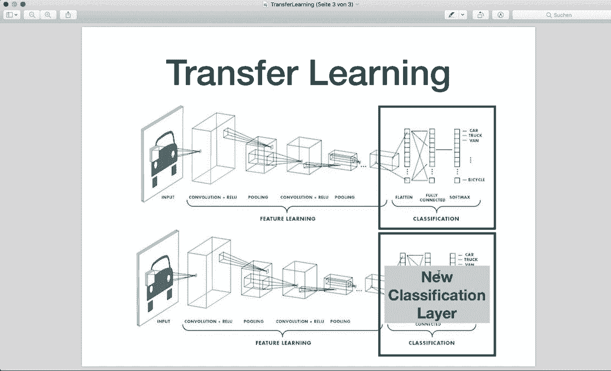

# 【双语字幕+资料下载】PyTorch 极简实战教程！全程代码讲解，在实践中掌握深度学习&搭建全pipeline！＜实战教程系列＞ - P15：L15- 迁移学习 - ShowMeAI - BV12m4y1S7ix

Hi， everybody。 welcomele to your new Pytorch tutorial In this tutorial。 we will talk about transfer learning and how it can be applied in Pytorch。 Transfer learning is a machine learning method where a model developed for a first task is then reused as the starting point for a model on a second task。 For example， we can train a model to classify birds and cats and then use the same model。

 modified only a little bit in the last layer， and then use the new model to classify bees and dogs。 So it's a popular approach in deep learning that allows rapid generation of new models。 And this is super important because training of a completely new model can be very time consuming。 It can take multiple days or even weeks。 So if you use a pretrained model。

 then we typically exchange only the last layer and then do not need to train the whole model again。 However， transfer learning can achieve pretty good performance results。 and that's why it's so popular nowadays。😊，So let's have a look at this picture here。 We have a typical CNN architecture that I already showed you in the last tutorial and this。

 let's say this has been already trained on a lot of data and we have the optimized weights and now we only want to take the last fully connected layer。 So this one here and then modify it and train the last layer on our new data。So then we have a new model that has been trained and tweaked in the last layer。And yeah。 this is the concept of transfer learning。 And now let's have a look at a concrete example in Pytorch。

 So in this example， we want， we are using the pretrained Resnet 18 C N。 This is a network that is trained on more than a million images from the Inet database。 And this network is 18 layers deep and can classify images into 1000 object categories。 And now in our example， we have only two classes， So we only want to detect Bs and ants。😊。

And yeah， so let's start。 So in this session， I already。 I also want to show you two other new things。 So first， the data sets image folder。 how we can use this and how use a scheduleula to change the learning rate。And then， of course。 how transfer learning is used。So I already imported the things that we need。

 and now we set up the data。 and the last time we used the built in data sets from the Torch vision data sets。 And now here we use the data sets dot image folder because we saved our data in a folder and this has to have the structure like this。 So we have the folder here。And then we have a training and a validation folder。 So train and Val。 And in each one， we have folders for each class。 So here we have ans in ants and Bs。

 and also in the validation folder， we have ants and Bs。And now in each folder。 we have the images here。 So， for example， here， we have some ants。 And also。 let's have a look at some Bs。 So here we have a B。And yeah。 so you must structure your folder like this。 And then you can call the data sets dot image folder and give it the path。

And we also give it some transforms here。And then， we get the。Classes。 the class names by calling image sets， image data sets dot classes。And yeah。 then here I defined the training model where I did the loop and did the training and the evaluation。 I will not go into detail here。 you should already know this from the last tutorials how at typical training and evaluation loop looks like you can also check the whole code on Gitthub。

 so I will provide the link in the description。 So have a look at this yourself。And now let's use transfer learning。 So， first of all， we want to import the pre trained model。 So let's set up this model so we can do this by saying model。So model equals。 And this is available in the Torch visionion dot models module。

 So I imported torch vision models already。 and then I can call models dot Resnet 16 or sorry。 Resnet 18 here。 And then I can say pretrained equals true。 So this is already the optimized weights that are trained on the imagenet data。And now what we want to do is we want to exchange the last fully connected layer。 So first of all。

 let's get the number of input features from the last layer。 So let's say nu features equals model。 and we can get this by calling dot F fully connected。 And then the input features。 So this is the number of input features for the last layer that we need。And then let's create a new layer and assign it to the last layer。 So let's say model。Dot F C equals。

 And now we give it a new fully connected layer N N dot linear。 And this gets the number of input features that we have。And then as new output features。 number of outputs， we have two because we have two classes now。And now we send our model to the device。 If we have GP support。

 So we created our device in the beginning， as always。 So this is Kuda or simply CPU。And now that we have our new model， we can， again， as always， define our loss and optimize us。 So we say criterion。Equals N， N dot cross entropis。And then let's say the optr equals。 This is from the optimization module， Opim dot S GD， stochastic gradient descent。

 which has to optimize the model parameters。 And we have to specify the learning rate equals。 let's say0001。And。Now， as a new thing， let's use a scheduleula。 This will update the learning rate。 so。For this， we can say we can create this by saying it's called a step L R scheduleular。Equals。 and the L R scheduletula is available also in the torch optimization module。

 So we already imported this。 And then we can say L R scheduletula dot step L R。 And then here we have to give it the optimizer。 So here we say optimizer。And then we say step size。 step size equals 7。 And then we say gamma equals let's say，01。 This means that every 7 epochs。 Our learning rate is multiplied by this value。 So every 7 epochs。

 Our learning rate has only 10 is now only updated to 10 per cent。So， yeah。 this is how we use a scheduletula。 And then typically what we want to do is in our loop。 in our loop over the epoch。 So for epoch in range， let's say，100。 And then typically here we use the training， where we also do。The。The optimizer dot step。

 optimizer dot step。 Then we want to evaluate it， evaluate it。 And then we also have to call scheduler step scheduler step。 So this is how we use a scheduler。 Please have a look at the whole loop here yourself。So yeah。 now we set up the scheduleular and let's。Call the training functions。

 So here we say model equals and then train model。 So this is the function that I created。 And then I have to pass the model， the criterion。The optimizer。 the scheduler and also the number of epochs。 So nu epochs， let's say 20。And。Yeah。 so this is how we use， how we can use transfer learning。 So in this case。

 we use a technique that is called fine tuning。Because here， we。Train the whole model again。 but only a little bit。 So we fine tune all the weights based on the new data。And with the new last layer。 So this is one option。 And the second one is for this。 I copy and paste the same thing。And。Let's see where does it start。 So here。

 and then as a second option， what we can do is we can freeze all the。All the layers in the beginning and only train the very last layer。 So for this。 we have to loop over all the parameters here after we got our model。 So we say 4。Pm in model。Dot parameters。And then we can set there requires gra attribute to fall so we can say para。

Dot requires gr。And then say， we， sorry， Do requires gra。Requires gra equals false。 Now we have it。 and this will freeze all the layers in the beginning。 And now we set up the new last layer。 We create a new layer here。 and by default， this has requires gra equals true。And then again。 we set up the loss and optimizer and the schedule in this case。

 And then we do the training function again。 And so yeah， so this is even more faster。 And let's run this and then have a look at both the evaluations。 And I also print out the time that it took。So。Yeah， let's save this。 and let's run this by saying Python transfer dot pi。And。This might first。

 it will download all the images， and this might take a couple of seconds because I don't have GP support here on my MacBook。 So I will skip this， and then I will see you in a second。All right， Soa， I am back。 So this took super long on my computer， so I reset。The number of epochs to just2 in this example。 So let's have a look at the results。 So after only two epochs。

 so this is the first training where we did the fine tuning of the whole。Model。 so this took three and a half minutes。 and the best accuracy now is 。92。 So 92%。And then this is the second training where we only trained the last layer。 So this took only one and a half minutes approximately。

 and yeah accuracy is also is already over 80%。 So of course。 it's not as good as in when we train the whole training， but still pretty good for only two epochs。 And now let's imagine if we set the number of epochs even higher。 So yeah。 this is why transfer learning is so powerful because we have a pretrained model。

 and then we only fine tune it a little bit and do a completely new task and then achieve pretty good results too。 So yeah， so now I hope you understood how transfer learning can be applied in Pythtorch。 if you enjoyed the tutorial。 Please subscribe to the channel and see you next time by。

