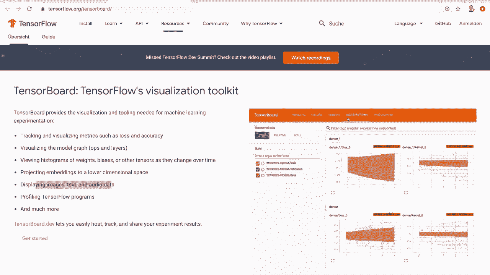
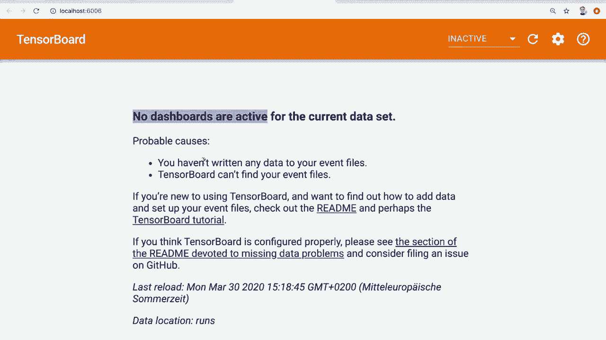
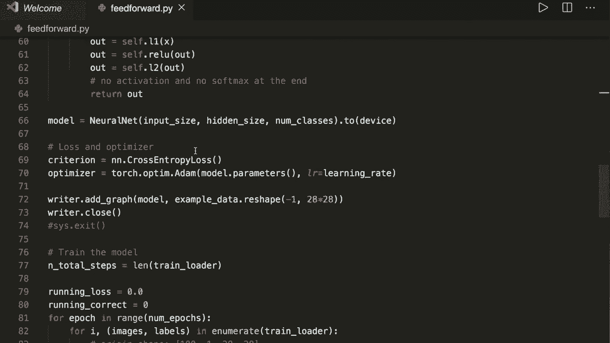
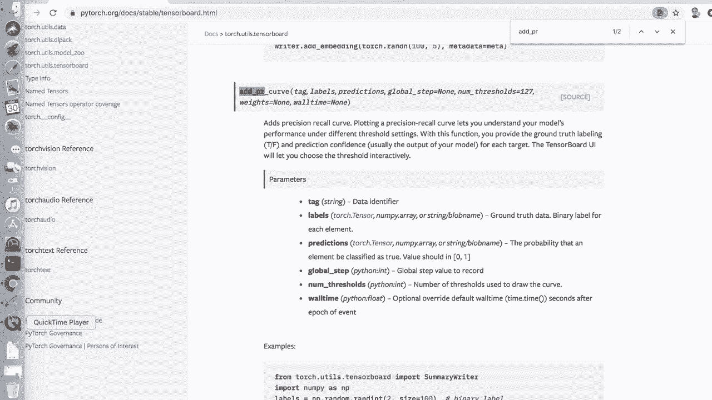

# 【双语字幕+资料下载】PyTorch 极简实战教程！全程代码讲解，在实践中掌握深度学习&搭建全pipeline！＜实战教程系列＞ - P16：L16- 如何使用 TensorBoard - ShowMeAI - BV12m4y1S7ix

Hey， guys， welcome to a new Pytorch tutorial。 In this video。

 we will learn how to use the Tenzo board to visualize and analyze our model and training pipeline。

 Tenszoboard is a visualization toolkit in order to experiment with our models。

 It is actually developed by the Tenorflow guys， but it can be used with Pytorch as well。

 So here on the official website。 We can do a few things。

 we see a few things that we can do with Tenszobar。 So， for example。

 we can track and visualize metrics such as the loss and the accuracy。

 We can visualize our model graph。 We can view histograms。

 We can project embeddings to a lower dimensional space， and we can display images。

 text and audio data， and we can profile our programs and much more。😊。

So now I want to show you how we can use this in our code。

 So I'm going to use the code from tutorial number 13 here。

All right。 So here is the code。 So this is the exact code from tutorial number 13。

 And if you haven't watched this one， and I recommend that you watch this one first。

 So I will briefly explain the code again now。So in this tutorial， we used the Mnes data set。

 So we did diit classification here。 So here we are loading the Mnis data set。

 Then we are plotting some of the images。 and then we create a simple feet forward neural net。

 So this is a fully connected neural network with one hidden layer。

 So we see we have one linear layer first， Then we have a relu activationctuaation function。

 and then another linear layer。 and that's our whole forward pass。

 Then we set up our training pipeline。 So we have our loss and optimizer。 Then we do the training。

So here， as always， we do a forward pass， a backward par， and then update our weights。

 And then at the end， we evaluate our model and plot the accuracy。

 So now let's use the tennor board for this code to analyze our model a little bit more。

 And the first， first thing we want to do is to install tensor board。 So for this， we can do Pip。

Install。Tenensil board。And this will install all the things that we need。 So in my case。

 I've already installed this。 So this was fast。 And we don't have to install the whole Tens of flow library。

 So Tenzzo board is enough here。And now we can start the tensor board by saying tenor board。

 And then we have to specify the path where we save the lock files。

 and we do this by giving it the argument minus minus loer equals。 and by default。

 this is called in the runs directory。 So let's hit enter。

And then it will start up the Tensor board at local horse 60，06。

 And here we have a warning that it doesn't find Tensorflow and it will run it with a reduced feature set。

 but that is fine。 So let's open up the tensor board。

And now here we have the tensor part。 And right now， we see that no dash ports are active。

 And this is because we haven't written any data。 So let's do this。

So let's jump to the code again。And now the first thing we want to do is to import the Tenzo board。

 So， and for this， we say from torch dot us dot Tenzobar。We import， and this is called summary rid。

 So we import a summary rid， and。So here I have a typo。And now let's create a rider。

 So let's say rider equals summary rider。 And then let's give it a。Diectctory。

 where it should save the log files and the default directory is， as I said， the runs folder。

 But let's be more specific here。 So let's call this runs and then M N。

And now we have our writer set up。 And now the first thing we want to do is here。

 So here in the code， we plotted some images。 And now， instead of plotting。

 let's add the image to our tensor board。 And for this。

 the only thing we have to do is we want to create a grit。 And then call the writer at image method。

 So let's do this。 So let's say our image grit equals。 And we also get this from torch vision dot us。

Dot make， make grit。 And then let's give it the data。 So here we have one batch of our example data。

 So let's put this in here。 And then let's call。Rrier， dot at。Image。

And then here we give the image grid。And we also have to provide a label for this image in the beginning。

 So let's call this， for example， M Nist。Images。And now。嗯。I want to exit here， so I use。

 I import cis or system。 And then here I use an early exit because I don't want to run the whole training pipeline right now。

 So here I call cis dot exit。 and I want to make sure that all the events are written here。

 So that's why I also call Rder。Dot close。 So this makes sure that all the outputs are being flushed here。

And now let's save this。 and let's go to the terminal， and let's run this。So let's say Python。

 and then our file was feet forward dot P and hit enter。

 And now let's go to our Tensor board again and let's reload this。

 And then we see we have our images here。

And here we have our grid that we just created。And this is 60。

 this is 8 by 8 because we specified our batch size to be 64。

And yeah， so now we can analyze our data。

And let's go ahead and do something more with our Tzor board。

So the next thing we want to do is to add a graph。 So to analyze our model。

 So if we scroll down further， then we see that here we create our。Neural nets。

 So let's comment this thisis exit out again。And then here we create our model。

 and then here our loss and optimizer。 And now down here。

 let's add our model graph So we can do this by saying rider at graph。

 And then here we give it the model。And then we also can give it an input so we can say， again。

 we have our example data。 So this is one batch。 And then we have to reshape the same way that we are doing it here。

So let's reshape our batch data。And。Then again， let's call Rer dot close and writerer exit。

insist system exits。 And again， let's run our。File。

And now let's head over to our tensor board again。 and let's reload this。

 And then we see here up here。 we also have the graphs tab。 So let's go to the graph。

 And here we see our model。So we have the input and then the neural net。

 And now if we do a double click， then we see more details。 So here we see our whole model。

 And so now we see we have the first linear layer。 Then we have the relu activationctuaation function。

 And then we have the second linear layer。And we also see the weights and the biases for each linear layer。

 So， yeah， so now we can inspect this further， if we want。And yeah。

 this is really helpful to analyze the structure of our model。

So， yeah， now we have our model。 and now let's analyze some metrics， so。

What we did in the original script is we simply， during the training， we printed every 100th step。

 We print the current loss。So now， instead of just printing did this。

 let's add this to our teno board。 So let's add the training loss and also the accuracy for this。

 And for this， we want to have the mean loss during this batch training。

 So let's add a two values up here before we start our loop。 So the first one is our running loss。

And this is 0 in the beginning。 And then let's also say， the running。Correct。

Predictions equals 0 in the beginning。 And now， every hundredth step。We。No。

 sorry before for in each iteration。 Now， we add the。Loss to the running loss。

 So we say running loss plus equals loss dot item。 And we also add the number of correct predictions to the running correct。

 So for this， we want to get the predictions。 And we can do this the same way as we are doing it down here by calling torch dot max。

So。Let's do this up here， as well。So we get the predicted values。

 and then we say running correct plus equals。 And here we say predicted equals equals the actual labels。

 and then the sum。 And this is a tensor with only one item。 So we can call dot item。And now， yeah。

 here we add this to the running loss。 And now every hundredth step。

 we want to calculate the mean value and add this to the tenor board。 So we call rider dot at Scala。

 And now we have to add have to give it a label。 So here， let's give it the label draining loss。

And now the actual loss is the running loss divided by 100， because we sum this up for 100 steps。

 And then we also have to give it the current global step。

And this is the by saying epoch and times the number of total steps that we extracted up here。

 So this is the length of the training loader。 and then plus I， and I is the current batch iteration。

So this is the current global step。 So here we add the training loss。

 And now let's do the same thing again and add the accuracy。 So let's say accuracy。

And then here we have to say， running。Correct。Divided by 100。And after that。

 we have to set the running loss and the running predicted to the running correct to 0 again。

 So let's say running loss equals0。0 and running loss。And no， sorry。 Run correct equals 0 again。

And then。Yeah， now we have to save this。 and now we have to run the whole training pipeline。

 So let's comment this system exit out again。And now， let's run our script。

And we should still see the， the printing outputs here。 So for every 100th step。

 we see that how the loss is decreasing。And now we should be done。

 And now we also see the whole accuracy of our network。

 And now let's go to our Tensor board again and again， hit reload。

 And then we have one more entry up here。 And this is the scholars entry。

 And here we have our two plots。 So yeah， we see that it worked。 So we see the accuracy。

For each of the steps。 And we also see how the training loss is decreasing。And yeah。

 so here by default， Tenzo flow， Tenzo board is smoothing this line so we can modify the smoothing parameter here。

But yeah， and now we can analyze how the loss is decreasing。 And so， for example。

 if we see that at some point， it is not decreasing further， and we can see that at this point。

 we have to improve something。So， for example， what we can do then is we can try out a different learning rate。

 of course， So this is usually one of the first things that we want to optimize。

 So let's modify the learning rate。 And now let's call the folder mist。 Let's say simply2。

And then again， let's clear this and run our script again。And。

Then this should already update our tenor board during the。During the file runnings。

 So now we see a second graph。And also here we see a second graph in the loss graph。 Now。

 let's reload this again。 And now yeah， it should be done。 And now， for example。

 here we see then another graph with a different learning rate。

And this is how we can interactively optimize and analyze our model。And now， as a last thing。

 what I want to show you is how we can add a precision recall curve。

 So precision recall curve lets you understand your model performance under different threshold settings。

 And this makes more sense in a binary classification problem。

 But if we analyze each class separately here。 Then we do have a binary classification problem。

 So let's add a precision recall curve for each class here。

AndFor those of you who do not know what a precision and recall mean。

 then I have a link for you in the description。 So please check that out。

 And now what we want to do here is。 let's have a look at the official documentation here。

 So I also I recommend that you check out this link。 So let's search for at PR。

 And then we see here we have the method at precision at PRr curve。

 So this adds a precision recall curve。 And this needs the attack first。

 and then it needs the labels。 and here we see the labels is the ground truth data。

 So a binary label for each element。

And then it needs the predictions and the predictions are the probability that an element be classified is true。

 and the value should be between 0 and1。 So this is important here。

 So we need to have the actual labels and also the predictions here。 All right。

 So now let's go to the code and at a precision recall curve for each class。

 So here in our evaluation。 we want to create a list where we store our labels。

 So let's say labels equals an empty list。 And also a list for the predictions。

 So pres equals an empty list。 And then during the batch evaluation。 So what we do here。

 So for the labels， we can say labels stopped app pen， the actual labels is the predicted labels。

 And now for the。😊。

Predictions， we have to be careful。 So for here， we need probabilities between 0 and 1。

And now here we get the outputs from our model。 And if we have a look at the neural net again。

 and we see that we have a linear layer at the end。 So these are raw values。

 And here we even have a comment。 So no activationctuaation and no softms at the end。

 because in this case， this is applied in our loss function in the cross entropy loss。 But now。

 again， in the evaluation， we want to have actual probabilities。And。

If you've watched my tutorial about activationation functions。

 then you know which activationation function we must use here to get the probabilities。

 And this is the soft max function。 So this  squeezes our values to be probabilities between 0 and 1。

 So let's call the softms here explicitly for our outputs。 And for this， let's import F。

 So functional。 So let's say here。😊，Let's import torch dot N， N dot functional， S F。Capital F。

And then， down here。We want to calculate the soft max for each output in our output。

 So let's use list comprehension for this。And let's call this class。🤢，嗯。Predictions equals。

 And now here we use list comprehension and call F dot soft max。 And then here we say of the output。

 And then we do this。 We have also have to give it the dimension。

 So let's say dimension equals along dimension 0。 And then we want to do this for output in outputs。

And then let's add this to our， what did we call it prettz。 So prets dot， a pen。

 And then here class predictions。 And then when we are done with the for loop。

 we want to convert this to a1zo。 So here we say labels equals。 and then torch dot cut the labels。

 So right now， this is a list。 And when we want to concatenate all the elements in our list along one dimension。

Into a one dimensional tenor。 And for the predictions， we want to have a two dimensional tensor。

 So for each。For each class， we want to stack the predictions。 and then we want to concatenate this。

 So we say。Prats equals。 And then here we say torch dot cat。

 And then here we use list comprehension again and say torch dot stack。

 And here we stack each batch and say four batch in our predictions。

So you should check the the shape of these tensors for yourself。 So this has shape。 I think how many。

 we have， I think 10000 samples。 So this is 10000 by one and this should be 10000 by 10。

 So for each class， we stacked it here。 and now when we are done。

 So now the last thing we have to do is to have the actual PR curve。 So for this， we say classes。

 So our class labels in this case， it's just the range 10 because we have the。Ditchitts from 0 to 9。

 And now let's iterate over this。 So4 I in classes。 And then we say we get the labels I equals。

 So this is where labels equals equals I。 And then the same thing with the predictions I equals the predictions。

 And here we want to have all the samples。 But only for the class I。 And then we call writer dot at。

 And this is called at PR curve。And this needs a tag。 So for the tag。

 we just use the class label as string。 And then here we have the。Labels first。

 and then the predictions。 So predictions I， and then as global global step， we just use0。

 And then let's call writer dot close。 And then we are done。

 So now let's save this and run our script one more time。And now when this is done。

 and we should see precision recall curve for each of the class labels。So。Almost done。 And a pen。

 So I have a typo here。So I have two different labels variables。 So let's call this。嗯。

Let's just call this labels 1 here。 So labels1 and labels 1 and labels1。And now。

Let's run this one more time。Sorry about that。So let's clear this and run this one more time。

And now again， we have to go through the training pipeline。Oh， I didn't save it。

Alright， so now we are done， So let's reload our tensor board one more time。

And now we have one more entry up here。 and this is the PR curve。

 And now we should see the precision recall curves for each of our class label。

 So here we have label 0， label 1 and so on。And then we can inspect the precision and the recall for the different thresholds。

 So here on the y axiss， we have the precision and on the x axis， we have the recall。 And then。

 for example， for each for different thresholds we can analyze it and see how many true positives。

 how many false positives， how many true negatives and false negatives we have。

So this is also really helpful to analyze the model。And yeah。

 so that's all I wanted to show you for the Tenser board。 I hope you enjoyed this tutorial。

 and please consider subscribing to the channel and see you next time， bye。😊。

