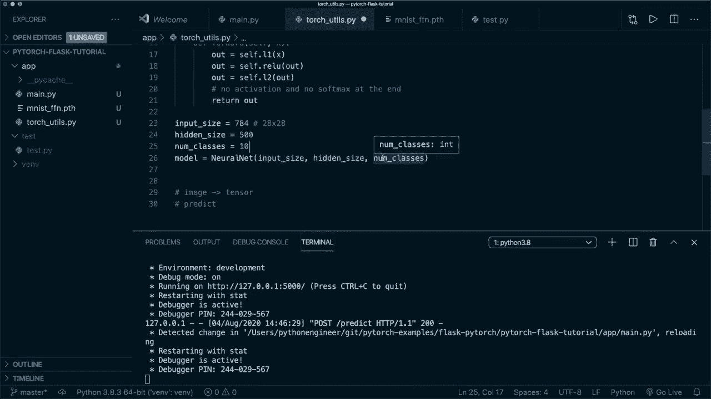
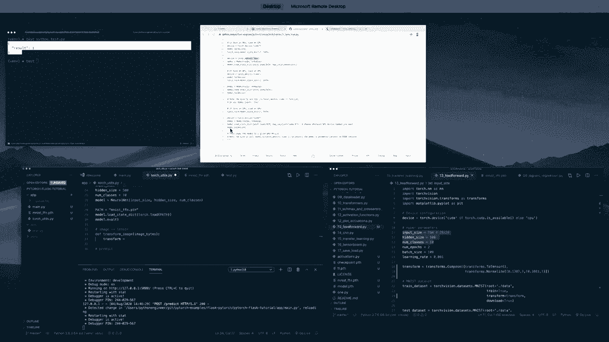
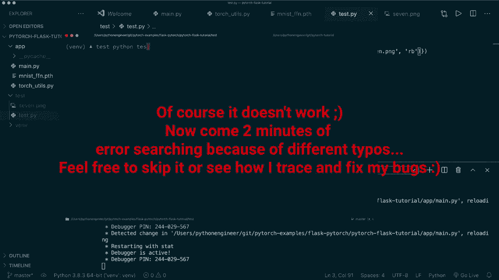
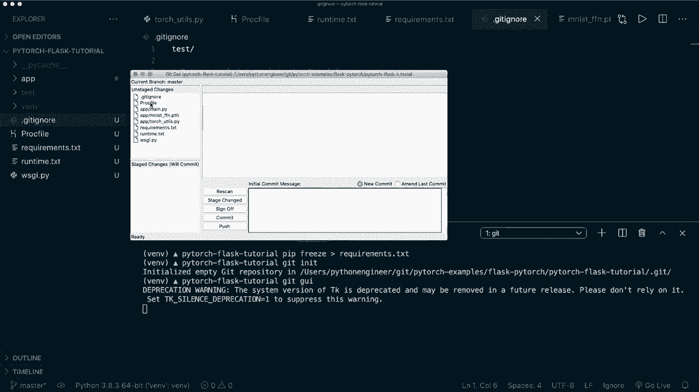

# 【双语字幕+资料下载】PyTorch 极简实战教程！全程代码讲解，在实践中掌握深度学习&搭建全pipeline！＜实战教程系列＞ - P18：L18- 创建和部署深度学习应用程序 - 使用 Flask 和 Heroku 部署 PyTorch 模型 - ShowMeAI - BV12m4y1S7ix

嗨，大家好，欢迎来到新的Pytorch教程。今天，我将向你展示如何使用flask和Heroku部署我们的Pytorch模型。我们将创建一个简单的flask应用，带有一个返回结果的REST API。然后我们将部署到Heroku。作为示例，我们的Pytorch应用应该进行数字分类。

最后，我将向你展示如何绘制自己的数字，然后用我们的实时应用进行预测。让我们开始吧。首先，让我们创建一个新的目录。我们称之为`Pytorch flask 2`。😊，然后让我们进入这个目录。接下来，我们要创建一个新的虚拟环境。所以我们输入`python 3`，`Minus M，V N V，N`。这将创建一个新的虚拟环境。

顺便说一下，这个命令在Windows上可能稍有不同。所以你可以查看官方fl网站上的安装指南。我会把链接放在描述中。在这里，你可以找到所有这些指令。

现在我们有了虚拟环境，接下来我们要通过输入`. v`和`thin slash activate`来激活它。同样，这在Windows上会有所不同。现在我们安装所需的东西。所以我们输入`pip install flask`。

然后我们为Pytorch安装包。所以我们输入`pip install torch`和`torch vision`。现在，这将花费几秒钟。好的，现在我们有了这个。接下来我创建另一个目录，命名为`app`。然后我打开我的编辑器。在这里，我使用的是Visual Studio Code。并。

让我为你放大一点。现在我们看到有两个目录。一个是我们的虚拟环境，另一个是新的空应用目录。现在，在应用目录中，让我们创建一个名为`main dot pi`的文件。在这里我们将编写我们的flask应用。所以我们输入`from flask import flask`。然后我们创建一个新的，顺便说一句，是的，我说，是的。

我想在这里使用虚拟环境。😊，嗯。现在我创建一个应用，输入`app equals flask`和`double underscore name`。这只是我们惯用的做法。然后我们只想创建一个函数。即一个API端点。我们称之为`predict`，稍后在这里进行预测。现在。

我们还需要通过输入`app dot route`和URL的路径来装饰它。所以在这里我们输入`slash predict`。我们要说允许的方法，允许的方法只有POST方法。因此我们创建一个列表并输入`post`。😊，现在。这是我们需要的API路由。我们要做四件事。

所以我们想要加载一张图像。我们想从我们的请求中获取图像。然后我们想将图像转换为张量。接着我们想做出预测，然后返回数据。因此结果将作为数据返回。为此，我们还需要从 flask 导入 request。同时我们也导入 Chasonify。因此现在。

让我们做一个简单的返回语句并返回一个虚拟的数据。因此这里我们放入一个字典。作为键，我们说 results，然后作为值，我们使用 1。因此现在我们有这个，然后在这里打开终端，进入应用程序目录。为了启动 flask，我们必须设置两个环境变量。

所以我说 export flask app 赋值为文件名 main.dot.pi，export flask 赋值为 development。这将在开发过程中给我们热重载。顺便说一下，在 Windows 上，这不是 export。因此在这里你必须说 set，然后这一部分。现在我们可以说 flask run。这将启动我们的 flask 应用程序，运行在 local host port 5000 上。

现在我们有一个运行中的应用程序以及这个端点。现在让我们来测试一下。我们创建一个新目录，并称之为 test，然后在这里创建一个文件 test.dot.pie。😊为了这个，我们使用 requests 模块。因此我们说 import requests。我想我也得安装这个。

让我们通过使用控制 C 暂时退出服务器，然后说 Pip install requests。所以现在我们有这个。现在让我们再次重启我们的 flask 应用程序。在这里我们想要向这个 URL 发送一个 POST 请求。因此我们说 requests.dot.post。然后是 URL 路径。因此我们说 H T T P colon slash slash。

然后我们可以说 local host port 5000。这和我们在这里看到的是一样的。然后我们还需要说 /predict，就像我们在这里指定的 /predict。然后，我们想要发送什么。因此现在我们不想发送任何东西。所以，让我们说打印 response.dots.text。这将打印我们在这里返回的实际数据。因此现在。

如果我去到另一个终端。让我们进入测试文件夹并运行 Python test pi。我在这里有个拼写错误，local host 5000。我们再试一次。让我清空一下。现在让我们运行 Python test。然后我们看到这是有效的。因此我们得到了我们在这里指定的字典。因此我们的应用程序已经在运行。

现在让我们执行这四个步骤。为此，我们在相同的应用程序目录中创建另一个文件。我们创建一个文件，并称之为 torch.u.P。在这里我们做我们的。😊从 torch 库中导入。因此我们说 import torch。我们导入 torch.N，N，S 和 N。嗯。然后我们还说 import torch.vision.dot transforms as transform forms。

然后我们说 from pill import image。因此我们需要这个来将我们的图像转换为张量。在我们继续之前，先看一下我们将要使用的代码。对此，我在我的 Pytorch 初学者课程的 Pytorch 仓库中有这个，我也会将这个链接放在描述中。因此我们将使用第 13 个教程。

我们的基本前馈神经网络用于进行图像分类。让我在第二个编辑器中打开这个。

在这里，这是你可以在GitHub上找到并下载的完全相同的代码。所以现在基本上。我们想运行这个文件，然后保存模型。所以我们在最后这里要做的是说torch.save。然后我们想保存模型.state_dict。然后是文件名。所以在这里我们说，让我们称这个为Mist_underscore_FFN.pth。

然后我们还想做一件事。现在对于我们的数据集，我只使用了一个变换。所以transform.to_tensor。现在让我们在这里使用另一个变换。所以我说transform等于transform.compose，因为我们使用的不止一个。在这里作为一个列表。首先我们执行to_tensor变换。然后我们还想对其进行归一化。所以我说transform。

点归一化。然后在这里，我放入均值和标准差。这要作为一个元组传入。所以均值是点1，3，07，然后是一个逗号，因为这应该是一个元组。然后作为标准差，让我们复制并粘贴这个。在这里我们使用点30，8，1。这些都是来自MNES数据集的全局均值和标准差。

所以这里给出了这个。所以只需在这里放入相同的数字。现在我们使用这个变换。因此你不必这样做，但我只是想演示稍后在推理中，我们想应用相同的两个变换。现在我们使用这个，然后我们想运行代码并在最后保存它。在这里我使用的是conda环境。和我在中使用的相同。

初学者课程教程中的教程。所以我说Conda激活。3conda激活PyTorch。然后让我们使用Python。这个文件是编号13的前馈神经网络，然后运行它。这会花几秒钟。好了，现在完成了。你可以看到在我们的训练过程中，损失减少了。最后。

我们有了这个准确性。所以效果很好。同时在同一个文件夹中出现了这个文件。所以我们想复制这个文件，然后粘贴到这里的目录中。现在我们可以关闭这个，然后开始在这里实现管道。我们要做三件事。我们想加载我们的模型。我们想要一个函数将图像转换为一个张量，并且使用我们刚刚看到的相同变换。

然后我们想要一个函数来预测。所以。

现在，让我们回到。

嗯，原始代码。从这里开始，我们复制一些东西。所以我们复制这一部分。我们想要相同的模型类。

所以让我们把它粘贴到这里，我们需要这些参数，并去掉两个设备调用。所以目前，或者在这个教程中，我们只使用 CPU。现在我们需要输入大小、隐藏大小和类别数量。我们也从这里获取这些信息。所以我们有。

这些超参数。所以让我们把它们复制到这里。

然后，我们创建我们的模型。

然后我们想要加载状态数据。顺便提一下，你可以在我的 GitHub 仓库找到我们如何保存和加载模型的方法。这是第 17 个教程，我们可以抓取这一部分。这是推荐的方式，顺便说一下，当我们只保存状态数据时。然后我们从类中创建我们的模型。

我们加载状态数据，并且必须将其设置为评估模式。这一点非常重要。

我们还需要路径。所以路径等于。然后这是文件名。所以它在同一目录下。所以我们写 amest underscore FFN dot PH。顺便说一下，如果你在 GPU 上训练过，你必须小心。所以，你也会发现如何从 GPU 加载到 CPU。

所以你必须指定映射位置，这就是我们的 CPU 设备。

现在我们有这个。现在我们有了我们的模型。接下来我们要做的是定义一个函数来转换图像，这将接收原始字节作为输入。然后我们想要创建一个转换，写成 transform 等于。然后我们抓取和我们这里相同的东西。

所以我们希望与训练时相同的转换步骤，但我们还希望或需要这里有一些更多的内容。目前，这也可以作为 RGb 图像输入，但我们只想要它作为灰度图像，就像在加载这个 MNIST 数据集时一样，且它是灰度格式，正好是这个大小。所以每个图像都有。

28 x 28 像素。所以我们也必须使用这些相同的值。我们应用了两个更多的转换。我们写 transforms dot。然后我们可以使用灰度。接着我们可以说输出通道的数量等于 1，因为我们只想要一个输出通道。我们还想要调整大小。所以我们写 transforms dot resize。

然后作为一个元组，大小为 28 x 28。所以现在我们有这个。让我把它格式化得更漂亮一些。

所以现在这是我们的转换。然后我们想应用它。所以，首先，我们想从图像字节创建一个图像，使用 pillow 图像。我们可以说 image.dot open。然后 I O.dot bys，I O。然后是我们的图像字节。为此，我们需要导入，抱歉。导入 I O。以处理输入输出流。然后我们想应用我们的转换，然后可以返回它。

所以我们说返回，转换，然后是我们的图像。我们还说 unque。Unsqueze 0。这将返回一个新的张量，并在此位置插入一个维度。因为在抽取时，我们在一个轴上有批次数量。现在我们只有一张图像。所以我们必须添加这个轴，并且在我们的批次中只保留一个样本。

所以现在我们有这个。现在缺少一个方法。我们需要写一个函数来进行预测。所以我们说定义 get.Prediction。它将获取一个图像张量作为输入。现在我们也可以看一下。

在这里。

原始代码。然后在这里我们进行评估。在这里我们使用相同的代码。所以让我们复制并粘贴这个。

在这里。所以我们调整我们的图像大小，使其符合这个形状。然后我们可以去掉这部分，因为我们不使用 GPU 支持。然后我们执行前向传递。通过调用 torch.dot max 获取预测，然后我们可以返回预测的类别或预测的索引。

现在这个文件中我们需要的全部内容。这是我们推断的所有代码。现在我们可以返回到我们的主文件，然后导入这个。所以我们说从 torch us 导入。我们称之为 transform image 和 get prediction。现在在我们的预测方法中。我们想实现这个管道。在这里我们要非常小心，因为我们不想在这里出错。

否则我们的服务器会崩溃。所以我们做一些错误检查。首先，我们检查我们的请求.method 是否等于 post。只有这样我们才会执行代码。然后我们获取文件。稍后我们将文件传递给这个 post 请求。然后通过 saying file equals request.file.get 获取这个文件。

然后我们稍后会使用 key 文件。所以首先，我们检查文件。如果 file.is not 或者我们说如果 file 为 none 或者 file.dot file name 等于一个空字符串。然后我们返回 chason file。在这里我们返回一个字典，我们把一个错误作为键。作为值，我们说没有文件。这是我们检查的第一件事。

然后我们也检查这是否是允许的扩展名。所以，例如。我们只支持 P 和 G 以及 Jpe 文件。所以我们说如果不是允许的文件。然后在这里我们传递 file.dot file name。然后我们也返回一个错误。所以我们说返回 Chasoniffi。然后我们说格式不支持。

我们创建一个小助手函数。 假设我们定义一个允许的文件。 这将获取一个文件名。 然后我们的文件名可以是，例如。某个名字，然后点P和G，我们的结尾。现在我们想定义一些允许的扩展名。 所以我们说允许的扩展名等于。 这是一个仅包含唯一值的集合。

所以我们支持P和G JpeEC以及带E的Jpeg。 所以。😊，现在，我们返回。文件名中的点。 所以我们的文件名应该是这个格式。现在我们想检查结尾。 所以我们想拆分我们的文件。 所以我们说文件名点R拆分。 从右侧开始。我们想在点处拆分，并且最多只进行一次拆分。然后我们取第二部分。

所以这一部分。 这是索引1。 然后我们转换为小写。 然后检查这是否在我们的允许扩展名中。 现在，如果我们的文件名看起来例如这样，这将返回true。 所以现在在下面，我们可以继续。 现在我们想加载图像字节。

然后进行转换和我们的预测以及这一部分。 目前，我将其包装在try except块中。 这不是很好错误处理。 但目前应该没问题。 如果我们在这一部分有异常。 我们说错误。 假设在预测期间出错。

然后我们说我们的图像字节等于文件点读取。 然后我们说我们的tenor等于变换图像并放入图像字节。 然后我们得到预测。 预测等于获取预测与我们的tenor。 然后我们想将结果作为一个。Chasten文件返回。 所以我们说，我们的数据等于一个带有预测键的字典。

你将使用预测预测点项，因为我们不能在这里放一个tenor。 但我们的tenor只有一个元素。 所以我们通过说预测点项来获取。 在Mnes数据集的情况下，例如，这个索引为0。 然后这相当于我们绘制的数字0。 基本上。

我们还想返回实际的类名。 但在这种情况下，这个类名是相同的。 这里我们只是为了演示。 我们返回与字符串相同的内容。 所以字符串预测点。项。 举个例子，如果我们使用Cypher 10数据集。 那么我们必须做一个映射。 比如，索引0是汽车或船或者其他。

这就是你想放入这里的内容。 现在我们有了数据。 现在我们只需再次将其作为cha对象返回。 然后我们应该完成。 我认为这就是我们需要的一切。 现在让我们看看。 我们的服务器应该自动重新加载，因为我们将环境设置为开发。 现在让我们去我们的测试文件。

在这里我们想将文件放入我们的POST请求。 所以我们说文件等于。 记住，这是一个带有关键字文件的字典。 现在我们需要一个文件。 为此，我们去谷歌。 然后搜索Mnist。

图像。

现在我们去看图像，举个例子。它在哪里？让我们抓取这张图片。点击另存为，然后我会将其保存为7到我的桌面。接着我会快速复制到这个文件夹中。

现在我们看到这个图像在文件夹中。我们现在想在这里打开它。所以我们说打开，然后是文件名7 dot P和G。我们希望以读取二进制模式打开它。所以，现在我们有了这个。然后，我们再次去我们的测试文件，如果一切正常，我们应该得到结果为7。

现在让我们运行P test at pi，交叉手指。当然，它不工作。如果我们去看看这个终端，出现了语法错误无效的语法。让我们回去看看。我想我漏掉了一个逗号，所以我们保存它。

现在，我们的服务器崩溃了。所以我们要再次运行上一次。这正是我们希望在这个方法中非常小心并进行一些错误处理的原因。所以现在我们再测试一次。清除一下。抱歉，这是错误的。因此，我想说Python test dot pi。

然后我们在预测时遇到了错误。所以它仍然无法工作。所以现在，让我们注释掉这个尝试块，看看我们遇到了什么错误。现在你可以看到这不是最佳的错误处理，因为我们不知道出了什么问题。所以我们的服务器又启动了。假设我们再运行一次Python test of pi。

然后名字转换未定义。所以我在这里又犯了一个拼写错误，trans.Forms。对此我很抱歉。现在，让我们保存它，并再次运行。Tensor没有属性on squeeze。所以又是一个拼写错误。Unsque。再次运行，Python tester pi images image。

取消。现在，Pythhen test a pie。现在它终于可以工作了。所以现在我们看到我们的flaskg正在运行，我们的pytorch模型在做正确的事情。所以我可以再次添加我们的try except块。让我们在这一部分再做一次except块。😊。

现在我们可以删除这个。现在让我们用自己的图像进行测试。我在这里使用画笔，然后我指定一个宽度和高度为100像素的新图像。例如，我们想要小心，背景是黑色的。所以我填充背景为黑色。现在我使用白色铅笔，举个例子，画一个三，并保存它。

As3 dot P和G。然后让我把它复制到这里的文件夹里。现在我们用这个。所以我们使用3 dot P和G。让我们回去，清除一下，再次运行。预测结果是3。所以，是的，这很不错。现在我们有了这个，剩下的唯一事情就是部署它。为此，我们还需要做几件事情。

首先，我们需要使用一个适合生产的实际网络服务器。因此，我们使用**Q unicorn**。所以我说Pip安装Q unicorn。在我们的基础文件夹中，我们创建一个新文件，叫做W S G I dot pi，并将其移动到基础文件夹。在这里，我们说从app.dot main导入app。现在我们想从这个创建一个Heroku应用程序。所以当然。

你需要一个Heroku帐户和安装heroku命令行界面。如果你还没有，那么请访问官方网站，Heroku dot com。在那里你会找到说明。我已经做过这个。所以现在我得登录。所以我说heroku lock in minus I在终端中执行。

然后我必须输入我的凭据和密码。现在它说我已经登录，所以我可以再次清理。现在我们想通过输入heroku create来创建一个新应用程序。然后命名。所以我们叫它flask pieytorrch tutorial。😊这将创建一个新的Heroku应用程序。

为了测试这个，我们可以再次进入基础目录。我们需要做一件事，我们需要以和这里相同的方式更新我们的路径名称。因此，现在app是我们的基础包。所以这个文件夹。在主文件中，我们必须说从app dot torch us。在里面，我们必须修改我们的路径。

现在这是app dot Amnes F F N dot P， T， H。抱歉，这里是app。斜杠这个。现在我们可以通过输入heroku local来测试它。这将启动。我们首先需要有配置文件。让我们创建一个新的Proug文件，抱歉，抱歉。我想把这个放在顶层目录中。所以我们叫它proc file。

这就是我们需要的Heroku。在这里我们需要指定。我们想要一个Web应用程序。我们希望使用Q unicorn和我们的新W S G I文件作为起点以及我们的应用程序。所以这是语法。现在，我们可以通过输入heroku local来再次测试它。现在这个是工作的。因此，这会在同一个端口上启动我们的G unicorn服务器。现在我们的flask应用程序正在运行。

但我们的Heroku应用程序在本地运行。而且服务器没有变化，所以我们可以再次通过输入Python test pi来测试它。所以这仍然可以与我们新的正确路径名称一起工作。现在我们可以停止这个。

现在，我还想创建一个Runtime dot T X， T。在里面，我们指定我们的Python版本。所以现在是Python 3.8.3。然后，我们还要。让我们清理一下。我们还需要我们的需求。因为我们使用Pip，所以我们可以说Pip freeze，然后大于号，然后require U require dot T X， T。这将把我们安装的所有需求写入这个T X T文件中。

但我们需要修改一下，因为现在我们正在使用普通的 torch 和 torch vision。这占用了很多空间。这对于 Heroku 来说太大了。所以我们必须在这里使用仅 CPU 版本。为此，我们可以去官方的 Pytorch 网站查看安装指南。

在这里，我们使用 Pip 作为我们的包管理器，我们不想要 kuta 支持。对于我，我实际上使用这个命令。但在 Heroku 上，我们有 Linux。所以我们需要这个命令。我们需要在我们的 torch 和 torch vision 后添加 + CPU。所以我们在这里说 + CPU，这里也说 + CPU，我们还需要这个命令。

我们可以在要求文件的顶部写下它。所以在这里。现在这将只在 Heroku 上安装 CPU 版本。为了将此目录推送到 Heroku，我们需要一个 git 仓库。所以我们说 git init。然后我想添加一个 git 忽略文件。所以我创建一个新文件，Git ignore。为此，我们开始吧。

或者我们可以谷歌一下，搜索 Python git ignore。我认为这会引导我们到 git up。然后我们可以复制所有这些内容。

并将其放入我们的 git 忽略文件。在顶部，我还添加了测试文件夹。所以我想忽略这个文件夹。所以让我快速检查一下我在仓库中是否拥有我想要的所有内容。列表看起来不错。所以现在我们有了这一切。现在我们想将其添加为 Heroku 的远程仓库。所以我们说 heroku git:remote -a。然后是我们的应用名称。

所以我认为我们叫它 flask - pi。

Torch minus 教程。这将把它添加为远程 dpo。现在我们添加所有文件。所以我们说 git add . 然后 git commit -m。假设我们说初始提交，然后现在我们可以推送。所以我们说 git push Heroku master。这将所有内容推送到 Heroku，然后开始构建和部署应用程序。

现在这需要几秒钟。好的，这成功了。现在它已部署到这个 URL。所以在这个路径下，我们现在有我们的实时运行的 F。现在让我们回到 test.py。与其使用本地主机，不如使用这个 URL，然后加上 /predict。😊

然后我们回到测试文件。再运行一次 Python 测试。现在我们得到了结果。所以，是的，这有效。所以现在我们再做一个测试。再次使用我的绘画程序。作为背景，我们使用黑色。现在我们画一个，比如 a8，像这样。然后将其保存。😊

8 dot P，N G。然后我们把它移到这个文件夹里。这里我们用这个。8 dot P和G。再一次，保存它，清理一下，然后再运行。我们看到预测是8。所以这在工作。我们已经将一个实时运行的应用部署到heroku上。嗯。我希望你喜欢这个教程。如果你喜欢的话。

请订阅这个频道，给我点赞，下次再见，拜。😊。
