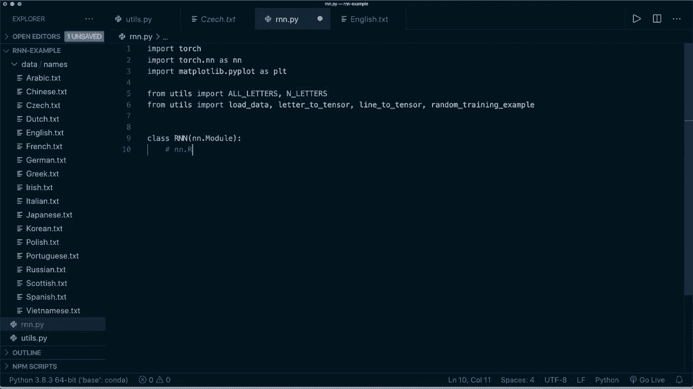
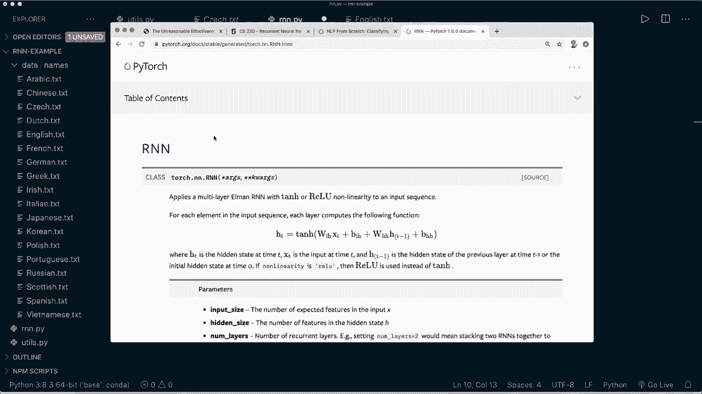
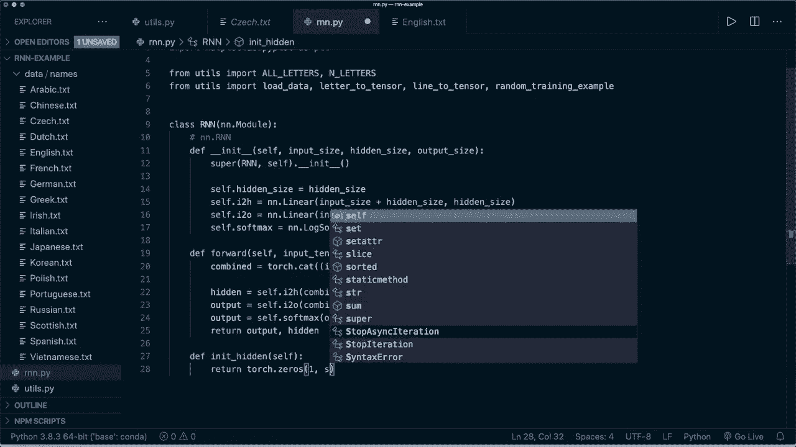
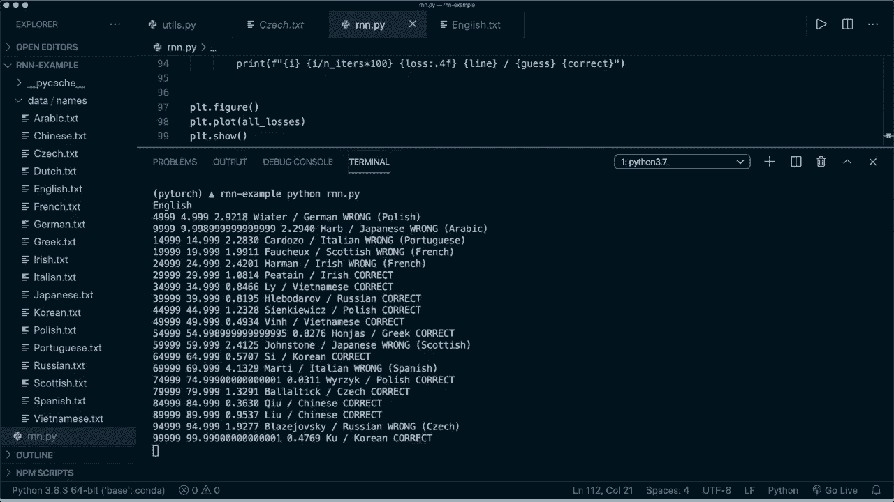
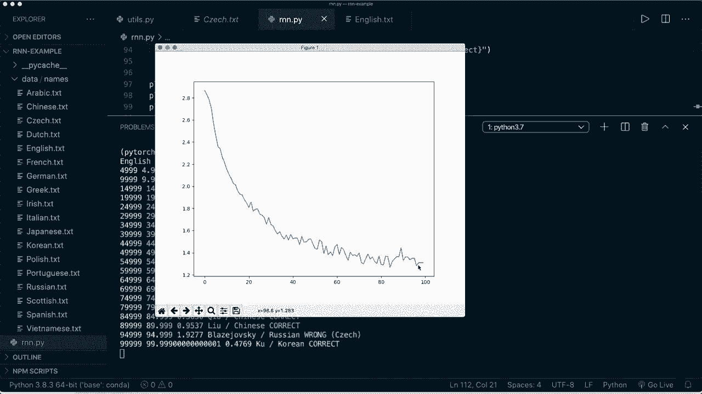
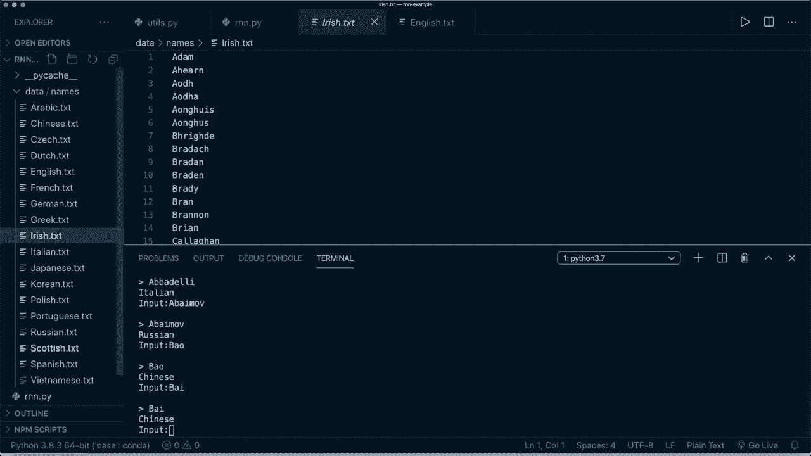

# 【双语字幕+资料下载】PyTorch 极简实战教程！全程代码讲解，在实践中掌握深度学习&搭建全pipeline！＜实战教程系列＞ - P19：L19- 使用循环神经网络进行名称分类 - ShowMeAI - BV12m4y1S7ix

Hey， guys， welcomee to your new Pytorch tutorial。 Today。 we will be talking about recurrent neural nets or short Rn Ns。 I will briefly explain the theory behind Rn Ns and the different kind of applications。 and then we will implement a Rn N from scratch in Pytorarch to do name classification。

 This should give you a good understanding of how Rn Ns work internally。 So let's start。 Rn Ns are a class of neural networks that allow previous outputs to be used as inputs while having hidden states。 Here's an image that shows the architecture of Rn Ns in the simplest way。 So we have an input and then internally do some operations and get hidden states。

 And then we take those hidden states and put them back into the next step。😊。So we can use the previous knowledge to update our new state。 And then at the end。 we also get an output。 So we can also unfold this graph to get a better understanding and basically we are working with a sequence here。 So， for example， if we have a whole sentence， then we might use every single word as one input。

 So we have the first input and some initial hidden。 and then we do our operations and get the output and a new hidden state and then we use this hidden state and then put it into the next input。 So we take the next input and use the previous hidden states and again。 do our operations and get a new output and the new updated hidden state。

 And then we take the next input and so on。 So this is basically the architecture of。RNAnd now why are R&N so important And for this there is a nice article by And Carpathy。 The article is called the unreasonable effectiveness of recurrent neural networks and I highly recommend to give this a read。 so I will put the link in the description。

But the core takeaway is that R and ends are so exciting because they allow us to operate over sequences of vectors。 So with traditional neural nets， we have just a one to one relationship， for example。 when we do image classification。😊，Then our input。 So our image is of fixed length。 and our also our output is of fixed length。And now with R and ends， we can work with sequences。

 and there are a lot of different types。 So basically， we can have a sequence in our input。 and we can also have a sequence in our output or also in both input and output。 So， for example。 we can have a one to many relationship where we have only one input， for example。 this is used in image captioning when we have one in image and then we want to describe what we see in the image and get multiple outputs。

Then we can also have a many to one relationship。 So we have this is， for example。 the case in sentiment classification， or what we are doing later with our name classification。 So we have a sequence as inputs， and then apply our R and N。 and then we use the last output and do some classification with this。

 Then we can also have a many to many relationship。 This is， for example。 used in machine translation where we have a whole sentence， for example， in English as an input。 And then we put out a whole sentence in French， for example。Then we can also have a many to many relationship with a synct way， for example。

 in video classification， where we want to classify each single frame。 So yeah。 these are our possible applications of R andNs。 So they are mostly used in the fields of natural language processing and speech recognition。 but they could， for example， also used for image classification。 So yeah。 that's what makes RnNs so powerful。 And now let's have a brief look at some pros and cons。

 So the advantages are that we have the possibility of processing inputs of any length。Then our model size is not increasing with the size of the input。 Then the computation takes into account historical information。 So the previous data。And our weights are shared across time。And some drawbacks are that the computation might be slowered and with normal neural nets。

 and it can be difficult to access information from a long time ago。 and we are also not able to consider any future input for the current state。 So yeah。 that's basically the theory behind R andNs。 And now we can directly jump to the code。 So in our example， we want to do name classifications。 So I downloaded the data。

 and I will also put the link in the description。 So basically we have different files with different names。 So these are all last names from different countries， for example。 We have Arabic Chinese C Dutch English and so on。 So I think these are 18 different countries。 And now we what。We want to do is we want to classify this and detect from which country the name is and what we are going to do here is we take the whole name as a sequence and then we use each single letter and put it in our R&N as one input。

And for this， we need some help of functions。 So I already implemented them here。 and I will only go briefly through this code。 So what we want to do here first。 we want to have a help of function to convert our data to ASI。 for example。 if we have this name with some special characters。 and then we process this。 So let's run this file。

 Then we see it remove the special characters and we only have ASI characters left。 and basically。 we also print all the possible letters。 So this is from a to C and also in capital letters。 and we also allow these signs。😊，And then we have a helper function to load the data。 So this basically loads all those files， and then it loads all the names。

 and it gets the country from the file name。 So this is what the load data function will do。And then we have some functions to turn our data to Tenzo。 So we have letter to index and letter to Tzo and also a line to atenzo。 And what we are doing here is we are using a technique that is called one hot encoding。

 So we need a way to display our data that can be used for training。 And for this。 we use one hot encoding。 So if you've watched my tutorial about the chatbot in Pyr。 then you might already know this。So a one hot back vector is filled with zeros。 except for a one at the index of the current letter。 For example。

 if we have only five possible characters， ABC D and E。 So our a would be a vector of length 5。 and we have a one at the position where a is。 and the same for B。 a vector of length 5 and the second index is a 1 and the rest zeros。 So this is one hot encoding。 So if we go back to our file for example， I can show you how the load data function looks。

 So this will return a dictionary with the country is key。 and then the。Corresponding names as the。Value， So， for example， if we run this and have a look at the key Italian and only take the first five entries。 then we see we have five different Italian names here。Then， as I said， we do this one hot encoding。 So for this， we can use the letter to tenor function。 So now if we run this。

 So let's save this and run this and then print the tenzo for ch。 Then we see it has this size。 So this is of shape 1 by 57， because we have 57。Possible characters。 This is what I printed here。 These are all the letters。 and then we have a cha at the position where the capital J is。 So this is how our input will look like like later。 and， of course。

 we do this not only for a single character， but for the whole name。 So for this。 we have the line to tensor function。 And now if we here we print the size。 So this will be of size5 by  one by 57。 And the one is because our model expects it to be in this shape。And the5 is because of the number of characters and the 57 is because of the number of all different characters。

 Allright， so these are all the help or functions that we need。 And， of course。 I will put the code on Github。 and I also provide the link to the data so you can download these files。 So now we can start writing our R and N。 So for this， of course， we import the things we need。 So we import torch。 We import torch dot N N as N N。

 Then I also want to import map plot Li dot pi plot S P L T because I want to show you a plot later map。Pot。Lip， then we import our utility functions。 So I say from us。 import all the different letters and also the number of different letters。 So this is 57。 Then we also say from u， we want to import these helper functions。 So load data。

 then letter to tenor and line to tensor and random trainingx example。 So this is basically a function。That will do a random choice from those names and return the corresponding country。So now that we have that， we can start implementing our R and N。 So we need to have a class and call this R and N。 And this should inherit from N。

 N dot module as all of our Pytor models。And by the way。 there is already a R andN module available in Pytch so you can directly use this。 but this is what we are doing in the next tutorial。 So for now we want to implement this from scratch to get a better understanding So let's have a look at our model architecture again So this is what our R andN for name classification will look like。

 So we have an input and a hidden state， and then internally So this is what we are doing here internally。 so we combine them and then we process our combined Tensor and we apply two different hidden layers。 so we have our input to a output and our input to a hidden layer。

These are just two normal linear layers and then we get one hidden output and then we use this for the next input and we also get a output and since we are doing classification。 so a multiclass classification task we apply the softmax layer and then get the output。

So now this is what we want to implement。So now， first of all， of course。 we define our init function。 This will get self。 Then it gets the input size。 It also gets the hidden size。 this is going to be a hyperparmeter that we can specify。 And we also get the output size。 and in our in function。 First。

 we want to call the super R and N and self。 And then the in it。😊，Sorry。In it。Then here we want to store our hidden size。 So we say self dot hidden size equals hidden size。 Then we define our two different linear layers。 So we call this input to hidden I to H equals N N dot linear and the size is the input size plus the hidden size because we combine them。 And for this， the output size is still the hidden size。 Then we do the same with our output。

 So we say input to output。 and this is going to be a linear layer as well。 So the input size is the same。 And here we use the output size。 And then we also need a soft max layer。 So we say self dot soft max equals N N dot。Soft max。 And then we say that dimension equals long dimension 1， cause our input， for example。

 just test the shape 1 by 57。 We need the second dimension。So this is our init function。 Then we。 of course， also have to define the forward pass。 So we say define the forward function。 and this gets self。 and then it gets an input tensor。 And as you should know now。 this also gets the hidden tensor。 So we use the hidden tensor for the forward pass。

 And then here we process this。 So first thing， let's have a look at this again。 we combine our input and our hidden tensor。 And then we apply those linear layers and the soft marks。 And then we return two different tensor。 So the output tensor and the new hidden tensor。So let's do this。 So let's call this combined equals。 And for this， we can use torch dot cat。

 And then as a tuple， we want to combine the input tensor and the hidden tensor。 And here again。 along dimension 1。 Then we apply our linear layer。 So we say hidden equal self dot I to H。 And then here we put in the combined。Tensar， then we say our output equals self dot I to O。O with our combined tensor as well。 And for the output， we also apply the soft max。

 So we say output equals self dot soft max with the output。 And at the end。 we return the output first and then the new hidden state。And so this is basically all we need for our R and N implementation。 And I'm also going to add a new。 a little helper function。 And I call this in it。Hidden。

 so I need some initial hidden state in the beginning。 And what I want to do here simply is I want to return an empty tensor。 So I say torch dot zeros。 And this has the shape 1 by self dot hidden size。 And yeah， so now we can start applying this。 So now let's load the data。 So let's say our categories lines and our all possible categories equals load data。

 So this is a dictionary with the country as key and the names as values。 And this is just a list of all the different countries。 And then the number of category。

Gorries equals the length of all categories。 For example， we can print the number of categories。 and let's save this for now and see if everything is working。 So let's say Python are an end on pi。And now this is working。 So we see we have8 different categories。 so this is because we have8 different files here。And now we need to define or set up our R and N。

 So we say R and N。Equals， and then we use our R and N class， and this gets the input size。 which is the number of possible letters。 Then it needs the hidden size。 So N hidden。 and it needs the output size， and this is the number of categories。 And now our hidden size。 So N hidden is an hyperparmeter that we can define。 So here， let's try 128。And now， as an example。

 let's do one single step。So we can， for example， say our input tensor equals。 and then we use the letter to tensor function for， let's say， for a and our。 then we need a hidden tensor。 So hidden tensor equals R and N dot in it hidden and then we process this。 So we say output and next hidden equals R and N with the input tensor and the initial hidden tensor。

And now， for example， we could print the output size or shape。 And let's also print the next hidden shape or size。 And let's run this and see if this is working。So yeah， we see our N R and N applied the forward pass and we get a new output with this shape and a new hidden state with this shape。 So it's still the size of the defined hidden size。 So this is how it works for only one character。

 and now if we go back。 So now basically we want to treat our name as one sequence and then each single character is one input。 So we repeatedly apply the R andNs for all the characters in the name。 And then at the very end。 we take the last output and apply the soft mark and then take the one with the highest probability。 So this is what we want to do for one name。 So now we say we have the whole sequence。

The whole name and here we say our input tensor equals and then we use line to tensor and here。 for example， we use the name Albert。And then our hidden tensor is the same。 And also。 this call is the same。So we grab this and copy this。 And then here we use slicing。 So we only use the very first letter now for this simple example。

 So let's try this and run it and see if this is working。So， yeah， So this is working。 And now here。 what we have to do is we have to repeatedly apply these characters。 So for this， let's。Write some help of functions first。 So let me。Comment our the print statements out again。 So now let's define a function。 and let's call this category to category from output。

 And this gets the output。 And as I said， we applied the soft marks at the very end。 So this is basically a likelihood of each character of each category。 So we want to return the index of the greatest value。 So we can get this。 So category index equals。 And here we can use torch dot arc。😊，Max， and then here we put in the output。

 and then we can call the dot item because this is only one value。 and then we can return all categories， the。List with this index category index。 So this is one。Hel a function， for example， Now， if we print the category from output and then hear our output from this name。 then if we run it。Then we get， now， this is Irish。 and， of course， this is not trained yet。

 So this doesn't look like an Irish name to me。So now what we want to do is we want to train our R and N。 of course。 So here， as always， we want to set up a criterion and a optr。 So we say criterion equals。 And here we use N N dot N L L loss。 This is the negative lock likelihood loss。 Then we need to specify a learning rate。 And here we have to be careful So In this case。

 I try point005。 and the learning rate is very important here。 So you might want to play around with this a little bit。 And then we say our optr equals torch dot optim dot S G D， so stochastic gradient。Descent。 and then we want to optimize R N N dot parameters。 And as a learning rate。

 we use the defined learning rate。So now we have our loss and criterion and let's define another help a function and call this training。 So this is going to be one training step， and this gets a line tenor。 So the whole name as a tenor。 and it also gets the category。Category tenor。 So this is the actual class label or the index of the class label。 And now here we want to get a initial hidden state。

 So we say hidden equals R and N dot in it hidden。 And then， as I said。We want to do this repeatedly。 so we need a four loops。 we say4 I in range and then the length of the line tensor。 So we say line tensor dot size and then index0。 So this is the length of the name basically。 and then we apply this So we say output and hidden equals R and N with the line tensor of the current index or the current character and the previous hidden state So note that we put in the hidden state and then assign it also to the same variable。

 So the new hidden state will be the output from the R andn。 and then we do this for the whole name and then for，The very last character。 we get the final output， and then we use this to calculate our loss。 So we say loss equals Here we apply our criterion with the output and the category tenor。

 and then as always， we do our optimizer step。 So first， we say optimizer0 gradients。 Then we say loss dot backward and then we say optimizer dot step。 And then at the end of each training step。 let's return the output。 and let's also return the loss dot item， So not as tenor， but as float value。

And now we have this helper function for the training step。 And now we can do our typical typical training loop。 So for this， let's track something。 So let's say the current loss equals 0 in the beginning。 Then all losses equals an empty list。 So here we want to put in all the losses。 So we can plot them later。

 Then let's say our plot steps and also our print steps equals。 Let's say1000 and5000。 and the number of iterations equals， let's say100000。 And then we say 4 I in range and。Eers。 and now what we want to do is we want to get a random training sample。 So we have this as a helper function。And this returns the category。

 Then it returns the actual line or the name。 Then the category is tenor， and also the line as tenor。 and we get this by calling the random training example function from the utility class。 and this needs the category lines as input and all categories。 and then we call the training function。 So we say output and loss equals training and this gets the line tenor。

 and it gets the category tenor， then we add the loss to our current loss。 So we say current loss plus equals loss。 and then we want to print some information。 So we say if I plus。One modo。Ploot steps。 So every thousand step。 If this equals 0。 So here we want to calculate the current running loss and append it to all losses。

 we say all losses dot append。 And here we say current loss divided by the number of plot steps。 and then we set our current loss back to 0。 because here we add it up for every iteration。 and then only every thousand step， we append it。 So we have to divide it by the number。 and then we get the average。And now we do the same with the print step。

 So we say if I plus one modular。Print steps equals equals 0。 Then we want some print some information。 So first， we want to get the guess。 So we say guess equals category from output and we put in the output， of course。 Then we check if this is correct。 So we say correct equals。 and then we say。Correct。

 and this is correct。 If the guess equals equals the actual category that we get from the random training example。And if this is not correct， then we print wrong。 And we also want to print the actual category。 So let's use this as an F string here。 And here let's print the actual category。 And then we print as an F string again， we want to print the current iteration step。Then we also。

 let's print I divided by the number of iters times 100。 Then let's also print the current loss。 So we say loss。 and let's print only four decimal values。And let's also print the current line。 So basically， this is the name。 And then let's print the guess。And let's also print the。 if it's correct or not。 And now we are done。 So this is basically all that we need。

And now when we are done， let's plot our losses。 So let's trade a figure with mapplotlip。 So P L D L T dot figure and P L T dot plot and here we want to plot all the losses and then say plot show and now we could already start our training。 And now what we， for example， what we can do is we can save our model here and then use it later for for whatever we want。 But in this case， I simply want to try it myself。 So I say while true。

 And then I say I get an sentence as input and。嗯。Let's say。Input。And then I put this to a function。Or I first， let's say if sentence equals equals quit， then I breakke。 and otherwise I want to predict the sentence。 So for this。 let's create another little helper function， let's call this。Predict。

 and this gets the input lines of a raw text。 So first of all， I print。Let's print a new line。 and then let's print the input line， as well。So for this， of course， we need an F string。And now。 here in our prediction， we should use torch dot。 No gras。 We can turn off the gradients now。 And then what we want to do is we want to say our line tensor equals line to tenor from the raw input line。

And now we want to do the same as we are doing in our training step。 So we have the initial hidden states and then repeatedly apply our R and N。 And let's do this。 So let me copy this and put it here。 So we have the initial hidden state。 Then we say4 I in line tens or size 0。 and then we get the new output and the new hidden state by applying the R and N。

And then at the very end， we want to get the guess。 So we say guess equals。 and then we say category from output。 And we use the last output from the last step。 and then we simply want to print the guess here。 So in this example。 I don't calculate the accuracy or anything。 I just print the。Guess and see if it's correct or not。

So yeah， so let's。Save this。 And let's run this and hope that everything is working。 So this might take a few seconds or minutes。 So this is from the first example。That I showed you？

And。Now we see we have step。 This should be 5000， actually。 and this should be 5% of the training is done。 and then we have the loss。 and we have the name and we see that the guess is wrong because this is actually Po。

All right， so now it's done， and it's plotting the losses。 And you see that it's decreasing very quickly。 And then it's trying or jumping around a little bit。 but still decreasing。 I think this is a pretty good result。 So let's have a look at some。

Random guesses during the training。 So we see that in the beginning， almost every guess is wrong。 And then it's starting to learn something things。 So now it's starting to do correct predictions。 But， of course， it's still not perfect。 So they are still wrong corrections。 But yeah。 at the very end， we have this loss。 So this is pretty good。 And now we can try it ourselves。 So now。

 for example， we could go and try some names from those files。 So for example。 let's start with some German names。 So let's try acker。 And we see it says German。 So let's try Oler， for example， and this is also correct。 So let's try some Italian names。 I think these are pretty clear to detect。 So let's try Abba Dhi。 and it says。Italian。

 so this is correct。 So let's try some Russian， for example， Let's say a ba off。 and it says Russian。 Yeah， great。 So let's try something more difficult。 For example， Chinese。 So let's try Bao。 and it says correct Bao。 Let's try bai。Still Chinese。 So it looks like it's。 it's working pretty nice in this example。 Of course， it's still not perfect。 But for now。

 all the guesses are correct。 So now you see how we can train a R and N to do name classification。 And yeah， I hope you enjoyed this tutorial。 And now know how R and ends can be implemented in Pytorch。 If you like this tutorial， and please consider subscribing to the channel and leave me alike and see you next time bye。😊。

