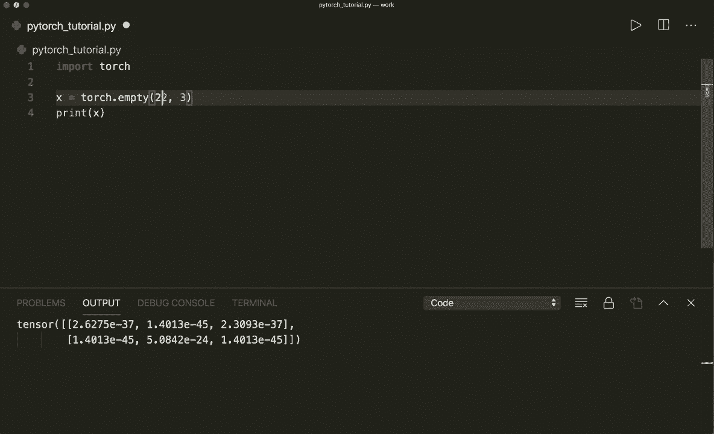
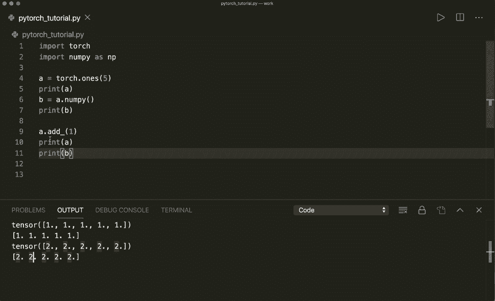
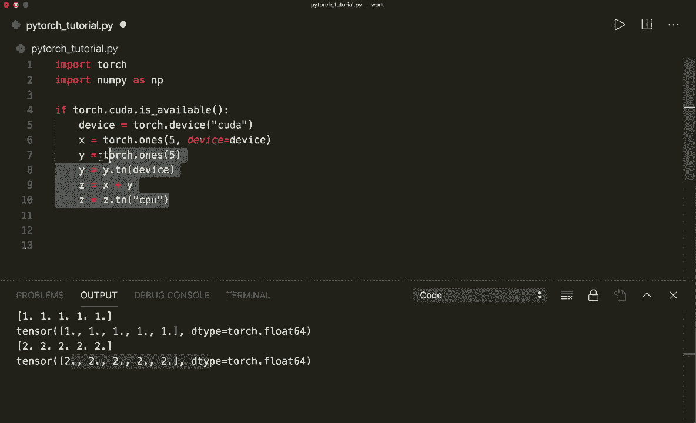
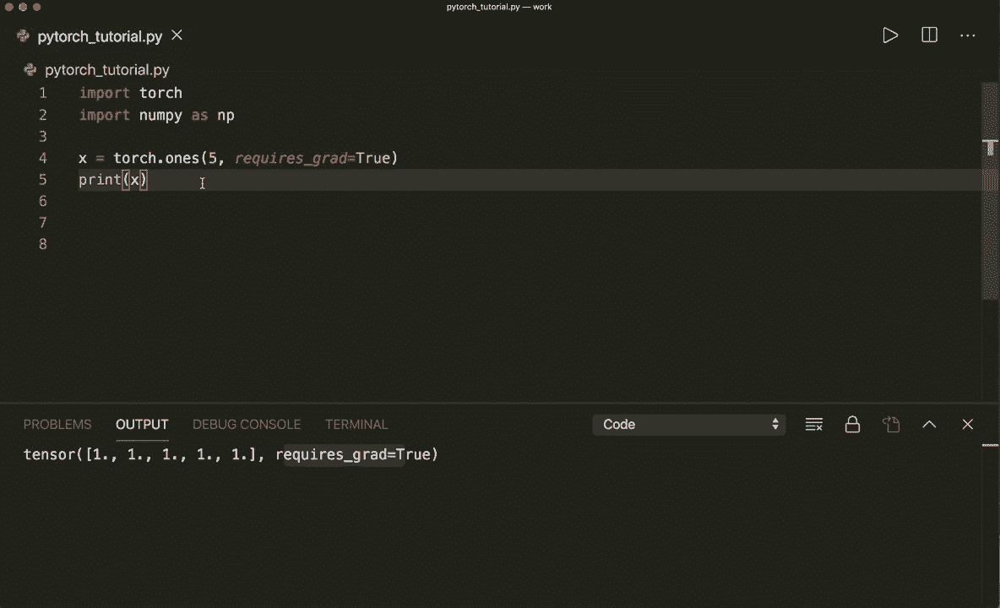
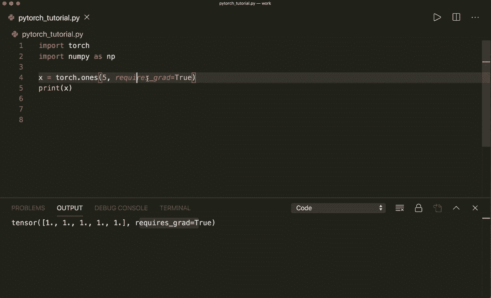

# 【双语字幕+资料下载】PyTorch 极简实战教程！全程代码讲解，在实践中掌握深度学习&搭建全pipeline！＜实战教程系列＞ - P2：L2- 张量基础 - ShowMeAI - BV12m4y1S7ix

嗨，大家好。欢迎来到你的新 PyTorch 教程。在这个视频中，我们将学习如何使用 Tenzoas。所以我们将学习如何创建 Tenzoos 和一些基本操作。我们还将学习如何从 Numpy 数组转换到 PyTorch Tzoos 及其反向。因此，让我们开始。😊在 PyTorch 中，一切都是基于 Tenzo 操作的，从 Nai，你可能知道数组和向量。

现在在 PyTorch 中，一切都是一个 tenzoor。因此，tenzor 可以有不同的维度。它可以是 1D，2D，甚至 3D 或更多维度。所以让我们创建一个空的 Tenzoa。首先，我们当然要导入 torch。

然后我们说 x 等于 torch dot empty。然后。我们需要给它一个大小。因此，例如。如果我们只说一，这就像一个标量值。那么我们来打印我们的 tenzo。

所以这将打印一个空的张量。值尚未初始化。现在我们可以改变大小。例如，如果我们在这里说 3，那么这就像一个包含三个元素的 1D 向量。因此现在如果你运行这个。我们看到我们的 tenzon 中有三个项目。现在我们也可以制作一个 2D。例如。

假设大小是 2 乘 3。这就像一个 2D 矩阵。那么我们现在运行这个。

当然，我们甚至可以放入更多维度。所以现在它会是 3D。例如，现在它会是 40，但我现在不再打印它，因为看到四个维度很难。但这就是我们如何创建一个空的 Tenzo。我们还可以。例如，通过说 torch dot ran 然后给它大小来创建一个随机值的 tenzo。

所以我们说两乘两。

让我们再次打印我们的 tenzor。

我们也可以像在 Numpy 中一样，我们可以说 torch dot 0s。所以这会填充所有。

我们可以说 torch dot once。所以这将把一次放入所有项目中。然后我们还可以给它一个特定的数据类型。首先，我们可以通过说 x dot D type 来查看数据类型。

所以如果我们运行这个，我们会看到默认情况下，它是 float 32。但我们也可以给它 D type 参数。在这里我们可以说，例如，torch dot，现在它都是整数，或者我们可以说 torch dot。

Doub。现在是双倍。或者我们也可以说，例如，float 16 chest。嗯。一。现在。如果你想看看大小，我们可以通过说x点size来实现。这是一个函数。所以我们必须使用括号。

所以这将打印它的大小。我们还可以从数据构建一个tenor。例如，从Python列表中。所以，例如，这里我们可以说x等于torch点tenor。然后这里我们放一个包含一些元素的列表。比如说2。50。1，然后打印我们的tenor。

这也是我们可以创建tenor的方式。现在让我们谈谈可以进行的一些基本操作。所以让我们创建两个大小为2x2的随机值的Tzoos。x和y等于torch点rand2x2。所以让我们打印X。让我们打印Y。

而且。

是的，现在我们可以通过说set等于x加y来进行简单的加法。例如。现在让我们打印我们的C。这将进行逐元素加法。它将把每个条目相加。

我们也可以使用。

set等于torch点at，然后x和Y。这将做同样的事情。嗯。现在。我们还可以进行就地加法。所以，例如，如果我们说。

W点，然后add下划线。

X，然后打印Y。这将修改我们的y，并将x的所有元素加到y上。顺便说一下，在pi中，每个有尾随下划线的函数都会进行就地操作。所以这将修改应用于的变量。

所以，是的。那么，除了加法，我们当然也可以使用减法，所以我们可以说C等于x减y。或者这与C等于torch点s相同。

X和y。现在，如果你打印C，那么我们可以看到逐元素减法。然后我们还可以对每个元素进行乘法。所以这将是torch点mule。

再一次，我们可以通过说y点mu下划线x来实现就地修改我们的y。

然后我们还可以进行逐元素的运算。所以这将是torch dot di。

是的，这些是我们可以用张量执行的一些基本操作。然后我们也可以像你习惯于Numpy数组那样进行切片操作。所以假设我们有一个指定大小的张量。

假设是5乘3。让我们先打印这个。

现在，打印x。现在，比如说，我们可以简单地，或者我们可以获取所有行，但只要一列。所以我们使用切片。因此，我们在这里使用a。对于所有行，但仅仅是列0，所以下面是。

让我们打印整个张量，仅此而已。所以在这里我们看到只有第一列，但所有的行。

或者我们可以简单地说，比如说，使用行号一，但所有列。所以，这将打印。第二行，和所有列。然后我们还可以只获取一个元素。所以位置在1，1的元素。这将是这个值。顺便说一下，现在它打印的是张量。如果我们有一个仅包含一个元素的张量。

我们还可以调用dot item方法。

这将获得实际值，但要小心。只有在张量中仅有一个元素时，你才能使用此方法。所以这将获得实际值。是的，现在让我们讨论重塑张量。所以假设我们有一个大小为4乘4的张量，并打印我们的张量。

嗯。如果我们想重塑它，我们可以通过调用view方法来做到这一点。所以我们说y等于x dot view，然后给它一个大小。假设我们现在只想要一个维度。那么让我们打印Y。

现在它只是一个一维向量。

当然，元素的数量必须仍然相同。所以在这里我们有4乘4。所以总共也是16个值，比如说，如果我们不想将维度或值放在一个维度中，我们可以简单地说-1，然后指定另一个维度，Py会自动确定正确的大小。

所以现在它必须是2乘8。

Tzoa。所以我们也可以再次打印大小以查看其尺寸。

所以这是2乘8的大小。它已经正确确定了大小。如果我们在这里放一个-1。

所以是的，这就是我们如何调整张量的大小。现在让我们谈谈从Nmpy转换为torch张量及其反向转换。这非常简单。首先，让我们再次导入Ny或者导入Ny作为N P。我想我得。

哦，不，它已经安装在这里了。所以我们先创建一个Tzo。A等于torch点。我们用大小为5创建一个Tnza。所以我们打印我们的Tzo。

现在，如果我们想要一个numpy数组，我们可以简单地说B等于A点nuumpy，然后打印。

B。所以现在我们有一个nuy数组。如果我们打印be的类型。嗯。然后我们会看到。这将打印出我们有一个nuy和DNA。

所以是的，这就是我们如何从张量创建一个numpy数组。但是现在我们必须小心。因为如果张量在CPU上而不是GP。然后这两个对象将共享同一内存位置。这意味着如果我们改变一个。我们也会改变另一个。例如，如果我们打印或者通过说A点at underscore就地修改B或A。

记住，所有的underscore函数都会就地修改我们的变量。所以如果我们给每个元素加1，首先，我们来看看我们的张量。现在我们也来看看我们的B numpy数组。然后我们看到它也。

在这里给每个元素加一，因为它们都指向同一个内存位置。所以要小心。

嗯，如果你确实想反过来做。所以如果你有一个。

在开始时的Numpy数组。所以我们假设A等于nuy大小为5，然后打印A。

现在你想从一个numpy数组创建一个torch张量。你可以说B等于torch，然后from underscore nuumpy，然后放入numpy数组。所以现在我们有一个张量。

这将，嗯，默认情况下，将数据类型设置为float 64。当然，如果你想要不同的数据类型，你也可以在这里指定数据类型。

现在再次提醒，如果我们修改其中一个，要小心。所以如果我们通过递增每个元素来修改 nuy 数组，例如。

现在，打印我们的 nuy 数组。所以我们看到它的每个值都递增了。如果我们打印 B。

然后我们看到我们的张量也被修改了。所以在这里再次要小心。

是的，但这只有在你的张量位于 GPU 上时才会发生，而这一点我们还没有讨论，因为你也可以在 GPU 上执行操作，但只有在可用的情况下。所以如果你也安装了 Kuda 工具包。

你可以通过说来检查这一点。

如果 tor dot coa dot 是可用的。所以在我这里，Mac 上，它将。

这将返回假。但例如，如果你在 Windows 上，并且有 Kuda 可用，那么你可以通过说 device 等于 torch.Dot.Devicise，然后说 Kuda 来指定你的 Kuda 设备。如果你想在 GPU 上创建一个张量，你可以通过说 x 等于。

Torch dot once。然后，例如，给它大小，然后说 device 等于 device。所以这将创建一个张量并将其放在 GPU 上。或者你可以先创建它。因此，只需说。

Y 等于 torch dot1 的大小为 5。然后你通过说 y 等于 Y dot2，将其移动到你的设备到你的 GPU，然后设备，所以这会将其移动到设备上。如果你执行一个操作，例如 C 等于 x 加 Y，那么这将在 GPU 上执行，可能会快得多。

嗯。是的，但现在你必须小心，因为如果你调用 C dot Nmpy，那么这将返回一个错误，因为 Ny 只能处理 CPU 张量。因此，你无法将 GPU 张量转换回 Numpy。

所以再次，我们必须将其移回 CPU，因此我们可以通过说 C 等于 C 点。

2，然后作为一个字符串 CPU。所以现在它又会在 CPU 上。所以是的。这就是我想展示的所有基本操作，还有一件事，很多时候在创建张量时。

例如，`torch dot`。大小为5。然后很多时候你会看到参数 `requires Grabs equals true`。所以默认情况下，这是 false。

现在，如果我们打印这个。

那么我们在这个张量中也会看到它会打印出需要 `Gr equals true`。所以在代码中，你经常会看到这个，它会告诉 PyTorch 在你的优化步骤中需要计算这个张量的梯度。

所以每当这意味着你在模型中有一个想要优化的变量时，你就需要梯度。因此你需要指定 `requires Gr equals true`。不过我们将在下一个教程中更详细地讨论这个。所以希望你喜欢这个教程。如果你喜欢，请订阅频道，下次见，拜。 

