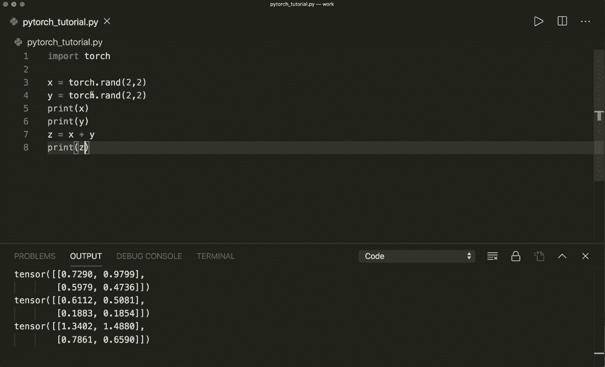

# 【双语字幕+资料下载】PyTorch 极简实战教程！全程代码讲解，在实践中掌握深度学习&搭建全pipeline！＜实战教程系列＞ - P2：L2- 张量基础 - ShowMeAI - BV12m4y1S7ix

Hi， everybody。 Welcome to your new Pytoch tutorial。 In this video。 we are going to learn how to work with Tenzoas So how we can create Tenzoos and some basic operations that we need。 We will also learn how to convert from Ny arrays to Pytoch Tzoos and vice versa。 So let's start。😊。So in Pytoch， everything is based on Tenzo operations from Nai， you probably know arrays and vectors。

 And now in Pytoch， everything is a tenzoor。 So atenor can have different dimensions。 so it can be 1 D，2 D or even 3 D or have more dimensions。So let's create an empty Tenzoa。 So first of all， we import torch， of course。

And then we say x equals torch dot empty。And then。We have to give it a size。 So， for example。 if we just say one， then this is like a scala value。 So let's print our tenzzo。

So this will print an empty tensor。 So the value is not initialized yet。And now we can change the size。 So， for example， if we say3 here。 then this is like a 1 D vector with three elements。 So now if you run this。 we see three items in our tenzon。 And now we can also make a 2D。 So， for example。

 let's say the size is 2 by 3。 So this is like a 2D matrix。 So now we'll run this。

And， of course， we can put even more dimensions in it。 So now it would be 3D。 And now， for example。 now it would be 40， but now I don't print it anymore more because it's hard to。 to see the four dimensions。 But yeah， this is how we can create an empty Tenzo。 And we can also。 for example， create a tenzo with random values by saying torch dot ran and then give it the size。

 So let's say two by two。

And let's print our tenzor， again。

We can also the same like in Numpy， we can say torch dot0s。 So this will put all。

0eros in it。 Or we can say torch dot once。 So this will put once in all the items。Then we can also give it a specific data type。 So first of all。 we can have a look at the data type by saying x dot D type。

So if we run this， then we see by default， it's a float 32。 but we can also give it the D type parameter。 And here we can say， for example。 torch dot into now it's all integers， or we can say torch dot。

Doub。Now， it is doubles。Or we can also say， for example， float 16 chest。嗯。一。And now。 if you want to have a look at the size， we can do this by saying x dot size。 And this is a function。 So we have to use parentheses。

So this will print the size of it。And we can also construct a tenor from data。 So， for example。 from a Python list。 So for example， here we can say x equals torch dot tenor。 and then here we put a list with some elements。 So let's say 2。50。1 and then print our tenor。

So this is also how we can create a tenor。 And now let's talk about some basic operations that we can do。 So let's create two Tzoos with random values of size 2 by 2。 So x and y equals torch dot brand2 by 2。 So let's print X。 and let's print Y。

And。

Yeah， so now we can do simple addition， for example， by saying set equals x plus y。 So。 and now let's print our C。 So this will do element wise additions。 So it will add up each of the entries。

And we could also use。

Set equals torch dot at， and then x and Y。 So this would do the same thing。嗯。Now。 we could also do an in place addition。 So， for example， if we say。

W dot， and then add underscore。

X and then print Y。 So this will modify our y and add all of the elements of x to our y。 And by the way， in pi to， every function that has a trailing underscore will do an in place operation。 So this will modify the variable that it is applied on。

So， yeah， so。Next to addition， of course， we could also use subtraction so we can say C equals x minus y。 or this would be the same as C equals torch dot s。

X and y。Now， if you print C， then we can see the element by subion。 Then we can also do a multiplication of each element。 So this would be torch dot mule。

And again， we can do everything in place by saying y dot mu underscore x。 So this would modify our y。

And then we can also do element wise tuition。 So this would be torch dot di。

And yeah， so this is some basic operations that we can do with tenzoors。 And then we can also do slicing operations like you are used to from Numpy arrays。 So let's say we have a tenzor of size。

Let's say5 by 3。 and let's print this first。

And now， print x。And now， for example， we can simply， or we can get all rows， but only one column。 So let's use slicing。 So we here use a。Con for all the rows， but only。The column 0， so。

Let's print the whole tenzor and only this。 So here we see we have only the first column。 but all the rows。

Or we can just say， for example， let's use the row number one， but all columns。So， this would print。The second row， and all the columns。Then we can also just get one element。 So the element at position 1，1。 So this would be this value。 And by the way， right now。 it prints the tenor。 And if we have a tenor with only one element。

 we can also say we can call the dot item method。

So this will get the actual value， but be careful。 You can only use this if you have only one element in your tenor。So this will get the actual value。And。Yeah， now let's talk about reshaping a tenzoor。 So let's say we have a tenzoor of size。 Let's say4 by 4， and print our tenzor。

嗯。And now， if we want to reshape it， then we can do this by saying or by calling the view method。 So we say y equals x dot view and then give it a size。 So let's say we only want one dimension now。 So let's print Y。

So now it's only a one defect vector。

And of course， the number of elements must still be the same。 So here we have 4 by 4。 So in total。 it's also 16 values and for example， if we don't want to put the dimension or the value in one dimension and we can simply say-1 and then specify the other dimension and Py to will automatically determine the right size for it。

 So now it must be a 2 by 8。

Tzoa。 so we can also print the size again to have a look at the size。

So this is size 2 by 8。 So it's correctly determined the size。 If we put a-1 here。

So yeah， this is how we can resize tenss。 And now let's talk about converting from Nmpy to a torch tensor and vice versa。 So this is very easy。 So first of all， let's import Ny again or import Ny as N P。 And I think I have to。

Oh， no， it's already installed here。 So let's create a Tzo first。 So a equals torch dot。 And let's create a Tnza with one of size 5。 So let's print our Tzo。

And now， if we want to have a numpy array， we can simply say B equals a dot nuumpy and then print。

B。So now we have a nuy array。 So if we print the type of be。嗯。And then this will see。 and this will print that we have a nuy and DNA。

So yeah， this is how we can create from a tensor to a numpy array。 But now we have to be careful。 because if the tensor is on the CPU and not the GP。 Then both objects will share the same memory location。 So this means that if we change one。 we will also change the other。 So for example， if we print or if we modify B or a in place by saying a dot at underscore。

 remember all the underscore functions will modify our variable in place and at one。 So if we add one to each element and allow first， let's have a look at our a tenor。 And now let's also have a look at our B numpy array。 then we see that it also。

Added plus one to each of the elements here， because they both point to the same memory location。 So be careful here。

And yeah， if you do want to do it the other way around。 So if you have a。

AnNumpy array in the beginning。 So let's say a equals nuy one of size 5， and then print a。

And now you want to have a torch tenor from a numpy array。 And you can say B equals torch and then from underscore nuumpy and then put the numpy array。 So now we have a tenor。

And this will， yeah， by default， this will put in the data type float 64。 Of course。 you could also specify the data type here if you want a different data type。

And now again， we have to be careful if we modify one。 So if we modify， for example。 the nuy array by incrementing each element， so。

Now， print our nuy array。 So we see that it incremented each value。 And if we print B。

Then we see that our tens are got modified， too。 So again， be careful here。

Yeah， but this happens only if your Tensor is on the GPU and this is one thing that we haven't talked about yet because you can also do the operations on the GPU。 but only if this is available。 So if you have also installed the Kuda toolkit。

And you can check that by saying。

If tor dot coa dot is。Available。And so in my case， on the Mac， it will。

And this will return false。 but for example， if you are on Windows and you have Kuda available。 then you can specify your kuda device by saying device equals torch。Dot。Devicise and then say。 Kuda here。 And then if you want to create a tensor on the GP U， you can do this by saying x equals。

Torch dot once。And then， for example， give it the size and then say device equals device。So。 this will create a。Tenor and put it on the GP。Or you can first create it。 So simply by saying。

Y equals torch dot1 of size 5。 And then you move it to your device to your GPu by saying y equals Y dot2。 and then device， so this will move it to the device。 and now if you do an operation， for example。 C equals x plus Y。 then this will be performed on the GPU and might be much faster。

嗯。Yeah， but now you have to be careful because now if you would call C dot Nmpy。 then this would return an error because Ny can only handle CPU tenor。 so you cannot convert a GP tenor back to Numpy。

So then again， we would have to move it back to the CPU so we can do this by saying C equals C dot。

2 and then as a string CPU。 So now it would be on the CPU again。So yeah。 this is all the basic operations that I wanted to show you。 and one more thing a lot of times when a tensor is created。

For example， torch dot。1 of size 5。 Then a lot of times you see the argument requires。Grabs equals true。 So by default， this is false。

And now， if we print this。

Then we will also see here in our tensor that it will print requires Gr equals true。So a lot of times in code， you will see this， And this will tell pieytoch that it will need to calculate the gradients for thistensor later in your optimization steps。

So whenever this means that whenever you have a variable in your model that you want to optimize。 then you need the gradients。 So you need to specify requires Gr equals true。 But yeah。 we will talk about this more in the next tutorial。 So I hope you enjoyed this tutorial。 And if you liked it， please subscribe to the channel and see you next time， bye。

