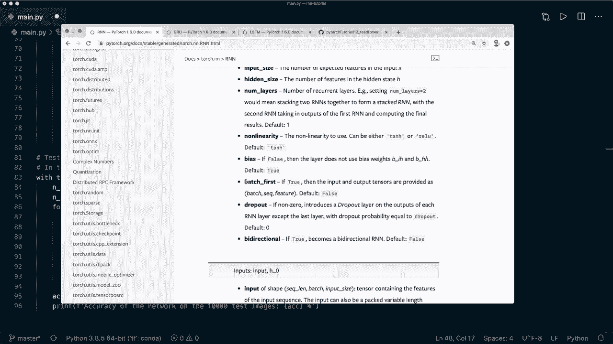
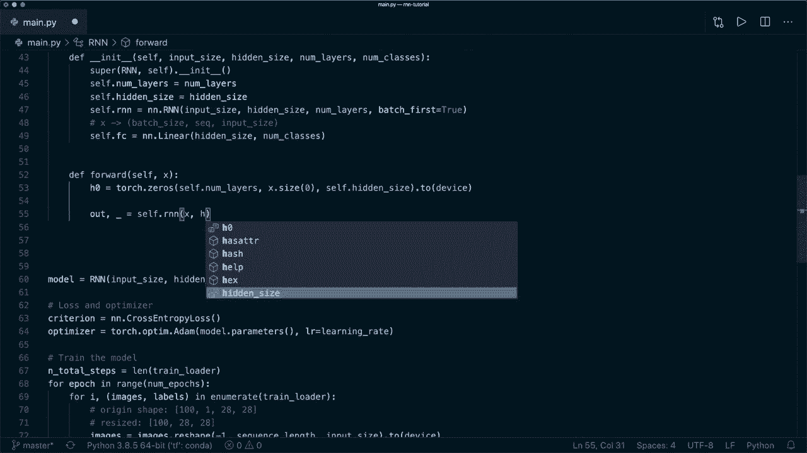
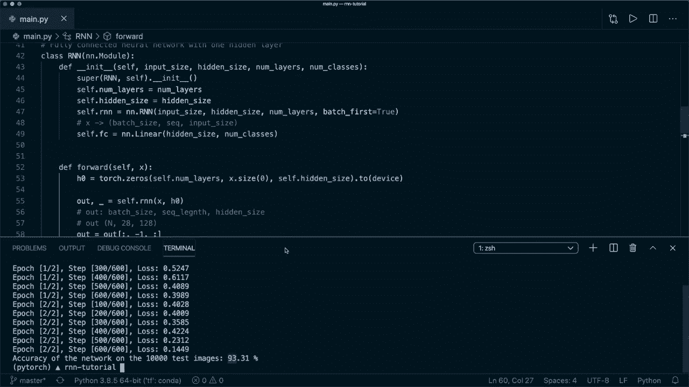
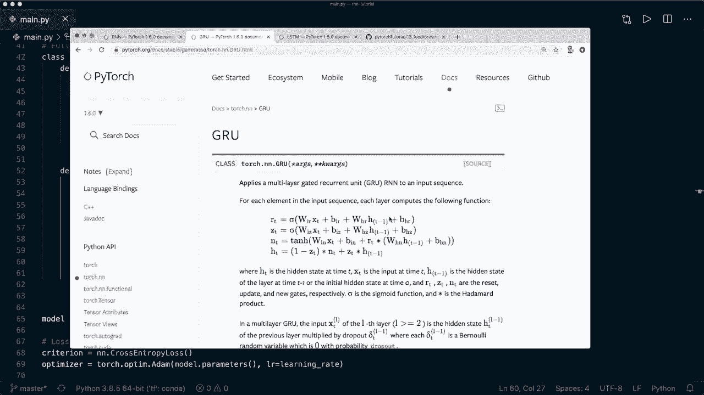
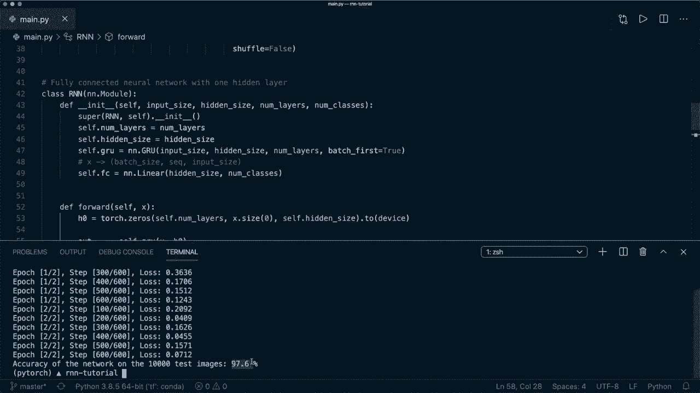

# 【双语字幕+资料下载】PyTorch 极简实战教程！全程代码讲解，在实践中掌握深度学习&搭建全pipeline！＜实战教程系列＞ - P20：L20- RNN & LSTM & GRU - 循环神经网络 - ShowMeAI - BV12m4y1S7ix

Hi and welcome to your new Pytorch tutorial。 Today。 I show you how we can implement a recurrent neural net using the built in R and N module。 In the last tutorial， we implemented the R and N from scratch。 and I highly recommend to watch this one first to understand the internal architecture of R Ns。😊。

And now today， we focus on the implementation with Pytorch's own module。 so we don't have to implement everything by ourselves。 I will show you how to use the RnN module。 And then at the end， I also show you how easily we can switch our Rn N model and use special kinds of RNs like LSTM and G。 So let's start。 and we are going to use my tutorial about a simple neural net as starting point。

 So this is tutorial number 13 from my Pytorch beginner course。 You can find the link to the video and also to the code on Gitub in the description below。 So as I said， this is tutorial number 13。 So I already grab this code and copied it to my editor。 And then this example， we are doing diit classification on the Mnes data sets。

 And I have to say that image classification is not the typical example for RnNs。 But what I want to demonstrate here is how we must treat our input。😊。

As a sequence and then set up the correct shapes， and it also shows that RnNs can indeed be used to get a high accuracy on this classification task。 So last time we learned that the special thing about RnNs is that we work on sequences of vectors here。

 So we treat our input as a sequence。 and there can be different types of Rnns。 So in this example we used this many to one architecture。 So here we have a sequence as a input and then only one output at the end。 and this is our class label in this case。 So let's jump to the code。

 and the first thing we must change is the hyperparameter。 So the Ms data set consists of images of size 28 by 28 pixels。 and last time we squeeze that into one dimensions。Our input size was 28 times 28 or 784。 and this time， as I said， we treat the image as a sequence。

 So what we do here now is we treat one image dimension as one sequence and the other image dimension as the input or feature size。So you can see this as that we are looking at one row at a time。 So let's comment and this out。 and let's create a new one。 So let's say our input size equals。 And now， as I said。 we are looking at one row at a time。 So this is 28。 And then we also create the sequence length。

 And this is also 28。 And then we change the hidden size to be 128。 So you can try our different sizes here。 And we add another hyperparmeter。 and this is the number of layers。 And here I set this to2。 So by default， it is one。 And this means that we are stacking in this case， two R and Ns together。

 and the second R and N takes the output from the first R and n as an input。 So this can further improve our model。And now we want to implement the R and N class。 So let's change the name to R and N。 and also in this super method。And then our model down here also now is the R and N。

 And now let's delete all of this to start with a new， fresh implementation。So now our R and N has still has the input size and the hidden size and the number of classes as parameters。 And it also gets the new parameter number of layers。 So let's put it in here。 So let's say the number of layers here。 And then， of course。

 we must also pass it to our model when we create it。 So this is our hyperparameter。😊。And then what we want to do here first is we simply want to store the number of layers and the hidden size。 So let's say self nu layers equals nu layers。And also， self dot。Hidden。Size equals hidden size。And then we create the R and N model and use the built in Pytorch R and N module。

 So you can find this here on the official documentation。 So this is the R and N class that Pytorch provides for us。 So we are going to use this。 So we create an R and N and say self R and N equals。 And now this is in the NN module。 So NN dot R and N。

And the R and N needs the input size。 It needs the hidden size。 and it needs the number of layers in this order。 And then we also use a parameter that is called batch first and set this to true。 So this just means that we must have the batch as a first dimension。 So our input needs to have the shape。Btch size。Bch size and then the sequence length。

 and then the input or feature size。 So this is the shape that we need to have for our input。

And again， you can find this in the documentation。 So if you set batch first to true。 then here you need this shape。

So now what we want to do is before we pass the images to our model。 So last time we reshaped it to be this size。 So originally our batch or our images have the size the batch size than a one and then 28 and then 28 again。 So this time we only want to have our batch size and then 28 by 28。 So here we reshape it to be this size and then the 28。

 the first one is our sequence length and the second one is our input size。 So these are both 28。 and the same in our so this is in our training loop and then later in our evaluation loop。 we do the same。 So here we also have to reshape it to。This size。 So now we have our input in the correct shape。And now we need one more layer。 So as I said。

 we are using this many to one architecture。 So in the end we have a classification task。 So this means that we are using a linear layer and then later the soft marks and the crossenttropis。 So let's create one more linear layer。 So let's say self dot Fc for fully connected equals nn dot linear。 And now here we want to be careful。 So for the input size。

 we use the hidden size and the output size is the number of classes。 and I will explain this later again， but basically as we can see in this image or also in this image we only use the last time step of our。ence to do the classification。 So we only need the last hidden size as the input size for the linear layer。 So this is basically the whole init function。 And now， of course。

 we also need to implement the forward pass。 So our R and N。 If we have a look at the documentation。

Then it needs two inputs， and the one is the the first one is the input。 and the second one is the initial hidden state。 So we need this in the correct shape。 And so let's create an a tensor with just0。 So we say H0 equals。 And then let's say torch dot0s。 And then here the first one is the number of layers。 The second one is the batch size。

 So we get this by saying x dot size0。 The next dimension is the hidden size。 So we say self dot hidden size。 And then we also want to push it to the device。 If you're using one。

So now this is our initial hidden state， and now we can call our R and N model。 So we say out and then a underscore because we don't need this。 and then we say self dot R and N。 and this gets x and H0。 So again， let's have a look at the documentation。 So it delivers two outputs。 and the first tenor contains the output features or the hidden states from all the time steps。

 And the other one is just the hidden state for the step N。 So we don't need this in this case。 So now we have the output and the output is of size。 This is batch。

Btch size， and then we have the sequence length， and then we have the hidden size。 So this is the new shape of our output。And now what we want to do is we want to decocode the hidden state only of the last time step。So what we have here again， let's write this in number。 So this is n。 and then 28。 and our hidden size is 128。 And now we only want the last time step。

 So we want to have our out to be in n and then 128。 So we get this by saying out equals out。 And then we use this slicing here and take all。The samples in our batch。 and then only the last time step。 So we can say-1。 And then again。 a colon for all the features in the hidden size。 So now we have our out in this size。

 And now that's why we need the hidden size as the input size for our linear layer。 So now we can call that。 So now we can say out equal self dot fully connected with our out。 And then we return the out。 So now this is the whole implementation that we need for our R and N。 So。Everything else stays the same in our training and evaluation loop。 And again。

 what we have to be careful here is to treat our input as a sequence。 And then when we use the build in R and N that we use the correct shape。 and then we need the initial hidden state also in the correct shape。 And then we have to reshape it before we pass it to our fully connected layer。 So let's try it out。

 So let's say Python main dot pi。😊，Al right， so now training is done and as you can see。 we get a accuracy of 93%。 so our R and N works and you can see that it can be applied on this classification task。

And now at the end， I also want to show you two more R and N modules。 So two special kinds。 The first one is the GR U or gated recurrent unit。And the second one is the LSTM or long short term memory。 So both both are also very popular R and Ns。 And I will not explain the theory about them right now。

 I will just show you how easily we can use them as well with this implementation。 So let's use the R U first。 So we can simply say N N dot G R U。 And let's also call this self dot G R U and down here self dot G R U。 And everything else stay exactly the same。 So it takes the same input parameters。

 It also needs this hidden state。 And then the output is in the same shape。 So now let's run this with the G R U and test this。

Alright， so now as you can see， the GR U works too。 So the accuracy was even higher here。 And now as last thing， let's also try the LSTM。 So as you might know for the LSTM。 we need an initial cell state。 So let's use the LSTM。 So let's first call the cell dot LSTM。 And then here we use Nn dot LSTM。 The input parameters are still the same。

 And then here we need an initial tenor for the cell state。 So let's call this C0。 And this has the same shape。 And then here we call the self dot LSTM。 And this needs the hidden state and the cell state as a as a tuple here。😊。

So now this is all we need to apply the LSTM。 So let's clear this and run it one more time。Alright。 so this one work 2。 and you can see the accuracy is 97%。 So， yeah。 so now you know how you can implement a R and N in Pyar using the build in R and N module。 and you also know how you can use the tier U and the LSTM。 And yeah。

 I hope you enjoyed this tutorial。 If you liked it。 Then please consider subscribing to the channel and hit the like button and see you next time bye。😊。