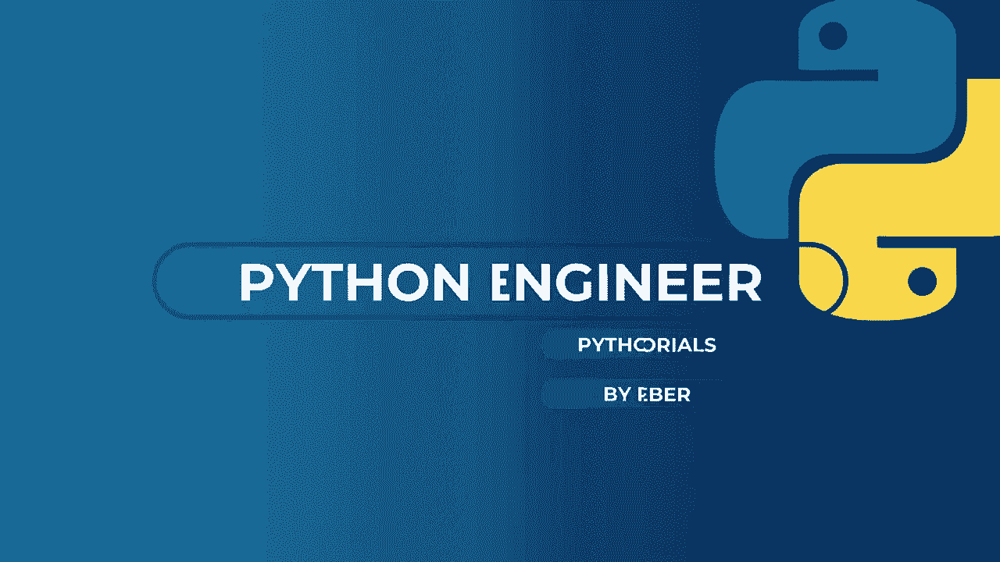
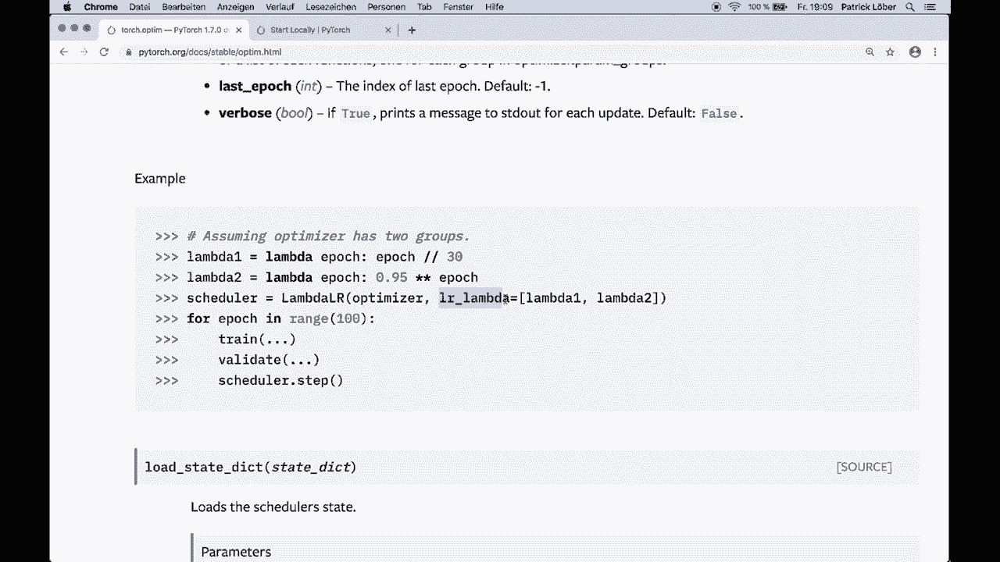
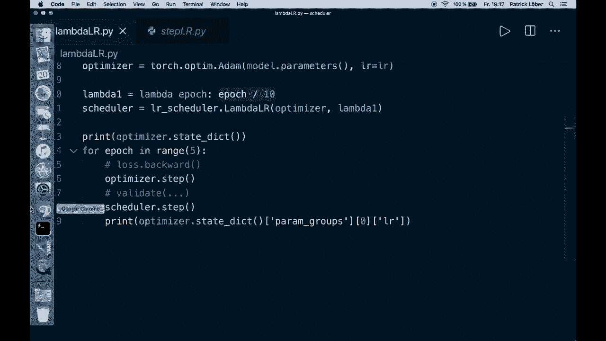
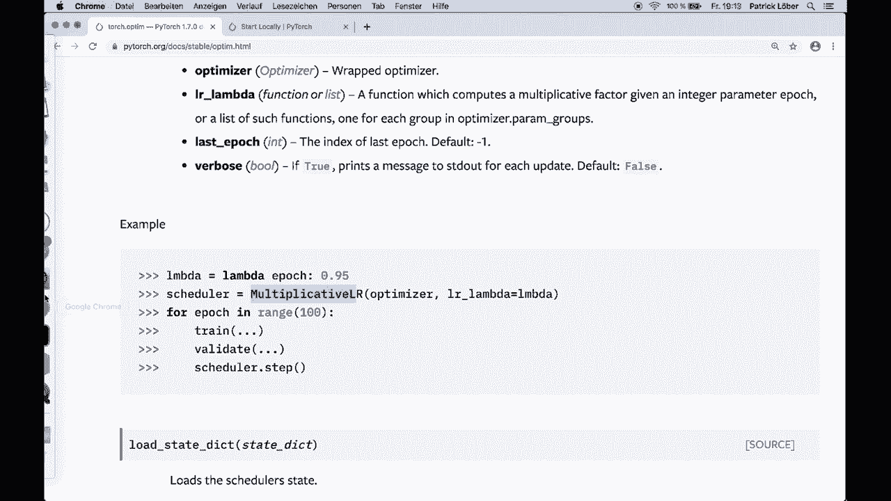
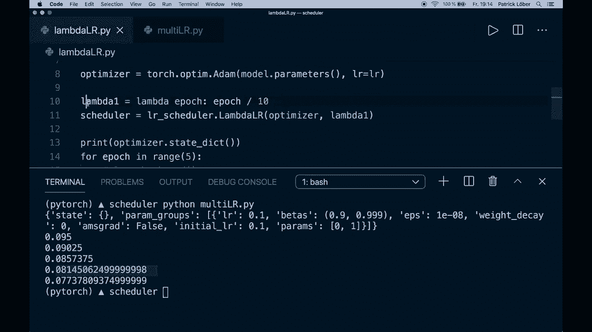
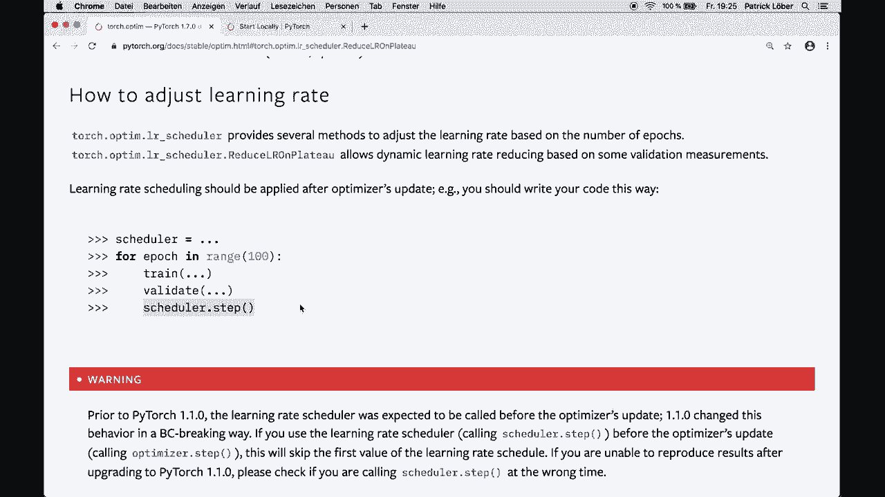

# 【双语字幕+资料下载】PyTorch 极简实战教程！全程代码讲解，在实践中掌握深度学习&搭建全pipeline！＜实战教程系列＞ - P21：L21- 调整学习率以获得更好的结果 - ShowMeAI - BV12m4y1S7ix

嘿，大家，欢迎来到另一个Pytorch教程。今天，我将向你展示一个简单但强大的技术，你可以在你的Pytorch代码中使用，以改善训练过程中的优化。因此，我们想在这里使用所谓的学习率调度。这意味着我们在训练循环中调整学习率。

无论是基于训练轮数还是基于验证测量。所以让我们开始介绍，然后我将向你展示如何做到这一点。😊！

🎼，如你所知，学习率是训练过程中最重要的参数之一，你应该在训练中进行调整。强烈建议在训练期间稍微调整学习率以获得更好的结果。Pytorch在其API中提供了几种方法来实现这一点。其实在你的代码中实现起来并不难。

让我向你展示一件事，我想提到的是，通过调整学习率，大多数时候我们想要降低学习率，而不是增加。但当然，这总是取决于你的具体问题。Pytorch在优化或optim模块中提供了一些所谓的学习率调度器。让我们浏览一下API文档，并展示一些例子。

所以我们现在在optim模块的API文档中。在这一部分中，如何调整学习率解释了我们如何做到这一点。当然，我会在描述中放上链接。它告诉我们torch Optim Lr调度提供了几种基于训练轮数调整学习率的方法，或者我们也有基于某些验证测量来调整学习率的方法。

我们还有这个重要的句子。学习率调度应该在优化器更新后应用。所以我们的代码应该看起来像这样。我们创建一个调度器。然后我们有我们的训练循环，在这里我们有训练轮数，然后我们进行训练步骤。这可能是像loss.backward。然后我们可能会有一个验证步骤。

然后我们调用Shaular的step方法。所以就是这么简单。但当然，我们必须创建一个调度器。为此，我们有不同的选项。让我们浏览一下文档，然后我会向你展示我们有哪些不同的方法。第一个是所谓的lambda Lr。它将每个参数组的学习率设置为初始学习率乘以给定的函数。

所以我们可能会有不同的参数组，但现在我们不需要关心这个。你应该知道，你可以在这里使用多个函数。所以我们想要做的是创建一个lambda函数。这基本上是一个单行函数。这可以依赖于训练轮数。在这个例子中，我们将轮数除以30。

然后我们用optr创建我们的lambda Lr，然后这个我们创建的lambda函数。那么我们来看看代码，让我给你展示一个实际的例子。所以你要做的是导入torch optim Lr scheduler作为Lr scheduler。😊

然后我们有一个学习率。因此在这种情况下，起初是0.1。接着我们有一个模型。在这种情况下，是一个简单的线性模型。然后你还需要一个优化器。接着我们创建这个lambda函数。这是一个单行函数，依赖于epoch。因此我们将epoch除以10，然后用初始学习率乘以这个值。

所以在第一个epoch我们有1除以10乘以我们的学习率，在第二个epoch，我们有2除以10乘以我们的初始学习率，依此类推，然后我们像这样创建我们的调度器。因此我们给它优化器和lambda函数。在这个例子中，我们的学习率实际上在增加。但在所有接下来的例子中，它将会减少。

所以在这里我们有我们的典型训练循环。首先，我想打印优化器状态字典，以展示它的样子。然后在这里我们可能，例如，进行lost.dot.backward，然后调用优化器步骤，然后我们可能有一些验证步骤，接着调用这个调度步骤。然后在这里我想打印实际的学习率，我们可以。

通过调用优化器状态字典来访问它。然后在这里我们访问关键参数组，并且这里我们只使用一个。所以我们用索引0来访问这个，并且使用关键学习率。所以这将给我们实际的学习率。我们通过说Python lambda L R来运行这段代码。然后在这里我们看到优化器状态字典的初始学习率是0.1。

然后在这里，第一个epoch。我们有1除以10乘以0.1。所以我们有这个。第二个epoch，我们有这个，依此类推。所以我希望这能清楚它是如何工作的。那么我们来看下一个例子。

所以下一个例子是所谓的乘法Lr。这基本上是相同的。但在这里我们将每个参数组的学习率乘以指定函数中给定的因子。因此，我们再次创建一个可能依赖于epoch的lambda函数。因此在这里我们只返回一个值。所以它实际上不会随着epoch数量的变化而改变。

但现在这是乘法的。因此每个epoch这将乘以上一个epoch。让我们再次查看代码，看看这看起来如何。因此这里我们有与之前相同的代码。但是现在我们使用乘法L R，简单地用这个0.95的因子。然后每次它将乘以上一个学习率。所以让我们打印出来。

这个，让我们清除这个并运行Python multi Lr dot pi。然后我们看到初始学习率为0.1。接着我们将其乘以0.95，这将给我们0.095。然后下一个，我们再次乘以0.95，这将给我们这个学习率，然后是这个，以此类推。

所以再次这里的主要区别是，我们将其乘以学习率，而使用lambda Lr时，我们只是使用初始学习率，然后将其乘以这个函数。如果我们继续前进，我们有步骤Lr，这可能是最简单理解的。因此，这里说它每个步长epoch将每个参数组的学习率衰减gamma。

它可能看起来像这样。因此，我们有我们的步骤Lr与优化器，然后是一个步长，再加上这个gamma。正如我所说，通常我们希望减少它。因此，我们将其设置为小于1的值。在这里，我们可以看到，在前30个epoch中，我们的初始学习率为0.05，然后我们将其乘以0.1。所以在接下来的30个步骤中，我们得到0.005，然后再次乘以我们的gamma。

所以我们有接下来30个步骤的学习率等等。所以，是的。这是最简单之一，但实际上非常强大。我自己非常常用这个。然后我们有这个多步骤Lr，它在达到里程碑的epoch数量后，通过gamma衰减每个参数组的学习率。因此，基本上在这里，我们可以给它里程碑，而不是步骤。

然后它将做同样的事情。因此，在第30个epoch时，它将应用我们的gamma，然后在第80个epoch时，它将应用我们的gamma，以此类推。这给了我们更多的变化，如果我们不想一直使用相同的步长。然后我们在这里有这个指数学习率（exponential Lr），它每个epoch通过gamma衰减学习率。因此，这本质上与步骤Lr相同。

如果我们在这里使用步长为1。那么我们在每个epoch简单地应用这个，而不必担心这些步骤。所以，是的，这就是这个。然后我们还有这个余弦调节学习率（cosine tuning Lr），我现在不会过多讲解，但你当然可以自己查看。好吧，但让我们再看一下这个。

这个被称为在平稳期减少学习率（reduce L R on plateau）。在这里，这并不依赖于epoch，而是依赖于一些测量或指标。因此，当指标停止改善时，它会减少学习率。在这里，我们希望降低学习率，而Py告诉我们，当学习停滞时，模型通常受益于将学习率降低2到10倍。

这个调度器读取一个度量数量。如果在患者的 epochs 数量上没有看到改进，学习率就会降低。所以我们需要的是一个优化器、一个模式、一个因子和一个患者。😊，模式可以是最小值或最大值。在最小模式下，当监测的数量停止减少时，学习率会降低；在最大模式下，当数量停止增加时，学习率也会降低。

然后我们需要这个因子。学习率降低的因子，默认是 0.1。我们还需要患者。我们需要等多久才算没有改进。即在没有改进的情况下经过的 epochs 数量，只有在第三个 epoch 后学习率才会降低。例如，如果患者等于 2，那么我们将忽略前两个没有改进的 epochs，只有在第三个 epoch 后才会降低学习率。

如果损失仍然没有改善，我们的代码可能看起来像这样。我们有我们的优化器。我们有这个 reduce L R on pla。与我们的优化器一起，在这种情况下，它只是使用默认的因子和患者。接着我们有我们的训练循环，在这里进行训练步骤。我们计算损失。验证后，我们使用这个验证损失计算 chatular dot step。

所以如果在我们想等待的 epochs 数量内没有改善，我们就会降低学习率。这确实可以帮助我们的模型停止停滞并进一步改善优化。所以是的，我们还有这个循环学习率，还有一个我想应该是这个 onecycl Lr。我在这里不会详细讲解，但你可以自己查看。不过，是的。

这就是我现在想给你展示的内容。所以再次强调，你可以查看这个 API 文档，然后了解不同的优化器。所以是的，这就是我目前想给你展示的一切，这真的可以在训练过程中帮助你的模型，并且实现起来并不困难。所以选择一个调度器，尝试不同的选项吧。

然后调用调度器，这就是 dot step。是的，接下来你就可以开始了。希望你喜欢这个教程，如果你喜欢的话，请订阅频道。希望下次再见，拜拜！

