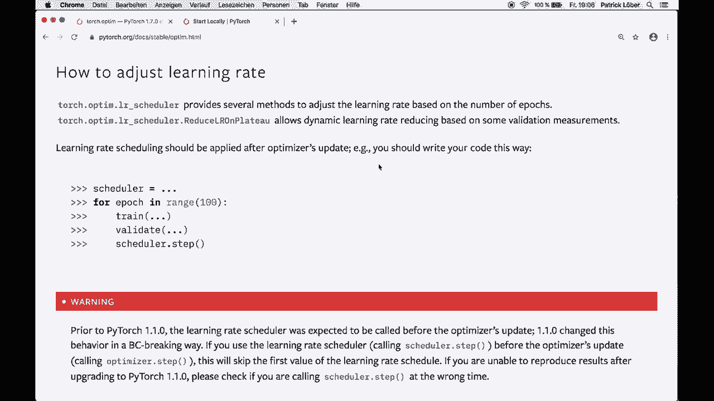

# 【双语字幕+资料下载】PyTorch 极简实战教程！全程代码讲解，在实践中掌握深度学习&搭建全pipeline！＜实战教程系列＞ - P21：L21- 调整学习率以获得更好的结果 - ShowMeAI - BV12m4y1S7ix

Hey， guys， welcome to another Pytorch tutorial。 Today。 I'll show you a simple but powerful technique that you can use in your Pytorch code to improve the optimization process during the training。 So what we want to use here is a so called learning rate chatular。 This means that we adjust our learning rate during the training loop。

 either based on the number of epochs or based on validation measurements。 So let's roll the intro。 and then I'll show you how to do this。😊。

🎼，As you should know， the learning rate is one of the most important type of parameters that you should tweak during the training。 and it's highly recommended to adjust the learning rate a little bit during the training to get better results。 Pytorarch provides several methods in their API to do this。 And it's really not that hard to implement this in your code。

 So let me show you how one thing I want to mention is that by adjusting the learning rate。 Most of the time we want to decrease the learning rate。 So not increase it。 But of course。 it always depends on your specific problem。 So Pytorarch provides some so-called learning rate scheduleular in the optimization or optim module。 So let's go through the API documentation and show some examples。

 So here we are in the API doc of the optim module。 and here in this section how to adjust the learning rate it explains how we can。do this。 And of course， I will put the link in the description So it tells us that torch Opim Lr schedule provides several methods to adjust the learning rate based on the number of epochs。 or we also have methods that adjust the learning rate based on some validation measurements。

And we also have this important sentence。 Learn rate scheduleuling should be applied after Opimrs update。 So our coach should look something like this。 So we create a scheduleer。 Then we have our training loop where we have our epochs。 and then we do the training step。 So this might be something like lost dot backward。 Then we might have a validation step。

 and then we call Shaular dot step。 So it's that simple。 But of course。 we have to create a scheduler。 And for this， we have different options。 So let's go through the documentation， and then I show you the different methods we have。So the first one is the socalled lambmbda Lr。 So this sets the learning rate of each parameter group to the initial learning rate times a given function。

 So we might even have different parameter groups， which we don't care about for now。 but you should know that then you can use multiple functions here。 So what we want to do is we create a lambda function。 So this is basically a one line function。 And this can be dependent on the epoch。 So here in this example we divide the epoch by 30。

 And then we create our lambda Lr with an optr。 and then this lambda function that we create it。 So let's go to the code and let me show you an actual example。 So what you want to do here is you want to import torch optim Lr scheduler as Lr scheduler。😊。

Then we have a learning rate。 So in this case， it's 0。1 in the beginning。 Then we have a model。 So in this case， a simple linear model。 Then you also need an optimizer。 And then here we create this lambda function。 So this is a one line function and dependent on the epoch。 So we divide the epoch by 10。And then we multiply this with the initial learning rate。

 So in the first epoch we have one divided by 10 times our learning rate in the second epoch。 we have two divided by 10 times our initial learning rate and so on and then we create our scheduler like this。 So we give it the optimizer and the lambda function。 And in this example。 our learning rate is actually increasing。 But in all the next examples， it will be decreasing then。

 So then here we have our typical training loop。 and first of all。 I want to print optimizer state di to show you how this looks like。 Then here we might， for example。 do lost dot backwards， then we call optimizer step then we might have some validation step and then we call this schedule step。 and then here I want to print the actual learning rate and we can。

Access this by calling optimizer state dit。 And then here we access the key Para groups。 and here we only use one。 So we access this one with index0。 And then we use the key learning rate。 So this will give us the actual learning rate。 So let's run this code by saying Python lambda L R。 And then here we see we have the optimizer state dit with the initial learning rate of 01。

 and then here the first epoch。 we have one over 10 times 0。1。 So we have this。 the second epoch。 we have this and on。 So I hope that it's clear how this works。 So let's look at the next example。

So the next example is the socalled multiplicative Lr。 This basically works the same。 But here we multiply the learning rate of each parameter group by the factor given in the specified function。 So again， we create a lambda function that may be dependent on the epoch。 So here we just return a value。 So it actually doesn't change with the number of epochs。

 But now this is multiplicative。 So each epoch this will be multiplied to the last epoch。 So let's go to the code again。 and then let's have a look at how this looks like。 So here we have the same code as before。 But now we use the multiplicative L R with simply this factor of 095。 And then each time it will be multiplied to the last learning rate。 So let's print。

This one， so let's clear this one and let's run Python multi Lr dot pi。 and then we see we have our initial learning rate of 0。1。 Then we multiply it with 0。95 which will give us 0。095。 and the next one we again multiply it with 0。95 and this will give us this learning rate and then this and this and so on。

 So again the big difference here is that here we multiply it with the learning rate。 and with the lambda Lr， we just use the initial learning rate and then multiply it with this function。 So then if we go further then we have the step Lr， this is probably the most easiest to understand。 So here it says it decays the learning rate of each parameter group by gamma every step size epoch so。

It might look something like this。 So we have our step Lr with the optimizer then a step size and then this gamma。 So as I said， typically we want to decrease it。 So we set this to something smaller than one。 And then here we can see for the first 30 epochs we have our initial learning rate 0。05。 then we multiplied it with 0。1。 So we have 0。005 for the next 30 steps and then again we multiplied it with our gamma。

 So we have this learning rate for the next 30 steps and so on So yeah。 this is one of the simplest one。 but it's actually really powerful。 So I used this very often myself。 Then we have this multi step Lr which decay the learning rate of each parameter group by gamma once the number of epoch reaches one of the milestones。So basically， here， instead of steps， we just we can give it milestones。

 and then it will do the same。 So here for epoch 30， it will apply our gamma， then for epoch 80。 it will apply our gamma and so on。 So this gives us a little bit more variation。 if we don't want to use the same step size all the time。 Then we have this exponential Lr here。 it decays the learning rate by gamma， every epoch。 So this is essentially the same as the step Lr。

 if we use a step size of one here。 So here we simply apply this every epoch。 and then we don't have to care about these steps。 So yeah， that's this one。 then we also have this cosine uning Lr， which I won't go over for now， but you can， of course。 have a look at that yourself。And yeah， but then let's have a look at this one again。

 So this one is called reduce L R on plateau。 So now here， this is not dependent on the epoch。 but here instead， it's dependent on some measurements or metrics。 So it reduces the learning rate when a metric has stopped improving。 So here we want to reduce our learning rate and Py tells us that models often benefit from reducing the learning rate by a factor of 2 between 2 and 10 Once learning stagnateates。

 This shaular here reads a metric quantity。 And if no improvement is seen for a patient's number of epochs。 The learning rate is reduced。 So what we need here is we need a optr。 we need a mode and a factor and a patients。😊，So the mode will be min or max。 So in min mode。 learning rate will be reduced when the quantity monitored has stopped decreasing in max mode。

 it will be reduced when the quantity has stopped increasing。 Then we need this factor。 So the factor by which the learning rate will be reduced default is 0。1。 and we need the patients。 So how long we wait for no improvement。 So number of epochs with no improvement after which learning rate will be reduced。 For example， if patients equals2。 Then we will ignore the first two epochs with no improvement and will only decrease the learning rate after the third epoch。

 If the loss still hasn't improved。 So our code might look something like this。 we have our optimizer。 We have this reduce L R on pla。With our optimizer and in this case。 it just uses the default factor and patience。 and then we have our training loop where we do the training step。 We calculate the loss。 And after the validation， we calculate chatular dot step with this validation loss。

 So if this doesn't get better for the number of epochs we want to wait。 then we reduce the learning rate。 and this really can help our model to stop stagnating and further improve the optimization。 So yeah， then we also have this cyclic Lr and one more， I guess this onecycl Lr。 which I won't go over here as well， but you can check that out for yourself。 But yeah。

 that's what I wanted to show you for now。 So again。 you can go to this API documentation and then check out the different optimizers。So yeah。 that's all I wanted to show you for now again。 this can really help your model during the training process。 and it's not that hard to implement。 So just pick a scheduler and try out different ones for yourself。

 and then call the scheduler That's dot step。 And yeah， then you're good to go。 And I hope you enjoyed this tutorial And if you liked it then please subscribe to the channel。 and then I hope to see you next time bye。

