# 【双语字幕+资料下载】PyTorch 极简实战教程！全程代码讲解，在实践中掌握深度学习&搭建全pipeline！＜实战教程系列＞ - P22：L22- PyTorch Lightning：专门为机器学习研究者开发的PyTorch轻量包装器 - ShowMeAI - BV12m4y1S7ix

Hey， guys， welcomel to your new Pytor tutorial。 Today， we'll be talking about Pytor lightning。 Pytorch lightning is a lightweight pytor wrapper。 It aims to reduce boiler plate codes so that implementing the algorithm and also improving your model。 So tweaking and optimizing it can be way faster。 You don't have to remember all the tiny details of the Pytor framework。 because lightning takes care of all that。😊，And another great feature is that it prints out warnings and gives you helpful machine learning tips or hints。

 if you make mistakes。 So we will see all that later。 So usually I'm skeptical when it comes to wrapper frameworks that abstract away a lot of things。 But this time， I can really recommend it。 I still advise that you learn the underlying basics first。 and if you haven't yet， then you can check out my free Pytor course here on YouTube。

 The link is in the description。 But if you are already familiar with Pytorch。 then you can check out Pytoch lightning and see if you like it or not。 So today。 I'll be converting one of the codes from my Pytor course to Pytorch lightning。 So you can get a feel how this framework works and how you can use it。 Allright， let's jump into it。

 So first of all， Pytorch lightning is open source。 So you can find it here on Github。 And they also have a website with a nice documentation that you get you started。 I will put。😊。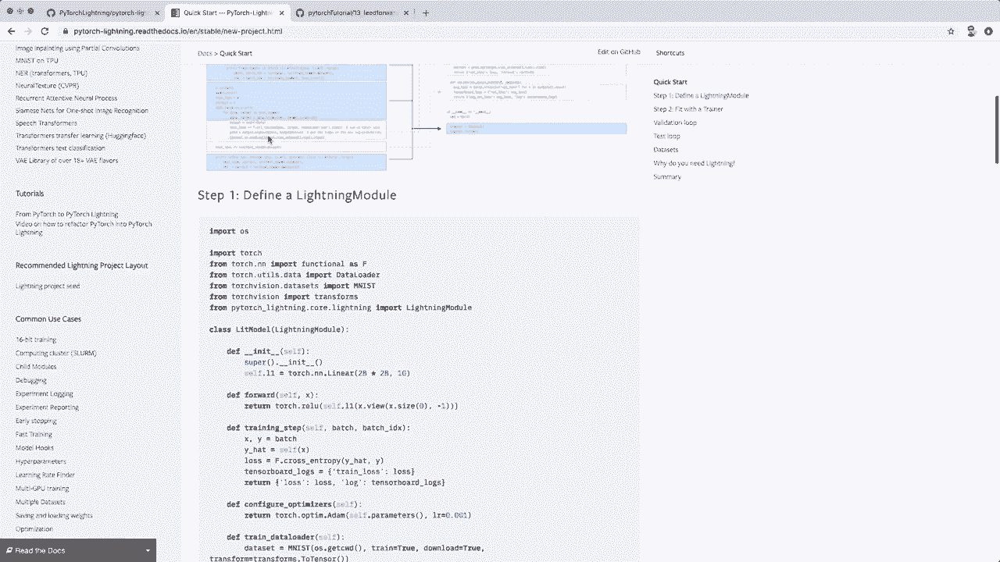

The links in the description as well„ÄÇ And now here are some of the details that you no longer have to worry about with Pytorch lightning„ÄÇ so you no longer have to worry about when to set your model to training or evaluation mode you don't have to worry about using a device for GPU support and then push your model and all your tenss to the device you can easily turn off GPu or even GPU support with lightning and you can easily scale it up then you also have to no longer care about the zero grad or calling backward and optimize a step you no longer have to worry about using torch no grad or detach and as a bonus you have integrate a tenor or support„ÄÇ

And it also prints out tips or hints， which we will see later。 So let's jump to the code。 And for this example， we'll be taking one of the codes from my Pytoch tutorial。 So you can find it on Github。 and then in this case， we take tutorial number 13。 So this is a simple feed forward neural net， which is applied to the Mist data set to do diit classification。

 So now let's grab some of the code and write a new code with Pytoch lightning。 So first of all。 so let me delete this。 and now let's start with a fresh Python script。 And by the way。 when you want to install Pytoch lightning， you have two common options。 The first one is to use Pip。 So you just say Pip install Pytoch lightning。 Or if you use in Conda。

 then you can grab this command„ÄÇ

So I already did this in my terminal„ÄÇ So Pytoch lightning is already insult here„ÄÇ So let's go back to the code and copy and paste some of the things„ÄÇ So we want to have all the same import statements„ÄÇ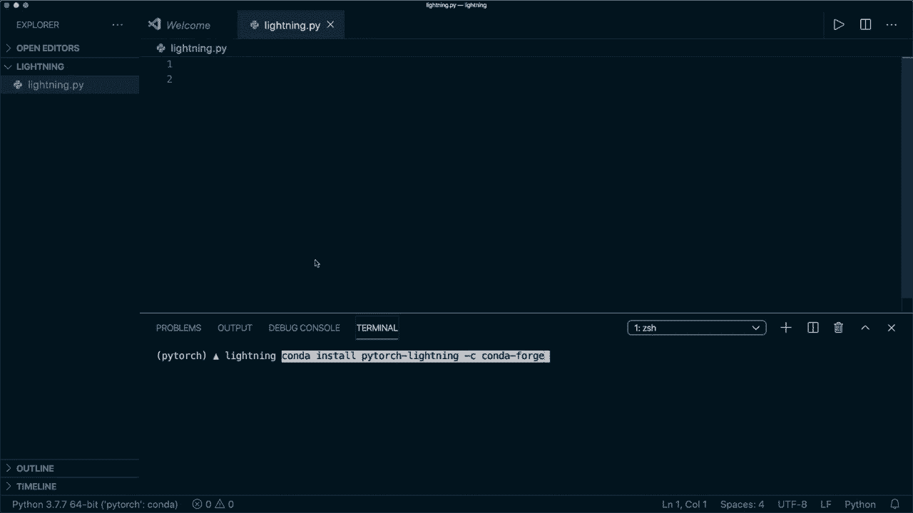

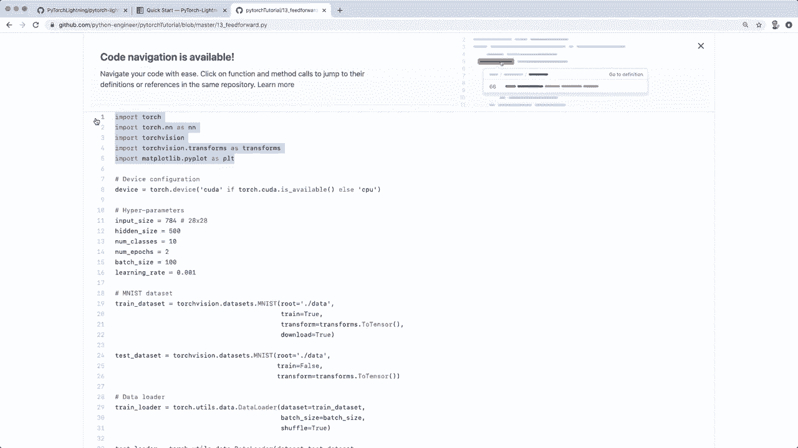

And as an addition now， we also import Pytorch lightning。 So we say import Pytorrch lightning with an underscore S P， L。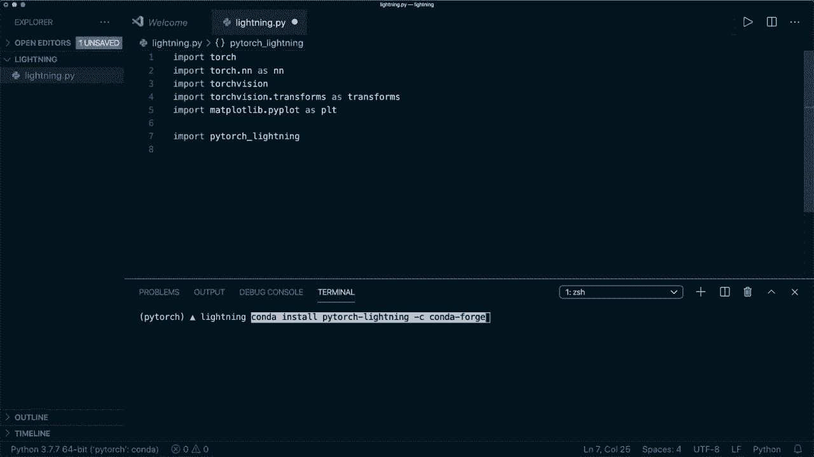

And now we want to convert our model， our neural net to a lightning model。 So we grab this code。 and then we copy and paste it in here And now instead of deriving from N and dot module。 we now derive from P dot lightning module。 This will give us the same functions as the original model。 but it will also give us some more functions， which we will see in a second。

 So now the in it function is still the same， and the forward function also is still the same。 So we then need all the hyperparameters。 So let's grab them as well。 So let's grab these hyperparameters and paste them in here。😊。

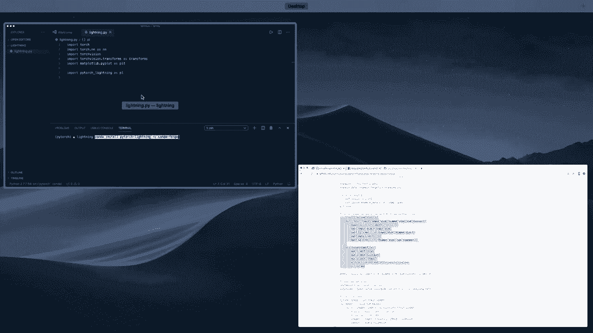

HereAnd now we need to implement some more functions。 So let's quickly go to the official website Here。 you see a step by step guide， by the way。 And you also have a nice comparison how Pytch code looks versus Pytoch lightning and what it abstracts away。 So as you can see， we also need to define a training step。

 a configure optimizes function and a train data loader„ÄÇ So let's copy all of these in here„ÄÇ

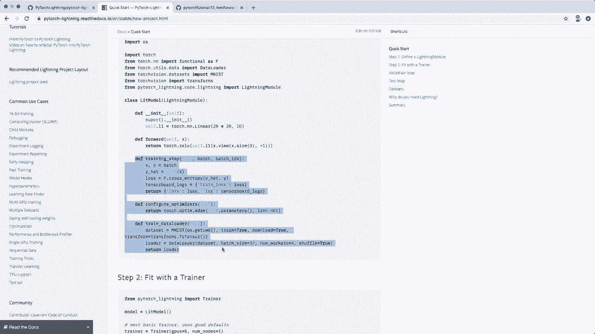

And now for the， let's start with the simplest one。 So the configure optimizers there you simply put in the optimizer that you created。 So in our original script， we set up the optimizer here。 So this is the atom optimizer。 And then you return it。 So we can return this one in one line。 So this will be our optimizer。

 our atom optimizer with the learning rate from our hyperparmeters„ÄÇ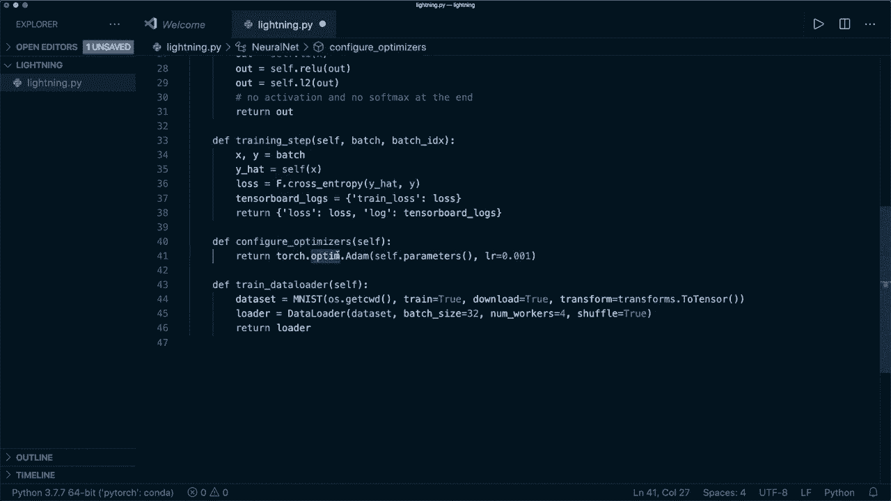

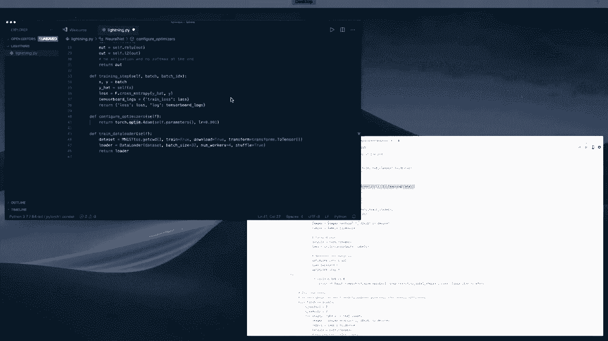

And then we want to in implement the training step„ÄÇ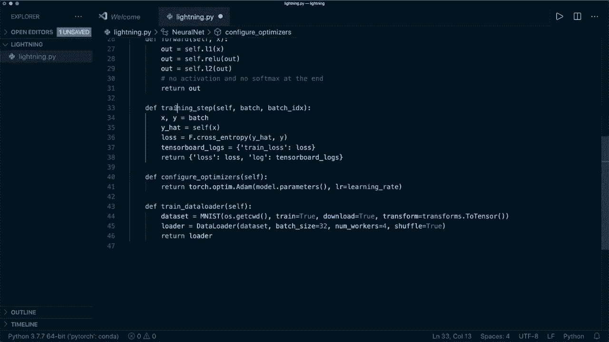

So for the training step， we are doing exactly what we are doing in our training loop。 and now we don't have no longer have to worry about our fall loops about unpackking our images and labels and then hear the optimizer0 grabs the backward and the step。

 So we simply grab this part„ÄÇ

And paste it in here。 And as you see in the training step function， we get a batch and a batch index。 So we unpack our batch into x and y。 and then let me copy the code。 So。This is now our images and our labels。 And then we have to reshape our images。 and we no longer have to push it to the device。 So we remove all of those things。

And then we do the forward pass„ÄÇ And here we can actually use self because we are inside of our model class„ÄÇ

And then we apply the criterion。 and in our original code。 we set up the criterion here as N and dot cross entropis。 But we can also use it instead if we use the functional module。 So for this， we say。

Import torch dot N， N， dot funk。Channel S F。And then down here， we say our loss equals。 and now we can call。F dot cross entropy with our outputs and the labels。 And these are all the things。 And for now， we only want to return a dictionary with this loss。 So Pyto lightning needs this dictionary so that it can show you the loss during the training。

And this is all we need in our training step„ÄÇ And then we also have to implement the train data loader function„ÄÇ So what we want to do here is we want to do what we did in the beginning here we set up the training data set and the training data loader„ÄÇ

 So let's copy this and paste this in the function here„ÄÇ So first our training data set„ÄÇ So this is this one„ÄÇ And then the train data loader„ÄÇ So this one„ÄÇ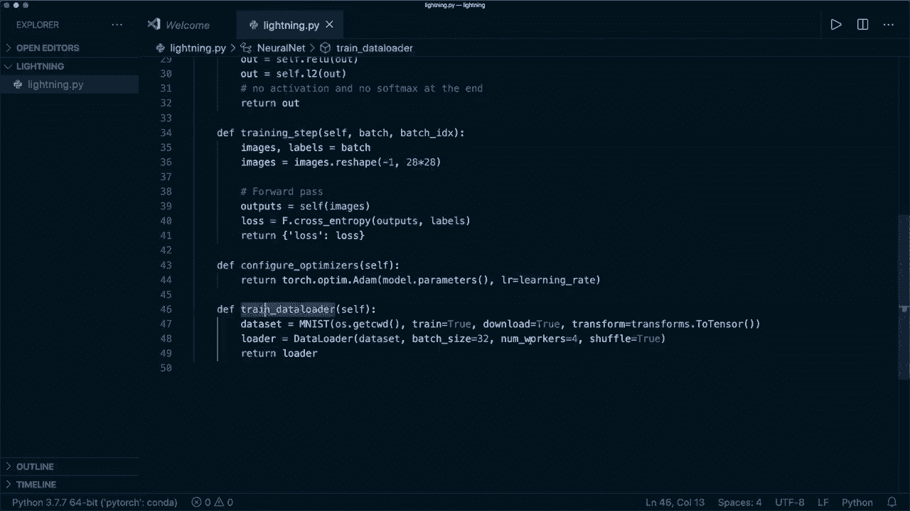

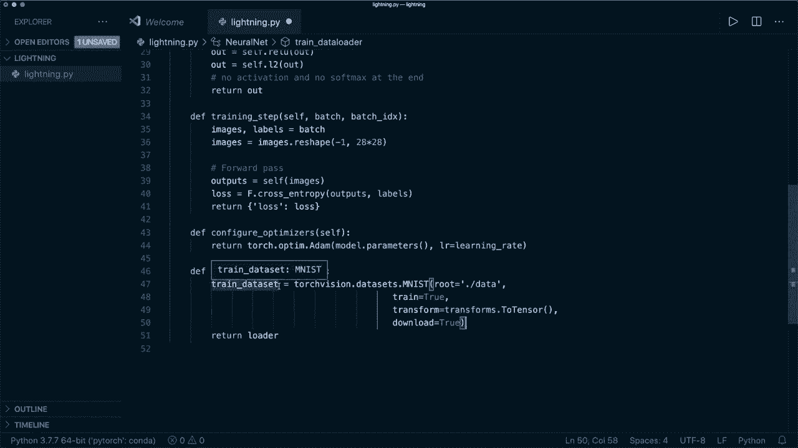

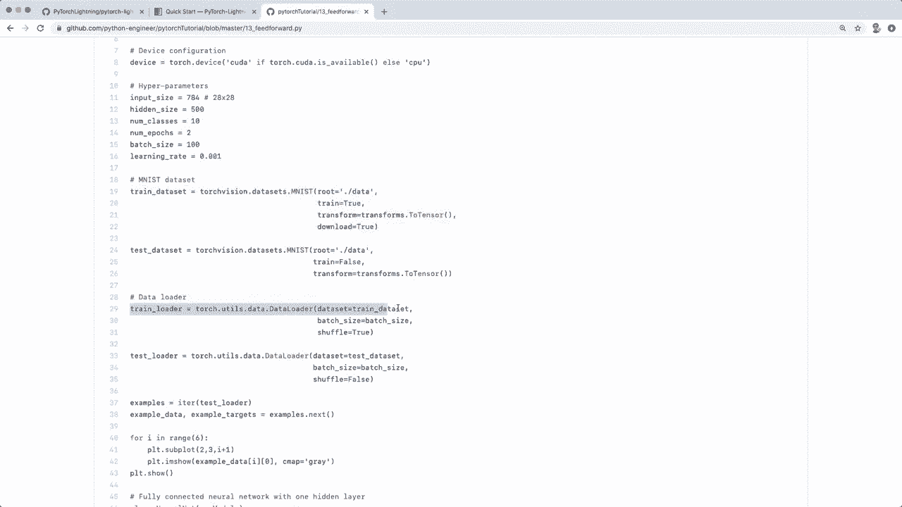

And then we want to return the train data loader or train loader。 And now this is all we need to start a training。 And now what we want to do is we say if。Name equals equals， underscore underscore main。Then we have to set up a lightning trainer。 So for this， we import a trainer。 So we say from Pytorch lightning import trainer。

 Then we want to set up a trainer。 So here we say our trainer equals our lightning trainer。 And for now， I can show you a trick that is very helpful during development。 So you say fast defron equals true。 This will run a single batch through train。 And also through validation。 if we have a validation step。 And with this。

 you can test if your model works。 So now we also have to set up our model。 So we say model equals。 And let's call this lit model to make it clear that this is a lightning model。 So lit。😊。uralNeAnd here we say let neural net with the hyperparameter。 So it needs the input size。 It needs the hidden size， and it needs the number of classes。

 which we all have here for our hyperparameters。 Then we have to fit it to our trainer。 So we say trainer dot fit our model。 And now we can already run it and see if this is working。 So now。Let's go to the console。 And now let's run this file。 So we say Python lightning dot pi。Here we get a error。 So， of course， I rename the lital net。 So I also have to say。

Let neural net here。 And now again， let's run it。And now we see it starting。 so we see that we have no GP support。 We also get an overview of our different layers and the parameters。 Then since I'm running it the first time， it's downloading the data set。And then here is the training。 So it worked。 So it only did one batch because we set fast defffron equals true。

 So let's clear it and test it one more time。 So now it shouldn't download it anymore。And this was way faster。 And now here， for example， we get one warning， so it says。The data loader train data loader does not have many workers， which may be a bottleneck。 Consider increasing the value of nu workers argument。 Try 4。

 So this is actually the first tip that can help us to speed up our code。 So here。 what we want to do is in our train loader。 We can also give it the argument。 nu workers equals 4。 And now let's clear this and run it again。And now our warning is gone， So now。Here we see the overview。 We now only used one epoch。 and here we have the loss。

 So now if you want to have a full training， we can also give our trainer。 the argument max epoch equals。 and then the number of epochs that we defined。 epochs。 So this is one of the hyperparameters。And now let's set this to false again。 So now this should do a full training。 And now， let's see if this is working。

And now this should take。Max epos， sorry。Now this should take a little longer。And yeah， we see。 So we get a nice progress bar， and we see our training works， and our loss should slowly decrease。 So this is working。😊，So now， let me stop this for now。 And now the next thing we want to do is to do our evaluation or testing。

 So similar to the training step and training data loader„ÄÇ We now also want to add a validation step and a validation data loader„ÄÇ So let me copy this„ÄÇ And let me paste it in here„ÄÇ And this has to be called validation step„ÄÇAnd here we are doing the same thing actually„ÄÇ So as in the test train training step„ÄÇ

 So we reshape our images， then we do the forward pass and calculate the loss。 And this time we use the key well loss or validation loss。 and now let's set our fast defron to true again。 and let me run it again。 So now if we run it。 we should get an error。 And yeah， here we get the exception。 you have defined validation step。

 but have not passed in a validation data loader„ÄÇ So now we know what we have to do„ÄÇ We also have to use a validation data loader„ÄÇ So let me copy and paste this„ÄÇAnd this has to be called well data loaddown„ÄÇ So if you're not sure you can go to the official„ÄÇ

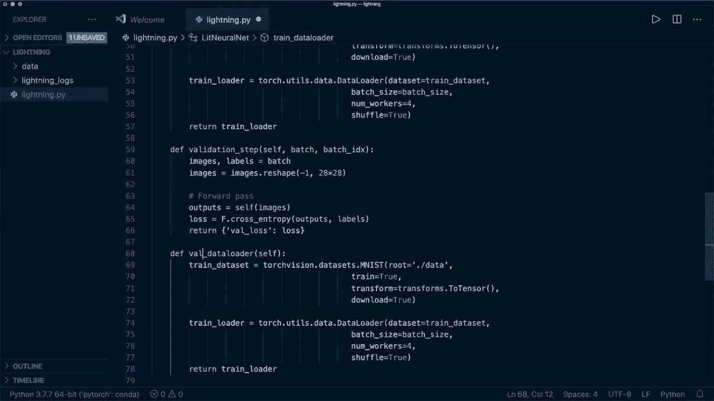

Documentation， and then scroll to the validation loop。 There。 you see the。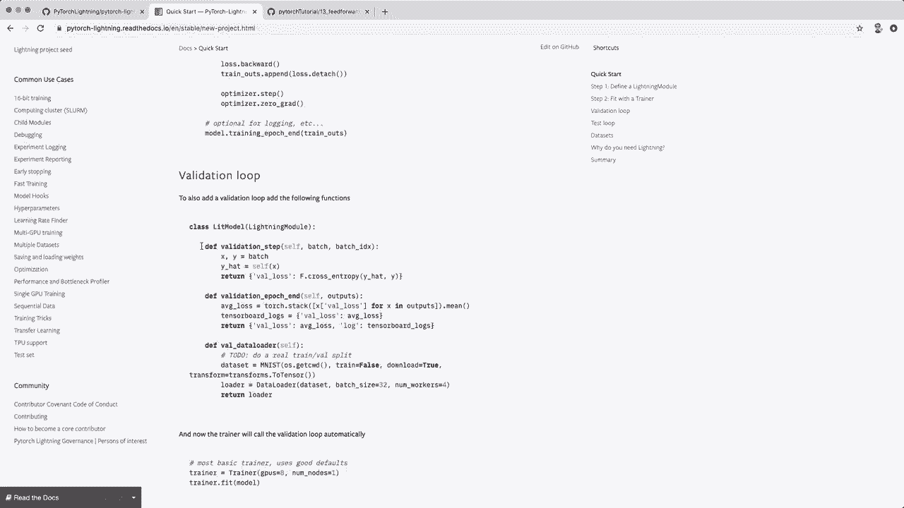

3 functions that you need， so。Now， first of all， now we have our。Validation data set。 So here we want to say， or we want to grab。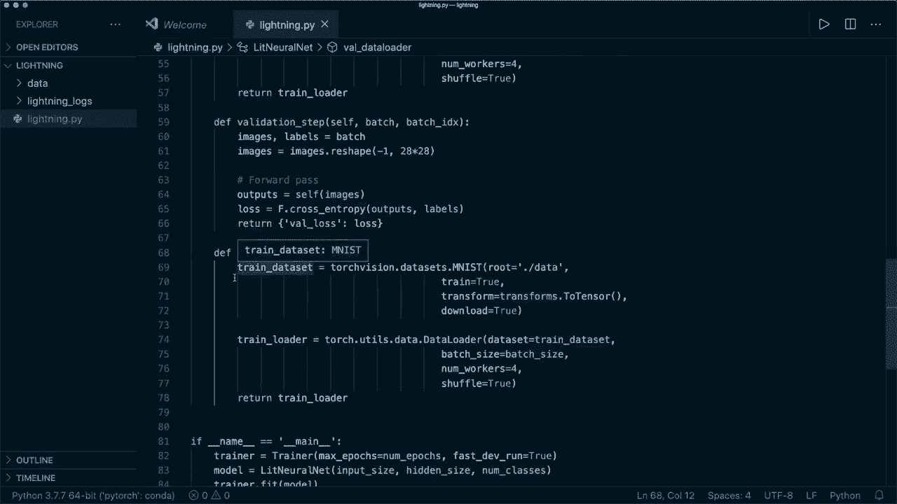

The next or the test data set。 So in this case， I call the test data set。 but actually。 you want to have。A split of your data to a training data set。 a validation data set and a test data set。 So the validation data set is used to get an unbiased evaluation of the model performance while tuning the hyperparameters。And then the test dataset set is used at the very end to provide an unbiased evaluation with data that the model has never seen before。

 So in this example， we， let's say we only have two splits of our data set。 Now。 we only use the first two steps training and validation。 So let me copy this and paste it in here。 And let's rename this to a validation data set。 And then let's grab the validation data loader。

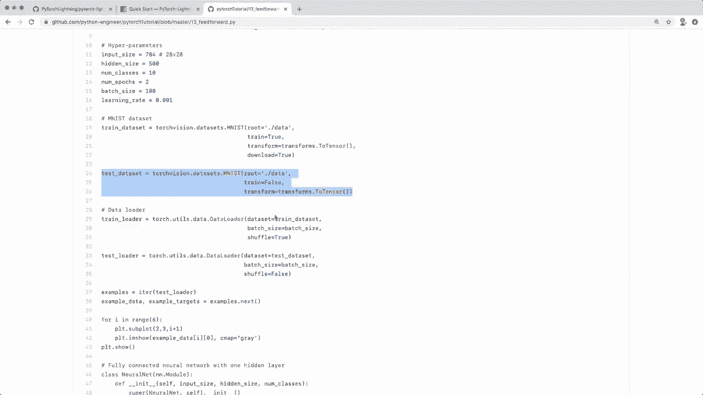

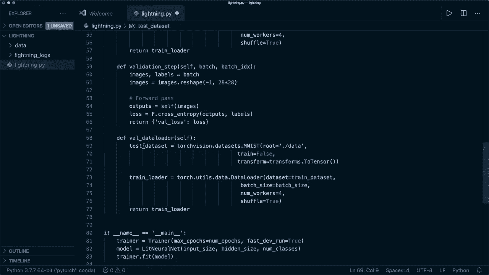

And rename it to Val loader and then return the v loader。And now let's run it again。 So let's say Python lightning dot pi。And we get anarrow。 So data set equals well data set。 of course。 And let's clear this and run it again and then it should do one pass through training and validation。 and we see it worked。 And now we again， get the same warning。

 So here we use the nu workers equals 4„ÄÇ So let's clear it and try it again„ÄÇ So you see it already starts giving us hints when we make some mistakes„ÄÇ And now we see it worked„ÄÇ And now it's also to suggesting to define a validation epoch and method for accumulating stats„ÄÇ So let's go to the documentation and grab this function to see how it looks like So„ÄÇ

We copy and paste this。 So this is the function that is executed after each validation epoch。 And here we want to calculate the average loss。 So actually， in our example。 we want to do exactly the same。 So we want to call。 calculate the average loss by saying this is torch stack。 And then since we。

Called the key validation loss。 We can access it here and then calculate the mean over all the。Losses， and now， for now， let's not worry about this。 And then we return the average loss as a dictionary。And then we are done。 So now， if we clear it。Then， we should get a。1 pass now no more warning。And now we have everything that we need for our coat。

 So this is all we need with pie touch lightning。And now， let me show you one more hint。 what we can get。 So， for example， in our validation loader。 if we accidentally set shuffle equals true and then try to run it。 we should get a warning or a hint。So yeah， here we see user warning。

 Yourve data loader has shuffle equals true。 It is best practice to turn this off for validation and test data loadus。 So you see， we can actually already improve our code with this framework。And now。 let's compare this with our。Original code。 So if we have a look at this code in Github。

Then we no longer need this device functionality。And we no longer needs to have the manual for loop over all epochs and over all the batches。 we no longer have to care about these two device calls。 we no longer have to care about the optimizer and the backward pass and also we can leave out the whole validation loop because we can calculate this with this validation step and now。 for example， if you also want a training step， we can easily edit the same way as we are doing with this function and with this function and now。

 for example， if you want to use GPus， then we can easily do this by giving our trainer the argument。 GPus equals， for example， one and when you want to scale it up and have more GPus available。 you can also use。

2 or let's say4， or you can use even T support。 So it's really easy to switch from CPU to GP and then scale it up。 And you can also have a distributed backend。 So DP， for example。You can also easily switch to 16 bit precision。You can lock the GP memory。 So a lot of features that you can now very easily test with this framework。

 You just have to use all the different arguments for the trainer。 And， for example。 one more helpful function that you can try is auto L R。Find equals true。 This will run a。Algorithm to find the best learning rate。 So you can try this one。You can also set， for example。 deterministic equals true。 So this allows it to reproduce your results。

 or you can apply gradient clipping very easily by just passing in the argument Claient gripve equals。 and then some value between 0 and one， I guess， So for this， you again。 have to check out the official documentation。

There you find all the different features and use cases„ÄÇ And now let me show you the full training and validation„ÄÇ So let's remove this„ÄÇ And now let's set the argument fast defffron to false again„ÄÇ So again„ÄÇ I'm not having a high number of epochs„ÄÇ So it's only two because it takes a long time here without the GP„ÄÇ

 But let's run it anyway„ÄÇ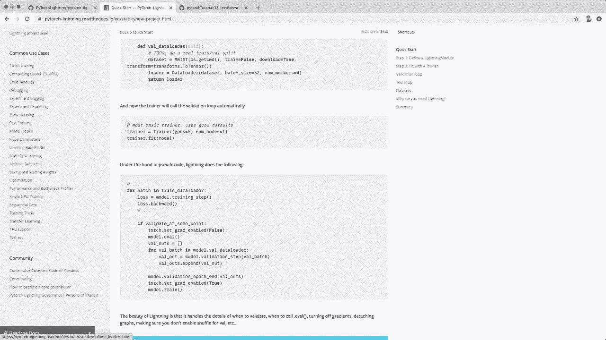

So again， we see the progress in our first epoch here and how our loss is decreasing。 And when this is done， we should a faster progress bar for the validation loop。So now be careful。 Now here we see the validation loop。 and now our second training epoch starts。 So， yeah。 this is working。And now the second validation and now it's done。

 and we can see and inspect the final loss。 So this worked。 And now as the last thing。 let me show you the integrated tenor board support。 So as you can see。 there is all already a folder， which is called lightning lock。 So it's already automatically saving some checkpoint。😊，So and now。

 if we want to inspect the different losses during in the tensor board， then what we have to do is。 for example， if you want to inspect the training。 Then in our training step。 we create another dictionary。 and let's call this tenor board locks equals。 and this is an again。 a dictionary。 and here let's call this train loss as a key and as value， it's the same loss。

 And then we also append the tensor board loss to our dictionary„ÄÇ And we have to give it the key lock and then lock„ÄÇ And this is our tensor board locks„ÄÇAnd now the same in our validation epoch end„ÄÇ So here we create the tensboard locks„ÄÇ And here let's call it average validation loss„ÄÇ And this is the average„ÄÇAverage loss„ÄÇ

 And then here again， we used the key lock and then the tenzo board locks。 And now let's run it one more time to save all those things。So now we have to wait until this is done。So now our training and validation is done。 So now it should have。Save all of those to the lock directory。

 And now we can start the tensor board by saying tensor board minus minus lock。D equals。 and then light ning locks。 And by the way， I also have a full tutorial about how you can work with the Tensor board。 I will also put the link in the description。And with lightning。 you don't have to install it manually become because it comes with the requirements of lightning。

 So this should automatically work now。 So now if we hit run。 and sorry， this was no underscore。inus minus loar equals lightning locks。And now it works。 So now our tensor board is running here。 So now if we open up this。

Then we should inspect the epochs。 Then we have the average validation loss。 So since we only use two。Epochs， we don't see a lot of difference here。 So it's only a one line。 But for the training loss， this is what we looked after each。Training step。 So here we see a nice graph how our training loss decreased。 So yeah， you see。

 we have automatic tensor board integration， and it's very easy to work with this tool。 So yeah。 these are most of the features I wanted to show you。 and let me know in the comments if you like this framework。 And if you also think that it can simplify your development process。 And if you like this video。

 then please hit the like button and consider subscribing to the channel„ÄÇ this helps me a lot and see next time by„ÄÇ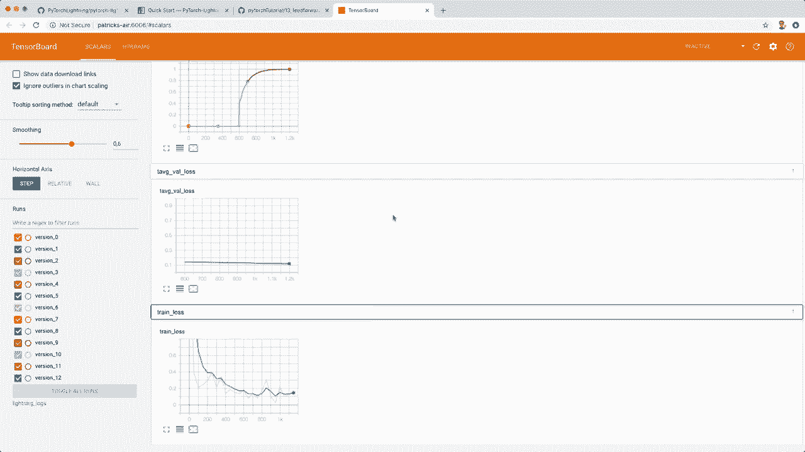

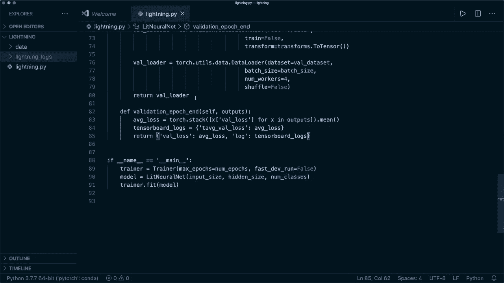