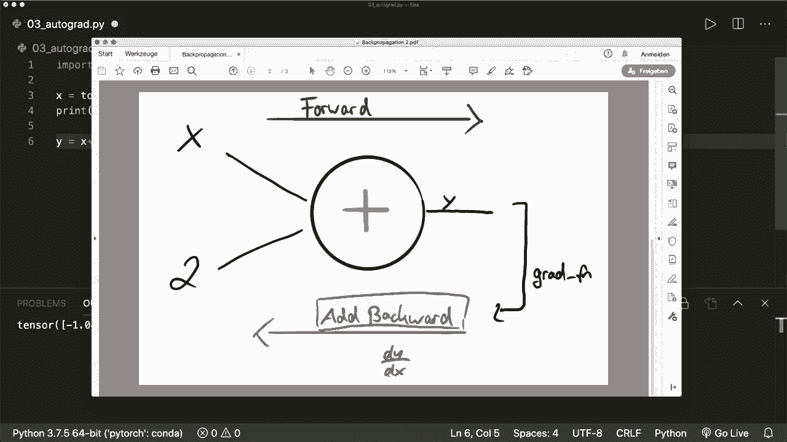
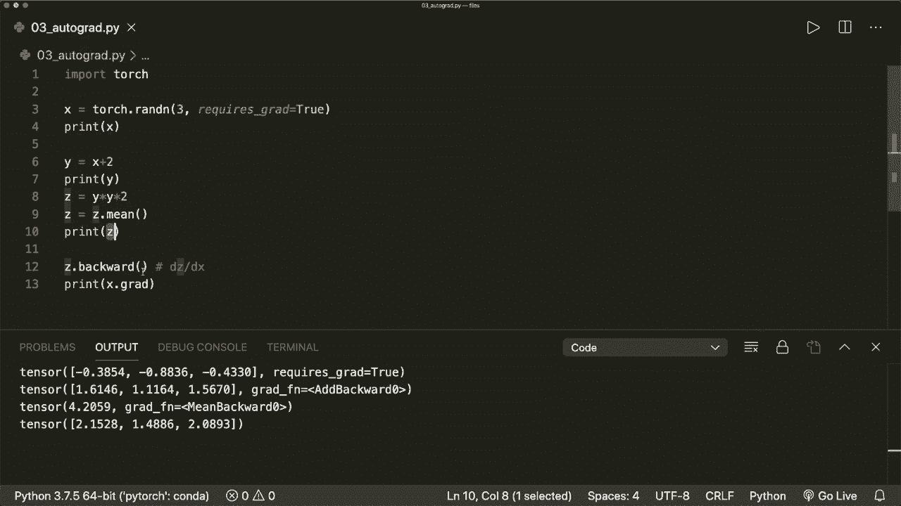
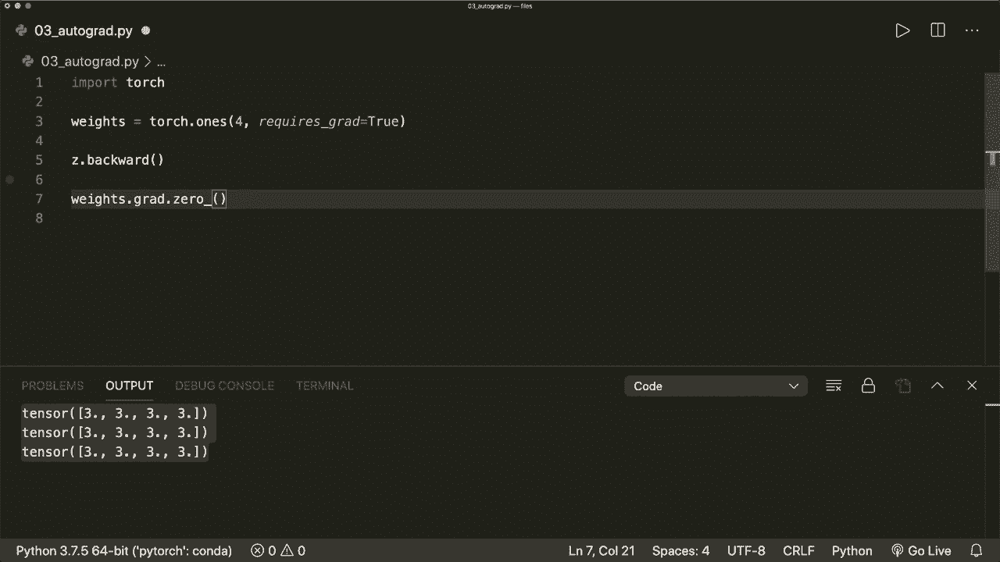

# 【双语字幕+资料下载】PyTorch 极简实战教程！全程代码讲解，在实践中掌握深度学习&搭建全pipeline！＜实战教程系列＞ - P3：L3- 使用 Autograd 计算梯度 - ShowMeAI - BV12m4y1S7ix

Hi， everybody。 Welcome to a new pytorrch tutorial。 Today。 we learn about the autograd package in pytorrch and how we can calculate gradients with it。 Grds are essential for our model optimization。 So this is a very important concept that we should understand。Luckily， Pytorch provides the autograd package， which can do all the computations for us。

 We just have to know how to use it。 So let's start to see how we can calculate gradients in pieytorrch。 So first of all， we import torch。 Of course。😊，And now let's create a tenor x equals torch dot R n of size 3。 And now let's print our x。 So this is a tenzor with three values。 So three random values。And now。 let's say later， we want to calculate the gradients of some function with respect to x。

 Then what we have to do is we must specify the argument requires Gr equals true。 So by default。 this is false。And now if we run this again， then we see that also Pyto tracks that it requires the gradient。And now。Whenever we do operations with this tenor， Py toch will create a so called computational graph for us。 So now let's say we do the operation x plus 2， and we start this in an output。

 So we say y equals x plus 2。 Then this will create the computational graph。

And this looks like this。So for each node， we have a for each operation。 we have a node with inputs and an output。 So here the operation is the plus。 So in addition。And our inputs are x and 2， and the output is y。And now with this graph and the technique that is called back propagation。 we can then calculate the gradients。I will explain the concept of Beck propagation in detail in the next video。

 But for now， it's fine to just know that we or how we can use it。So first， we do a forward pass。 So here we apply this operation。 And in the forward pass， we calculate the output y。And since we specified that it requires the gradient。 Pytoch will then automatically create and store a function for us。

 And this function is then used in the back proagation and to get the gradients。 So here y has an attribute Gr underscore F N。 So this will point to a gradient function。 And in this case， it's called at add backward。And with this function。 we can then calculate the gradients in the so called backward pass。

 So this will calculate the gradient of y with respect to x in this case。 So now if we print y。

Then we will see exactly this grat Fn attribute。 And here， this is an at backward function。 So because here， our operation was a plus。And then， our。Then we do the back propagation later。 So that's why it's called at backward。And let's do some more operation with our tensrs。So let's say we have C equals y times y times 2， for example。

 So this tensor then also has this gra function attribute So here Grt Fn equals mile backward because here our operation is a multiplication。 And for example， we can say C equals C dot mean。 So we can apply a mean operation。 And then our gradient function is the mean backward。And now。 when we want to calculate the gradients， the only thing that we must do is to call C dot backward。

So this will then calculate the gradient of C with respect to x。 So x then has a gradient。 a dot Gr attribute where the gradients are stored。 so we can print this。And now if you run this。 then we see that we have the gradients here in this tenor。 So this is all we have to do。And now let's have a look what happens when we don't specify this argument。 So first of all。

 if we print our tenzos。Then we see that they don't have this gra function attribute。 And if we try to call the backward function， then this will produce an  error。 So it says tens does not require gr and does not have the gr function。So remember that we must specify this argument and then it will work。

And one thing that we should also know is so in the background what this basically does。 this will create a socal vector Jacobcobian product to get the gradients。 So this will look like this。 I will not go into the mathematical details。 but we should know that we have the Jacobcobian matrix。 with the partial derivatives。

 And then we multiply this with a gradient vector。 and then we will get the final the final gradients that we are interested in。 So this is also called the chain rule。 And I will also explain this more in detail in the next video But yeah。 we should know that actually we must multiply it with a vector。 So in this case。 since our C is a scala value， We don't have to put the don't have to use an argument。

And here for our backward function。

So our C here has only v value。 So this is fine。 But let's say we didn't apply the mean operation。 So now our C has more than one value in it。 So it's also size 1 by 3。 And now when we try to call the backward function like this。 And this will produce an error。 So Gr can be implicitly created only for scala outputs。 So in this case， we have to。

Give it the gradient argument。 So we have to create a vector of the same size， so。Let's say V equals torch dot1or。 And here we put， for example，011。0 and0。0，0，1。 and we give it a data type of torch dot float 32。 and then we must pass this vector to our backward function。 and now it will work again。So now， if we run this。Then this is okay。

 So we should know that in the background， this is a a vector Jacobbian product。 And a lot of times。 the last operation is some operation that will create a scala value。 So this is。 it's okay to call it like this without an argument。 But if this is not an a scala。 Then we must give it the the vector。And yeah。Then some other thing that we should know is how we can prevent Pyth from tracking the history and calculating this gra f n attribute。

 So for example， sometimes during our training loop when we want to update our weights。 Then this operation should not be part of the gradient computation。 So in one of the next tutorials。 I will give a concrete example of how we apply this autocrad package。 And then it will become clearer， maybe。 But yeah， for now。

 we should know how we can prevent this from from tracking the gradients。 and we have three option for this。 So the first one is to call the requires。Grat。 underscore function， and set this to false。The second option is to call X dot det。 So this will create a new Tenzoor that doesn't require the gradient。

 And the second option would be to wrap this in a width statement。 So with torch， dot， no gr。 And then we can do our operations。So， yeah， let's try each of these。 So first。We can say。 x dot requires。Grat， underscore and set this to false。 So whenever a function has a trailing underscore in Pytorch。

 then this means that it will modify our variable in place。 So now， if we print X。Then we will see that it doesn't have this require Gr attribute anymore。 So now this is false。So this is the first option， and the second option would be to call x detaach。 So we say y equals x do detaach。 So this will create a new vector with the same or a newtenzo with the same values。

 but it doesn't require the gradient。 So here we see that our y has the same values。 but doesn't require the gradients。And the last option is to wrap it in a torch in a width with statement with torch dot no Gr。 And then we can do some operations， for example， y equals。X plus 2。And now， if we print our y。 then we see that it doesn't have the gradient function attribute here。 So， yeah。

 if we don't use this and would run it like this。Then our y has the gradient function。 So these are the three ways how we can stop Pythot from creating this gradient functions and tracking the history in our computational graph。And now one more very important thing that we should also know is that whenever we call the backward function。 then the gradient for this tenzoor will be accumulated into the dot gra attribute。

 So the values will be summed up。 So here we we must be very careful。 So let's create some dummy training example。 where we have some have some weights。 So this is a a tenzoor with ones in it of size， let's say4， and they require the gradient。 So requires gra equals true。 And now let's say we have a training loop where we say four epo in range and first。

 let's only do one iteration。 And here we do， let's say model output。Equals， let's say。Weights times 3 dot sum。 So this is just a dummy operation， which will simulate some model output。 And then we want to calculate the gradients。 So we say model output dot backward。And now we have the gradient， so we can call weight dot Gr。And print this。嗯。

So I what gradients here are 3。So the tensor is filled with threes。 And now if we do another iteration。 So if we say we have two iterations。 then the second backward call will again accumulate the values and write them into the Gr attribute。 So now our grs has sixes in it。 And now if we do a third iteration。 Then it has nines in it。

 So all the values are summed up。 And now our weights or our gradients are clearly incorrect。 So before we do the next iteration and optimization step。 we must empty the gradients。 So we must call weights dot Gr dot0 underscore。 And now if we run this then our gradients are correct again。So this is one very important。Th that we must know during our training steps。

 and later we will work with the Pytorch built in Opr。 So let's say we have a optr from the torch optimization package。 So torch do optim do SGD for stochastic gradient descent。 which has our weights as parameters and some learning rate and now with this optimizer。

 we can call or do a optimization step and then before we do the next iteration。 we must call the optimizer do0 gra function， which will do exactly the same。So， yeah。 we will talk about the optimizes in some later tutorials。 But yeah， for now。 the things you should remember is that whenever we want to calculate the gradients。

 We must specify the require gr parameter and set this to true。 Then we can simply calculate the gradients with calling the backward function and before we want to do the next operation or the next iteration in our optimization steps。 we must empty our gradients。 So we must call the0 function again。And we also should know how we can prevent some operations from being tracked in the computational graph。

And that's all I wanted to show you for now with the autograd package。 And I hope you liked it。 Please subscribe to the channel and see you next time， bye。