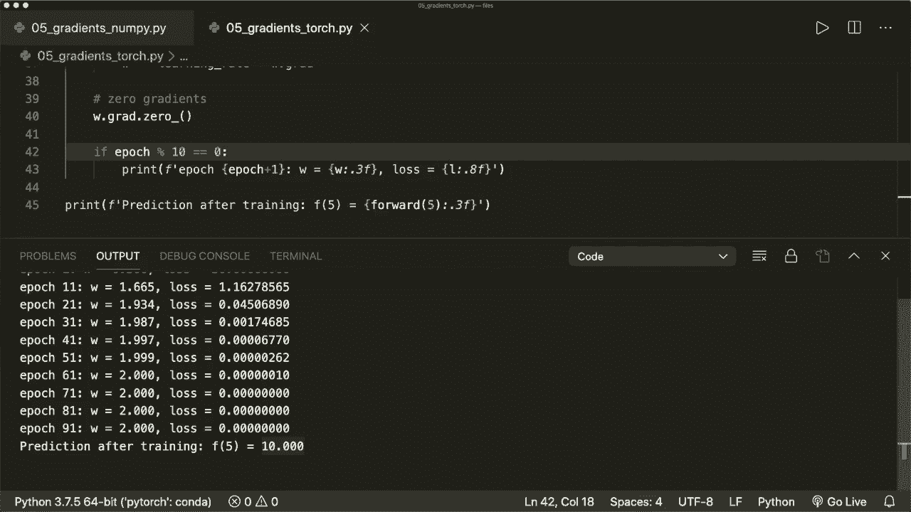

# 【双语字幕+资料下载】PyTorch 极简实战教程！全程代码讲解，在实践中掌握深度学习&搭建全pipeline！＜实战教程系列＞ - P5：L5- 带有 Autograd 和反向传播的梯度下降 - ShowMeAI - BV12m4y1S7ix

Hi， everybody。 Welcome to a new Pytorch tutorial。 In this tutorial。

 I show you a concrete example of how we optimize our model with automatic gradient computation using the pytorch autogra package。

 So we start by implementing the linear regression algorithm from scratch。

 where we do every step manually。 So we implement the equations to calculate the model prediction and the loss function。

 Then we do a numerical computation of the gradients and implement the formula。

 And then we implement the gradient decent algorithm to optimize our parameters。

 When this is working， we see how we can replace the manually computed gradients with the automatic back propagation algorithm from Pytorch。

😊，So this is step number 2。 and in the third steps， we in the third step。

 we replace the manually computed loss and parameter updates by using the loss and optimize the classes in Pytorch。

 and in the final step， we replaced the manually computed model prediction by implementing a pytorch model。

So when we understood each of these steps， Pytorch can do most of the work for us。 Of course。

 we still have to to design our model and have to know which loss and optimizer we should use。

 But we don't have to worry about the underlying algorithms any more。

So now this video will cover steps 1 and 2。And in the next video， we will see the steps 3 and 4。

 So let's start。 And I assume that you already know how linear regression and gradient decent works。

 And if not， then please watch my machine learning from scratch tutorial about this algorithm。

 because now I will not explain all the steps in detail。

But I put the link in the description。So now we do everything from scratch。 So we use only nuy。

 So we import nuy S and P， and then we use linear regression。

 So we use a function which just just does a linear combination of some weights and our inputs。

 and we don't care about the bias here。So in our example， let's say F equals。Two times x。

 So our weight must be 2。 And then let's do some training samples。 So let's say x。

Equals numpy dot array。 And then we put some tests or training samples。 So let's say 1，2，3， and 4。

 And this will be of numpy。Or， let's get。Give this a data type on， say this is Nmpy dot floatat 32。

And then， we also want a y。And。Since our formula is， this is 2 x。

 we have to multiply each of the values by 2。 So 2，4，6 and 8。And now we initialize our weights。

 So we simply say w equals 0 in the beginning。And now we have to calculate our model prediction。

 And we also have to calculate the loss。And then we have to calculate the gradients。

 So now we do each of these steps manually。 So let's define a function， and we call this forward。

 So this is a forward pass to follow the conventions of pytorrch， which will get x。

 and then our model output is simply w times x。So this is the forward pass。Now， the loss。

So here we define the function loss， which depends on why and why predicted。So。

The this is the model output。And now here in this case。

 this is the or the loss equals the mean squared error in the case of linear regression。

 And we can calculate this by saying， this is。嗯。Let's say y predict it minus y。

 And then to the power of 2。 And then we do the mean operation。So this is the loss。

 and now we manually have have to calculate the gradient of the loss with respect to our parameters。

 So let's have a look at the mean squared error。 So the formula is1 over n because it's the mean。

 And then we have our w times x our prediction minus the actual value to the power of2。

 And now if you want to have the derivative。 So the derivative of this。

 let's call this j or objective function with respect to w equals1 over n And then we have two times x。

 and then times W times x minus y。 So this is the numerical computationd。Computed derivative。

 Also please double check the math for yourself。And now we implement this。 So we say define gradient。

 which is dependent。On x and y and also Y predicted。 And now we can do this in one line。

 So we return numpy dot。 We need a dot product of two times x。

And then here we have y predicted minus y。

Said this is this formula here。And then， of course， we also need the mean。

 So let's say this is dot mean。 We can simply do it like this in Ny。And now。Yeah， these are the。

Things we need Now， let's print our。Prediction before the training。 So let's print。

 and we use an F string。 So prediction before training。And let's say we want to predict the value5。

 which should be 10。And here， we can do。In the F string。

 we can actually use an expression so we can call this forward method and with five。

And let's say we only want three decimal values。And now， let's start our training。

So let's define some parameters。 So we need a learning rate， which is， let's say，001。

 And then we need a number of iterations。 So we say an its equals 10。

And now let's do our training loop。 So we say for epoch in range and iters。And then first， we do the。

Prediction， which is the forward pass。 So this is the forward pass。

And we can simply do this with our functions。 So we say y prediction or y pre equals forward。

And then we put in our capital x。And now we want to have the loss。 So our loss L equals the loss of。

The actual y。And our Y predict it。Now， we need to get the。Gras， so our gradients， with respect to W。

 So D W equals the gradient function that we just implemented。

 which is dependent on x and y and the y predicted。srry。Why pret。And。

Now we have to update our weights。 and yes， so the update formula in the gradient decentcent algorithm is just we go into the negative direction of the training of the gradient。

 So minus x。 And then here， the step width or the so called learning rate times our our gradient。

 So this is the update formula。And then let's say we also want to print some information here。

 So we say if epoch modular， just say one here， because now we want to print every step。If this is 0。

 we want to print， let's say。We want to print the epoch。 And here we print epoch plus 1。

And then we want to get the weight， which is。The weight。W， also， just 3。Deimal numbers。

 And then we also want to have the loss。 So the loss equals。The loss。 And here we say， point。8。

 let's say。And yeah， and then at the end。We want to print the prediction after the training。So， now。

 let's predict。Prediict a print prediction。After training。And yeah， so。 Now。

 let's run this and see what happens。So everything should be working。 And now， so yeah。

 before our training， the prediction is0。And then for each step。

 remember that our formula should be  two times x。 So our w should be 2 in the beginning。

 And we see that with each training step， it it increases our weight， and it decreases our loss。

 So it gets better with every step。 And after the training， our model prediction is 9。999。

 So it's almost there。 So let's say， for example， now we want to have more iterations here。

 say we only did we only did 10 iterations， which is not much。 Now。

 if we run this and let's print every second step only。Then we see， in the end， our loss is 0。

 and the prediction is correct。Now， this is the implementation where we did everything manually。

 And now let's replace the gradient calculation。 So let's select all of this and copy this into a separate file。

And now we don't use numpy anymore。 So now let's only import torch and do everything with pie torch。

And， of course， what we now want to get rid of is this gradient， the the manually computed gradient。

 So we simply delete this。 We don't need this anymore。And now we don't have nuy arrays。

 So this is now a。Torch dot Tzar。And our data type is now a torch dot float 32 and the same with our y。

 which is now a。Torch dot。Tensor and also the data types from the torch module。

But everything else is the same here。 So the same syntax。And now our W also has to be a tenor。

 So let's say this is a torch dot tenor with0。0 in the beginning。 and it also gets a data type of。

 say torch dot float 32。 And since we are interested in the gradient of our loss with respect to this parameter。

 we need to specify that this requires the gradient computation。 So requires gra equals true。

Now， the forward function and the loss function is still the same because we can use the same syntax in pytorrch。

And now。In our training loop， the forward pass is still the same。 The loss is the same。

 And now the gradient， this is the equal to the backward pass。 So remember， in backward propagation。

 we first do a forward pass。 That's why we used the syntax。 And then later for the gradients。

 we use the backward pass。 So here we simply call L dot。Backward。

And this will calculate the gradient of our loss with respect to W。

 So Pyto does all the computations for us。 And now we update our weights。

 But here we want to be careful。 and I explained this in the tutorial about the auto gridd package。

Because we don't want to be。 this operation should not be part of our。Graadient trackingrek graph。

 So this should not be part of the computational graph。 So we need to wrap this in a width torch dot。

 no gr statement。And then one more thing that we should also know。

 And I also talked about this already， we must empty or  zero the gradients again。

 because whenever we call backward， it will write our。

Grads and accumulate them in the W dot Gr attribute。 So before the next iteration。

 we want to make sure that our gradients are 0 again。 So we can say w times gra times0 underscore。

 So this will modify it in place。And now， we are done。

And now let's run this and see if this is working。And W is not defined。 Oh， yeah， Co， Of course。

 this is now W dot gra。And let's try this again。 and now it's working。

And now we also see that it will increase our W， and it will decrease our loss。

 And here we said we had 20 iterations。But it's not correct， Not completely correct。

 And this is because the。Backward or the back propagation is not as exact as the numerical gradient computation。

 So let's try some more iterations here。 Let's say we want 100 iterations and print our update every 10th step。

 So let's try this again。And now we see after the training is done。

 we have the correct correct prediction。So， yeah， that's it for this video。 And in the next video。

 we will continue here and replace the manually computed loss and weight updates with Pytorch loss and optimizer classes。

So if you like this video， please subscribe to the channel and see you next time， bye。

