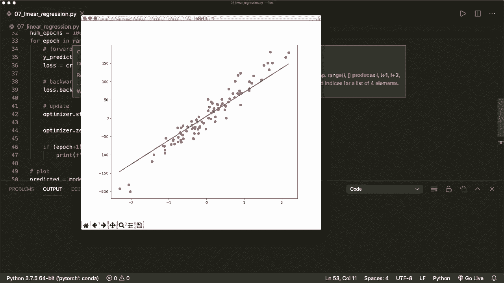

# 【双语字幕+资料下载】PyTorch 极简实战教程！全程代码讲解，在实践中掌握深度学习&搭建全pipeline！＜实战教程系列＞ - P7：L7- 线性回归 - ShowMeAI - BV12m4y1S7ix

Hi， everybody。 Welcome back to a new Pytarch tutorial。 This time， we implement linear regression。 So we already implemented this step by step in the last couple of tutorials。 and this should be a repetition where we can apply all the learned concepts and quickly implement our algorithm again。😊，So as I've shown you before， our typical pieytorch pipeline consists of those three steps。First。

 we design our model。 So we define the input and the output size， and then the forward pass。 Then we create our loss and optimizer functions。 And then we do the actual training loop with the forward pass。 the backward pass and the weight updates。 So let's do this。And first of all。 we import a couple of things that we need。 So let's import torch。

 Then we import torch dot and N S and N。 So the neural network module。 Then we import nuy S and P just to make some data transformations。 and then from S K learn。 we import data set。 So we want to generate a regression data set。And then we also want to plot this later。 So I say import matplot clip the pie plot as P LT。

And then we do our three steps。 So we design the model， step number one。Then step number two。 we define the loss and the optimizer。And then step number 3， our training loop。 So let's do this。 And first of all， let's do a step 0 where we prepare our data。 So prepare data。 So let's generate a regression data set。 and we can do this by saying let's call this x nuy and y nuy equals。

 and then we can use data sets dot make regression。 which gets， let's say 100 samples。 So n samples equals 100。 and only one feature in this example。 So n features equals  one。 Then we add some noise。 and let's also at a random state。 Let's say this is one。

And then we want to convert this to a torch tenzoa。 So we say x equals。 and then we can use the function torch dot from numy。 and then we say x dot。X underscore nuy。But we want to convert this to a。A float 32 data data type before。 So right now this is a double data type。 So if we use a double here。

 then we will run into some arrows later。 So let's just convert this by saying S type and then say nuy dot float 32 and we do the same thing for our y。 So we say y equals the torch tenzo from our nuy array。And now let's also reshape our y。 because right now this is a has only one row， and we want to make it a column vector。 So we want to put each value in one row， and the whole shape has only one column， so。

Let's say y equals y dot view。 And here we put in the new size So y dot shape0。 So the number of of values。 and then only one column。

So the few method is a built in pi torch method， which will reshape our tenone。And then let's get the number of samples and the number of features by saying this is x dot shape。 So we can use this in a second。 And now let's do our three steps。 So now we have the data。 Now we define the model。And in the linear regression case， this is just one layer。 So our。

 so we can use to build in linear model。 So we say model equals N N dot linear。

This is the linear layer， which needs a input size of our features and a output size。 So let's say input size equals。 This is the number of features we have。 So this is just one in our example。 and the output size equals one。 So we only want to have one value for each sample that we want to put in。

 So our model gets now the input and the output size So input size and output size。

And this is all we have to do to set up the model。And now let's continue with the loss and the optimizer。 So let's call this criterion。

And here we can use a built in loss function from Pytorch。 And in the case of linear regression。 this is the mean squared error。 So we can say this is N N dot M S E loss。 So will calculate the mean squared error。 So this is a callable function。And then we also set up the optimizers。 So we say。Opttimizer equals。

And let's say torch dot optim dot S G D。 So this is stochastic gradient descent。 and our optr needs the parameters that it should optimize。 So here we can simply say this is model dot parameters。 And then it needs a learning rate。 So let's define this here as a variable。 So let's say learning rate equals。 let's say 001。

And then Lr equals learning rate。

So this is step number 2。 And now let's do our training loop。 So， first of all。 let's define the number of epochs。Let's say we want to do 100 training iterations。 and now for。

Epoch in range epochs。 And now here we do our steps in the training loop， the forward pass。 the backward pass and the update and the weight updates。

So let's， first of all， do the forward pass and also the loss here。Then， the backward pass。And then the update。 So the forward pass and the loss here， we can say， why predict it。

Equals， and here we call our model。 And as a data， it gets x。 So this is the forward pass。 And then we compute the loss by saying loss equals。

This is our cr we call this criterion。

And this needs the actual labels and the predicted values。 So why predict and why。

And now， in the backward pass to calculate the gradients， we just say lost dot backward。 So this will do the back propagation and calculate the gradients for us。And then our update here。 we simply say optimizer dot step。 So this will update the weights。And then before the next iteration， we have to be careful。 So we have to empty our gradients now。

 because whenever we call the backward function， this will sum up the gradients into the dot Gr attribute。 So now we want to empty this again。 And we simply say optimizer dot0 gra。 So you should never forget this。

And then we are done with the draining loop。 Let's also print some information。 So let's say if。Epoch plus 1 modular1s equals equals 0。 So every 10th step， we want to print some information。 So let's print the epoch。 And here we say epoch plus one。 and let's also print the loss。 the loss equals。 And here we can can say loss dot item。 and let's format this。

 So let's plot or print only for decimal values。🤢，So now we are done。 and now let's also plot this。 so。Let's say， let's get all the predicted values by saying predicted equals here。 we call our final model now， model X。And with all the data。And now we want to convert this to nu pipe back again， but before we do that。

 we want to detach our tenzoor， so we want to prevent this operation from being tracked in our graph and our computational graph。Because right now， this tenor。Here I have a typo predicted。 So this tenor has the required gradients argument set to true。 But now we want this to fall to be false。 So this will generate a new tenzor where our gradient calculation attribute is false。

 So this is our new tenzo。 And then we just call the numpy function。 Now we convert it to numpy and now plot this。 So let's say first plot all our data。So。 x nuy and y nuy。And we want to plot this as， let's say red dots。 And then we want to plot our generated or approximated function。 So let's say P， L T dot plot。

X nuy on the X axis and our predicted labels on the Y axis。And let's plot this in blue。 And then we say P L T dot show。 And now let's run this and hope that everything is correct。

And now this plot appears here。 So now we see that we have a pretty good approximation of our data with this line。 and we see that this is working。

And yeah， now were done。 I hope you enjoyed this。 If you like this。 please subscribe to the channel and see you next time， bye。😊。