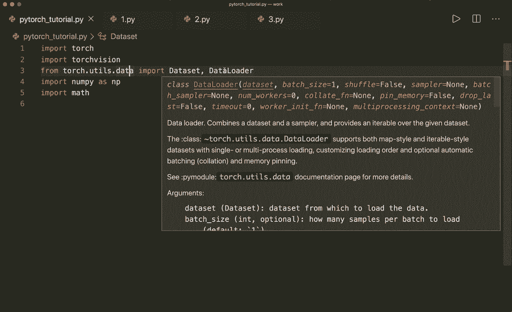

# 【双语字幕+资料下载】PyTorch 极简实战教程！全程代码讲解，在实践中掌握深度学习&搭建全pipeline！＜实战教程系列＞ - P9：L9- 数据集和数据加载器 - 批量训练 - ShowMeAI - BV12m4y1S7ix

Hi， everybody。 Welcome back to a new Pytorch tutorial Today。 I want to show you the Pytorch data and data loader classes。 So far。 our code looked something like this， so we had a data set that we loaded somehow。 For example。 from a CV file。 and then we had our training loop that looped over the number of epochs and then we optimized our model based on the whole data set。

 So this might be very time consuming if we did gradient calculations on the whole training data。 So a better way for large data sets is to divide the samples into so-called smaller batches。 and then our training loop looks something like this。😊，So we loop over the epochs again。 and then we do another loop and loop over all the batches。

 and then we get the x and y batch samples and do the optimization based only on those batches。So now if we use the build in data set and data loader classes from Pytorch。 then Pytorch can do the batch calculations and iterations for us。 so it's very easy to use。And now I want to show you how we can use these classes。 but before we jump to the code。

 let's quickly talk about some terms when we talk about batch training。So first。 one epoch means one complete forward and backward pass of all the training samples。And one。 the batch size is the number of training samples in one forward and one backward pass。And the number of iterations is the number of passes where each pass uses the batch size number of samples。

 So here we have an example。 If we have 100 samples and our batch size is 20。 then we have5 iterations for one epoch， because 100 divided by 20 is 5。So yeah。 that's what we should know。 And now let's jump to the code。 So first。 I already implemented some modules that we need。 So torch， of course， then also torch vision。

 And then from torch dot u the data。 We import data set and data loader。 So the classes I just talked about。 Then let's also import Ny and math。 And now we can start implementing our own custom data set。 So let's call this wine data set。

And this must inherit data set。 And then we have to implement three things。 So we have to implement the in it。AndWith self。 So here we do some data loading， for example。And then we also must implement the double underscore get item method， which gets self and an index。 So this will allow for indexing later。 so we can call data set with an index0， for example。

And then we also must implement the lengthng method， which only has self。And then this will allow that we can call length of our data set。So now let's start。 So in our case。 we want to look at the wine data set。 So I have the Cs we file here。 and I also put this in my Github repository so you can check it out here。

And so the data set looks like this。 So the first row is the header。And here we want to calculate or to predict the wine categories。 So we have three different wine categories，1，2， and 3。And the class label is in the very first column。 And then all the other columns are the features。

So let's load this and split our columns into X and Y。 So here we can say X， Y equals Ny dot load T。 X， T。

And here I must specify the file name。 So this is in the data folder， and then I have a wine folder。 And then it's called wine dot csv。 Then let's also give a de limititer equals a comma here because this is a comma separated file。 Then let's also give it a data type。 So let's say data type equals nuy dot float through the2。 And let's also say skip rows equals one。 So we want to skip the first row。

 because this is our header。And now let's split our whole data set into x and y。 So we say self dot x equals。 And here we can use slicing。 So X， Y。 And we want to have all the samples。 And then we don't want the very first column。 So we want to start at at the column number one， and then go all the way to the end。

 So this will give us the X。 and then self dot y equals X， Y of。And here again。 we want all the samples， but only the very first column。 And we put this in another array here so that we have the size number of samples by one。 So this will make it easier later for some calculations。嗯。So， yeah。

 and that's also convert this to a tenzo。 So we can say torch dot from Numpy and then give this to our our to the function here。 So torch dot from Ny。So， we don't。We do not need this， but we can do it。 We can also convert it later， but we can do it right here。 So let's do this。 And let's also get the number of samples。 So let's say self dot number of samples equals X。

 Y dot shape。And then 0。 So the first dimension is the number of samples。And then we can return this right here。 And this is our whole length function。 So return self dot number of samples。 And here we can also implement this in one line。 So we can say return self dot X of this index and then self dot Y of this index。

 So this will return a tuple。And yeah， now we are done。 So this is our data set that we just implemented。 And now let's create this data set。 So let's say data set equals wine data set。And now let's have a look at this data set。 So now we can say first data。Equals data set。 And now we can use indexing。

 So let's have a look at the very first sample。 And now let's unpack this into features and labels like this。 So this is first data。 And now let's print the features and also print the labels。To see if this is working。 And yeah， so we have one feature column or only one row。 So this is one row vector。 and then the label。 So the label  one in this case。And yeah。

 so this is how we get the data sets。 And now let's see how we use a data loader so we can say data loader equals the build in data loader class and then we pass。 we say data set equals this data set。 and then we can also give this a batch size。 So batch size equals， let's say4 in this case。 Then let's say shuffle equals true。 which is very useful for training。so this will shuffle the data。

 And then we also say nu workers equals 2。 So you don't need to do this， but this might。Make loading faster because it's using multiple sub processessses now。And。Yeah。 so now let's see how we can use this data loader object。 So now we can convert this to a iterate iterator。 So let's say data iter equals。Iter data loader。

And then we can call the next function so we can say data equals data iter。Dot next。And then we can all again， unpack this by saying features and labels equals data。 And now let's print the features and the labels。 if to see if this is working。And yeah。 so here we have it。 And here in this case， I specify specified the batch size to 4。

 This is why we see four different feature vectors here。 And then also for each feature vector the class。 So four class labels in our labels vector or labels tenor。And now we also can iterate over the whole data loader。 So and not only get the next item。 So now let's do a dummy training loop。So let's specify some hyperparmeter。 So let's say， nu epochs。

Equal epoch equals 2。 And then let's get the total number of samples。 So total samples equals L。Of our data set。And now let's get the number of iterations in one epoch。 So this is。The total number of samples divided by the batch size， So divided by 4。 And then we also have to。 to seal this。 So math seal。嗯。This， and now let's print our total samples and the number of iterations。

And then we see we have 178 samples and 45 iterations。 So now let's do our loop。 So let's say for epoch in range number of epochs。 And now we do the second loop and loop over the train loader。 So let's say for I。 And here we can already unpack this by saying inputs and labels in enumerate。 And here we only put an the how did we call it。

Data loader。So this is all we have to do， and。Now， this enumerate function will give us the index and then also。The inputs and the labels here， which is already unpacked。And now。 what we should do typically in our training is to do our forward and then our backward pass and then update our weights。 So this is just a dummy example。 So in this case， I only want to print some information about our batch that we have here。

 So let's say if。I plus 1 modo 5 equals equals0。 So every fifth step。 we want to print some information。 So let's print epoch。 And here， let's print the current epoch。And then all epochs。 So here， let's say nu epochs。 And then let's also print the current step。 So step。And this is I plus 1。And then the total steps。 So this is。And iterations here。

 And then let's also print some information about our input。 So inputs。 And let's say here we want to print input dot shape only。And yeah。 now let's run this to see if this is working。And yeah， so here we see our print statements。 So we see that we have two epochs and in every epoch， we have 45 steps and every fifth step。

 we print some information。And we also see that our Tenzoar is 4 by 13。 So we have our batch size is 4 and then 30 different features in each batch。And yeah。 so that's how we use the。Data set and the data loader classes。 And then we can very easily get a single patch。Single bes。嗯，这样。Of course。

 Pytorch also has some already built in data sets。 So， for example。 from torch Viion dot data sets dot。Amist， we get the famous Amist data set。 and for example。 we can also get the fashion Ams data set or the scipher。And a data set or the coco data set。 And yeah， so the M this data is one that we will use in one of the next tutorials。 And for now。

 this is what I wanted to show you about the data and data loader classes。 I hope you liked it。 and please subscribe to the channel and see you next time， bye。