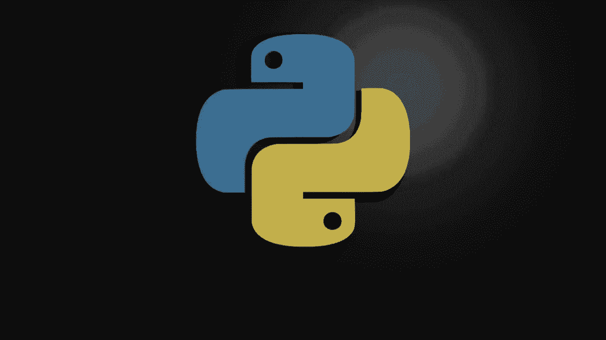
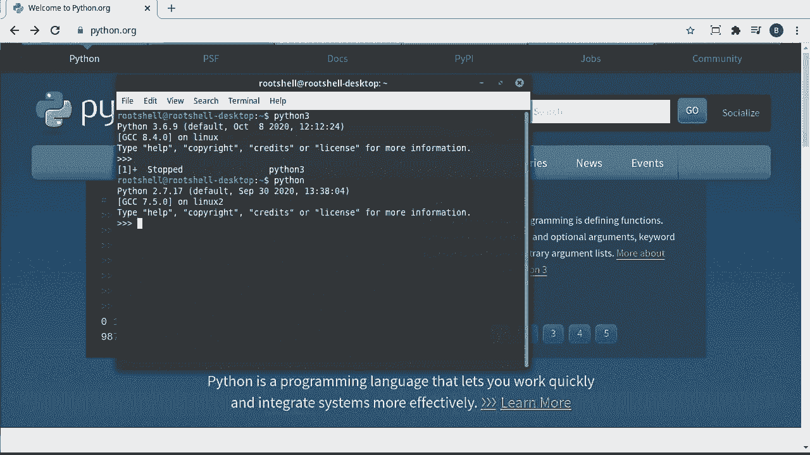
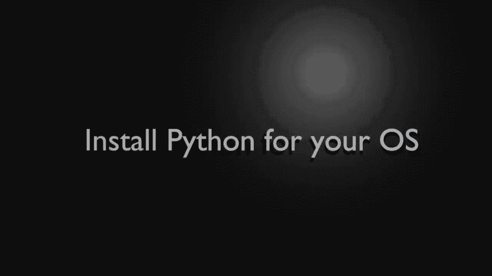
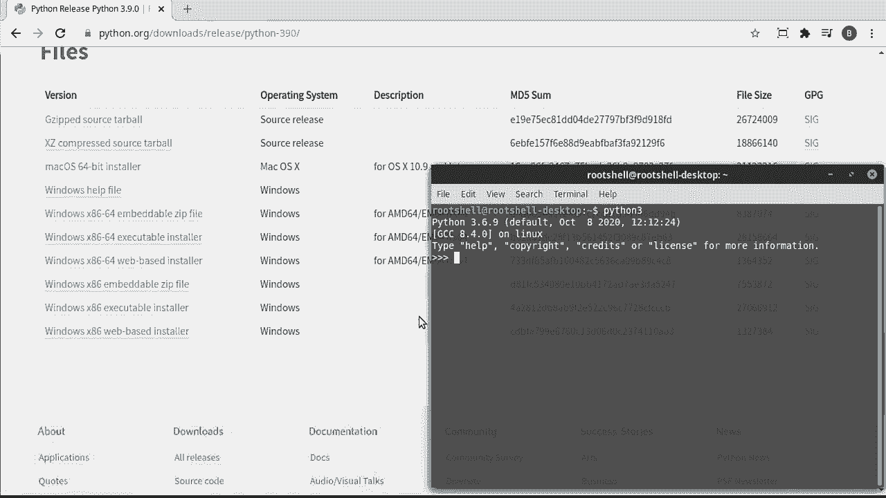
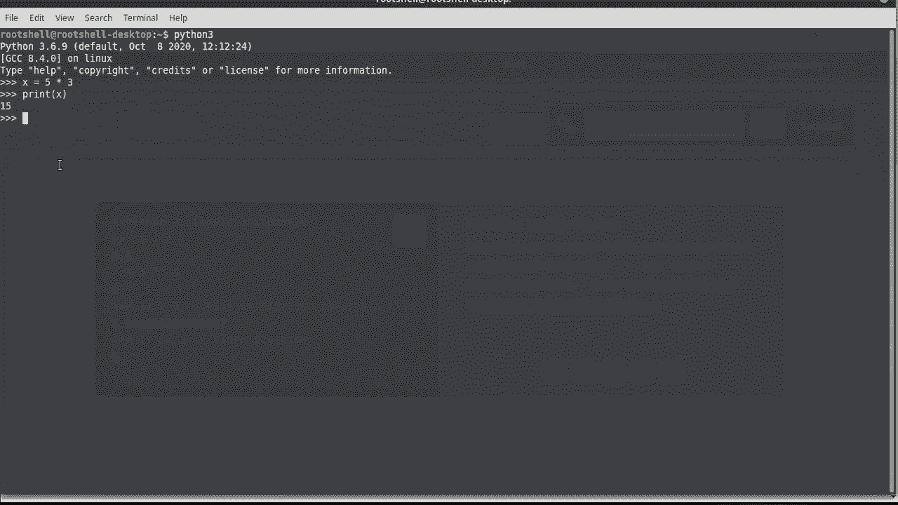
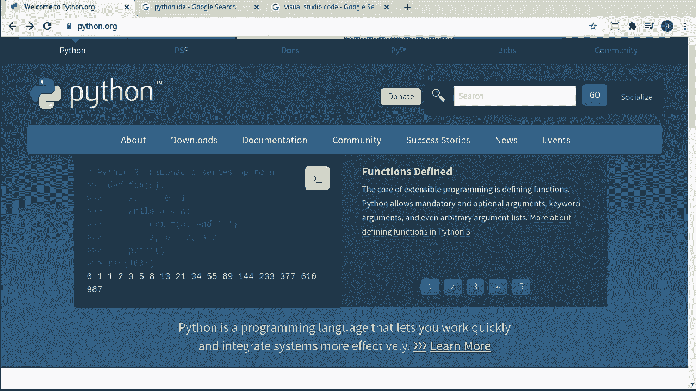
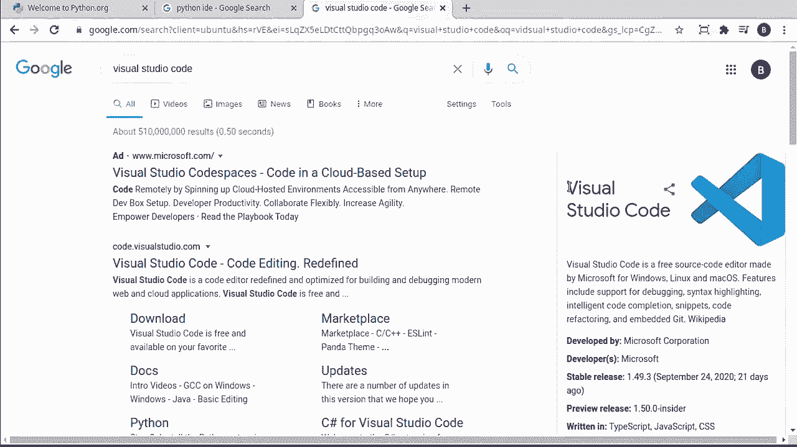
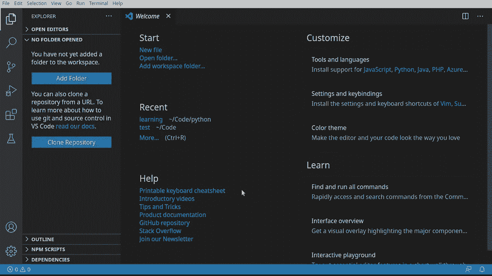
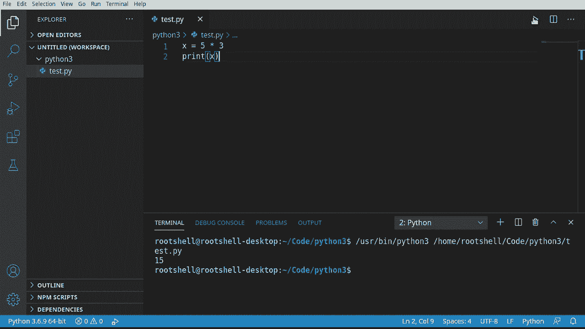

# 【双语字幕+资料下载】Python 3全系列基础教程，全程代码演示&讲解！10小时视频42节，保证你能掌握Python！快来一起跟着视频敲代码~＜快速入门系列＞ - P1：1）Python介绍和设置 - ShowMeAI - BV1yg411c7Nw

Everyoney everyone， my name is Brian， and we're gonna to learn Python 3。 This video series is aimed at the complete beginner。 So if you have zero programming experience。 this is what you need to watch。 Now， we're going to start off in this specific video with how to install configure and test Python 3。 and I'm going to try to make a video a week。 So definitely check back often as I'm going update this series as fast as I can。

😊，Let's dive in。Okay， the first step is very simple。 Check to see if Python's already installed。 Now。 you can and probably should use your operating systems documentation to figure out if it's installed。 but a very， very quick way is simply bring open a command line。You don't know how to open a command line， I highly suggest you go out to Google and learn how to open a command line。

 it's not super hard and once you get to this point， type in something like this。Aan。3。If you see this right here where it says。Python， and then some version。 it's already installed and ready to go。 and you can simply skip the next step。However。 if you don't see this， if you get like command not found or unknown command。

 then you're going to have to follow the next step and actually install Python。 Special note。 a lot of documentation out there。We'll say type the word Python。 This is the older version of Python。 This is Python 2。

See right here， done Python2， we're going to be working with Python 3。

Okay， assuming you ran a command line and tried Python 3 and got a big fact command not found or command unknown。 you need to install it， go out to Python。org and then go to downloads。

From here you can either click all release or you can go into your specific operating system。 we're going to go to all releases， it will try to auto detectect what you're doing。 however you may need to pick your operating system。The vast majority of you are probably going to be on Windows， so I'm just going to click on Windows。

Then click on Python 3 release the latest one， notice this is a Python 3， not a Python 2。And scroll all the way down。They've kind of got these jumbled up together。 you notice it how you've got， you guessed it， a tar ball， something for Mac。 and then stuff for Windows Windows has the vast majority of the options and this is why it gets a little bit confusing。

Honestly， I'd go with this one。 Windows X 86 64 executable installer。 That's going to be an offline installer it's going to have everything you need to run。 or at least it should。 You're going to download that executable and run it。 You may be prompted to run as administrator and you may have to restart your computer when you're done After you're done installing。

 you will definitely need to go back and double check。 You should be able to open a command line and type Python  3。If you cannot get to this step。 you may have to go to Google and look for your specific error message to figure out what's going on。

Now that Python's installed and configured and we can bring up a command line and type Python 3。 we need to test this thing out， make sure it's actually working the way we expect it to。First things first， I'm just going to drag this up like this to take up the rest of the screen。 And we're in what's called the interactive shell or interactive mode。

 We are not going to be using this very much because， well， it's a bit cumbersome。 If you make a spelling mistake， it's impossible to go back and fix it。So we're going to use an IDE。 but right now we're just testing， I want you to do something like this say。X equals5 times3。Now we're going to type the word print。And then， let's say X。Notice that's in brackets。

 so we're going to cover all this later right now we're just simply testing。You should see 15 on the screen。To be brutally honest。Pyping Python 3 and even seeing the version is really the true test that this is working。 However。 I wanted to show you there is an interactive mode if you want it。Again， though。

 it's really hard to go back and edit configure and you're going to make mistakes。 so we're not going to use this at all。 we're going to use an IDE or an integrated development environment。 which we're going to cover in the next step。

When talking about integrated development environments， well there are tons and tons of them。 if you just go out to Google and type Python IDE， you're going to get well。

Millions and millions of results because there's just literally thousands upon thousands of IDs。To be brutally honest， you don't need anything fancy， you can use a simple text editor。Really。 what an IdeE is is a very fancy text editor with a lot of functionality built on top of it。You'll probably find a lot of documentation that says iddle comes directly with Python that's not really true anymore。

 You got to install it a little bit separately。 and personally I don't like it。 I don't think it's the greatest Pycharm is another good one。 but we're going to be using something called visual studio code。 and I know a lot of folks really are not Microsoft fans。

 you're not forced to use this it's what I'm going to use for this series and without warning I may change IDs halfway through just depending on what I feel like coding in because Python makes it super easy to do that。

The reason why I'm using Vi Studio code is， well， it's very simple。 it's very straightforward and this is what it looks like。

So all I'm going to do here is I'm going to just add a folder。

I'm going to go into Python 3。Close this out。 Now I need to add in some extensions。 and this is what I love about Vi Studio code。 is you can extend this to work with just about any language。 So I'm going to say Python。And you see， there are tons， and I mean。A lot。 I could just scroll down forever and ever。To like infinity and beyond kind of forever。 I mean。

 there's tons of extensions， but it does a good job of putting the best ones right at the top。You can see this guy right here。From Microsoft，26 million views，5 star rating， you just simply go。 okay， do you actually need it， That's a good question。 because you could go through and spend hours just installing all of these and not know what you really need。

 So we're going to take a short detour。 Go back here。This is simply the folder we opened。 I'm going to say new file。 and let's call this test dot P Y。And it automatically recommends extensions for us。 a Python file will end in dot PY。So it's detecting that extension and saying， hey。Do you want to use the recommended extensions。

 so I'm going to say， you know what， why not？And it's going to automatically go out there and install them。And that's going to say， installed。And it's used globally， there we go。 and we can even click this little gear icon and play around with it。If we really felt like。Let's go back to our file or we can use it up here depends on how you want to get there Now this is my only real criticism of visual Studio code is it does tend to clutter the UI a little bit。

 so occasionally you'll see me closing things out。And I'm just going to， well。 start using this bad boy。Okay， to wrap this video up。 we're going to make what's called hellello world。 This is kind of the obligatory first application you're going to make in any programming language。 It's actually a rite of passage for programmers。 and it is very simple is just printing out the words hello world on the screen。

 And this is where we're gonna to hit some stumbling blocks if we're not fully configured。 So what you should see before you is everything we've done so far， you should have your IdeE。 whatever you're using， even if it's just a simple text editor。 and。You should have a blank file called test。pyy， the name's not super important。And。Last but not least。

 you should see the Python interpreter。 I have Python 36，9。 You can actually switch to different ones if you wanted to just be aware that you can use different versions。I'm going to type the word print。And then we're going to give it some brackets。 anything in the brackets， it's going to try to print。Now with Python。

 you can use double quotes or single quotes。I have a habit of using double quotes。 but it really doesn't matter which one you choose。And then type the words， hello and world。Click save。Now you should have this little guy right here that says run Python file in a terminal。 if not， you can go up here， you're going to have a few options。

 start debugging and run without debugging。Immediately， if you're a newbie。 you have no idea what those means。 Debugging sounds really， really bad。 So what does this really mean， Debugging is a special mode in programming where if you have bugs or errors in your code。 it will walk you through them and help you fix them or more to the point point them out to you so that you can fix them。

Often， I'll run without debugging because it is a little bit faster。And you should see something like this on the screen， Hello world。All of this stuff looks really nasty， but really what's going on here is you have your installation path for Python 3。 and then you guessed it everything that it's doing in the background。

 it's calling this launcher and it's saying run this script。 The end result is this。Now。 because I'm not a huge fan of Hello World because it's so overly simple， let's actually。Get rid of that。 And we want to go back to what we did。 the interactive shell。 where we're going to say x equals 5。Times。3。What we're doing is we're making a variable and we're going to talk about variables in the next video。

 but what we want to do now is just simply print this out。Save this and I'm going to go ahead and run。

And you see， theres 15 right there。