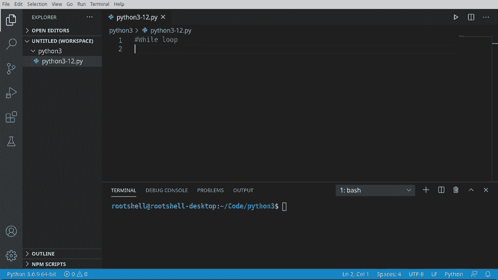
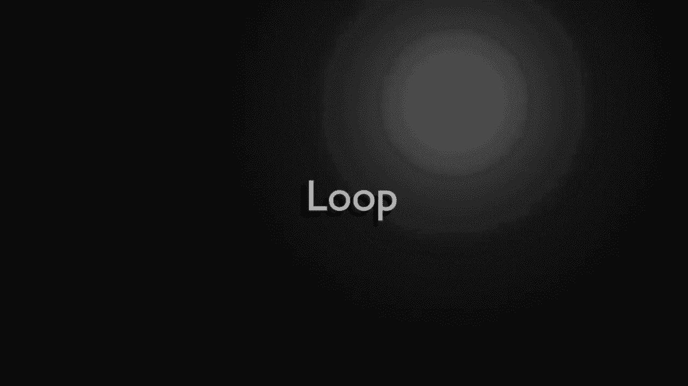
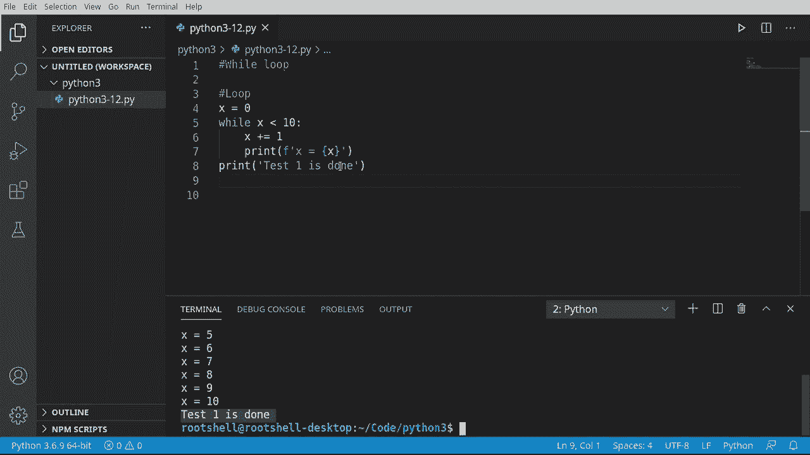
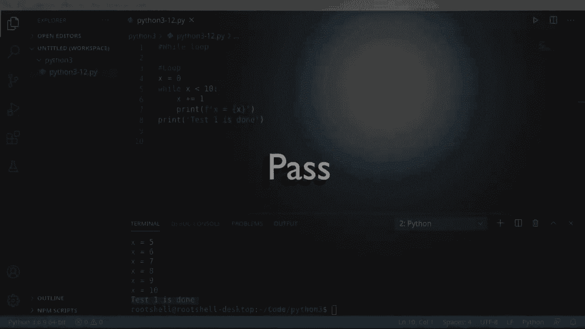
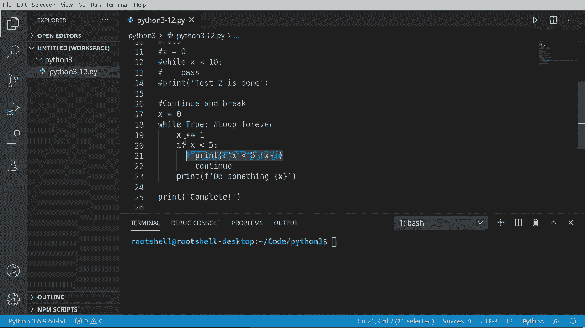
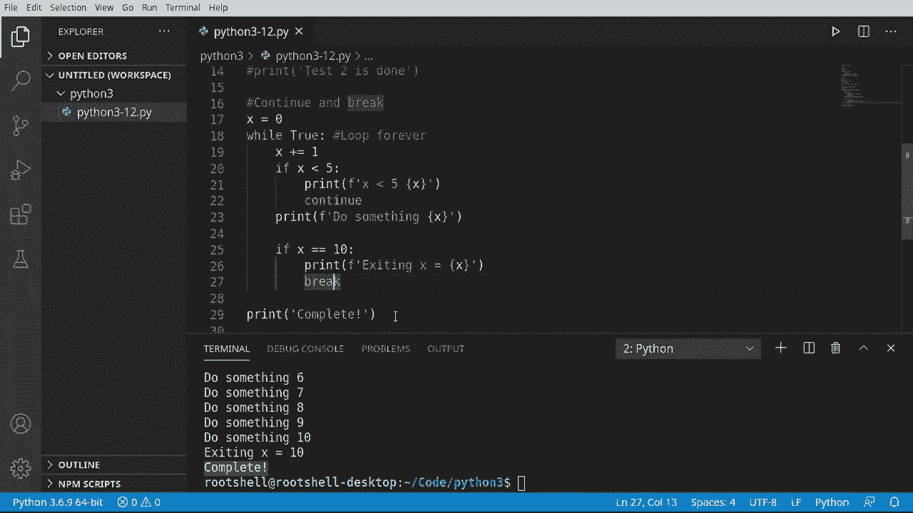

# 【双语字幕+资料下载】Python 3全系列基础教程，全程代码演示&讲解！10小时视频42节，保证你能掌握Python！快来一起跟着视频敲代码~＜快速入门系列＞ - P12：12）Python流控制：While 循环 - ShowMeAI - BV1yg411c7Nw

Welcome back everyone， my name is Bryant， let's continue our journey into Python 3。

We're going to talk about the while loop。 This is basic flow control。

 and it's going to prove a point your computer is very stupid。 And yes， I said what I said。

 your computer is just very dumb， and we're going to prove that。

So a loop is just simply completing code over and over and over again until you tell it to stop because the computer isn't smart enough to know when to quit。

Let's take a look。

Okay， little bit of theory here before we move on， we have the entrance of our program and we're going to jump down into some sort of loop。

Let's call this our loop here。And it's going to evaluate this and run some type of code。

 Now it doesn't really matter what type of code it runs。Let's get rid of that little guy。

Usually what you're doing is some sort of incremental function。 for example， count something。

 increase the number， look for data on a socket or something like that。 So it's going to say， okay。

 start the loop。So I want to connect there， there we go。And do something。If。You don't exit this loop。

 it just literally goes right back into the loop， and your program ends up looking something like this。

We call this an infinite loop where you will enter the program， go into a loop。

 and then you just loop this code over and over and over again until you tell it to well。

 stop and do something else。You may be asking yourself， why do you even need a loop。

 well think about it。You enter your program。 You come down into your loop。

 and let's say you want to do something 100 times。 You need to now increment some sort of counter。

 Once you've hit that counter， you jump out of this loop and you stop your code。

There are some loops out there that are intentionally infinite。

 And what I mean is they look like this。The program starts， you enter your loop。

 and then it just loops forever。For example， when you in and do graphic user interface programming。

 you have what's called the user interface loop or the event loop。

 which is basically the program will run forever waiting for the user to like click a mouse or move something around。

That loop just happens forever and ever until the program closes。

All right， now that we understand what a loop is， Let's take a look at it in practice。

 So I'm going to say x equals 0。 and we're going to create our while loop。

And this is going to look very similar to an if statement because it's going to evaluate it just like an if statement would。

 Mean this loop will execute as long as the condition we're about to give it。 It is true。

 Some say act of lesson than 10。Then do something。 And this is going to be a great example of how computers are dumb。

 They do what you tell them to。As you tell them to do it。Little bit of bonus。

 Any see a problem with this statement。 But what we're saying is x is 0， while x is less than 10。

Prennt this， but we're never incrementing X。 It's always going to be 0。 So this will always be true。

 and it'll just run forever。 That's the infinite loop I was telling you about。 See how it just says0。

 And it's going to run forever and ever。 And that console is just going crazy。 somebody kill it。

It will just keep going forever and ever until I turn the program off or until I shut the computer down。

 so we need to actually increment X。Once we do that。We have now incremented our counter。

 eventually x will。B10 or greater， and this will exit out。One through 1 works is expected now。

So loops can be very powerful and very easy to use。

 but you can very much screw up your application just by creating an infinite loop on accident。Now。

 in case you're wondering。Go ahead and print this out here。 and we're going to say。Next one is done。

We want to know when this loop is done executing and we use。

 you guessed it the indentations this determines our scope or our block of code。

So while this condition is true。Execute this scope or this block of code。

 Then when we're done looping， we're going to jump right back up here。

Let's see that in action I'm going to clear that out。Sure enough。

1 through 10 and then test one is done， so it works exactly the way you think it would。

Let's take a quick detour and talk about pass。 You're going to see this quite a bit in Python land。

 and a lot of people don't really explain it。 So let's just say while。

And let's just take this little template here。And it's going to say。While expression pass。

But this is a valid Python expression。Go say。0， and let's just give it the same logic here。

Notice how this will run。Now what's going on into the hood is this is still。Functioning。Or is it。

 Let's find out here。Im going kill this terminal just in case。Well say test2 is done。So x0。

 while x is less than notice how we never increment it like we did in this guy， we're going to pass。

And then eventually print out test 2 is done。 Sa run。 Notice how it says test 1 is done from up here。

But it never gets down to test， too。So what's going on under the hood， this script is still running。

 It's just doing an infinite loop right here。 So whenever you see pass inside of a loop。

Be very careful because you're creating some sort of infinite loop。

Pass is a special keyword in Python that tells Python。

 take no action and just continue with what you would normally do。

So be very careful with pass。

We just covered that pass as well， pretty dangerous in a loop。

 simply because you can loop forever on accident。 Well， it's not that simple under the hood。

 but we're going to try and make it simple。 and we're going to talk about continuing and breaking。

 So we're going to say x equals 0。And let's go ahead and do something really， really terrible。

 We're going to say， while true， do something。If you're paying attention。

 you know that while is going to evaluate this much in the way an if statement would。

 and it's going to say if this is true。Do the loop and keep doing it over and over until this is no longer true。

However， we've used the Python true keyword， so this will now loop forever。

And you will actually see this out in code because sometimes people just want to loop until some arbitrary condition is met。

 It could be input from the keyboard。 It could be some network connection。 It could be anything。

 you're going to see this a lot。 So you'll need to know when to break out of the loop or how to handle certain conditions。

 So let's talk about continue first。We're going to say x plus equal goess1。And if x is less than 5。

We want to。 Well， just kind of skip over this。And we don't really want to do anything。

 So I'm just going to say x is less than 5。 whatever the number is。 And then we're going to continue。

And what Conin does is say go back to the beginning。

 just continue along your merry way and do what you were going to normally do。

And then we're going to add in some sort of logic。 So if x was greater than 10。We would do something。

Print that X out。 And we're going to put a print statement at the very， very end of this。

And notice this is on the same line as while。 So this will not print out until this loop is complete。

One thing I love about VS code in most editors is you can actually collapse。

 so it actually looks like this。So once this loop is done， it'll print complete。

 let's go ahead and clear this out， see this in action here。U， oh， you notice how。

It's working exactly as we expect it would， because。The computer， while very fast， is very dumb。

So what's going on here is it's going and saying if x is less than 5。

Brnt it out and then just go back to the beginning， so we're still in continual loop land。

 we need to fix that。

So our programming logic， we want to basically say if it's less than5。

 just go back to the beginning of loop and keep incrementing that counter。 If it's greater than5。

 do something but we also want to stop when we hit 10， so I'm going to say if。X is 10。Pnt。

And then x equals。Just so we can see that x is actually at that value。

Now we're going to use the brake。E word about。Don't worry， we're not breaking anything。

Break is like kind of think of the wild loop， this guy。As a little jail cell。

 and we're going to break out of jail and just jump right to the next line。

So it's going to pick up code execution right here and then it's going to run this statement。

Go ahead and see this in action。Okay， sure enough， we've got。X is less than 5。 We've got 1，2，3，4。

 and then do something，6，7，8，9，10。 And then when we hit 10， we're going to exit， and we are complete。

So that is looping in a nutshell。So major takeaways from this video is well， loops are very。

 very powerful， but you need to have some sort of condition to evaluate。

 otherwise you're going to create an infinite loop。

An easy way to create an infinite loop is just simply pass and it will loop forever。

And you can say while true， which will also create an infinite loop。

 but you can use continue to well， continue to use the flow inside of the loop or break to break out of that flow and use the programming logic。

