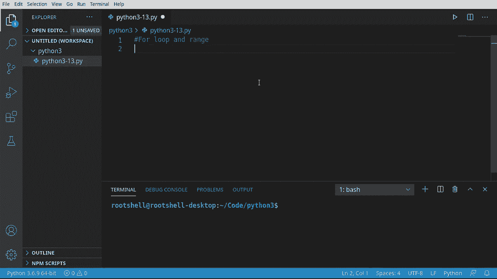
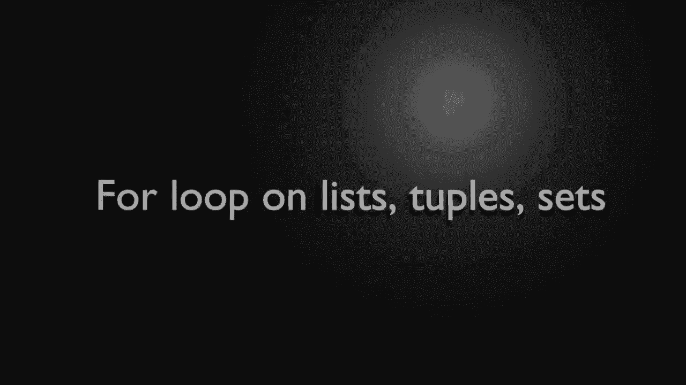
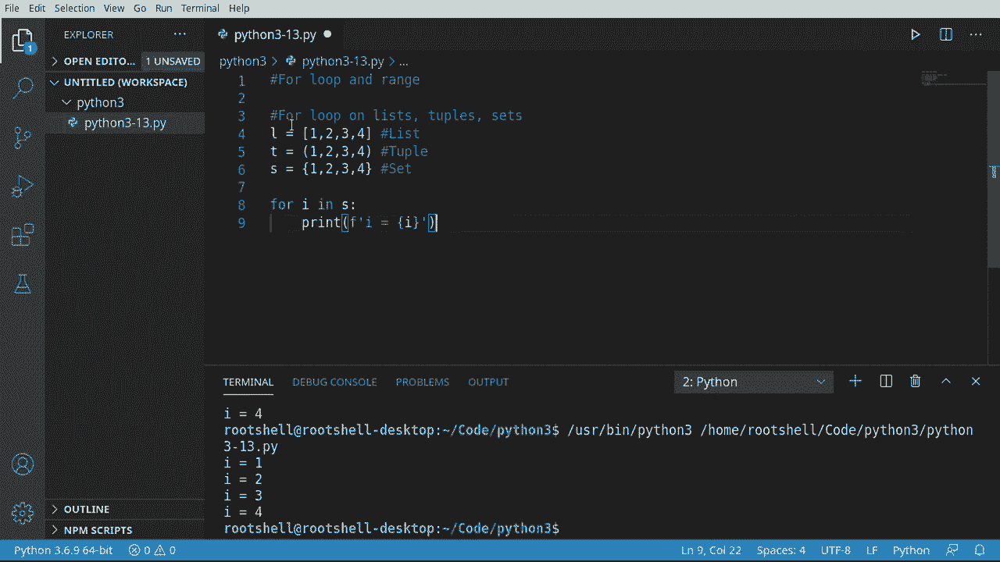
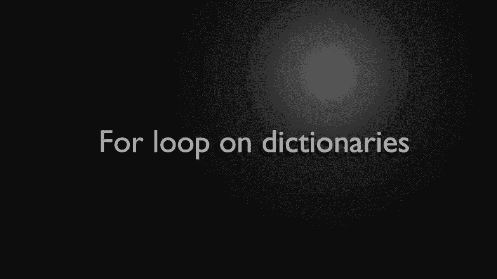
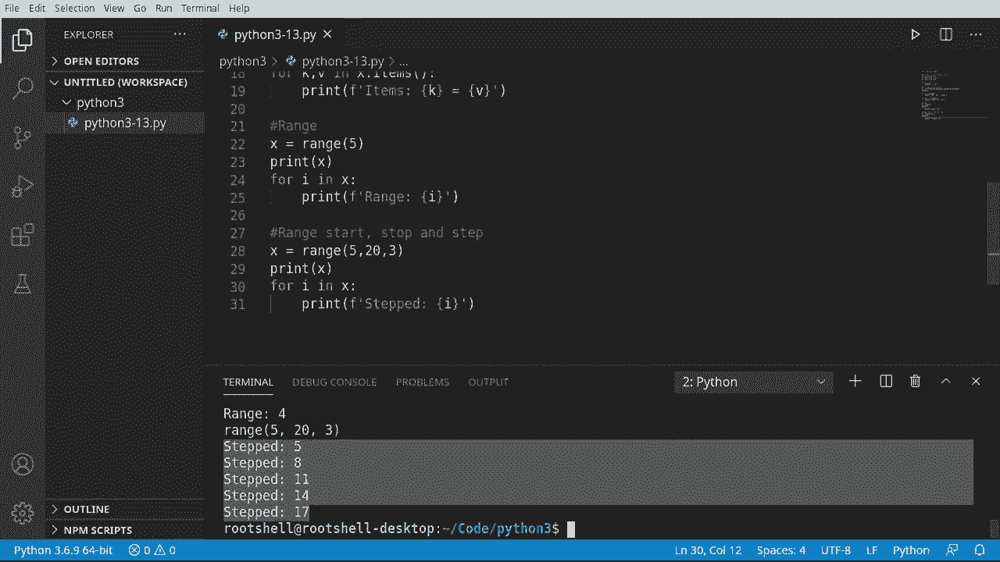

# 【双语字幕+资料下载】Python 3全系列基础教程，全程代码演示&讲解！10小时视频42节，保证你能掌握Python！快来一起跟着视频敲代码~＜快速入门系列＞ - P13：13）Python流控制：For 循环 - ShowMeAI - BV1yg411c7Nw

Welcome back everyone， this is Brian， this video we're going to talk about the for loop and the range function。The difference from the for loop。Compared to the while loop。 which we talked about in the previous video is the for loop has a beginning and an end。 and the range function helps us create that beginning and end。

Really helps us to just avoid that nasty business of infinite loops。 Let's dive in， and take a look。

All right， first thing， Spts， let's go ahead and look at the for loop on list tuples and sets。 This is super， super ridiculously simple。And I'm just going to make a simple list。And we're going to say4 I in。 notice what we're doing here。 though。 We're saying4。 and then we're creating a variable。 and this variable is named I。 You could name it X， Z，zebra。

 whatever you wanted to name it。 I'm just going to say 4 I in。 And now we have to give it some sort of container。Let's say x。And then the colon。This reads just like the while loop， but we are now creating the variable in the statement itself。What we can do now is just simply say print。And let's say， ae。

And we're going to print out the value of I。Go ahead， run this。You see I 1，2，3，4， and it stops。 We don't have to tell it to break or to return or to do anything like that。 And we don't have to increment some sort of counter。 It Does it force us under the hood based off。 you guessed at the length of this list。 So it's taking this iterable container。

 and it's saying each one of these is now a separate variable。 And we're going to treat it independently。 And you can do this ridiculously。Fast， and you can do it。Across different types of things here。 So for example， think I made one too many。We're going to say list tuple。And a set。And we're just going to say this is L。This is T。

And this is X so we've got。Wtuch of different things here。 And let's actually。One of the little nuances of this is you got to have it in the right style bracket here are this as the parentheses。 And the set has a little weird， squiggly thing。There we go。And we can just switch this out。 so I'm going to do the list。Works as expected。 Let's switch this out to the topple。

Works is expected。 and I know you're already probably rolling your eyes going。 We know。 we know the set's going to work just fine， and it does。 Everything works as advertised。 This makes it just ridiculously easy to loop through a container。

Let's take a look at the for loop in regards to dictionaries。 We're going to treat this a little bit differently here。 So I'm going to make a dictionary。 and I'm going to say。Dickt， and let's just go ahead and build this out。Brian。 I'm going to say my age is 46。Say Tamy。Don't tell her I put this in the video。 should get very mad。

 but she's 48。And then Heather， let's go ahead and say Heather is 28。And Chris。 let's just say Chris is 30， we could add more if we really wanted to。So we have our beautiful dictionary here。Go ahead and print this out just so we can see what it looks like。And it creates a dictionary for us。 Now， we're going to work with this in regards to the looping。

 When I say the looping， there's a couple different ways we can do this。 So the first way。We're going to say 4K。In X dot E。A gotta be a little careful here， if you forget。To call it as a function。 And we haven't really covered functions yet。 But trust me on this。 If you just do this， you're going to have a bad time。

 And let's actually see it fail just to prove that a， it is going to fail。And we're going to say he。Okay。Equals and then we're going to fill that out later。 But let's just watch this thing fail。 See built in function or method object is not iterable。 what what is going on here。 What does this mean plain English built in function or method。Well。

 we haven't really covered these yet， but basically it's a chunk of code that we can call and to do that。 you need these parentheses。 so if you forget those you're going to have a bad time。And it says object is not iterable。 What does that mean， Well。 it needs to be a container of some kind， For example， a list tuple set or a dictionary。

 So simply by saying， hey， use those parameters， it's now going to return。Some sort of data that is iterable， which we can go through and work with。All right。 let's continue on。We're going to say x。And we want to get that specific key。 and I'm going to just assume you watched the previous videos， but just in case you skipped them。

 let's slow this down just a smi here。For6 first， we need to fix our little error there。So what's going on here is we are creating our dictionary， a dictionary is just a key value pair。K value， key value， key value， and you could see that in the dictionary right here where it's created those key value pairs。Now， we're going to say for each K or each key in our dictionaries' keys。

It's going to return back some sort of list， we're going to say for each one of those。ge the values。 We're saying x。so really what we're saying here is。X is a dictionary。 K is the key。 So we're saying for whatever key， for example， if it was Tammy。 it's going to say print out Tammy because that's the key and then print out。The actual value here。

 which is that right there。 So each key is going to correlate to a values。 what I'm trying to really drive home here。 Maybe I explain that badly。So keys。 and then you got your key value， key value， key value。There is another way of doing it。And I wanted to bring this up simply because you're going to see people do it both ways。

So we're going to say for Kma B。And this is going to blow your mind。 if you're coming from another language。 We're going to say two different variables here。 key in value in。 we want to switch this out to。Items and again。 we're calling a function so we need those parentheses there if we forget those。

 we're going to have a bad， bad time。And because we are now pulling these or unpacking those。 we don't have to do this little bit here。 We can just simply swap that out with our variable。So what items is doing is well， it's actually pulling each。E value pair out and returning it。 So now it can unpack the key and the value。 So you have two different variables。

 See that in action here。 Let's save and run。 And actually， let's。All this items。 so we don't get that confused with the keys。And sure enough items。 And it is unpacked em correctly。 Brian 46， Tammy，48， Heather 28， Chris 30。So which ways better， Well。 it depends on what you want to do personally， I tend to do this method right here that way I don't have to mess around。

With all these little brackets remembering what does what。Each way is perfectly fine。Let's talk about range。 and we've touched on it briefly。 but let's really look at range。 So let's kind of quick review here。 We're going to say x equals。 and we want a range。Of 5。And if we print this out， this is where you're going to get really confused really， really fast。

 So let's go ahead and run this。And here's our x right here， range 0 to 5。 Wait what？

You're thinking this is going to return a list or something like that。 actually it's going to return a functionction call， so there's range 0 to5。What is this 0 to 5。 Where did this come from， We said 5。 Well we're going to look at that in the next little segment here。 But just understand what we're really doing is we're saying X is really going to equal a call to that function。

 We're going to color functions in depth in other videos。 It's actually a large topics。 So we're going to split it in multiple videos， but just understand what's going on here。 You're not actually getting some sort of iterable container that you can go through。But what we can do here now is something like this。Or I and X。

Notice how I don't have these parentheses。Because we are not calling a function directly。 We're calling a variable。You try to do something like this。 You're going to have a very bad time。 Just understand the difference between those。And then from here。 it just some becomes really ridiculously simple。 This is what I love about Python。

 Everything just becomes very simple to the point。 I'm almost embarrassed to just。Even talk about it。Because to me， because I'm an old programmer， it seems like just common sense。And there we go range 0 through 4。 So what's happening under the hood here is it' saying for I。 So we're creating a variable in x。 and this variable is actually pointing。To a function。

 So it's making this function call getting that value back， and then it's going through each item。Now， if that last little bit hurt your brain fasten your seatbelt range can get a little complex here。 so we have a start a stop and a step。What does this really mean， Let's go ahead and do this。 Let's say x equals。Range。And I'm just going to leave it here for now so we can read this and see what's going on。

We have stop int。 So that's the default。 But there's different ways of calling this。 You can do a start， which means the number you're going to start at a stop。 which means the number you're going to stop at。And a step。 meaning how many numbers in between those two you want to jump。

Let's take a look at this and see what it really looks like under the hood。 So let's say we want to start at 5。 We want to stop when we hit 20。 and we want to take three steps at a time。All right， pop quiz。 What is this going to look like。 Let's go ahead and print this out。If you thought it was going to say range 5， 23。

 you were absolutely right because beginning to understand here that this is pointing to a function。 not some sort of value。But we can actually work with it now that we've assigned it to a variable called X。Go ahead and say4 I in X。Remember， we're calling a variable， not a function。go ahead and print。Okay。 bonus round。 Who knows what this is going print out here， Let's see。Starts at 5。

 and then it goes to 8，11，1417， and it stops at 20。 notice how it didn't fire off a 20。If we said 21。 let's see what happens。Now， suddenly， it includes that。 So that's the major takeaway from here。 is it's not going to include that stop。 It's going to stop when it gets to there。Remember。 under the hood， this is using some sort of loop。 Its saying probably something that we've seen before like this while。

 and then act as less than 20。So when it gets to this 20。 it's just going to break out of that loop and stop doing it。Once you understand how this works。 it makes life ridiculously simple。 Something like this would require a little bit of math in other languages。 But Iython， as usual， makes it nice and easy。

