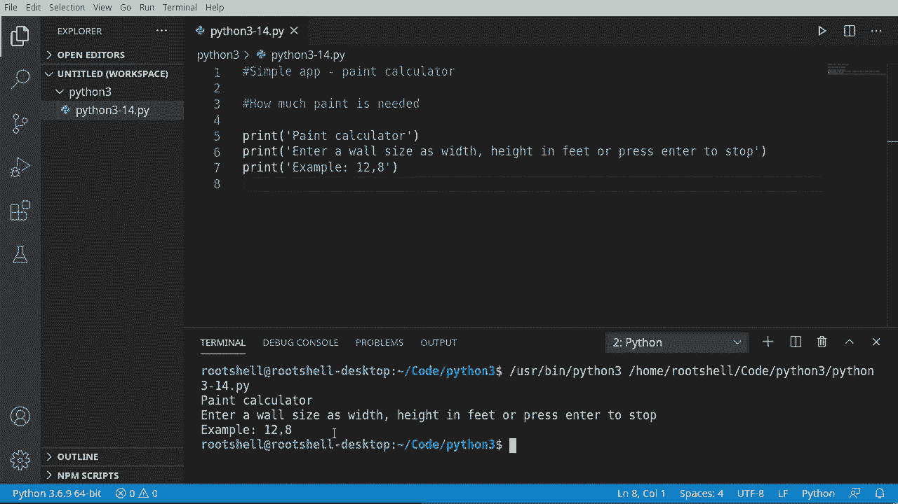
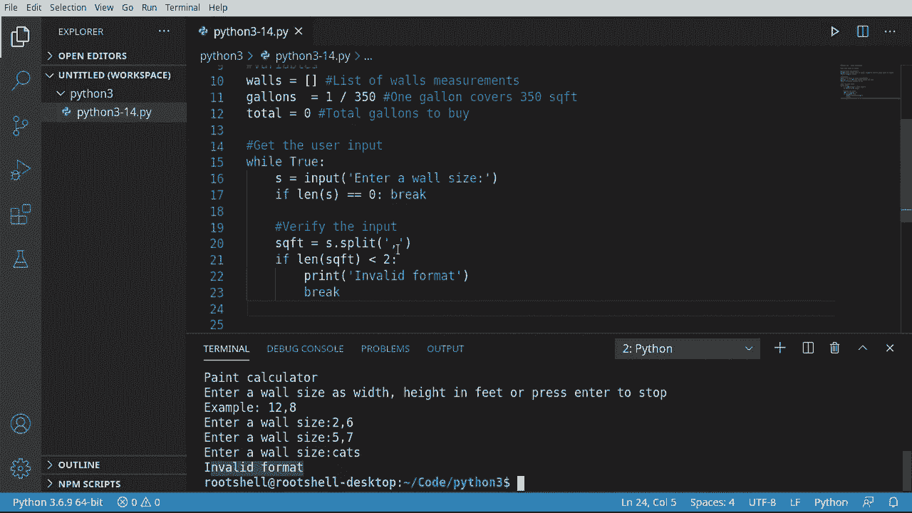

# 【双语字幕+资料下载】Python 3全系列基础教程，全程代码演示&讲解！10小时视频42节，保证你能掌握Python！快来一起跟着视频敲代码~＜快速入门系列＞ - P14：14）构建简单的应用程序：油漆计算器 - ShowMeAI - BV1yg411c7Nw

Welcome back， everyone。 This is Brian。 We're going to create a simple application using everything that we've learned to this point。 If you're just now tuning in， there are 13 other videos in this playlist you need to go back and watch if you don't know Python。

 but we're going to make a paint calculator。So we're going to determine how much paint is actually needed to paint a room。 When we run this， the user is going to be presented with something like this。 Paint calculator enter a wall size as width comma height in feet or press enter to stop for the example would be 12a 8。 No spaces or anything like that。 And they can enter as many walls as they want。 And at the end。

 this is going to magically tell them how many cans or how many gallons of paint they need to go by。 Let's take a look。😊。

First thing we need to do is well set up some variables。 So we're going to make a list called walls。And this list is going to exist just to hold the measurements。Second thing we're going to add is gallons。This is going to be。 Well。 how many gallons of paint per square feet。 And I'm not an expert。

 but I did go out and look this up on Google。And according to Google，1 gallon of paint。Covers。350 square feet。I question that because every time I have bought paint。 I have never bought enough and I've had to go back to the store and get it。 maybe this application will helpless。And then total is going to be the total number of gallons of paint we need to go by。

We're going to use this later。Little gallons to buy。So far， our application does absolutely nothing。 but that's about to change。 We are going to get the users's input。 and we haven't talked about this yet。But we're going to make a wild loop。 And we're going to say wild true。 And you may be going oh， whoa， whoa， whoa。

 You're making an infinite loop。 That's true。 We're going to break out of this。 And I'm going to show you how。So we're going to get a variable。And we're going to use the built in input functions。 there's different ways of doing this。 but we're going to use input。And I'm going to say enter。It wall size。

Then we're going to break out of this， if they don't really enter。Any data， So I must say Ly。Of S。The zero。Then we want to just call break if you're kind of questioning what any of this is。 go back and watch the previous 13 videos that I've done on this。So let's go ahead and test this out。We're going to run this。 and it says inner wall size。

 She knows how our programs just stopped and waiting for us。 Well， I'll just enter some garbage。 I must say cats。And it wants another。吃。And another fish。And then I'm just going to hit enter。And sure enough， it exits out。 So that is the correct way of using an infinite loop to gather user input and to test when we need to break out of this loop。

Now that we can get the user input， we need to actually do something with it。 And before we try to do anything with it， the first thing we should do is， well。 verify that what the user gave us is actually what we are hoping for。 We could have a very bad time。 Remember， this whole thing started with the example of 12a 8。 Well I entered catstocks fish。

I'm not sure how you would calculate the square footage of a cat。 but I'm sure it would be interesting and probably involve a trip to the vets。 but anyway。 so we're going to say S QFT equals and we're going to say S that split。Because。The S is our variable we got from the input function right up here。And it's going to be a string。

 So we can treat this as a string and say， a split。And we want to split this。On the comma again。 if you have not a clue what I'm doing here， watch the previous 13 videos， but anyways。 String has a built in function called split which you can return multiple values based off a character or sequence of character。So our square footage is going to be。To return value from that split function。

So first thing we're going to do is make sure we actually have two values in there。And if it's less than two。Well， we want to tell the user something bad happened。Brench。It's go ahead to say， invalid。Format。And then we're going to break out of here。Now remember break doesn't really care where it is， it's going to break out of this loop。

 Let's go ahead and test this out here。So we're going to run this。 and it's going to say inner wall size。 and I'm going to say。Okay，2，ma 6， it's working good。5 comma 7。 and let's enter some garbage cats。Oh， in valid format and it stops a loop and exits the program。 so it is actually testing to make sure there are two items that is split on a comma。

All right， we're not done yet。We need to now that we've gotten the user input。 convert it because remember we're working with strings and we want to work with numbers。Specifically， we want to convert from a string to an integer。And this could lead to a bad time。 And we're going to demonstrate that。 So I'm going to say W equals。 We're going to call n。

 and we're going to do something called casting。 And I'm going to do a whole video on this later。 But when I say casting， just think of a wizard with a magic wand who is going to cast a spell and turn something into something else。 So what we're saying is we want to。Cast a spell Ald int。 which is going to convert whatever we give it into an integer。And in this case。

 we are going to get that first value。Out of square footage。Go grab this。Give it the old copy paste。 well a little too much copy paste。And。Let's get the other dimension。 so we now we have the width and the height from square foot0 and square foot1。Interesting bit。 if we try to do this and it's not actually a number， we're going to have a bad time。

 It's going to actually air out and our programs going to stop and die a horrible death。 And I'm going to cover how to handle all that in another video。 The whole point of this program is to do a program with what we've learned so far in the 13 videos。Now， I'm going to say item， and I want to make a list with the width and the height。

And we're going to add that to our walls。 If you're wondering where I got walls from， remember。 it's way， way， way up here in our variables， just an empty list。So we're going to say walls。And。let's go ahead and add that item in here。So now we have a list holding。The wall dimensions for every single wall that they add。

 let's go ahead and just print that out just to verify， hey， we did something。So， adding。哦。😮。Go ahead， save run and let's test this out， so inner wall size。Al right，3 by 6。 It's a very small wall。 and it says adding wall。 All right， great。 So 8 by 8。Let's go ahead and say 9 by 12。 Now， let's test out this conversion right here and watch it die a horrible death。

 So I'm going to say two by cats。Oh， and valid literal for int with base 10 cats。And this looks very ugly， and it is。 It's a value error。 We're going to talk about errors in a future video。 I just want you to understand if you get a value error。 what's going on is we're basically saying we cannot convert this。To a number or specifically to an int。 Remember， think of a wizard with a magic wand。 and we are casting a spell called int， which is going to convert whatever we cast on to an int。Once we've got to this point， the only thing that's left is to really just crunch the numbers and tell them how much paint they need。

 So what I like to do is just tell them what they entered。 So we going say F。You entered。That way。 if there's any discrepancy， I can say send me a screenshot of the app and I can say show， oh， no。 no， you screwed up， you entered the wrong value here。And then we're going to say 4 M。 M's going to be for measurements in walls。We're going to say the width is going to be M 0。 Remember。

 it's a0 based index。 And inside of our walls， we have created another。List here。 so we're getting this guy the width。And we can say H。One。 remember zero based index that always trips newbies up。Now we're going to get the square footage。 so I'm to make another variable called S。 I'm going to say that simply the width finds the height。

Now I want to get some sort of value。 So I'm going to say this is the S or the square footage。Times。 the gallons。As you're wondering where gallons magically appeared from。 Remember。 it's all the way up here in our global variables that we created。 I did Google it。 One gallon should cover 350 square feet， so。😊，This value right here is one divided by 350。

Not a clue if that's accurate， I highly doubt it， even though I do trust Google。And then we're going to grab our other global variable total。I want to say plus equals B。 so we're just incrementing that。As you're wandering plus equal。 we did cover this in a previous video。 It's basically， we're saying total equals total。Plus。

 the value， but we're just shorthanding it。Now we're going to drop down and go inward。 We're going to dent。In so we're dropping out of this code block right here。And we're going back to the main。 And we're going to say Prince。We're just going to tell them you need to go buy some paint。

 And this is how much paint you need to go buy。You need to buy。 Let's go ahead。 And if we just say total。It's going to give us some crazy number。 So what I like to do is make it a little pretty。 And I'm going to say round。And we're going to round the total by two decimal places。冇嘅。

Tell them you need to go buy or many gallons of paint rounded to two decimal places。Let's go ahead and test this thing out and see if it works。 So I'm going to say。12 by 8。And let's make another one，15 by 9。 Actually， let's make it by 8。 That'd be weird if the ceiling was different height。And let's go ahead and say we have an 8 by 8。

And a4 by 8， just kind of a weird shape room。And then I don't want to enter anymore。 So I'm just going to hit enter and you need to buy。One gallon of paint。 basically it's going to use less than a gallon I should have some left over。I don't know how accurate that is。 And honestly， I'm kind of looking at my little office here going。

 I think it's going to take more than a gallan to do this。 So when in doubt， blame Google， but。The major takeaway from this video is。Even though we're only 13 videos in and we've really just scratched the surface of what Python can do。 you can make some pretty interesting programming logic。We just did a simple application。 which is a paint calculator telling us how much paint we need to buy。

We're letting the user enter any number of walls they want。 We are verifying that user input。 and then we're converting that input into the correct data type。 and then we're calculating how much they need and giving it back to the end user。

