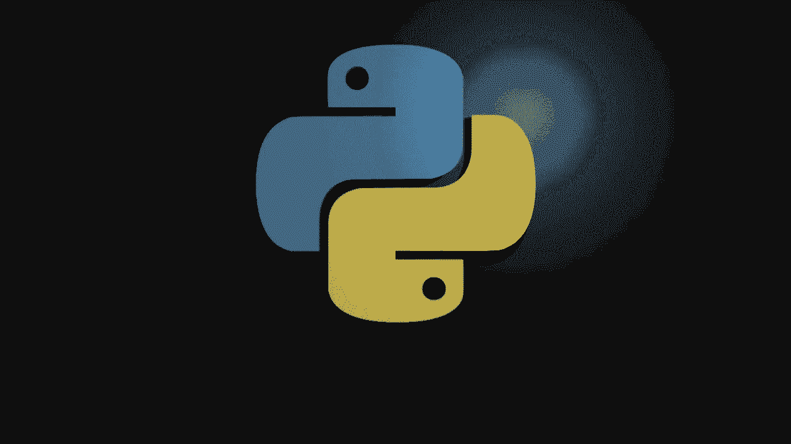
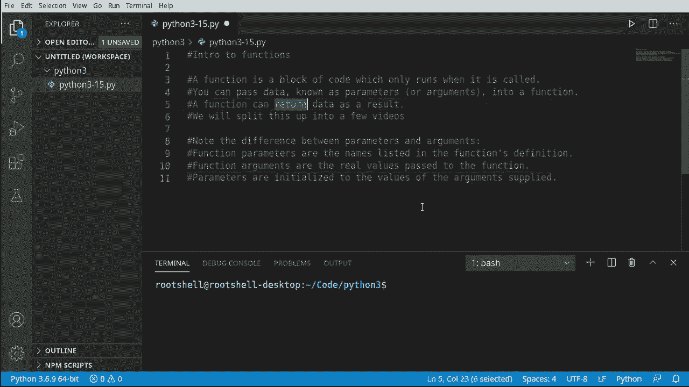
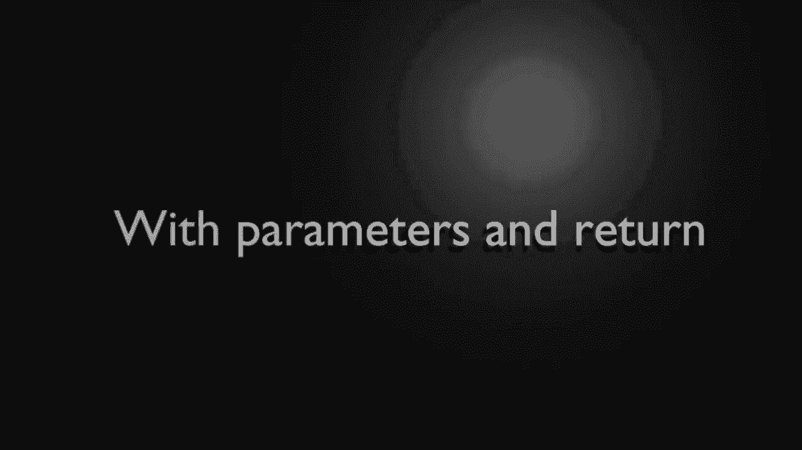
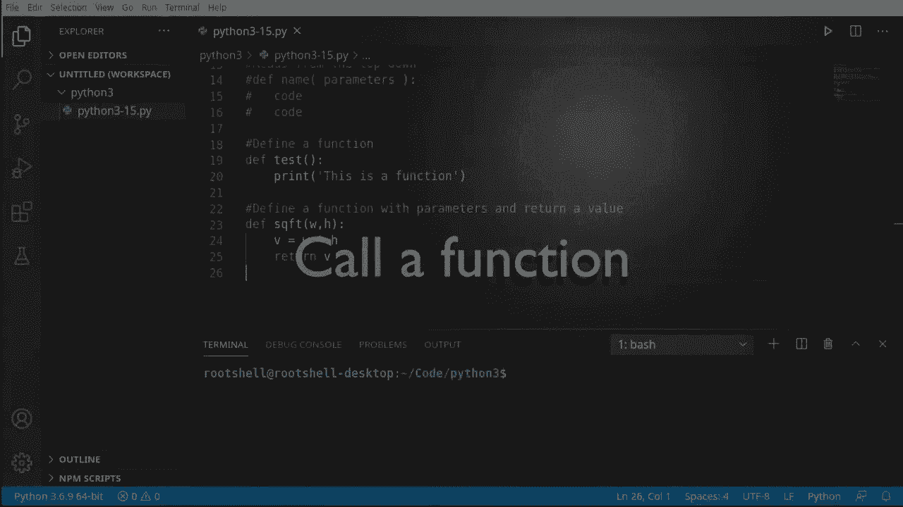
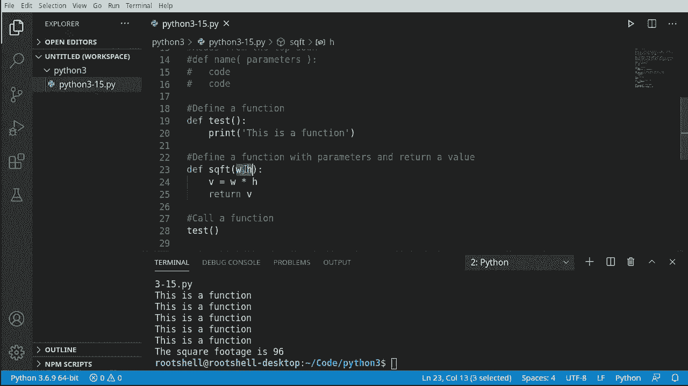

# 【双语字幕+资料下载】Python 3全系列基础教程，全程代码演示&讲解！10小时视频42节，保证你能掌握Python！快来一起跟着视频敲代码~＜快速入门系列＞ - P15：15）Python函数介绍 - ShowMeAI - BV1yg411c7Nw

Welcome back everyone， this is Brian， we're going to continue our journey into Python 3 with an introduction to functions。So first off， what is a function， it's a block of code which only runs when it is called so far all the code we've written runs immediatelying as soon as Python reads it。

 it runs it。This is going to change that。 We're going to write some code and we are going to decide when it runs。 This is another fundamental building block of programming。 and there's a lot of theory attached to it， and there's a lot of names and terminology。 so we are going to split this into multiple videos。Some key takeaways from this video though。

 is that you can pass data known as a parameter or an argument into a function you're going to hear these two used interchangeably。It gets really confusing。So down here， I put some notes the difference between a parameter and an argument。 a function parameter is the names listed in the functionss definition。Where an argument is the real value。That's just confusing。

 Why don't they just call it like a name or a value， But instead。 they've got to call it parameter argument。 And everyone， even myself gets these mixed up。 You'll hear some videos where I'll call it a parameter and some videos where I'll call it an argument。 And I've heard people with。Vastly more programming experience than me switch these around as well。

 it's just that confusing。Another major takeaway is that a function can return data as a result。 Turn is actually a keyword， and we're going to cover that。

Diving into the land just for a moment here so far。 we've worked with statements。 And what do I mean by statements。 We've done something like this so far。 Well have a statement。 a statement， a statement。 And Python just reads it from the top down。 For example。 we would like print something。 maybe do a wild loop inside that wild loop。

 we could have like an if statement。And it's just kind of read like a book straight from the top down。But now what we're going to do is introduce a function。Which is a separate block code。It's not going to run unless we specifically tell Python go run this code。In a function。Can call other functions。And so on and so on。The end result now is that we can。Fundamentally。

 decide how we want our program to run and how we want it to behave。We can do some pretty complex programming logic using this。Another key takeaway here。Is we are subt introducing the concept of scope。 Everything that we've done so far has been on what's called the global scope in each function。 each block of code。Has its own scope Spe is something we're going to dive into detail in a future video。

 but just understand we are subtly introducing this。

So let's test this， let's go ahead and define a function。We're going to say D EF。Which is shorthand for define or definition。 And we're going to give it a name。 and then we have those little parentheses。 If we forget those， we're going to have a bad time。We need the parentheses。 And then in there， we would define any parameters。

 We're going to keep this first one very basic， and there'll be no parameters。 but we still need the parentheses in there。And then colon。And hit En and notice how most IDs will do this automatically where they will drop you down the line and indentate you automatically。Then we can just fill in our code and we can have pretty much anything we want in here。

 I'm just going to put a print statement just for testing。And we're just going to say this is a function。Now we can work with this thing as needed。

Okay， this last one was a little bit simplistic， let's ramp up the difficulty here。 so we're going to define a function with parameters and return a value。In the last video。 we made a paint calculator which calculated based off the square footage， how much paint we needed。 We could have very easily used functions in that。 and most programs would have。

So we're going to make a function called。S QFT， which shorthand for square footage。Prenheses and let's define some parameters， I must say， W for width and H for height。Now we can add our programming logic in here， so the value。We're going to return is going to be simply the width times the height。

Now we're going to use the return keyword。To return that value。Notice how these are both very simple。 but they're fundamentally very different。This first one basically has no parameters and run some code。 and once it's done， it just jumps right back out of here。This one， however。 we have to give it two parameters， and there's going to be some logic。

 and it's coin to return a value。 It's up to us to decide if we want to actually work with the value that's return。 It's not actually mandatory。 We can just ignore it if we wanted to。But this is what I mean by functions can get very complex very， very quickly。 We have two very small functions that act completely differently。

Let's take a look at how this actually works， how would we call a function。Now what do we mean by call a function， remember， this code is not going to execute until we specifically tell Python to run it。Let's go ahead and run our program as is and see what happens， absolutely nothing。So what it's doing is it's reading from the top down。 It's saying define test， define S QF T。

 And it has this queued up in memory ready to go。 but it's not actually going to use it until we tell it to。So let's tell it to run it。Most editors are going to be smart enough to tell you， hey。 this is an actual function。 and in VS code， this little block means it's a function。 Notice a block because it's a block of code。Now， if I just hit OK or enter or click on it。

 it does nothing。This actually will not run。 We have to add those parentheses。Now。 suddenly see how it says de test and it knows we're trying to call that function。Let's go ahead and run and Ta， this is a function。So Python is reading this from the top down。 defining tests， defining SQFT， getting here and saying， oh， it wants to actually call this。

There are no parameters， so we don't have to supply any arguments。You may be wondering what the big deal here is， why would we even mess around with functions， I mean。 we could have just printed this out。Well， let's take a look at a specific situation。 Let's say we wanted to call that function multiple times or' say 4 x in range。

And we're going to say range four， so we want to call that multiple times。Now we could just write this out like this。But were times， we could do something like this。And you'll see people do that。 However， that's not the best way。 What if your boss comes and says。 well， I want you to do that 20000 times。 O， you're going to have a very big file calling that out。

 It is a much simpler way。You would say 4 x in range， and then you would call this。 So what we've done now is we've created a loop and we have a lower boundary。And an upper boundary。 And it's going to call it。So we have not created an infinite loop， it will call our function。 let's see this in action and。There it goes right there。So that's the power of a function。

You can define a block of code and then decide when and how it runs。NowIn typical fashion with these videos， I do like to ramp the difficulty up here。 so we're going to call a function with parameters。This is what I mean by this is going to get confusing fast。Remember our little buddy。

 the SQFT function， which we define， which we haven't really worked with yet。Let's go ahead and say x equals S， QF T。Now we have some parameters and it's smart enough to know that it's a p。So we have to feed it some information now， let must say 12 by8。Bonus question here。These numbers are these parameters or these arguments。Well， there arguments。

So these up here are the parameters they're in the function definition。The values we're feeding it are arguments。 and you're going to get people that will， No pun intended。 argue this all day long because people get it so confused。All right， let's go ahead and print out。The square footage。So the square footage is 96。Now you see just how powerful this is。

 you can define some sort of logic and then call it on demand when you need it and get the value back from it and use it accordingly。Just a quick recap of what we've talked about in this video is well， functionss are amazing。 They're also very complex。 It reads from the top down you have to use the DEF or the def keyword to define a function。Functions can have zero or more parameters， those parameters have to be fed arguments。

