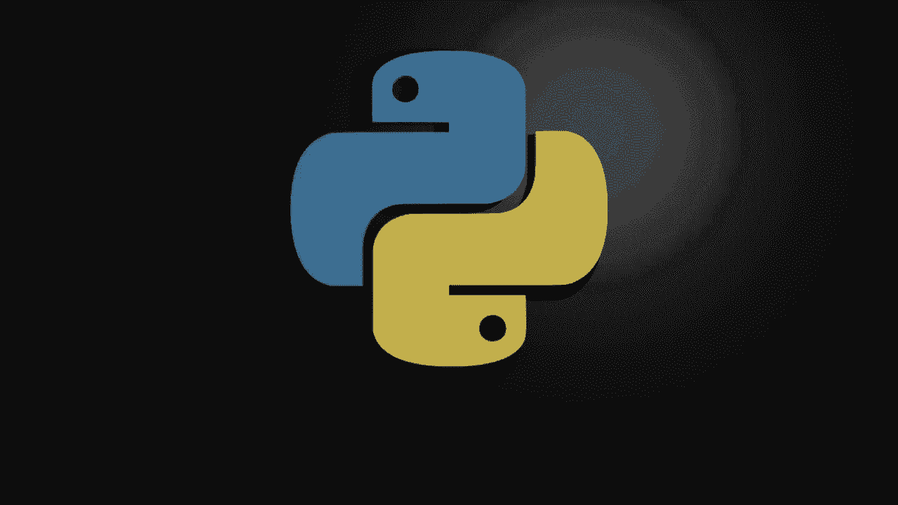
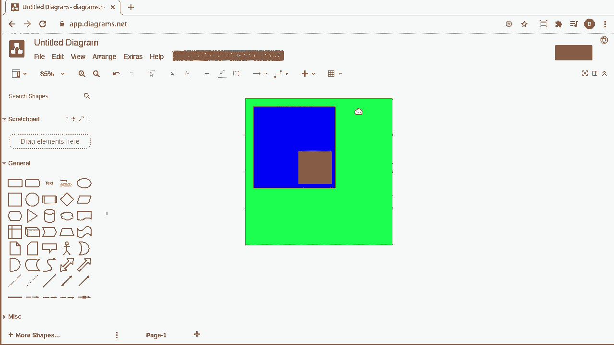
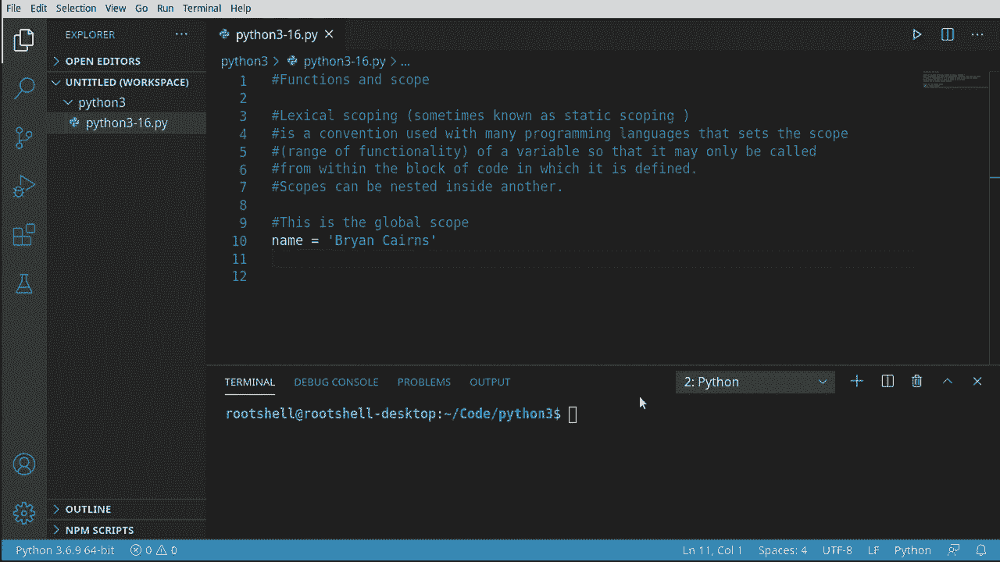
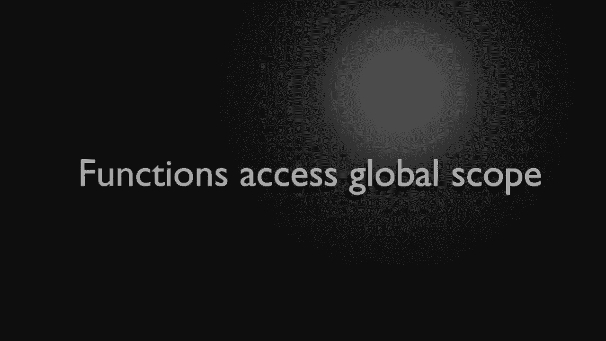
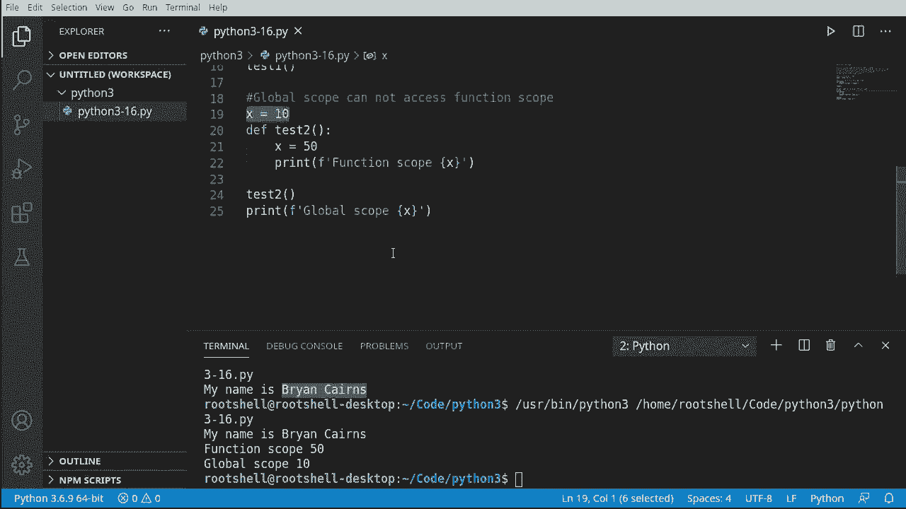
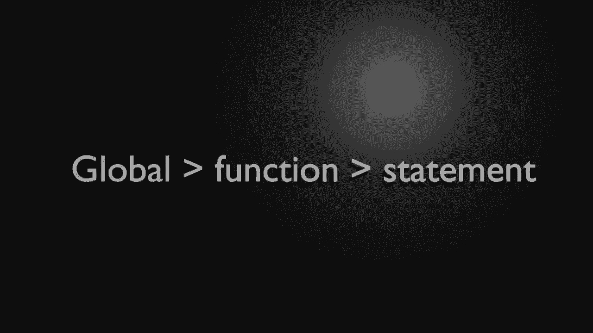
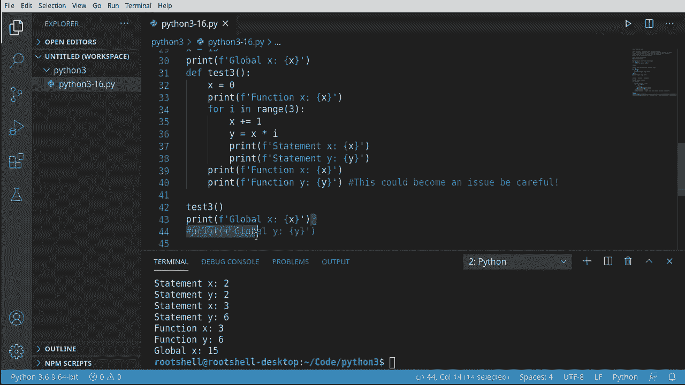
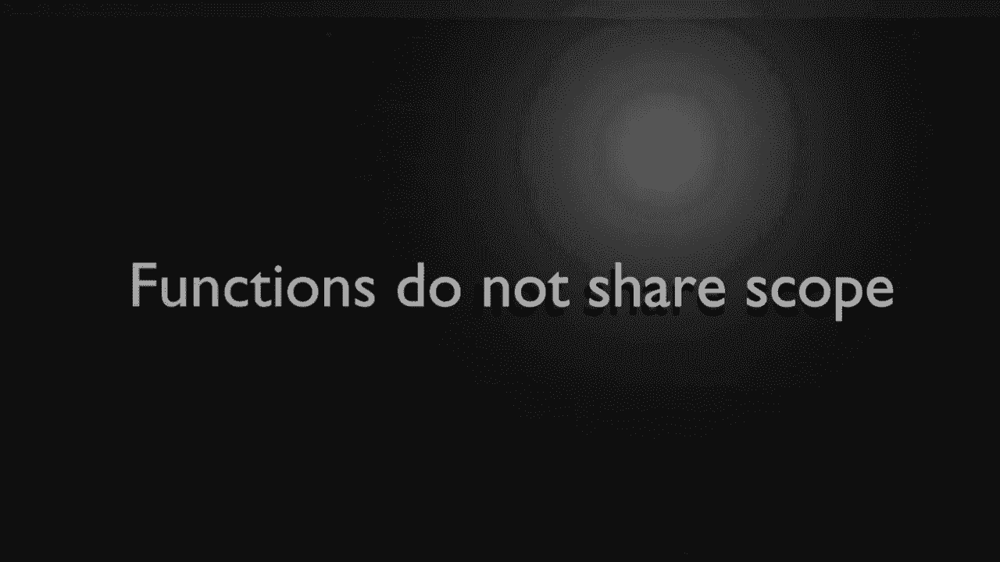
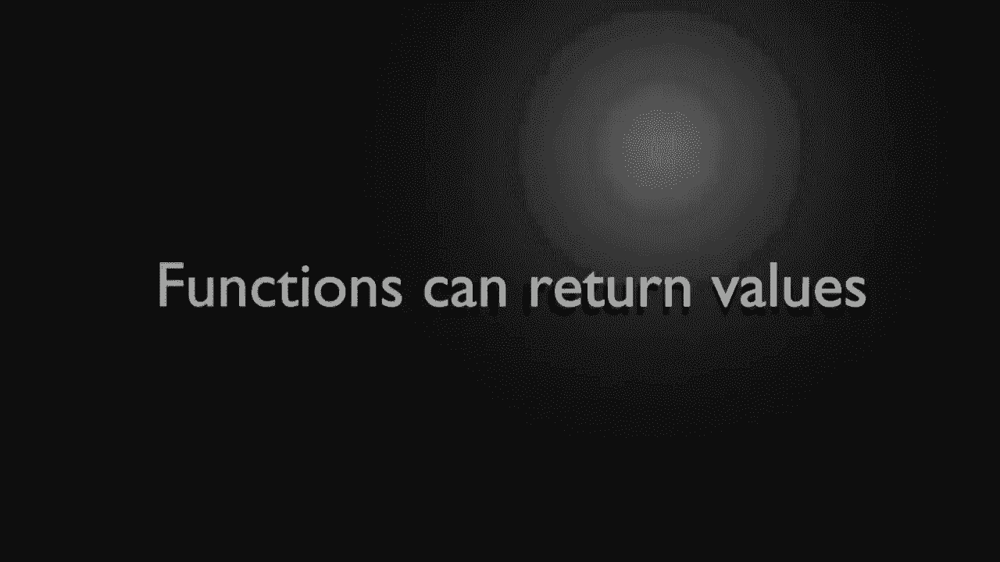
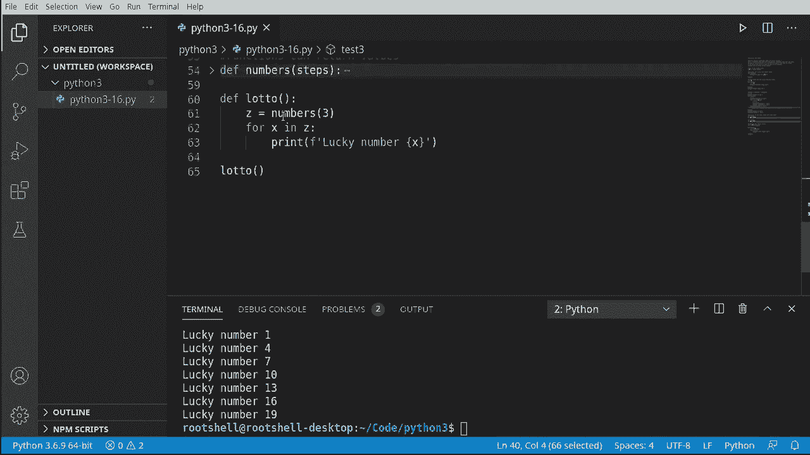

# 【双语字幕+资料下载】Python 3全系列基础教程，全程代码演示&讲解！10小时视频42节，保证你能掌握Python！快来一起跟着视频敲代码~＜快速入门系列＞ - P16：16）函数与作用域 - ShowMeAI - BV1yg411c7Nw

Hello again everyone， this is Brian， let's continue our journey into Python 3 with functions and scope。This is a theory heavy video， but we're going to try and make it very simple。 So we're talking about lexical scoping， sometimes known as static scoping。 which is a convention many programming languages use。

That sets the scope or the range of functionality of a variable so that it is only called from within the block of code from which it was defined。 however。Scopes can be nested inside of each other。So you ever have like a box and a box and a box and a box。 that's kind of what we're talking about and that's why this really will hurt your brain if you're not paying attention。

 so let's dive in and take a look。

So let's take a look at lexical scoping and I'm going to just put a square out here。 I'm going to make it nice and big， and let's go ahead and give it a color。 Let's say this is going to be some sort of green Does't really matter what it is。So that would be a block of code。 And actually， you've been working in this this whole time。

 This has been called the global scope。 Everything we've done so far has been in one giant scope called the global scopepe。 There's other names for it as well。 but that's basically what we're talking about。 Now。 we can actually take another one。😊，Let's go ahead and bring this all the way to the front and let's set this as a different color。Say blue。And this。Is a different scope， think of this like a function。

Doesn't necessarily have to be a function。 It could be like， a wild statement。Or an if statement。 something like that。 So what we're getting at here is。You have this big overarching global scope。 but then you have these subcopes。Now to make things a little bit more complex。 let's say we have this scope here that's inside the global scope。 let's call this a function。

 for example。We're going to go ahead and make another one。And let's give this a different color。This is what we're talking about。So you can have a scope with a scope in a scope。

Like a box and a box and a box and it gets very， very confusing。Now， this guy here。 and let's just actually move all of this down here and make it graphically easier to understand。You have your global scope， you have your function scope。 and then you have another little like a statement in here。

You can define something in the global and use it all the way down through here。 even down into this statement。You cannot， however， do the reverse。 you can't define something in the statement and use it backwards up in the global scope。So this is why it gets very， very confusing and I think graphically this is probably one of the better ways of really defining this。

Just understand that you can have a scope with a scope inside of it and another scope inside of it。 you can define something， and as you get more granular， you can use whatever you defined， however。 you can't define something at the very granular level and use it higher up。All this talk about scope is well confusing， so let's just dive in and look first thing we're going to talk about is the global scope。

This is probably the easiest concept to understand， because we've been using it this entire time。 That's right。 So if I say name and then just whatever your name is。We have now created a variable on the global scope。 meaning anything in this application can now use this。

This is extremely cool and it's extremely easy。

So let's demonstrate this global scope。Functions can access the global scope。 So let's go ahead and define a function。 Let's just call this test1 very descriptive name， I know。And we are going to use。This variable， which we create in the global scope in this function。 and remember this function has its own scope that we're now defining。Say print。And to test this。

 let's go ahead and let's call this function。My name is and then the name from the global scope。Makes it super， super convenient。 However， what we're going to show in this video is that this convenience comes with a cost of complexity and there's some issues you can definitely run into。

Let's do the reverse and show some problems we can run into。 So for example。 the global scope cannot access a function scope。 seemsm absurd。 We define the function in the global scope。 We should be able to access it。 but it doesn't work that way。We's say x equals 10。 Let's go ahead and define a function。

 Let's call this test2， very super descriptive name。And we're going to say x equals 50。Now。 you may be going， wait a minute。 There's two x's。 So it's the same x， but it's really not。Let's go ahead and take a look here。And we're going to say oh。functionction。Nope。And now we're just going to print out that value of x。Go ahead and go down here。

Let's call this function so it's going to print that out。 And then we're going to say。Globel scope。All right， so。U quiz。X equals 10， x equals 50， what is this going to print out。 it's going to say function scope x， global scope x。Let's take a look。So if you thought both of these would be 50， you are wrong， this is what's going on here。

We have X in the global scope， We are now creating a new variable in the function scope and assigning it to value 50。 these are two different variables so it's treating them differently even though they have the same name。This is confusing， but it exists for a reason。 It's called name collision。 If you have a variable with the same name， you don't want to overwrite that。

 Let's say this was some magic number like a password or something。 And then we went and kind of goofed it up in a function somewhere。 We don't want to break the functionality of the application。😊。So this actually exists to protect us from ourselves。

Okay， let's dive deeper and deeper still， so we're going to talk about global scope。 function scope and statement scope all in one， and this is going to really。 really tax your brain here。So we're going to make a global variable。 We'll say x equals 15。 and let's go ahead and just。Butut a print statement， print global X。

 just so we can see what's going on here。There it is， 15。 Now we're going to define a function。 so let' say de。Ss 3。Ever descriptive name I know。And I'm going to make x is zero。 What have we done here？Well we've created two different variables。 we've talked about that a little bit here， and we're saying this variable is 15 and this variable is0。

So I'm going to through the magic copy and paste， I have some notes off the screen here just to save a smiiddge of time。We're going to print these out。Let's go ahead and call this。Just so we can see what's going on。And sure enough。Globals 15， function is 0， things are working the way we'd expect them to。 even though it's a little bit confusing。This exists to keep us from hurting ourselveslf because you have a concept called name collision。

 this where a password or something crazy like that。 we wouldn't want to overwrite that and then screw something up somewhere else in the code。Okay。 now let's take this a bit further and we're going to say for I in range。 and we're going to really make some people mad here because we're going to do some things we really should not be doing。

We're going to say x plus equals1。Now we're going to say why。Equals x。Es。I。So far， everything's good。 but now this x， you notice how it worth three layers down， which x is this really？Well。 this is the confusing bit。So this x is actually borrowing from our definition。 it's going a bit higher。So think of any time you see。The deaf keyword。

 we're actually putting some sort of wall or a shield here。 And let's actually just。Draw a line。 So it's like we're setting a boundary right there saying you will not pass if I've already named that。Now， let's go ahead and。Do something we probably should not be doing。We have。Statement X。 statement Y。This is perfectly fine。 Let's go ahead and run this and see what this looks like。

Sure enough， it's working as expected。 We can see that statement Y is actually multiplying。 Everything's working good。 Now， let's do something。Very， very horrible。 We're going to grab these。And we're going to go backwards through the scope。VS code adds these beautiful little lines to tell us where in scope we are。 you can actually see it's like a bubble here。So we're at the global， we're at the function。

 we're at the statement now we're dropping back to the function scope。Let's run this and see what happens， you notice how it does work and it's because we're in this little boundary here and it thinks it's a safe little playground for us to work at。However， you can definitely break some things and you can cause some issues， I would strongly。 strongly。Advise against this。Future versions of Python and even current versions of Python。

 you can run into some issues， some name collisions， and you can break your code。Now。 let's go ahead and take this same concept here。And try to go backwards still。And let's go back up to the global scope。So we want to see x and Y。 we've defined y here and we're able to go backwards into the function scope。

 let's see if we can go backwards up to the global scope。And sure enough。 we can not name error Y is not defined， Why are we getting this， what's going on here？

This definition is a block of code， it's its own individual little scope。 and I've got these arrows here， global goes to function， function goes to statement。 you should not go backwards。However， we've seen you can violate that principle and go backwards。 even though we really shouldn't be able to。Or I should say you don't want to because you can cause problems。

Because if you take that logic and try to go backwards all the way up to the global。 you're going to get a name error why simply does not exist out on the global namespace。You need to be a little bit careful when you're working with scope and really wrap your brain around this。That will cause problems time and time again。 I see people constantly doing this going well。

 I defined why， why can't I use it， and then you have to explain scope to them。Trrum that again and everything runs beautifully because we've commented this code out。

Now， all this talk about scope and functions and all that can get a little bit confusing。 So one thing you need to really understand is that functions do not share scope with each other。 Let's go ahead and test this out。 So I'm must say doubt cats。Better name。 I like cats。 So I'm going to make a variable called Z。 and I'm going to make this one。Now。

 what you need to understand， I mean， really， really pound into your brain is this only exists in this function。Let's grab literally that function， make another one， and let's call it dogs。Now， Z is3。What have we done here， You see two different functions of two different Z's。These are individuals。 They are not the same variable， and they cannot talk to each other。So for example。

If I do something like this。What's going to happen？Well， we're going to call cats。 we're going to call dogs， and then we're going to get some sort of undefined error and Vi Studio code is already smart enough to know it's not defined because these only exist up here。

Now to kind of pound that in here。Let's grab this。Let's get rid of these guys。Now we've commented this out， let's save that。What's going to happen if we call dogs right now。 Let's go ahead and say。Notice how it's already going， oh oh。 you're going to have an undefined variable and let's test that， so sure enough。

Print Z name Z not defined。 Remember when you see not defined， it means it simply doesn't exist。Even if we were to call cats。See， 하나。Does not exist。 So they do not share scope with each other。 If you're ever confused about this， just simply take your Ide E and you can collapse the code down if your I D E allows it。 And that's what we're talking about。 These are individual islands They don't talk to each other at all。

Now to wrap this up， you may be asking yourself if functions do not share scope。 how do you share information between functions？Well， functions can return values。 And we've talked about this a little bit here。 So let's go ahead and generate some lucky numbers。 I'm going to say define。A function called numbers。And we want actually a parameter of steps。

Go ahead and we're going to say L equal range。And then we want to go from 1 to 20。Using the steps。There we go。Go ahead and print these out。 We're going to say for I N L。And we're going to go ahead and print I， this is just so we can see on the screen what's going on。Now we're going to drop back down and we're going to say return。

And we want to return that little list that we got from this range here。 So what's going on under the hood？We're saying define this function who has a parameter of steps。 we're going to say L is range 1 to 20 using steps。I to L。 we're just going to print those out and then we're going to actually return all of this information we generated。

Now， a realroad program would have vastly more complex logic。But now we're going to use that function and get the information out of it。 So we're going to make the lottto function。 Everybody wants to win the lottto。 I know I do。And we're going to say z equal， and we're going to call that numbers function with a step of three。

You may be going now， wait a minute。Numbers doesn't exist， we can't use it。If you're ever confused and your IDE allows it collapse the code down。 you can see numbers exist on the global scope。Therefore， we can call it we're going down， not up。All right， so now that we have this。We can say or x in z。

And let's go ahead and print out our lucky numbers。And we're just going to print that out。Now。 let's go ahead and call our lotto function。Notice how we're not calling numbers directly。 we're calling Lotto and Loto is going to call numbers， run that code and return the value。 get the return value， and then use it。See， there's our lucky numbers。Major take away from this。

 We've talked about scope， and we've talked about it in depth。 Scope can be a little bit confusing。 but just remember， it's going to go from global to function to statement。 You should not go backwards。 And if you do， you're probably going to run into some sort of problem。 although you'll see people do this all the time in Python。 and it drives me。Bgers。

 because they're going to eventually run into a problem if they haven't already。And a function can call a function and you can get values from those functions and use them locally。