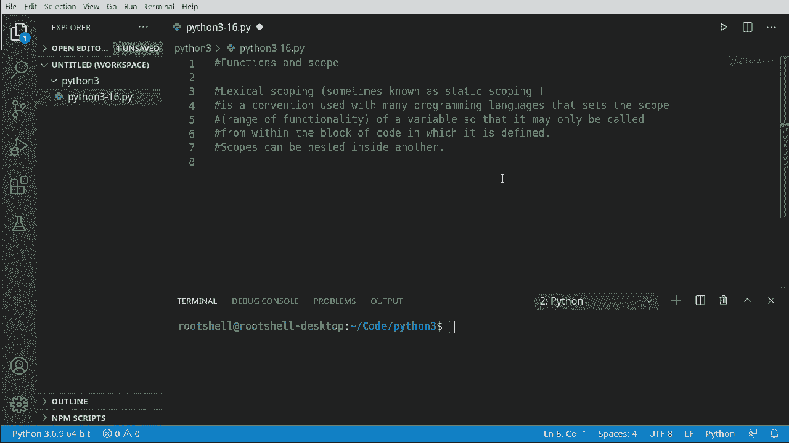
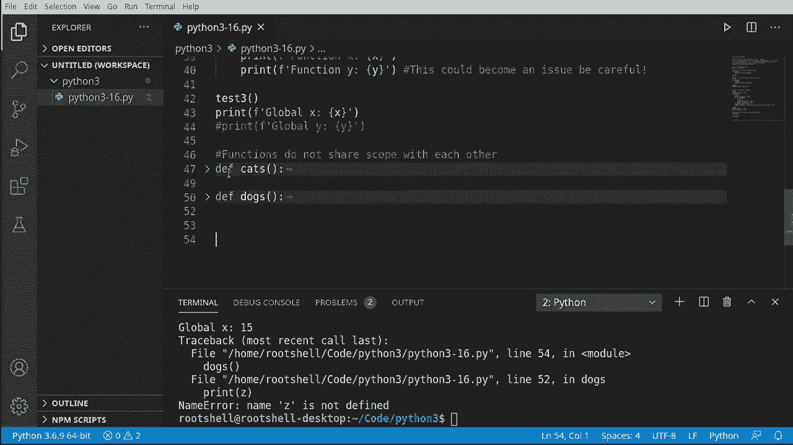

# 【双语字幕+资料下载】Python 3全系列基础教程，全程代码演示&讲解！10小时视频42节，保证你能掌握Python！快来一起跟着视频敲代码~＜快速入门系列＞ - P16：16）函数与作用域 - ShowMeAI - BV1yg411c7Nw

大家好，我是布莱恩，让我们继续探索 Python 3 的函数与作用域。这是一段理论密集的视频，但我们会尽量简单明了。我们正在讨论词法作用域，有时也称为静态作用域，这是一种许多编程语言使用的约定。

这设定了变量的作用域或功能范围，使其仅在定义它的代码块内部调用。然而，作用域可以嵌套在彼此内部。因此，你可能会有一个盒子再加一个盒子再加一个盒子，这就是我们在讨论的内容，这也是为什么如果你不专心，这真的会让你感到困惑。

所以让我们深入探讨一下。

现在我们来看看词法作用域，我将这里放一个正方形。我要把它做得大一些，并且给它上个颜色。假设这个颜色是某种绿色，实际上颜色并不重要。这就是一段代码块。实际上，你一直在使用这个。

这被称为全局作用域。到目前为止，我们做的所有事情都在一个叫做全局作用域的巨大范围内。它还有其他名称，但这基本上就是我们在讨论的内容。现在，我们实际上可以再做一个。😊，让我们把这个移到最前面，并将其设为不同的颜色，比如蓝色。这是一个不同的作用域，可以把它想象成一个函数。

它不一定是一个函数。它也可以是一个任意语句或条件语句之类的东西。那么我们要表达的是，你有这个大范围的全局作用域，但随后你有这些子作用域。为了让事情稍微复杂一点，假设我们在全局作用域内有这个作用域，我们称之为一个函数。

例如，我们将继续创建另一个。这次我们给它一个不同的颜色。这就是我们要讨论的内容。所以你可以在一个作用域内再嵌套一个作用域。

就像一个盒子、一个盒子再加一个盒子，这样就变得非常非常混乱。现在，这里有一个框。让我们把所有的东西都移到这里，让它更容易理解。你有全局作用域，有函数作用域，还有另外一个像语句的东西在这里。

你可以在全局范围内定义一些东西，并在这里一直使用它，甚至在这个语句中使用。然而，你不能反过来，你不能在语句中定义某个东西，然后在全局范围内向上使用它。这就是为什么它会变得非常非常混乱，我认为图形化地表示这可能是定义它的更好方法之一。

只需理解，你可以有一个作用域，其中包含另一个作用域，还有另一个作用域。你可以定义某个东西，并随着细化，可以使用你定义的东西。然而，你不能在非常细化的级别定义某个东西并在更高的层次使用它。所有关于作用域的讨论确实令人困惑，所以让我们深入了解，首先讨论全局作用域。

这可能是最简单理解的概念，因为我们整个时间都在使用它。没错。如果我说名字，然后填上你的名字。我们现在在全局作用域中创建了一个变量，这意味着这个应用中的任何东西现在都可以使用它。

这非常酷，也非常简单。

让我们演示这个全局作用域。函数可以访问全局作用域。所以让我们定义一个函数。我们把它叫做 test1，名字很描述性，我知道。我们将使用这个在全局作用域中创建的变量，并在这个函数中使用。记住这个函数有自己的作用域，我们现在正在定义它。说 print。为了测试这一点。

让我们调用这个函数。我的名字是，然后用全局作用域中的名字。这样非常方便。然而，我们在这个视频中要展示的是，这种便利带来了复杂性，肯定会遇到一些问题。

让我们反向思考一下，展示一些可能遇到的问题。例如，**全局作用域**无法访问**函数作用域**，这看起来很荒谬。我们在全局作用域中定义了函数，应该能够访问它，但并不是这样的。我们说 x 等于 10。接下来，我们定义一个函数。

我们把这个叫做 test2，名字非常具有描述性。我们将说 x 等于 50。现在，你可能会想，等等，这有两个 x。它们是同一个 x，但实际上并不是。我们来看看这里。我们将说哦，**函数**。不，不行。现在我们只打印出 x 的值。继续往下看看。

让我们调用这个函数，这样它会打印出来。然后我们将说，全局作用域。好吧，那么，**U quiz**。x 等于 10，x 等于 50，这将打印什么？它会说函数作用域 x，全局作用域 x。让我们看看。如果你认为这两个都是 50，那你错了，这里发生了什么。

我们在全局作用域中有 x，现在我们在函数作用域中创建一个新变量并将其赋值为 50。这是两个不同的变量，所以它们会被不同对待，即使它们的名字相同。这很令人困惑，但这是有原因的。这被称为**名字冲突**。如果你有一个同名变量，你不想覆盖它。

假设这是某个神奇的数字，比如密码之类的。然后我们在某个函数里搞砸了它。我们不想破坏应用程序的功能。😊。所以这实际上是为了保护我们自己。

好的，让我们更深入地探讨，所以我们将讨论全局作用域、函数作用域和语句作用域，所有这些都会真正考验你的大脑。所以我们要创建一个全局变量。我们说`x`等于15。现在我们就来添加一个打印语句，打印全局的X。

为了让我们看看这里发生了什么。是的，15。现在我们要定义一个函数。我们说`de`。名称非常描述性，我知道。我要让`x`等于0。我们在这里做了什么？我们创建了两个不同的变量。我们在这里讨论过这一点，我们说这个变量是15，而这个变量是0。

所以我通过神奇的复制粘贴，我有一些笔记在屏幕外，以节省一点时间。我们要打印这些出来。让我们先这样做。这样我们就能看到发生了什么。果然，Globals 15，函数为0，一切正常，即使这有点令人困惑。这是为了防止我们自己出错，因为你有一个叫做名称冲突的概念。

这就是一个密码或类似的疯狂东西。我们不想覆盖它，然后在代码的其他地方搞砸。好的。现在让我们进一步，我们要说的是对于`I in range`。我们要让一些人非常生气，因为我们要做一些我们真的不该做的事情。

我们要说`x`加1。现在我们要说`y`等于`x`。到目前为止，一切都很好。但是现在这个`x`，你注意到它有三层深，这个`x`究竟是哪个？好吧，这是令人困惑的部分。所以这个`x`实际上是借用我们定义的内容，它向上延伸了一些。因此，当你看到`def`关键字时，请想象一下。

我们实际上是在这里放置某种墙或保护罩。让我们画一条线。就像是在设置一个边界，表示如果我已经命名过，你将无法通过。现在，让我们去做一些我们可能不该做的事情。我们有语句X，语句Y。这完全没问题。让我们运行这个，看看效果如何。

果然，它按预期工作。我们可以看到语句Y实际上是在乘法。一切都很好。现在，让我们做一些非常、非常可怕的事情。我们将抓取这些。然后我们将通过作用域向后走。VS代码添加了这些漂亮的小线条，告诉我们我们在什么作用域中。你可以看到，就像一个气泡一样。我们在全局，我们在函数内。

我们现在在语句中，正在回到函数作用域。让我们运行这个，看看会发生什么，你会注意到它确实有效，因为我们在这个小边界内，系统认为这是一个安全的小游乐场。然而，你绝对可以破坏一些东西，造成一些问题，我强烈。强烈建议避免这样做。未来的 Python 版本甚至当前的 Python 版本。

你可能会遇到一些问题，一些名称冲突，可能会破坏你的代码。现在，让我们继续使用这个概念。并尝试仍然向后追溯。让我们回到全局作用域。所以我们想查看 x 和 y。我们在这里定义了 y，并且能够回到函数作用域。

让我们看看是否可以回到全局作用域。果然，我们无法命名错误 Y 未定义，为什么会出现这个，发生了什么？

这个定义是一段代码，它是其自己的独立小作用域。这里有这些箭头，全球指向函数，函数指向语句。你不应该向后追溯。然而，我们看到你可以违反这个原则并向后追溯。尽管我们实际上不应该这样做。或者我应该说你不想这样做，因为你可能会引发问题。

因为如果你采用那个逻辑并试图向后追溯到全局，你将会得到一个名称错误，为什么在全局命名空间中根本不存在。你在处理作用域时需要稍微小心，并真正理解这一点。这将一次又一次地导致问题。我看到人们不断这样做。

我定义了 y，为什么我不能使用它，然后你必须向他们解释作用域。再次运行一遍，一切运作得很好，因为我们注释掉了这段代码。

现在，关于作用域和函数的这些讨论可能有点混淆。所以你需要真正理解的一件事是，函数之间不共享作用域。让我们测试一下这个。我要说的是怀疑猫。更好的名称。我喜欢猫。所以我要创建一个变量 Z。现在。

你需要理解的，是这仅在这个函数中存在。让我们实际提取这个函数，创建另一个，称之为狗。现在， Z 是 3。我们在这里做了什么，你看到两个不同的函数和两个不同的 Z。这些是独立的。它们不是同一个变量，不能互相通信。所以例如。

如果我这样做，会发生什么？嗯，我们将会调用猫。我们会调用狗，然后我们将会得到某种未定义错误，而 Vi Studio 代码已经足够智能，知道它未定义，因为这些变量只存在于这里。

现在为了强调这一点。让我们抓住这个。让我们去掉这些。现在我们已经将其注释掉了，让我们保存它。如果我们现在调用狗，会发生什么？让我们继续说。注意，它已经在运行，哦哦。你将遇到一个未定义的变量，让我们测试一下，果然如此。

打印 Z 名称未定义。记住，当你看到未定义时，它意味着它根本不存在。即使我们调用猫。看，하나。不存在。因此它们彼此不共享范围。如果你对此感到困惑，只需折叠代码，如果你的 IDE 允许的话。这就是我们所说的。这些是独立的岛屿，它们根本不交流。

现在为了总结，你可能会问，如果函数不共享范围，如何在函数之间共享信息？好吧，函数可以返回值。我们在这里讨论过这一点。让我们生成一些幸运数字。我将定义一个名为数字的函数。我们实际上想要一个步长参数。

继续，我们将说 L 等于范围。然后我们想从 1 到 20。使用步长。好了。继续打印这些。我们将说对于 I 在 L 中。我们将继续打印 I，这样我们可以在屏幕上看到发生了什么。现在我们将返回，并且我们将说返回。

我们想返回从这个范围中得到的小列表。那么在幕后发生了什么？我们在说定义这个函数，它有一个步长参数。我们将说 L 是从 1 到 20 的范围，使用步长。I 在 L 中。我们只是将其打印出来，然后我们将实际返回我们生成的所有这些信息。

现在，一个真正的程序会有更复杂的逻辑。但现在我们将使用这个函数并获取其中的信息。所以我们将创建乐透函数。每个人都想赢得乐透。我知道我想。我们将说 z 等于，我们将以三为步长调用数字函数。

你可能在想，等一下。数字并不存在，我们无法使用它。如果你感到困惑，而你的 IDE 允许，可以折叠代码。你可以看到数字存在于全局范围内。因此，我们可以调用它，我们是向下走，而不是向上走。好的，既然我们有了这个。我们可以说或 x 在 z 中。

现在让我们继续打印出我们的幸运数字。我们只是要把它打印出来。现在，让我们调用我们的乐透函数。注意，我们并没有直接调用数字，我们是调用乐透，而乐透将调用数字，运行代码并返回值。获取返回值，然后使用它。看，这就是我们的幸运数字。这是一个重要的收获。

我们讨论了作用域，并且深入探讨了它。作用域可能有点 confusing，但请记住，它会从全局到函数再到语句。你不应该逆向操作。如果你这样做，你可能会遇到某种问题，尽管你会看到人们在 Python 中总是这样做，这让我感到困扰。

因为如果他们还没有遇到问题，他们最终会碰到问题。一个函数可以调用另一个函数，你可以从这些函数中获取值并在本地使用它。
