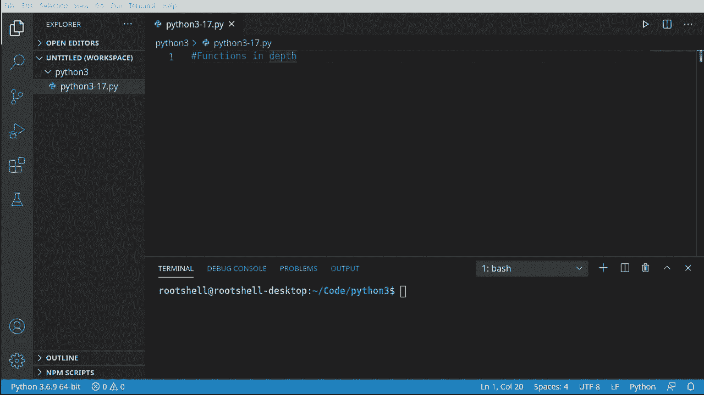
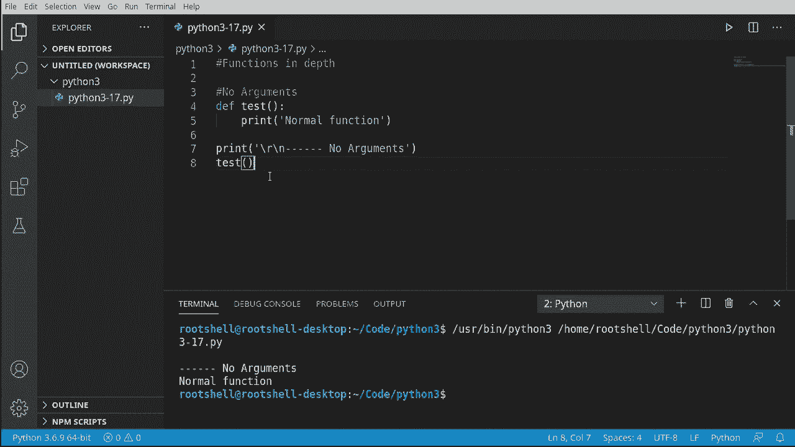
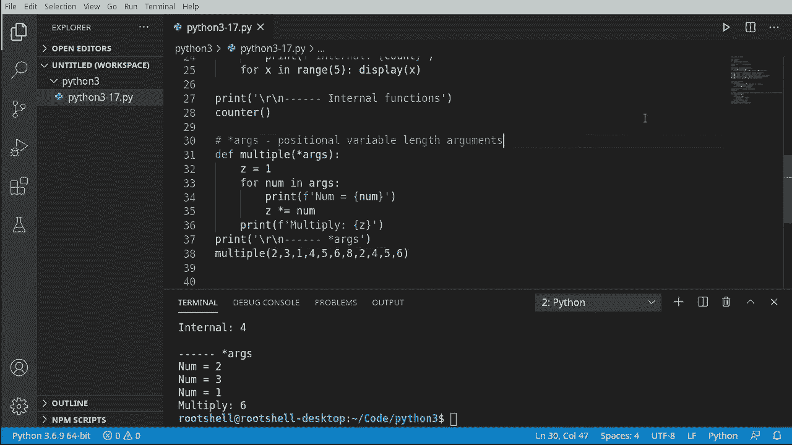
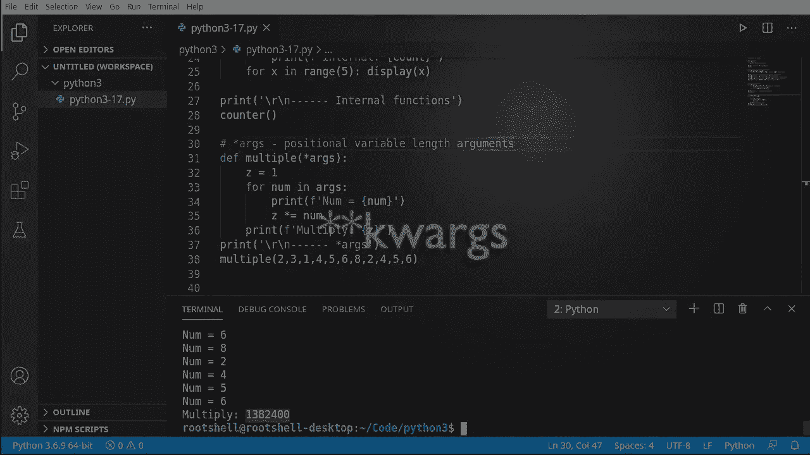
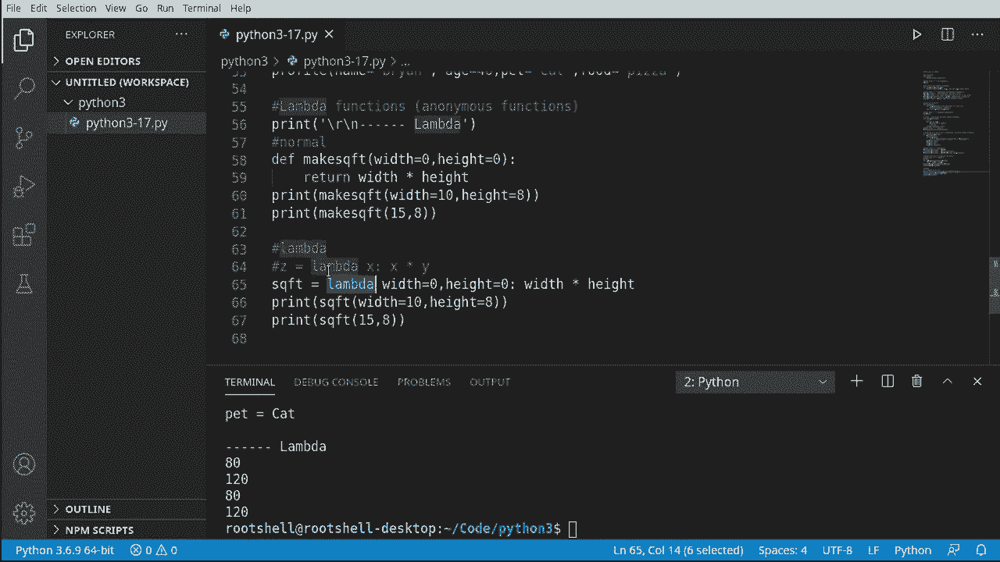

# 【双语字幕+资料下载】Python 3全系列基础教程，全程代码演示&讲解！10小时视频42节，保证你能掌握Python！快来一起跟着视频敲代码~＜快速入门系列＞ - P17：17）函数进阶 - ShowMeAI - BV1yg411c7Nw

Okay， this video we're going to talk about functions in depth specifically we're talking about arguments and parameters and different ways of doing things。 for example， you can have a function inside of a function。That's crazy。 so let's dive in and take a look。

Okay， let's start off nice and simple。 We're talking about no arguments， no parameters。 We're just going to do what we've done before， just so we can have a good base to start with。 We've done this multiple times by now。 So we're going to just print this out and we're going to say normal。Aunction， this is kind of our starting point here。We're going to go on a little bit of a journey。

 And what we're going to do is we're going to dive into the mouth of madness and just see how crazy this can get。 so。We're now going to just call this。You notice how I've put this right here。 These are escape characters。 returnturn line feed with some dashes and arguments。 We're going to break this up because we're going to have a lot of output in this video。

 and we want to be able to see what's happening here。 So I'm going to just copy and paste these as we go。 We're calling this function。 and it works as expected。If any of this seems unclear at this point。 you need to stop watching this video and go watch the previous 16 videos to really wrap your head around what we're going to be talking about because we are going to Noll holds bar just dive right into the deep end。

Let's take the training wheels off， we're going to talk about positional and keyword arguments。Okay。 this is where it's going to get really confusing really fast。 So we're going to make a function called message。 We're going to say name。Message。 and then we want an age。 So we've got a couple different data types we're going to be working with。

Pretty clearly it's going to be like a string string and an ant， so I'mre going to say print。Hello。 and then we want the name。Followed by the message。You are。 And then however many years。 they tell us。So fundamentally。This doesn't seem like rocket science。 but we can start doing some really， really crazy things。So I'm going to just put that out there。

 positional keyword arguments， so when we run this， we'll see the output broken up。Let's go ahead and say message。And let's call this， as you would expect it。 Now。 what we're doing here is called positional。 You notice how there is name， message and age。 Those are the positions。Think of this like a list。 It's zero base， so 0，1，2。

We don't have to give it an index。 It's smart enough to know what the index is。But I'm going to say。 Brian。Let's say， good morning。And then let's give it an age。 Let's say I'm 22， boy I wish I was 22。 I'm really not。And that's positional。Go ahead and run this。 And we'll see。 sure enough， Ho， Brian。 Good morning。 You are 22 years old。 So it looks great。

 Let's grab this and let's play around with it a little bit here。😊，We're going to use positional。 but we're going to use the wrong order。Let's go ahead and screw this up。So I'm going to say22。And。Good morning， so really what we're doing is we're switching these around here。The output suddenly makes no sense。 Ho， Brian 22， you are good morning years old。

 That makes absolutely no sense。 It's like a serial killer wrote that or something。 All right， so。What we've done here is position and we've screwed up the orders。So how do we fix that。 We use what's called keywords。 So we're going to do the same thing。 We're going to save message。And here， we're going to say。MSg equals。And you see this in Viual Studio code。

 it's got that parentheses and little bitty block there。 it's smart enough to know that we are trying to call the parameter message。With the argument of。Good morning。Now you notice right off the bat， we are completely disregarding the order because message is。 well， the second one and we're giving it first。As you're about to see， it really does not matter。

Say age equals， say 46。And then， name。Equals。Rightan。Let's go ahead and run this。And sure enough。 it says， hellello， Brian， good morning， you are 46 years old， so now it's working as expected。 we don't have to give it a specific order。We are working with。E words。And I wish they would have called this。Raammeteral arguments or something like that。

 but basically it's keywords。 So what's happening is Python is taking these。Rameters here and turning them under the hood to keywords。 And it has some sort of internal list in it saying， hey。If you give me a keyword and pump it in there。It will just magically know how to line those up and what order they need to go into。

You can also do both， so let's just grab this guy。Let's grab this。Let'm me say， Brian。And then let's go ahead and flip these around。So you can mix and match these as you want。 so you can say positional followed by keyword， let's run that， see it in action。It doesn't matter which way you do it， it just works。Extremely cool。

 and I absolutely love that about Python。Let's make this ever complex still。 we're going to talk about internal or in line functions。 and there is a subtle difference between internal and in line。 we're talking about an internal function， which is essentially a function inside of a function。

So we're going to say。Counner。And inside of counter。 we're going to immediately call another function or create another function called display。We want to say， count。0。 So really all we're doing is we're saying a function in a function。And notice how it's smart enough to drop us down a line so it knows it has its own scope。

And we're just going to print this out， and we're going to say。Eternal， that way。 we know I was going to do it Saint Mal。 But let's just say internal。 So we know where we are and then print that count out。Under the hood， this is really complex。 but it's super simple the way we do it， we just have a function。

 we've defined another function that function gets its own little scope。And we can now drop out here and say something like this。4 x in range。Say five。 nothing too drastic here。 Let's go ahead and call our function display。And we're going to call that with X。So we're saying4 x in range。

 so it's going to do that five times and it's going to say call display one。1，2，3，4，5。Interesting how that works。 Let's see this in action here。A bit of copy and paste action for my notes， we're going to talk about internal functions and we're going to call the counter function。Sureurn enough。0，1，2，3，4。I always forget that0 base always trips me up。Okay。

 so what we're doing here is calling a function， which has an internal function。 which is calling it internally and is just kind of going round inside and doing all this madness for us。 So let's take this counter。Grab this internal function called display。And tryry to call it。 so we're now going up a notch。And let's just see if we can call this。Sure enough， we cannot。

 we get a name error display is not defined remember when you see is not defined that means Python has no idea what this is because it does not exist in the scope we're working in。So you guessed it， you collapse that down， display doesn't exist。 It's inside of the scope over here。

Its super cool， but it's also super confusing， so if you're going to use this。 be very careful about how you try to call it or you're going to get some sort of error。Al right。 let's give you a nightmare scenario。 Boss walks in。 You're a newbie Python programmer and he says。 I want you to make a function， but I'm not going to tell you how many arguments I'm going to give you。

 I want your function to automatically figure it out。Well。 what we're talking about here are star Args and star stands for wildcard。 this is a positional variable length argument。All right， so what are we talking about positional？

Well， we've talked about this a little bit before up here where you have a position。 and that's not so much what we're talking about。 We're talking about this right here。 We're going to say de。And let's go multiply。Our as， we could name this whatever we wanted。Now。 we're going to feed that a bunch of arguments and they're going to be based in a position。

So let's go， Z equals 1。Or。Nam。In as。And let's go ahead and print that out so we can see what's going on。Now we're just going to multiply that， we're going to say。Z is multiplied by the number。Now let's go ahead and print this out。A little bit of copy and paste action from my nose just so graphically in the output。 we can see where we are。Let's go and call this。I want to say multiply。Or multiple， actually。

And we're going to say boss gives us three numbers here。Number one， number two， number three。 this is what I mean by positional。It's going to take the exact order。 We give it，1，2，3。 We could switch this around and say2，3，1。And you'll see the position changes231。All right。 very。 very simple， very easy to wrap your head around。The major takeaway here is we're not constrained。

 We can take this out to just some ridiculous level。We could do something like this。

诶。Works as expected。

Let's take that same nightmare scenario where our boss is just a complete jerk。 and we're going to say， okay， he's going to come in and say。 I'm going to give you random information。 I'm not going to tell you how much information may give you。And I'm not going to give it to you in a specific order。Yes， that's a nightmare。

 So what we're talking about is keyword as， which is basically。The same thing。 except for instead of positional， we're using a keyword。 we've talked about keywords before way back up here。 how we can mix and match and do all this other cool stuff。 but we're going to try and dumb this down and make it a little bit simple because yes。 this can get complex fast。Major thing to note is there are two asterisks here， two stars。So let's go ahead and say de。Profile。This is what the boss is going to do to us。 He's going to say。 I'm going to give you a person。And the person is just going to be a bunch of data。

 and you need to figure out what to do with it。So we're going to print out。Our person。Now。 let's jump out of there for just a moment here。And I'm going to say。Add our little delimiter here so we know we are in our output， and let's go and call this。So I'm going to say profile。Now， it's smart enough to know。Choosing keyword arc。

 so it gives us that double asterisk and now it's on us。To define what information we're going to give。 I'm just going to say name。 And if you're wondering where I'm getting name from。 I'm literally just randomly grabbing something out of my mind。 It doesn't matter what we give it here。So we're saving Brian。 and then let's go ahead and say age equals 46。Let's run this and see what happens。We're printing out this person， so notice it's now converting that into a dictionary。That's right。 so now we can just use this like a dictionary， it's extremely cool the way this works。Al right。

 let's go ahead， Anne。Use an internal function I'm going to say。N display。Let's go ahead and display K。Now we're going to do a little bit of test here。 We've covered this in our dictionary video here where we're going to say if K， it's in。The person。第一次。Then we want to print this out。And if that's super confusing。

 I would highly encourage you to go back in the playlist and watch the video where we cover dictionaries。So now we can just work with this dictionary directly so we have a function in a function。 this internal function display is just going to say if this keyword is in person keys because remember it's converting it to a dictionary。Then go ahead and print out the key and print out the value。

Now that we have our little internal function， let's go ahead and call it。 So I'm going to say。Theyplay。And let's give it an keyword name。 Now， notice how we're actually hard coding this。You can do different things like this。So I'm going to say name。Age。And we were in a meeting and they were talking about adding a pet。

 but they didn't actually do it yet， which is why we're saying if the keywords in the keys。Because we've done this， if we don't have to worry about not defined。It's going to print out name。 age， okay。Someone in marketing comes back goes，Wouldn't it be really， really cool if they had a pet？

So let's go ahead and add that in there。Now you can see Brian 46 and Ka and we have our two different calls here。 so we have the first one that does not have the pet and the second one which does have the pet。And it just works the way you would expect it to。We can now。Test this or other things。 So。 for example， let's say。Food。Es pizza。What have we done here well we've added a keyword that we're not using。

It does not crash your application because it's saying。If it's in there and we haven't even called it， so let's do the opposite here， let's。Go here and let's say。当。As， I don't know what that is。 We're just gooping around。Doesn't crash because it's not in there。Very cool， very easy the way this works。

 super simple to wrap your brain around， but what we're really trying to drive home here is these are keyword arguments not positional。 The position simply does not matter。Okay， let's wrap this up with a brief conversation about Lambda or anonymous functions。

 you're going to hear them called Lambda functions， they're actually not lambmbda functions。 they're anonymous functions。 We use Lambda to create an anonymous function。So let's go ahead and define this real quick here。 So first things first。 we're going to make a normal one。Just as a point of reference， some must say。Yeah。

 and let's call this make。S Q X T。 So we're making the square footage。 We're gonna to say the width。The default and the height。With a default。And we're just going to return。The with。Heth。So we're just really getting the square footage here。Super simple， super easy to understand。Go ahead and print this out。 Let me say print。Actually， I'm going to pausez for just a second。

 and we're going to。Add in our little delimiter here so we can see it in the output。 All right。 back to what we're working on here。 We are going to print out。The square footage。 and let's go ahead and do this both ways， we can say width equals。Try to think of a good number here，10。The height， anybody out in the audience， anybody。

 anybody call it eight， why not？You can also just say。F。And then make the square footage。 and let's say。15 by 8。We can call it both ways。Go ahead and run that， you see。h。 there's our numbers。Now let's use the Lambda keyword to create an anonymous function。I intentionally called it a Lambda function， even though they're anonymous functions because you're going to hear people say。

 well， I'm going to create a Lambda function。We're actually using the lambmbda keyword as Q。 F T equals。 So what are we doing here， We're making a variable。 We're going to say lambda。And let's go ahead and define some things。 Now I want to kind of slow way down I'm plop a note in here。There's a certain format we have to do this in。So we have a variable， the lambda keyword。

 a list of one or more variables， and then some code。So we're saying lambmbda。Let's go ahead and say width。Equals， and let's say zero。はい。Well zero。Poen and now we're going to our code， so if you're looking at this。 really what we're doing is we're saying Lambda is going to replace all of this。

Then we have our information， and I specifically name these the same so you could see them highlighted on the screen。 Let's do that again。So now we have our parameters， now we have our code。Now， if we wanted to。 we could just grab these and through the magic of copy and paste instead of a function call to make square footage。 we're going to just。All this variable。S QFT， and it functions exactly the same。See， 8120， 8120。

This is just witchcraft， I mean， this is like voodoo magic from old school programmers like me。 but so what's really going on under the hood is when you call lambmbda。Python is basically making。This。But it's doing it all in one line。 So as a programmer。 it makes your life a little bit easier because it's all in one line。

 And you just have to remember this variable name。 And it exists out in the global scope so we can treat it just like a function。 And if we mouse over this， you see it's smart enough to know that it is a call to lambmbda。 So it is making an anonymous function。I personally am not a huge fan of anonymous functions。 but they do have their place out in the programming world。

 especially if you get into like gooey programming and socket programming and things like that。 You'll see people use these very heavily。 Some people love them。 Some people hate them。 I personal。 My personal preference is I like to actually define what I'm going to use rather than relying on some。Crazy witchcraft。I don't want to steer away from this Lada。 is very powerful and very useful。

