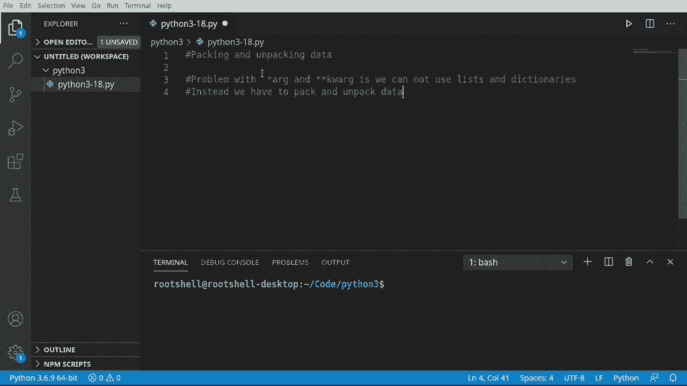
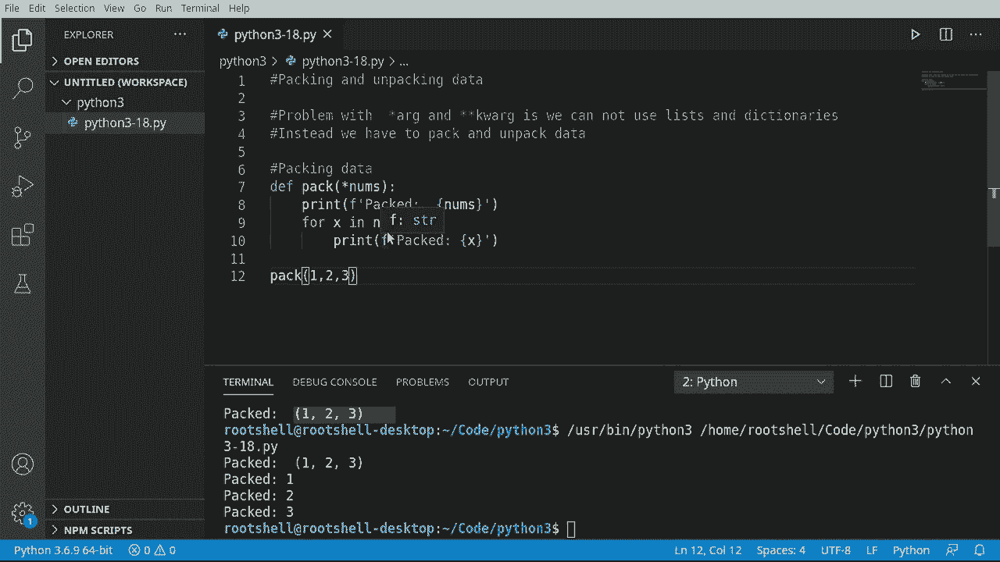
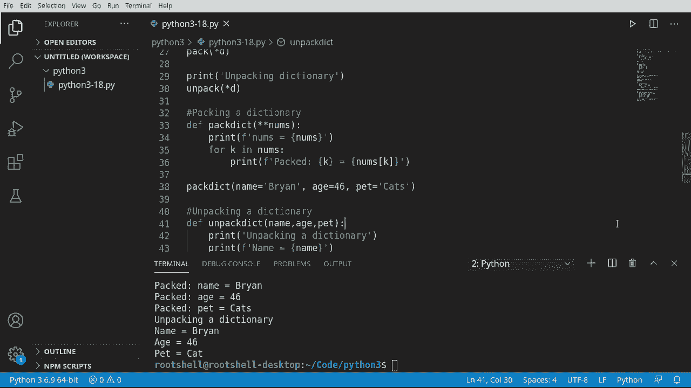

# 【双语字幕+资料下载】Python 3全系列基础教程，全程代码演示&讲解！10小时视频42节，保证你能掌握Python！快来一起跟着视频敲代码~＜快速入门系列＞ - P18：18）打包和解包数据 - ShowMeAI - BV1yg411c7Nw

Welcome back everyone， this is Brian， we're going to talk about packing and unpacking data。 now what are we really talking about here？Well， we have a problem with Arg and keyword Arg is that we cannot easily use lists。 sets， tuples and dictionaries， instead we have to pack and unpack the data and that's what this video is really going to dive into let's take a look。

So let's look at packing data。 And this sounds like it's going to be super complex。 but actually。 in the spirit of Python， it's super， super easy。 So I'm just going to make a function called pack。And we're going to make a parameter here， called nuns。This is a star a right here。 which means one or more variables。And in here， we're going to say， go ahead and print this out。

Just so we can see what we're actually getting。Now， let's go ahead and call this pack。 and I want to pack  one，2， and3。Let's see what's actually going on here。Sure enough。 it has made a topple。From here， we can very easily say or X in nus。And then do something like this。Get those individual numbers out of there and see exactly what's going on inside the tuple。 Super。

 super simple to wrap your head around。 This works as expected。 However， there are some issues here。 And let's go ahead and take a look at how we would unpack the data。

Okay， packing data is well， simple， and we've done this before。But what if we try to do the opposite and unpack the data， What are we really talking about here。 unpacking， So let's go ahead and make an example I say F unpack。 and let's give it three variables。 A， B and C。From here， I'm just going to print out。Unpack that way we can see what's going on。

Follow by rent。And we could just grab those directly。Super simple。 probably the simplest function we'll ever write。Say BC and of course， line those up。U B and C。Just looking at that function， it's pretty straightforward， pretty obvious what's going to happen。 but now let's introduce a problem， I'm going to say。Numb。结个。😊，And I want to make a list of numbers。

1，ma 2， comma 3。If we say unpack。And just give it our variable。What do you think is going to happen Well in telesc is already telling us there's going to be a problem here。 no value for argument， and it says， oh。See。😊，Missing two required optional sorry positional arguments B and C。Wait what？But I gave it a list， there's three elements in this list。

 what's really going on what's happening is we have to tell Python specifically take this list and unpack it and we do that just by adding a star right here。Let's try that again。 I'm going to clear this out。And now it magically works。So what we're driving home here is when you see this asterisk this little star。No matter what contest whether you're using AGs or keyword args。

 or you're using it up here as a parameter or you're using it as an argument。Think of this as telling Python you're going to be packing or unpacking data and Python。 I want you to take care of all the messy details so I don't have to。

As with everything programming related， it's not that simple。 Let's look at another issue。 The dictionary issue。 Let's go ahead and make a dictionary some and say。B equals dictionary and must say name equals Ryan。Age equals 46。And。That equals cat。Feel free to put in whatever values you want， you just need a dictionary with three elements。Now。

 let's go ahead and say print。M a packing dictionary。And let's go ahead and try to pack this。 So we're going to call our pack function。And。We're smart enough to know now that we need to put that asterisk there because we're going to tell Python you deal with the details and we're going to put our dictionary there。

Go ahead and clear out our results down here and see what happens。Oh oh， we've got a problem。 It's only getting the keys。 It did get the keys successfully， but it's only getting the keys。 And remember our dictionary is a key value pair， so。That is frustrating。 Let's try the opposite。 Let's try to unpack that。And let's go ahead and say。Unpacking。Andy little function name right there。

And run again， unpack， and again， ABC， it's only getting the keys。So you're absolutely right。 we have to do it a special way for dictionaries， let's take a look。Looking at the dictionary issue how it's only getting the keys， we have to treat the special。 so we are going to look at an example of how to pack a dictionary。Now。

 when you say pack a dictionary， I get this image of putting a dictionary in your backpack and going off to school。 And that's kind of what we're doing here。 So we're going to say define。Pack a dictionary。And let's go ahead and say， we want to do asterisk asterisks。Numbs notice the double asterisk asterisk stands for wild card。

 so we're telling it we're going to get two things。 and if this looks eerily familiar。 it's because we're talking about you guessed it keyword as。A dictionary is nothing more than a key value pair。 So this is exactly what we're talking about。 keyword it are。 Let's go ahead and say print。And let's actually print this out。

 I want to see what we're being fed here from Python land。Nuns equals。 And then let's just print this out。Now， let's go ahead and call this。 and I want to say。Let's go ahead and feed it some arbitrary data。 Just make up whatever you want。 as long as you got three values， it doesn't really care。 I'm just going to say name Brian。

8 equals 46。APa equal。Ats。Run this and sure enough numbs。Is equal to see these little squiggly lines。 a dictionary object。 So it's automatically。Done this for us basically under the hood what it's done is it's called the diict function and converted all those keyword arguments into a dictionary forest From here。

 it is ridiculously simple to work with， which is going to say print。F。And let's go ahead and say。At。And we want actually， we're going to do a or a loop instead of pulling these out one at a time。Or k。And。Nuns。Last minute， change of plans here。So there is our keyword。And then we want to say equals。And give it our key， there we go。Say Ron， let's see what this looks like sure enough。Pt name。

 age and pet works as expected as long as you have that double asterisk in there。 you now have access to the entire object as a dictionary。Just to wrap this whole thing up。 let's do the polar opposite， we are now going to unpack a dictionary。So let's go ahead and say D EF。Unpack it。And boy， that's a funny name。 I'm probably going to get some flack in the comments about that one。

 but the name， age and pet， we're just going to stick with that and a little paradigm there。And let's go ahead and say print。We're going to unpack a dictionary object here。Let's go ahead and say print。And you guessed it， it is just ridiculously simple to do this。Do the magic copy and paste， I'm going to speed this up just to spin。All right， now to call this。

Well。嗯。How would we actually go about calling this， We have a dictionary object out there。 So let's go ahead and reuse that dictionary object in case you're wondering it's this guy right here and I'll actually just grab him。And bring it right here。Just recreate the wheel。 It's already set， and I'm going to set it again。 just so you can see it on screen。And we're going to unpack that dictionary object。

Because we're using a dictionary， we need the double asterisk telling it， hey。 we are working under the hood with keyword as。And watch this thing in action。 So it's going to create a dictionary。And then we are going to tell Python unpack this into these。See， Ta unpacking a dictionary named Brian age 46 at Cats。So this video。Well， seemingly simple。

 we're actually doing a lot of work under the hood， I should say Python's doing all the work for us。 we are packing and unpacking data， we've given examples on how to pack and unpack list sets and tuples and how to pack and unpack dictionary objects and some of the issues that arise。

