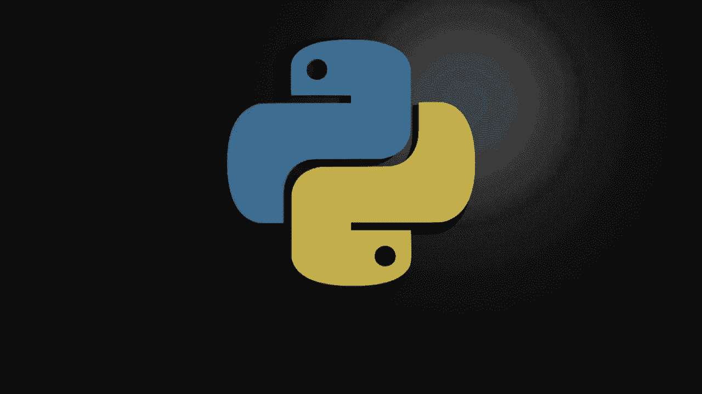
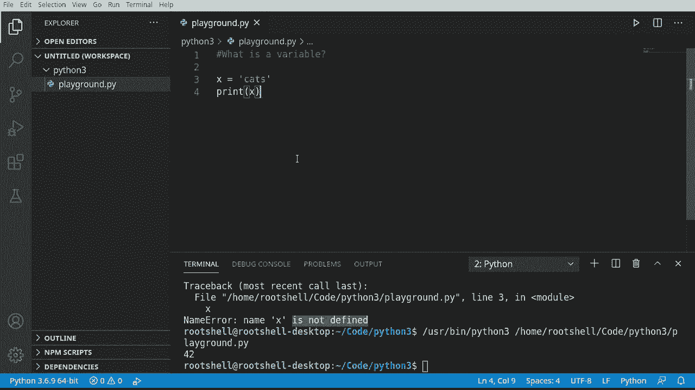
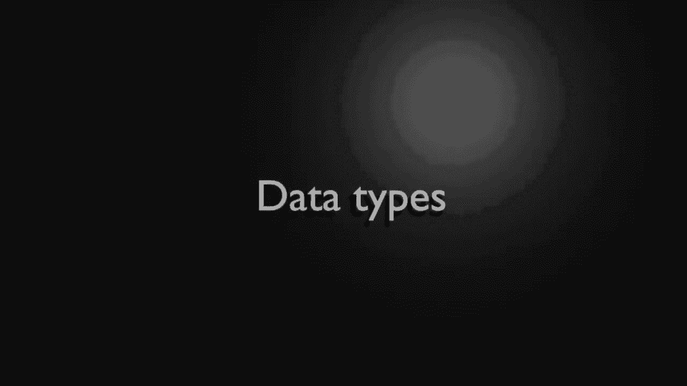
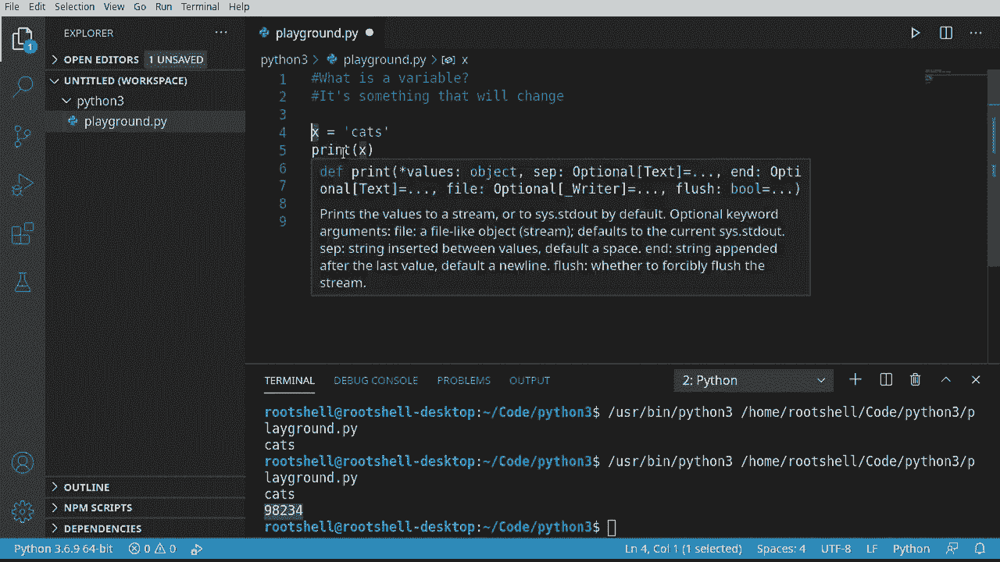

# 【双语字幕+资料下载】Python 3全系列基础教程，全程代码演示&讲解！10小时视频42节，保证你能掌握Python！快来一起跟着视频敲代码~＜快速入门系列＞ - P2：2）Python变量 - ShowMeAI - BV1yg411c7Nw

Welcome back， My name is Brian， We're going to continue our conversation about Python 3。 whatever IDE you're using， go ahead and make a new file and give it some type of name。 I'm just going to name it playground， not really important which name it you just need some sort of file you can play around in。Remember， these videos assume you have no experience， so we're literally starting with a blank slate。

The first thing you're going to learn is what is a variable， I'm going to write this out here。Well。 a variable is simply something that will change， for example， if I declare a variable named X。I have to assign this some sort of value。 go ahead and try and print X out， see what happens here。Notice it's going to have some sort of error， it's going to say name error， name X is not defined。

 What does that mean？Well， clearly， we defined it。 It's right here。 Really。 what Python's trying to tell you is that it doesn't really have any sort of value。 So I'm going to say。42。Now let's go ahead and rerun this。In a how suddenly it says 42。So if you get a is not defined， really what you're saying is you have not set that value。

You notice how this is a number。And this is what I mean by a variable is something that will change。 I could have very easily said。Hats。Notice how cats is a string。A string is just a series of characters， but it's not a number is the point I'm driving home here。 Canin't if we run this。

It works just fine。

So under the hood， what you have going on here is Python knows it's smart enough to know。What type of information we're storing in this variable， and we can change it at a moment's notice。So。For example， we have x equals cats， and let's just grab this It'll copy and paste action。And we'll say， x equals。H，I need some sort of number。 Why not？And the I D E is not happy with me。

 saying invalid token。 I'm just going to get rid of that 0。 Maybe that'll clear it out。 Nope。 will not。Let's go ahead， up， there it goes， let's run this。You know how it says cats。 And then it's got a number。 so we can take this same variable and change it。 And Python is smart enough under the hood to know that X is a string。And X is an integer。

So what we're really diving into and we're going to spend a lot of time talking about this is data types and when I say a lot of time I'm going to have to break this into multiple videos because each data type。 whether it's a string，Or a number like an integer here。

 has different properties that you can access。So the short answer to what is a variable is just simply that。It's something that will change。That's it， it's that simple。A lot of instructors are going to take like months and months and months to explain what a variable is and how it lives in memory and bh。lah， blah， as a programmer， we don't care about any of that， we just want it to work。

And this is computer programming 101。 You declare some type of variable。You set the value and that value has some sort of type， and with that type， you can now work with it。Interesting note here， if you're coming from another language or if you know a little bit about programming。 Python， you do not have to declare the data type， for example。In other languages。

 you may have to say something like int X equals3。 So what we're really doing here is we're stating or telling the interpreter。This is the data type we're going to work with。 We don't have to do that。 Python。 It's smart enough to figure it out on its own。Okay， let's take a little detour down to The land。 Now， what we're going to talk about is。Dynamic and strong typed Python is both。

 and this is often confusing for people， especially coming from other languages， As you saw。 we don't have to declare the data type Python smart enough to know。In other languages。 you do have to declare。 And that gets super confusing to people。 So we're often asked this question。 Why is Python a dynamic language and also a strongly type language。

 And what do those two things really， really mean。 dynamicy means just that， It's dynamic。 You don't have to declare a variable type。 And you can change that at a moment's notice。 As you saw right here。 We went from a string to a variable。 And it's smart enough to keep track of everything for us。 And no errors were thrown。

Other languages you're going to get a huge error because we're saying。 once you declare this as a data type， it can never be anything different。

That gets kind of convoluted。Best answer here is Python is a strongly typed language as the interpreter keeps track of all variable types meaning。The interpreter， Python itself， is smart enough to know what you want it to do。 but it is also guaranteeing un the hood that once you assign it。 it's going to stay that variable type until you overwrite it or change it。 Remember。

 a variable is something that will change。 And with Python， that's very。 very true because you can change it to a completely different data type。A lot of other languages。 you simply can't do that。