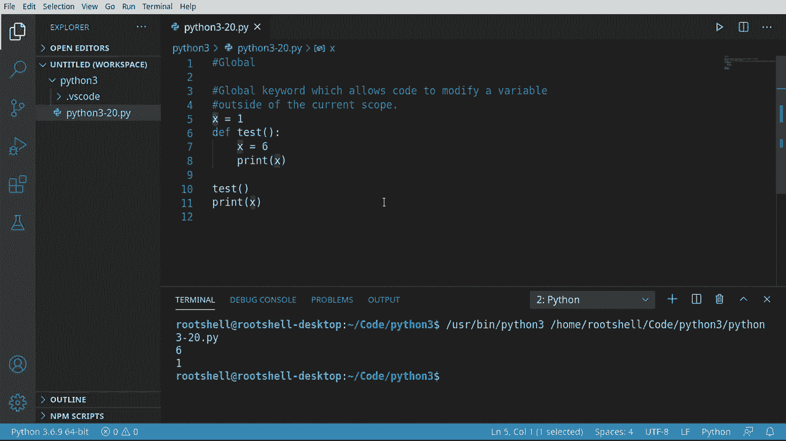
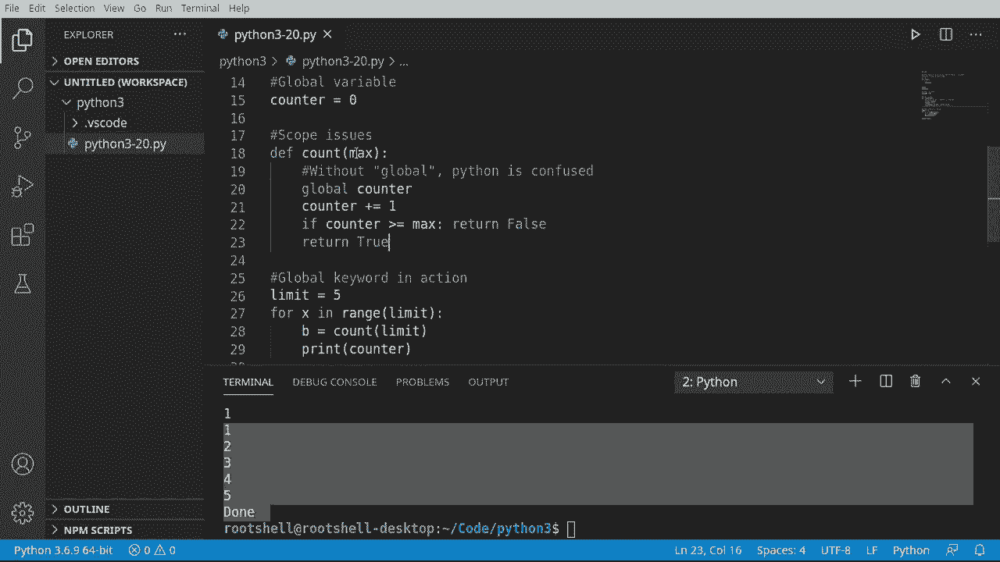

# 【双语字幕+资料下载】Python 3全系列基础教程，全程代码演示&讲解！10小时视频42节，保证你能掌握Python！快来一起跟着视频敲代码~＜快速入门系列＞ - P20：20）全局关键字 - ShowMeAI - BV1yg411c7Nw

欢迎回来，大家好，我是Brian，我们将继续探索Python 3与全局关键字。这非常酷，非常简单，并解决了一个复杂的问题。😊例如，我们之前见过这段代码。X是1。我们有一个函数x是6。如果我们运行这个，结果会怎样？让我们找出答案。所以我们有6和1。基本上，X是两个不同的变量。

它们的处理方式不同，因为这是两个不同的作用域。记住，每当你定义一个函数时，你实际上是在定义一个作用域。所以，全局关键字允许我们修改变量。没错，就是全局作用域。让我们深入看看。

好的，如果你跳过了关于作用域的视频，我们真正要深入探讨的是代码块。我们正在定义一个有自己作用域的函数。问题是Python是词法或静态作用域，这意味着如果我们运行这个，我们有两个不同的变量。然而，这很令人沮丧。如果你注释掉这个。

它将访问全局作用域。因此，我们想要能够访问和修改，这正是全局关键字的作用。所以，首先，现在我们理解了这个基本前提，先来测试一下这段代码。果然，1，1。我们可以在更高的作用域中访问。让我们看看如何修改。

让我们来定义一个全局变量。好，这就行了。其实真的是这么简单。仅仅因为我们把它放在这一行。没有多余的填充。这就是在文件的边缘。这现在被视为全局作用域。让我们深入看看作用域问题，假设作用域问题。

现在我们来定义一个名为count的函数，它将有一个最大计数的数字。现在，如果没有全局关键字，Python会非常非常快地变得混乱。我们来演示一下。因此，我会说，Counter。等于，实际上，little'll做加等于。我们将立即增加这个值。

有时Python会让你这样做，有时不会。其他时候它会完全崩溃，搞不清楚你在做什么。但在我们运行之前，你现在可以看到，它说，未定义变量counter。这令人困惑，因为它就在这里。所以记住我们的对话。

我们正在访问它。但现在它突然说，哦，它没有定义。这令人沮丧。让我们试着运行它，假设我们说，输出。我们只是尝试计数一次看看会发生什么。哦，未绑定的局部变量，局部错误。抱歉，局部变量counter在赋值前被引用。

之前提到的赋值前引用真的给了我们线索，说明这里发生了什么。它所说的是。现在正在创建一个新变量。然后试图在我们实际赋值之前对其进行递增。所以记住，Python的类型有点。好吧，是个谜。我们不知道那是一个字符串。实际上，一旦它被创建，它就是未定义的。所以如果你取未定义的。

如果你尝试给它加一，预期的行为是什么？记住，未定义并不是0。它只是简单地什么都没有，字面上什么都没有。它根本不知道它是什么类型。因此，Python会变得非常困惑，非常、非常快。让我们继续输入，看看这会变得多糟，我们要说。

计数器。如果大于或等于最大值，那么我们就直接返回false。否则，我们就返回true。你看，问题相同。所以在这里，它认为没问题。它实际上知道这是一个整数，但在这里，它却说这是未定义的。这就是我所说的Python会非常快地变得非常困惑。哦，这真让人沮丧。

所以我们要通过说。Logo。Mouner来修复这个问题。注意它有完全相同的名称。所以我们实际上是在说使用名为计数器的全局变量，并在这里赋予它同样的名称。保存它。保存后，你会注意到IntelliSense足够聪明地知道，嘿。这实际上是现在定义的，我们可以开始使用它，而且它知道这是一个整数。

让我们看看全局关键字在这里的实际应用。我将创建一个名为limit的变量。它将是5。我想用这个来递增我们的计数器。所以我说4 x在范围内。我们将使用我们的限制。从那个函数中获取一个变量。使用那个限制。

让我们打印出来。或者打印我们的计数器。为了好玩，让我们打印出来。完成。所以我们可以看到它确实有效。继续运行，果然。哦，我完成了。所以现在一切都按预期工作，这一切都要归功于这个简单的小关键字。在标准实践中，我倾向于避免在函数内部修改全局变量，正是出于这个原因。

比如，假设。我想抓住这个。并把它做成一个完整的新函数。我去。家里，我不需要那个全局变量。我只想要一个名为计数器的变量。我不需要那个。现在，突然，你猜到了，我们又回到了同样的问题。所以现在很难搞清楚我们在谈论哪个计数器以及在什么函数中。

你可以很容易地通过这样做来修复它，但当然。现在你又回到了修改全局变量，这实际上不是一个好的编程实践。当你有疑问时。我们稍后会讨论封装，但你希望封装或使用几乎所有内部作用域的内容，而不是去修改其他作用域。
