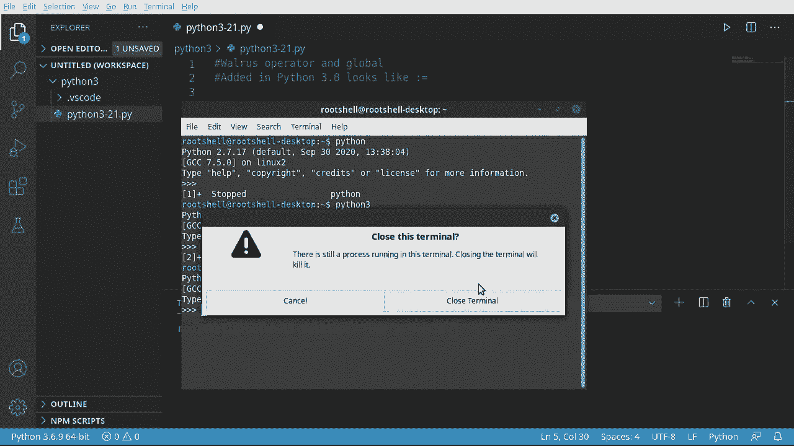
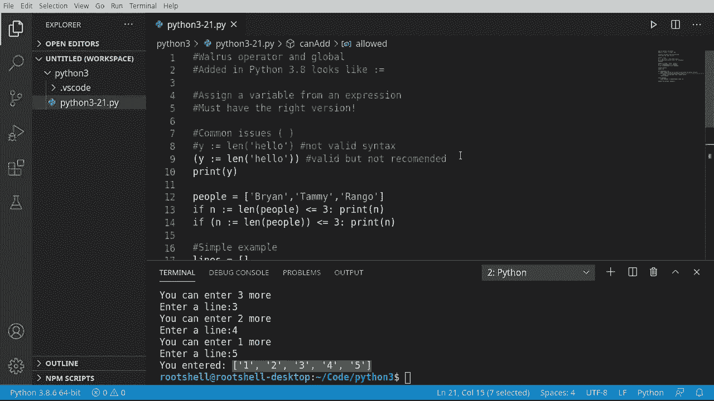

# 【双语字幕+资料下载】Python 3全系列基础教程，全程代码演示&讲解！10小时视频42节，保证你能掌握Python！快来一起跟着视频敲代码~＜快速入门系列＞ - P21：21）海象运算符 - ShowMeAI - BV1yg411c7Nw

Welcome back， everyone。 In this video， we're going to talk about the walrus operator。 The what that's right。 The walrus operator， It's funny name， and it gets it from these syntax。 it's colon and equal。 And if you look at it， like if you like cock your head sideways。 it kind of looks like a walrus。 It's got the little eyes and the tusk and everything。

 that's where it gets its name。😊，This is a little bit confusing。 and this might hurt your brain a little bit。And to make it even more complex。 you have to have the right version， this isn't available in Python until Python 3。8 or higher。But what the walrus operator allows us to do is assign a variable from an expression。

 meaning we're going to take some chunk of code and turn the end result of that code into a variable without having to do a whole lot of complex stuff。In case you're wondering aboutversioning， remember if you pull up a terminal。And there's different ways of doing this。 you can see down in the corner。 I'm using Python 36，9。 There are different versions installed。 So， for example， if I type Python。That's 2，7。嗯。

By type Python 3， my systems at 369。So that's not going to work。 I would have to do 3。8。I have 3。86。 just use whatever you have if you don't have 3。8 or higher installed。 this will not work and you'll have to go out to Python's website and。Download and install and configure Python 3。8 or higher。

 follow the instructions for your operating system Google's your best friend if you have a problem or you can visit me in the Voros Facebook group。 there's details at the end of this video。For our purposes here。

We're just going to go down here and we're going to select Python 3 and then select the correct workspace。 which should be Python 3。8 or higher。And suddenly， everything starts popping up and saying。 do you want to install this， Do you want to install that。 I'm not going to do any of that for this video。 I'm going to apologize if it keeps popping up。

 though。Let's dive in。 Let's look at some common issues。 and I put the parentheses here for a reason。 because that's going to be your biggest issue when working with the walrus operator。 For example。 if I say why and then walrus， I'm just going to say walrus。Len。Of hello。What do you think we're doing here？Well。Let's try and print why out。U oh。

 I get no graphical error in the IDE because well。There's really no pilotlinter installed。 I can install kite or something else like that。 But I just wanted to switch versions and see this thing work。 And it' saying syntax error invalid syntax。What do you mean in valid syntax。 I'm using the walrus operator， and I've got the right version of Python。Hm。

 this is what I'm talking about， let's just grab this guy right here。And let's just put that same thing inside parentheses here。And I'm going to put some notes at the end here。Just for anybody who downloads the code so they know what's going on。And let's comment this bad boy out。Butut that at the end there， didn't I， There we go。

And let's rerun this。 Now， suddenly， we get the output L 5， it's valid。 but according to Python's website， it's not recommended。 why。 because it's just confusing to look at what is going on here。 It's almost like we're。Calling a function， remember。In programming and in math。

 anything inside of the parentheses is pretty much done first。 So what we're really telling Python is as you're reading this， stop what you're doing。Wrununch all this stuff between these parentheses and then replace all that parentheses with the value which is five。 so it's just going to really make a variable called five。Seems confusing。And it is9 times out of 10。

That's going to be your biggest issue。 is just you forget to put something in the parenthesesis。 So let's go ahead and。Look at another real world example here， I must say。People equals。And we're going to make a list of people。So me， my wife Anne， family dog， big old stinky， dumb dog。He's probably down there wanting a treat right now。

 But he's not getting one'cause I'm up here making a video。 Po dog。 So I'm going say if。And walrus。Then， and we're going to just get the length of that variable right there。 And I want to just say less than orre equal to3。Then go ahead and print it out。And we're going to print out n。Little confusing。 but what's going on here？

I'm saying n is walrus or equal to this expression。The length of people。Which in this case。 should be three because I have three elements。 We're saying if it's less than or equal to 3。 go ahead and print it out。 But when we run this， we have been betrayed。 It actually says2。What come on。Why is it true， Why， Because we forgot the parentheses， Let's just take the same thing。

And let's just go ahead。And rapid in parentheses here。Rerun it， and sure enough we get three。So nine times out of 10， if you have a problem with the Wallrus operator。 it's because you're missing your parentheses。I am not a fan of introducing new concepts without some sort of example。 so let's make this。Super short， but super confusing because the walrus operator is confusing。

All right， so I'm going to say lines equals， and we're just going to make a list。And we're going to use a function。All can add。With a maximum of five， as the default。Which is going to determine whether or not we can add to that list。And we're going to say。嗯。漏宝。Lines。 I don't like doing this because what we're saying is now we can modify this。

 but I want to make sure Python knows we want this list。 We're not creating some new variable。That gets a little bit cumbersome。 Not a fan doing that when， in doubt。 you should actually send it as a parameter slash argument。Let's work with the walrus operator。 Let's unleash our inner walrus。 I'm going to say allowed equals and knows how allowedud's not defined。

 So what we're doing is we're letting the walrus operator define this variable。So if you're worried you're going to get an undefined error， don't worry， it's not going to happen。 But whenever you see walrus think the walrus needs to open his mouth。 you should see these parentheses if you don't， you're going to have a bad time。

Let's go ahead and say。This is going to be the count。 And again， Lawrus operators。 So we need some sort of parentheses， but we're going to use a function。Then。 we're just going to get the length of those lines。Now we're going to say we want the max。And that looks really crazy and confusing， but what are we doing here， We're creating one。

 two variables， and we're saying allowed is going to be this code expression here。Os my mouse ever wants to cooperate this code expression here。And count is going to be this code expression here。Whatever you see these parentheses。 you are working with some sort of expression or scope， but usually both。 Let's go ahead and print。

And we're going to say F。You can enter。And we want the max this the account。More。 so we want to tell the user in real time how many more they can actually enter。 We're going to drop back down and say it return。 And we're going to just return whether or not this was even allowed。That looks super confusing。 But the pole point of the walrus operator is we've reduced code。

 We now have a variable that got assigned an expression。 We didn't have to say something like aloud。Equals something， something， something。 And then put the allowedud in the if。 It just automatically does all of it for us。To further make this confusing。 let's do something that I see people doing all the time。

I'm going to say while and then a function is going to return a bull。And we're just going to loop until that function says we can't do it any more。 Sa the lines。You had to pen that。And we're going to make another variable called L。 I'mre going to get the input。We' on the user。Whoa， that's crazy， all right so。We are making yet a third variable here。

And let's go ahead and just print out that we're done。Okay。Highlight the wall's operating see just in our little example here。 we are creating one two three variables。Whenever you see wrus think immediately to the left is what we're creating。Immediately to the right， whatever is in the walrus's mouth is what we're using to create it。

Kind of crazy。If allowed。And the count。Less the max。 then we're going to go ahead and get the max minus count blah， blah blah that gets super confusing。 We're going to return a bull。 we're going to use that bull。 and then we're going to get this value from the input all in one line。Really。

 really reduces our code， but it also makes it a little bit harder to read。So I'm going to say we' just going to enter some stuff。 One， we can enter four more， three more。 two more。One more An Bo， you entered， and it gives us our nice， neat little list。Major takeaway here。Walrus operator is super convenient， but can be super。

 super confusing whenever you see the walrus operator think immediately under the tusk。You need the mouth， which are these parentheses。 and then whatevers in the parentheses is going to get assigned to the variable because you're really taking an expression in putting it into a variable。

 You also need Python 3。8 or higher， or you're going to get a whole lot of crazy errors because earlier versions of Python have no idea what you're talking about。That in a nutshell is the walrus operator。