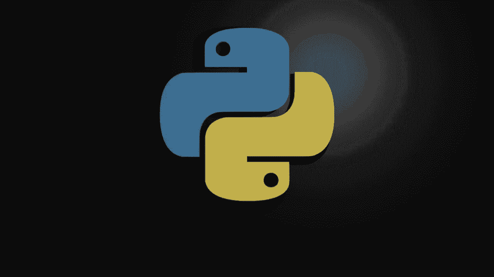
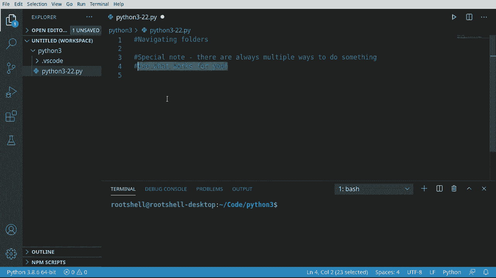
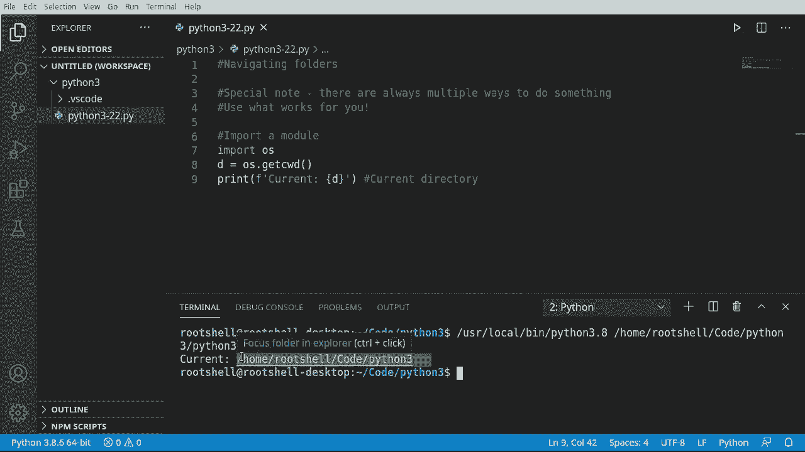
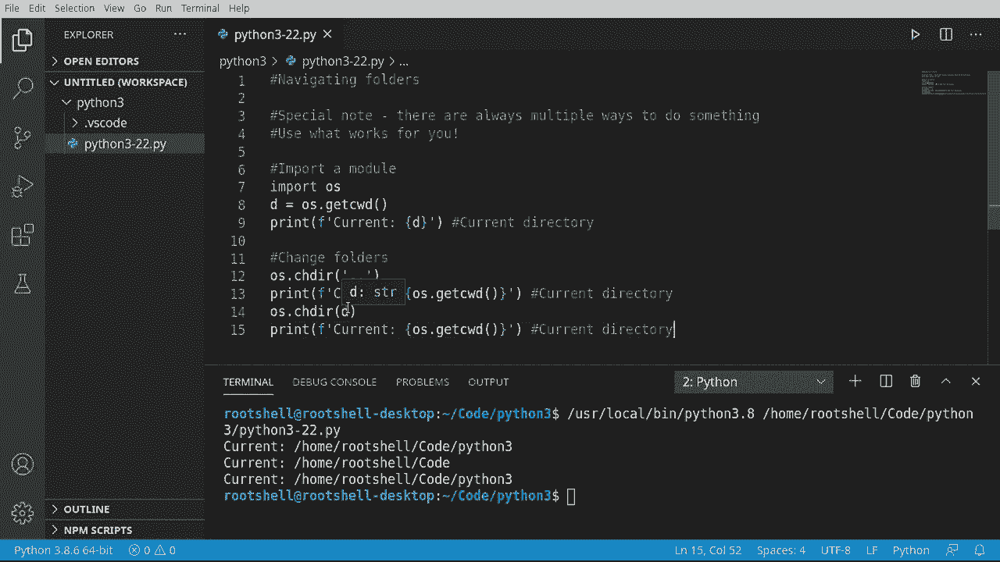
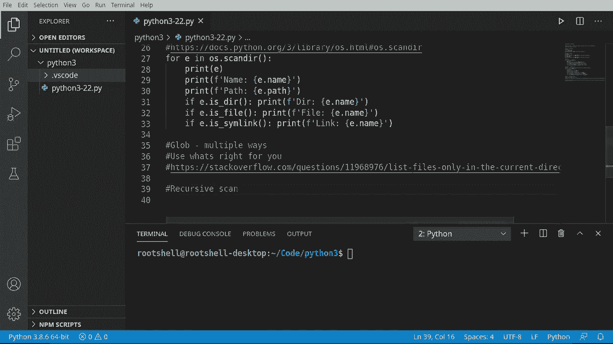
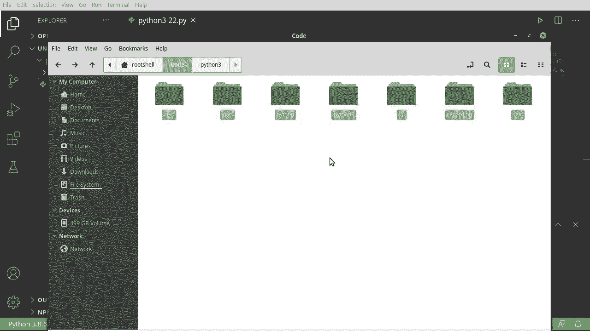

# 【双语字幕+资料下载】Python 3全系列基础教程，全程代码演示&讲解！10小时视频42节，保证你能掌握Python！快来一起跟着视频敲代码~＜快速入门系列＞ - P22：22）文件夹操作 - ShowMeAI - BV1yg411c7Nw

欢迎回来，大家好，我是Brian，我们现在要讨论Python 3中的文件夹导航。在我们开始之前，剧透警告，有多种方法可以完成某事。这在每种编程语言和每个计算机操作系统中都是如此。基本上，随着计算机的发展，编程语言和人们用来创建程序的平台也在不断演变。

它们在幕后变得复杂无比，但在前端使用时却变得极其简单。但它们也隐藏了很多复杂性，这导致了很多困惑，特别是新手，因为他们会问做某事的最佳方法是什么。简短的答案是没有一个。使用对你有效的方式。我们将讨论几种情况。

但你会看到评论区里的人说，是否使用那种方式。相反，使用另一种方式，再次回到黄金法则，使用对你有效的方式。

让我们深入了解一下！

首先，我们要做的是导入一个模块。你可能会说等一下。我以为我们要处理的是导航文件夹。我们将了解文件夹是文件系统的一部分，它可能变得非常复杂，而很多内容都集成在Python的核心中。

但我们需要与他人的代码一起工作。其中一些代码已经集成在Python中。我们只需告诉Python我们想使用它们。因此，我们将导入OS模块。如果你在想模块是什么，那是一组我们可以使用的代码。

其他人已经编写了这段代码，我们可以随意使用它。所以首先，导入OS，这样我们就导入了一个模块。一旦模块被导入，我们就可以开始使用它。因此，我将创建一个变量，叫做D。代表当前工作目录的缩写。

如果你在想那是什么。每个应用程序都在某个目录中运行。每一个。它们都是你系统上的某个文件。那个文件位于某个目录内。如果你使用的是Linux、Unix或Mac，它在根目录中，看起来像这样，仅仅是一个斜杠。如果你在Windows环境中。

它看起来会像这样。现在。这是OS的根目录。但很可能你并不在根目录中。你在OS的某个深处。所以让我们弄清楚我们实际在哪里。因此，我将说打印。让我们格式化一下。我将说当前。

我们只是想知道我们在操作系统中的位置。有时这就像是在深蓝色的海洋中导航一样，我们不知道自己在哪里。所以我们将获取当前工作目录。或者我们可以使用已经提取出的变量。现在，我必须指出，这是当前目录。

这并不意味着每个程序都在这个目录中运行。它只是表示我们的程序正在运行的目录。所有其他程序都在不同的目录中运行，甚至在同一个目录中，这会让人感到困惑。好吧，在我的虚拟机上，我们当前在`/home/root/shell`中，这是我当前的帐户。

`slash code slash Python 3`。所以你可以看到我们不在根目录中，而是在几个级别下的子文件夹中。

假设我们不太喜欢这个文件夹，只是想用不同的文件夹看看能否实现，那么我们就来更改文件夹。我必须输入`O S . C H D`，代表更改目录。`C W D`是获取当前工作目录。

我们将进行`C H D`或更改目录。掌握术语似乎有点混乱。现在，你实际上可以硬编码这个，比如说我们可以使用`home . Obs files`，某些东西，或者如果你在Windows上，它就像`C \`，随你所需。或者你可以使用所谓的当前路径，这意味着你没有任何路径在其中。

这有点高级，我将使用`dot dot`。你可能在想这个`dot dot`是什么意思。它实际上代表当前目录及其父目录，因此我们实际上是向上移动两个级别。这听起来有点混乱，但我们来看一下。我将抓取一些代码，打印当前的目录。

我们将说`O S get current working directory`。注意我们没有重用`D`，我将抓取这个以备将来参考，让我们运行这个。我们又上升了一层，因此我们在Python 3，现在在code中。我们只是简单地上升到父目录。所以当你看到`dot dot`时，实际上我们就是在上升一层。

我们将在这里重用这个变量，我将说`OS . C D`，并跳回到该目录的字符串表示。抓住它，粘贴，然后清除一下以防万一，运行。我们从Python 3上升到父目录，然后再回到Python 3。所以Python 3上升到父目录再回到Python 3。导航文件夹结构非常简单。

如果你知道路径，那真是太简单了，但你只需输入一个字符串，咔嚓一下就可以了。现在，这是假设它确实存在。我们将在未来的视频中讨论如果它不存在该怎么办。但请知道，如果你尝试给它一个不存在的东西。

你会过得很糟糕。

记得我开始这个视频时，我基本上说过有多种方法可以做同样的事情。我们将开始查看其中一些。第一个是列出。这可能是最简单的方法。所以我们将说 4 F 在 O S。记得我们添加的那个导入吗？我们将去。任何 Drmerel，列表。好了。

这是一个函数。我们必须有括号。我们可以指定目录，我们可以使用当前目录。现在，如果我们只是打印出来，它就很好。打印，看看这里发生了什么。没什么特别的。它只是有一个文件加上这个小点 VS code。VS code 就是这个文件夹。

其中有另一个文件。所以我们正在获取文件夹和文件。如果你的目录中有很多文件，你会看到它们全部。很有趣。那么我们如何实际确定每一个是什么呢？让我们把这个美化一下。注意这只是 Ithon 3-22，脚本的名称，但我们没有获取完整路径。

让我们继续说，王子。让我们格式化一下。路径。这就是下面评论区的人们开始互相争论的地方。我会说哦，路径，我想获取 A B，S 或绝对路径。这将告诉我们绝对路径，下面某人可能会说。

你为什么不使用真实文件或类似的东西？再说一次，这是个人偏好。这是我想要的。让我们继续运行，哦。哎呀，这些敏感性又让我受到了影响。好了，现在它按我们预期的工作，路径给出了完整路径，而不仅仅是文件的名称。

所以这里的区别是我们有文件名，然后我们有绝对路径。让我们把这个变得稍微复杂一点，我想让 OS 做 F。让我们确保它是一个目录。现在我们只需打印出来。我们可以采用相同的模式并重复它。所以我们将说如果它是一个目录。

只需打印目录，然后无论是什么。如果它是一个文件，它会继续打印文件及其内容。让我们再加一个，仅仅是为了好玩，那就是链接。你可能在想链接是什么。这是文件领域中的一种特殊符号，基本上说的是我不是正确的那个。

转到这个其他位置。它实际上只是指向另一个位置。你可以称它们为快捷方式或符号链接，这真的取决于你的操作系统。注意，这在 Windows 6.0 之前总是会返回错误，因为 Windows 6.0 之前没有符号链接。你可能在想，Windows 6 是什么。

我们是否收到了 Windows 6 的广告，这是 Windows 版本管理的方式，微软有时候就是有点傻。但基本上，如果你有一个旧版本的 Windows，它永远不会返回 true。让我们继续保存并运行。你可以看到我们的路径，它是一个文件，然后我们的路径和一半，它是一个目录，所以它按预期工作，我们现在可以确定它是一个文件还是目录，并且我们可以获取绝对路径。

所以，Listister。连同 OS dotpath 实际上相当复杂，并且可以完成你可能需要的绝大多数功能。稍微倒回一下视频，你会记得我说过，嘿，随着计算机变得越来越复杂，代码变得更简单，但细节却变得有些模糊，而这是一个完美的例子。Scanander，这在 Python 3.5 或更高版本中出现，我们一直在使用 Ler。你可能会问自己。

我们为什么需要 scanander。Lister 似乎完成了我们想要做的几乎所有事情。好吧，scanander，这里最大的卖点是它被封装在一个类中，并且速度更快。虽然我只想说，除非你在进行一些高编码，否则你真的看不到巨大的性能提升。

你可能会感到困惑，想知道你为什么要使用它。但如果有疑问，我们就深入研究一下。我将说 scanander，然后我们来打印出来。K，我在里面有 E。当我运行这个时，你将看到一些神奇的事情发生。Ta，它说 D entry，然后是名字。这意味着什么呢，这是一种奇怪的语法。

每当你看到被括号包围的内容时，这意味着 Python 正在给我们一个类。我们将在未来的视频中讨论类。但现在，重要的信念是，类仅仅是一个自定义数据类型。它实际上是别人定义的对象的蓝图。

我们将在不久的将来学习如何构建我们自己的类和蓝图。但现在，你真正需要理解的是，我们有一个名为 DR entry 的自定义数据类型。说到数据类型，我们指的是像字符串、数字、列表以及类似的东西。它的条目只是另一种数据类型。

让我们来处理一下这个。我们要说 print。这就是我所说的，你会在复杂性中迷失一点的意思。我们有点困惑，想弄清楚。我们需要打印什么，所以你必须实际去查阅文档或观看这个视频的其余部分。

我们要说 E dot。我们想要名字。接下来获取路径，所以我将抓取这个。因此，整个目的就是让生活变得更简单。但与此同时，Scner 的速度确实比 Ler 快。Ta，现在它在路径中工作。让我们继续。并且。运行一个小问题。当我说运行一个小问题时。

我们想要获取目录、文件和符号链接，和之前的方式差不多。所以我会抓取这个。这就是这里会变得有些令人费解的地方。如果我说 E 点是 D 是文件是符号链接。你会觉得这很简单，然后说，好的，试试这个。但实际上我们在背后微妙地创造了一个问题。

我在想有没有人能真的发现这个问题。让我们先抓取这个名字。现在我们进行了一些修改。O quiz，有人能发现问题吗，举手？

那么这里发生了什么？他们的 entry.dotvscode，我们说 dotvscode 实际上是一个目录。看，它就在那儿。但它却打印出 D 文件和链接，等等。它不可能同时是三者。那么这里发生的事情是我们实际上在调用一个函数。或者至少我们应该是。我想演示这一点，因为有人可能会遇到忘记加括号的问题。

然后他们得到了奇怪的结果。再运行一次，你会发现现在它按预期工作了。但它实际上并没有抛出任何错误。这就是令人困惑的地方。所以如果你在扫描中遇到奇怪的结果，确保你放上了那些括号。好的。

好的，让我们来谈谈 Gob。我提到 Gob 有多种方式，因为到目前为止我们已经介绍了另外两种方法。TheBob 代表第三种方法，而 Gob，虽然听起来很糟糕，但实际上真的很酷。简而言之，使用适合你的方法。我们之所以讨论 Glob，是因为这个原因，我在这里放了链接。一个典型的 Stack Overflow 问题，就是，如何扫描所有文件夹和子文件夹，或者说是递归的。

扫描。如果你稍微理解一下递归扫描是什么。我们在这个 Python 3 文件夹中，要跳到上一级目录。我想知道这些文件夹的所有内容。如果其中一个文件夹里面还有一个文件夹，我想进入那个文件夹，依此类推。

我们将进行递归扫描。现在，在某些语言和框架中。这并不是一个简单的事情。但 Gloob 让它变得极其简单。所以我们需要做的第一件事是导入 Gob。

我不知道你为什么会想要一个 glob，但无论如何。我希望他们能给这个起个更好的名字。所以我们要更改目录。我们要上到上一级目录。所以我们要进入一个更高的目录。现在，我要在这里定义一个变量。这个变量将是 O S。然后我们将获取当前的。

我会说获取当前工作目录。现在我们实际上要处理 G。我会说 4。文件名。和 G。gllo 会变得非常混乱，我们不会深入探讨 Gob 的所有部分，但要知道你可以用 Gob 做很多不同的事情，实际上只是触及了表面。所以我们会说 Gob，Gob。听起来就像是在酒吧里和一个醉汉交谈。Gb，glob。

不管怎样，blob，我们想要给它一个路径名。我们将在这里得到一些帮助。所以半个名称，我会说，等于我们的目录。我们将提供一些通配符。我们需要告诉 Gloob 要做什么。我会说。任何东西后面跟着任何东西。每当我们看到星号，那就是我们的通配符，然后我们想要递归。

等于 true。所以我们告诉 Gb。不仅仅是这个目录，还有里面的所有目录。继续施展你的魔法。继续以格式化的方式打印出来。我想要将其 glob 化。像是现在卡在我脑海里的，gal glob，不管怎样。你知道，可能有一群程序员围坐在房间里说我们做了这个非常棒的东西。

我们称之为什么呢？我们就称它为 Gob，然后他们似乎认真对待了这个名字。好了。GloB 有很多内容，你可以看到我在里面还有其他项目的代码，包括 C++ 文件、make 文件、文本文件，以及我做过的其他 Python 脚本。诸如此类。所以 Glob 现在已经读取了所有这些内容。

为了展示有多种方法来做到这一点。我们再换一种方式来做。所以我会说 4。让我们走。当前路径。Ooldders。和文件。在 O，我们的 gobu O 进行遍历。基本上，我们会告诉操作系统在我们当前目录中走一圈。现在，记住。点点是父目录，点是当前目录。所以我们只会说 O S。

锁定当前目录。我要继续说 4。文件在文件中。这并不是一个递归的操作，但这里给你一些细节。假设我们继续打印。让我们继续处理这些，我会说，哦，路径。那连接。所以我们要做的是将所有这些连接起来。我们想知道当前路径。

和文件。如果你对我在哪里获得当前路径和文件感到困惑，它就在这里。所以实际上，OS S Walk 返回的是一个元组。我相信我们只是从中提取那些元素，然后使用 OS 路径连接将它们连接起来，使其看起来像这样。相当有趣，也很容易理解。所以总结一下，有，嗯。

实际上有多种方法来做几乎相同的事情。每种方法都有自己的优缺点和小问题，以及不同的实现方式。使用适合你的方法。这个视频涵盖了如何更改文件夹，Ler，Scer，Gloob，以及 O S 遍历。你会在其他人的代码中看到所有这些。我们之前在谈论递归，它有自己的一系列复杂性。

我们将在未来的视频中也会涉及这个主题。😊这是初学者的指南，我们只是触及了我们能做的表面。！
