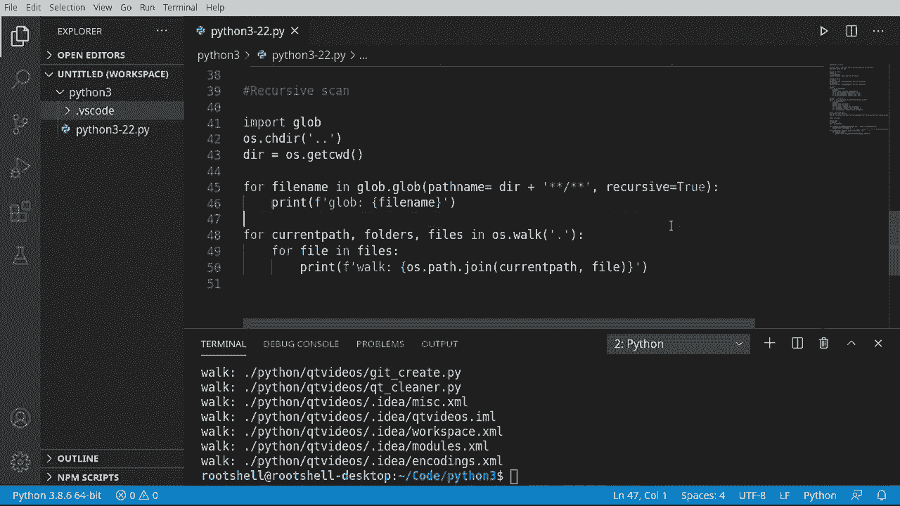

# 【双语字幕+资料下载】Python 3全系列基础教程，全程代码演示&讲解！10小时视频42节，保证你能掌握Python！快来一起跟着视频敲代码~＜快速入门系列＞ - P22：22）文件夹操作 - ShowMeAI - BV1yg411c7Nw

Welcome back everyone， this is Brian， we're going to talk about navigating folders in Python 3 now。Before we begin spoiler alert， there are multiple ways to do something。 and this is true in every programming language on every computer operating system。Basically。 as computers of all， so do the programming languages and platforms that people use to create programs。

 they get infinitely more complex behind the scenes and infinitely easier to use up front。 but they also hide a lot of that complexity， which leads to a lot of confusion。 especially newbie's because they say what's the best way to do something。 The short answer is there isn't one。Use what works for you。We're going to cover a few situations。

 but you're going to see people even in the comments down below say， are you using that way。 use this other way instead， again， refer back to the golden rule， use what works for you。

Let's dive in and take a look。

First things first， what we're going to do is import a module。 You may be going now wait a minute。 I thought we're going to work with navigating folders。We'll understand that folders are part of the file system， and it can get very， very complex。 and a lot of this is baked right into the core of Python。

 but we need to work with someone else's code。And some of these。 the ones we're going to work with are already baked in a Python。 we just need to tell Python we want to use them。So we're going to import the OS module。In case you're wondering what a module is， it is a group of code that we can use。

 someone else has already written this code， we can just simply use it however we want。So first things first， import OS， so we're importing a module。Once that module is imported。 we can start working with it。So I'm going to just make a variable called D。 shorthand for directoring an say O。Dot。Yet。Current working directory。

C you're wondering what that is。Every single application runs inside of a directory。 every single one of them。They are a file on your system somewhere。That file lives inside sight of a directory。If you're on like a Linux or Uniix or Mac。 it's in what's called root， which looks like that， just a slash。 If you're in Windows land。

 it's going to look something like that。Now。That is the root of the O S。 But chances are you're not actually in the root。 You're buried down deep in the O S somewhere。 So let's figure out where we're actually at。 So I'm going to say print。And let's go ahead and format that。 And I'm going to say current。

We just want to know where the heck we are in the OS。Sometimes this could be like， you know。 navigating the deep blue sea or something。 We just don't know where we are。So we're going to get that current working directory。Or we could just use our variable。 which we've already pulled out。Now， I have to put， this is the current directory。

 does not mean that every single program runs in this directory。 It just means what our program is running in。 All the other programs are running in different directories or even in the same directory。 It can be either or Its super confusing。 All right。 on my little virtual machine。 We are currently in slash home slash root shell。 just the account that I'm on here。

 slash code slash Python 3。 So you can see we are not in the route。 We are in a subfold several levels down。

So let's say just for example， we don't really like this folder。 we just want to work with a different folder just to see if we can do it。 so let's go ahead and change folders。So I must say O S dot C。 H D which stands for changeder change directory。 So get C W D is get the current working directory。

 We're going to C H D or change directory。 seems a little confusing to get the terminology down。 Now。 you can actually hard code this。 like let's say we could home。Obs files， something， something。 Or if you're on Windows， it would be like C， Wack Wack， you know， whatever。You wanted。 or you can use what's called a current path， which means you don't have any sort of pathing in there。

Again， a little bit advanced。 and I'm just going to do dot dot。Is your wondering what that means that dot， dot。It actually stands for your current directory and its parent。 so we're actually going up to levels。Sounds a little confusing， but let's take a look here。I'm going to just。Rrab some code here。We're going to print the current。

 and we're going to say O S get current working directory。 Notice how we're not reusing D。 and I'm going to。Just。Grab that for future reference here， let's run this。And we've gone up a notch。 so we were in Python 3 now we're in code。 So we just simply jumped up to the parent。 So when you see dot dot， that's really all we're doing is jumping up a level。Now。

We're going to reuse this variable here， and I'm going to say。OS。That CD。And we're going to jump back to that string representation of that directory。Grab that， paste it。Clear this out just for good measure and run。 So we went from Python 3 up to the parent and then back to Python 3。 So Python 3 up to the parent and back to Python 3。Navigating the folder structures is very。

 very simple。 If you know the path， it's just ridiculous simple。 but you just handed a string and boom。 it just goes。 Now， that's assuming it actually exists。 We're going to cover what to do if it doesn't exist in a future video。 But just know that if you try to give it something that doesn't exist。

 you're going to have a very bad time。

Remember when I started this video， I basically said there are multiple ways to do the same thing。 And we're going to start looking at some of those。 The first one is lister。 And this is probably the easiest way to do it。 So we're going to say 4 F in O S。 Remember that import that we added。And we're going to。Anybody Drmerel， list。 There you go。

 This is a functions。 we have to have our parentheses。And we can specify directory we can use the current。Now， if we just print this out， it's just good。 print， and see what this does here。Not a whole lot here。 it's just got one file plus this little dot VS code。VS code is this folder right here。

 which has another file in it。 So we're getting folders and files。 And if you've got a lot of files in your director， you're going to see them all。Interesting。 so how do we actually determine what each one is？And let's pretty this up a little bit。 notice how this is just Ithon 3-22， just the name of the script， but we don't get the full path。

Let's go ahead and say， Prince。Let's format that。Fath and。This is where people in the comments below are going to start arguing with each other。 I'm going to say oh S。Path， and I want to get the A B， S or the absolute path。This is going to tell us the absolute path that file someone down below is probably going to say。

 why aren't you using real file or something of that nature。 Again， personal preference。 This is what I want。 Let's go ahead and run that oh。Ass no a oh。These sensitivity has come back to bite me。 there we go。 so now it is working as we expect path and as giving the full path， not just the name of the file。

So that's the difference here is we've got the file name and then we've got the absolute path here。Let's go ahead and make this a little bit more complex and'll see if， and I want OS do F。And let's make sure it is a directory。Now we're just going to go and print this out。And we can take the same pattern and just repeat it。So we're going to say if it's a directory。

 just print dirt and then whatever it is。And then if it is a file。It's going to go ahead and print file and whatever it is。And let's add one more just for giggles is link。 you're wondering what a link is。 It's a special kind of symbol out there in file land， which basically says I'm not the right one。

 go to this other location。 It literally just points to another location。You could call them shortcuts or symbolic lengths， it really depends on your operating system。Notice how this will always return faults for Windows prior to 6。0 because Windows before 6。0。Did not have symbolic links。 And you may be wondering， what's Windows 6。

 Did we ever get an advertisement for Windows 6， It's just the way Windows does versioning Microsoft' just kind of dumb sometimes。 but。Basically， if you've got an older version of Windows， that's just not going to ever return true。 Let's go ahead save run。And you can see that our path， it is a file， do。 and then our path and half and it is a directory， so it's working as expected and we can now determine whether it's a file or directory and we can get the absolute path。

So。Listister。Along with OS dotpath is actually pretty complex and does most of what you may actually need it to do。Rewind the video a little bit and you'll remember I said， hey， as computers get more complex。 the code gets easier， but details get kind of murky， and this is a perfect example of this。Scanander， this appears in Python 3。5 or higher we've been using Ler。You may be asking yourself。

 why do we need scanander。 Lister seems to do just about everything we'd wanted to do。Well。 scanander， the big selling point for this is it encapsulateulated in a class and it is faster。 although I will just say it。Unless you're doing some high encoding。 you're really not going to see a massive performance boost。

 And you may be scratching your head wondering why you're been working with it。 But win a doubt。 let's just dive in here。And I'm going to say scanander， and let's go ahead and print this out。K how I have E in there。When I run this， you're about to see something magical happen Ta， it says。D entry。 and then the name。 So what does this mean， This is a weird little syntax。

Whenever you see something encapsulated in brackets like that。 it means that Python is handing us a class。 and we're going to talk about classes in a future video。 But right now， Major leap of faith， a class is just simply a custom data type。 It's really a blueprint for an object that someone else has defined。

 We're going to learn how to build our own classes and blueprints in the near future。 But right now。All you really need to understand is we have a custom data type called a DR entry。And we to say data types， we're talking about things like strings， numbers。 lists and things like that。 their entry is just another data type。

Let's go ahead and work with this a little bit here。We're going to say print。And this is what I mean by you get lost in the complexity a little bit here。 We're kind of scratching our head， figuring out。What we would need to print out。 so you have to actually go out and read the docs or watch the rest of this video。人成呢。

And we're going to say E dot。And we want the name。Go ahead and get the path here。 so I'm going to grab this。So the whole purpose of this is to make life a little bit easier。 but at the same time， Scner does work faster than Ler。And ta， it works now in path。Let's go ahead。 and。Run a little bit of an issue。 and when I say run a little bit of an issue。

 we want to get the directory， the file and the symbolic link， the bulls kind of how we did before。 so I'm going to grab this。And this is where it's going to get a little mind bending here。 So if I say。E dot is D is file is symbolic link。 You think it's pretty straightforward and you go。 okay。Let's try this。But what we're doing under the hood is subtly creating an issue。

 And I'm wondering if anybody out there can really spot this。Let's go ahead and grab this name here。Now that we've done a little bit of surgery。O quiz， can anybody spot the issue， raise your hand？

So what's going on here？Their entry dot vS code， we said dotvS code is actually a directory。 see there it is right there。But it is printing out D file and link， wait。 it can't be all three at once。What's going on here is we're actually calling a function。 or at least we should be。I wanted to demonstrate that because somebody out there is going to run into that issue where they forget to put the parentheses。

 and then they have some weird results。Run that again and you see now it works as expected。 but it never actually threw any kind of error。 That's the confusing part。 So if you ever get some weird kind of results out of scan。 just make sure you got those parentheses there。Okay。

 well let's go ahead and cover Gob and I put Gob multiple ways because so far we've covered two other ways to do it。TheBob represents a third way， and。Gob， although it sounds gross， is actually really cool。 in short use what's right for you we're covering Glob because of this and I put the link here。Typical stack overflow question， which is， how do I scan all folders and subfolds or A K A A recursive。

Scan。And if you kind of wrap in your head around what a recursive scan is。 We're in this Python 3 folder， we're going to jump up to the parent here。 And I want to know the contents of all of these folders。 And if one of these folders has a folder in it， I want to go into that folder and so on and so on。

 And we're just going do a recursive scan。 Now， in some languages and frameworks。 This is not for the faint of heart。 But Gloob makes it ridiculously simple。 So first thing we need to do is we need to import Gob。

I don't know why you'd want a glob， but anyways。I wish they picked a better name for that。So we're going to change our directory。And we're going to go up to that parent。 So we're going to go a directory higher。Now， I'm going to say there。 I'm going to make a variable here。 this is going to be O S。 and we're going to get the。Current。

 I would say git current working directory。Now we're going to actually work with G。 and I'm going to say four。Byile name。And G。And gllo is going to get really confusing and we're not going to like deep dive into all of the parts of Gob。 but know that you can do a bunch of different things with Gob or really just scratching the surface。So we're going to say Gob， Gob。Sounds like you're talking to a drunk person in a bar。 Gb， glob。

Anyways， so blob， we want to give it a path name。We're going to have in tell usense help here。 So half name， I'm going to say， is equal to our directory。And we're going to give some wild cars here。 We need to tell Gloob what to do。And I say。Anything followed by anything。Whenever we see star， that's our wild card， and then we want recursive。

Equals true。 So we're telling Gb。Not just this directory， but all the directories inside of it。 go ahead and do your magic。Go ahead and print that out formatted。I want to glob this out。Like stuck in my head now， gal glob， anyways。You know。 there was probably like a bunch of programmers sitting around a room going we made this really awesome thing。

 what do we call it， let's call it Gob， and then they kind of took that seriously。There you go。 So GloB has gotten a lot of stuff， and you can see I've got other code from other projects in there。 including C++ files， make files， text files， other Python scripts that I've worked on。 things like that。 so Glob has gone through and read the contents of all of those now。

To kind of show that there are multiple ways to do this。 let's go ahead and do it yet a different way。 So I'm gonna say 4。Let's go。 current path。Ooldders。And files。In O， ourgobu O do walk。And basically， we're going to tell OS to go take a walk in our current directory。Now， remember。Dot dot is the parent dot is the current。 So we're just going to say O S。

 lock the current directory。 And I'm going to go ahead and say4。File in files。This is not so much a recursive scam， but it gives you a little bit of detail here。Let's say go ahead and print。And let's go ahead and work with these， I' going say， oh path。That join。 So what we're going to do is we're going to join all of this up。We want to know the current path。

And the file。 And if you're kind of confused about where I got current path and file。 it's right up here。 So really what OS S Walk is doing is returning， believe it's a tuple。And then were're just pulling those elements out of there and then using OS path join to join all that up and make it look something like this。Pretty interesting， pretty easy to understand。 So to summarize， there are， well。

 multiple ways to do virtually the same thing。 Each one has its own little pros and cons and little gotchas and different ways of doing it。 Use what's right for you。 This video covered how to change folders， Ler， Scer， Gloob。 along with O S walk。 And you're going to see all those out in other people's code。 And we were talking about recursive， and that has its own set of complexities。

 which we're also going to cover in future videos。😊。This is the beginner's guide and we're just scratching the surface of what we can do。