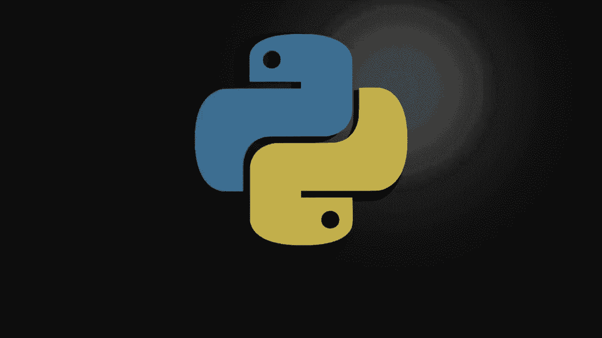
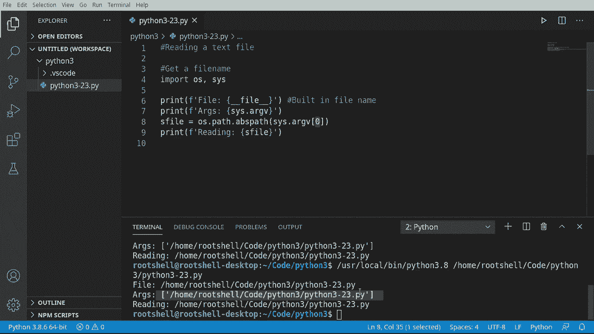
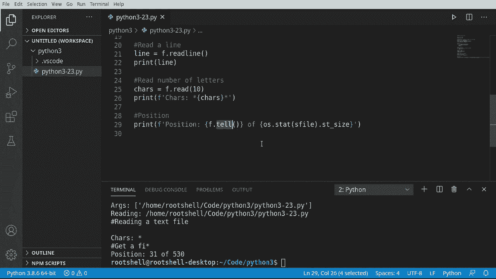
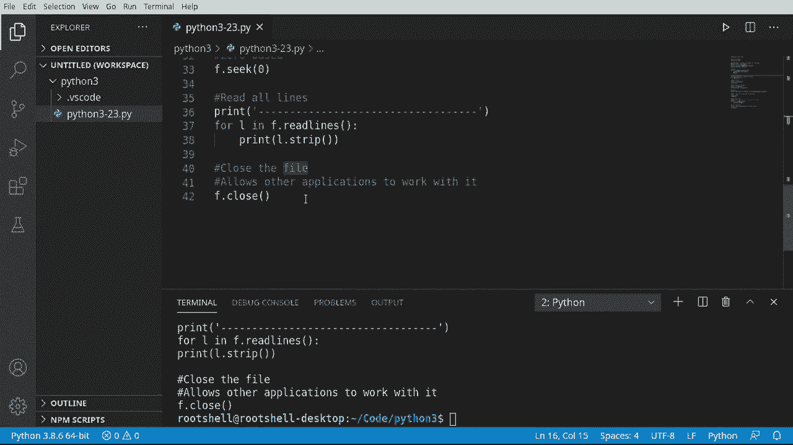

# 【双语字幕+资料下载】Python 3全系列基础教程，全程代码演示&讲解！10小时视频42节，保证你能掌握Python！快来一起跟着视频敲代码~＜快速入门系列＞ - P23：23）写入文本文件 - ShowMeAI - BV1yg411c7Nw

Welcome back everyone and this is Brian。 we're going to talk about reading a text file。 The main takeaway from this is it is easy。 anybody can do it。 So if you're intimidated with the file system， do not worry this is super ridiculously simple。 let's dive in and take a look。

First things first， let's go ahead and get a file name。 Now， your operating system is full of files。 but we want to read a file and not disrupt any other application。 So we're going to read ourselves。 meaningan this file right here that you see on the screen。 we're going to read this。 So we have to get the file name to this script。 How do we do that。Well。

 there's a couple different ways。 We're going to show how to do a few of them。 So we're going to say OOS and cis， we're going to import both those modules。 You do that just by putting a comma。 We could have done it one part line with import module。 import module。 I'm just going to do it all in one shot。Let's go ahead and say， Prince。

And you're going to see this quite a bit out in Internet land。Where someone is going to say something like this。Whenever you see the double underscore。 it's kind of like a built in little。Piece of information in Pythononic gets a little more complex to that。 but just understand that double underscore means built in。And you seeterra。

We've got the full path to our script。 Now， there is a problem here。 Now， the problem is。That may not always exist， Sometimes you're going to get into a situation where this just simply does not work。So again， going back to our previous conversation， there's always multiple ways to do something。 So we're going to show you what I believe to be a better way。 And we're going to use the arguments。

Now， as or arguments are usually not a good thing。 Usually you want to avoid getting into an argument。 but in this case， we want to dive right into them。So we're going to just print out the cyst。And we want the Arg B。What's going on with this Well， under the hood， when Python calls your script。 this guy， Python da da da。It actually sends you a list of arguments， you ever like。

In your file browser， double click a file and your operating system knows what program to open it up in。Those are arguments， so it will call。Your script。And there'll be another。 It'll be like comma and then whatever you want to work with。 So just know the first argument Python's going to send you is， well， the name of yourself。

 what you're currently running， makes it super easy。Now， let's go ahead and say。We want to get。Be full path here， just to be sure。We want the OS path， we want the。A B S path。Now。 a lot of folks in the comments are going to say， why are using the A B S path or the absolute path。 Why don't you use this other one。 We're just doing this for demonstration。

 We haven't really dived in the complexity。 I'm going to do an entire video on the different types of paths and what they mean and which one's best and so on and so forth。 But right now， we're still in newbieance。 We're just going to do the A B S path。

And then we're going to。Briin out reading whatever this file is。 Let's go ahead and run this。And there it is。 So it's just simply handing us back a list。Of arguments。 the first one or the zero position is always the script that's currently running。

One thing I really want to demonstrate is， does it exist Well， if we're running our own file。 we know it exists， if we're going to run this and read it。 we know it exists because we're currently in there editing it。But just for giggles。 I want to cover how to determine if the file exists。Ian， that is the existential question。

 Does the file exist。Do we exist， Intering， So anyways， let's。Say if。 and let's go ahead， say not。Oh。 asked do path。Exists you may be wondering what not is。Not as similar to something like。Not equals to， it's kind of short litigent for that， but I'm just going to say if not OS path exists。And then I want to give an the name of our file。Which we got up here。So if it does not exist。

 then I want to say hey。Rt。And let's go ahead and print that file， not bound。Because if we try to work with some file that doesn't exist， we are going to get an error message in。What we're going to end up getting is something like this where it's just going to say。File not found error， which would be covered later on。

 So if you're just churning away and you give it the wrong file name。 you're going to have a bad time。 But now that we know the file does not exist。 We don't want to go any further。 So I'm going to say exit。And I have to give it some sort of exit code。 And I'm just going to say one。Makest you're curious。

 a normal exit is 0， and then you would give it some sort of error message like access denied or whatever。 but usually vendors will have different exit code。 So I'm just going to say one。Just so we can tell the in， hey something bad happened。But because we're reading our own file。 it should work just beautifully。 so let's run this。Jur enough works beautifully。

 Let's go ahead and take this and let's give it。A name I know， just simply is not there。Nope。txD。 let's run this again。file that found and then it exits out。Works is expected。Now comes the confusing bit we're going to actually start working with the file。 we're going to start with opening the file and if you get a file not found error during this。

 it means you have the wrong file path and you did not follow the directions。Or something's going horribly wrong with this。So what we're going to do is we're going to say f equals and we want to call open。Sounds ridiculously simple， and it is now which' just going to give it a path。Now comes the confusing bit， we have to give it what's called a mode。

Now I'm going to do another video on modes， but this one's just going to cover reading text files。 so Im must say。二。Just stands for read， and we're just going to read plain text。 But what this whole things going to do is it's going to go out。In your operating system。Make sure that file is there， if not， you're going to get a file in that found error。

 and then it's going to try to open it for reading。And it's going to put the cursor in the file at the zero position。It's going to hand you a file object back。 So this one little line。 there is a lot of complexity going on there。

Now that we have the file open， let's go ahead and read a line and I'm going to say the line equals。 we're going to take that file variable， and I want to say we read。 and you notice how we get a whole lot of options。Read， read a bowl， read line and read lines。 We want read lines。 So we're just going to read one single line。

 and let's go ahead and print that out。Save Ron and reading a text file so it read the first line out of our file。 very， very cool， you also notice how it put this little return down here because guess what there's a return right there。At the end of this， there is an invisible slash R slash n or slash N。 depending on your operating system。Just know that。It's also going to include that。

 So when we print this out， we're going to have to strip that out。 but we have successfully read a line。Now， if reading a line was cool。 you're going to really love this。 we can actually control this。 I'm going to read a number of letters。 So I'm going to say cares equals F dot read。

And notice how it wants a number， so we're going to read 10。Let's go ahead and print this out。And I'm going to actually format this， say cares。And we'll put star star。And then。What we're actually reading。So if you look at our file here， it says reading a text file。 and now the cursor is right here， so let's run this and see what happens。

And you see how it says cares star， and then it's got a return line feed。Get A FiI and then star。 so we've actually controlled how many characters we've read。I wanted to do it this way to really show the complexity here。 notice we've cut this hard return line feed here and we may not actually want that。

So if you're using the read function， you're going to get some weirdness like that。 And that's why I tend to use read line when I'm working with a text file。Now。 somebody very observant is going to notice as we've been reading， things have been moving forward。 meaning we read a line。 Then we read a number of characters。And it said， get A FI。

 It didn't start back over at reading。 So what's happening here。As we read。 there is an invisible cursor， much like in this text document。 You see that cursors right there。 It always starts off at the 0。 So invisibly， there's a 0 right there。 And it's just like a list or a tuple or anything like that。 It's a 0 based index。

 it's going to start at 0。 And as we read， it will move forward。 So as it says read line。It's going to move there。 and then when we say ray 10， it's going to move there。 so it's going to actually count。So this invisible cursor is going to keep moving。What I want to do now is just show the position。 How do we figure out where we actually are in the file。

 This is a bit advanced， and it may not make a lot of sense to you in beginner land。 but as you'd get into advanced file processing， you're going to need to be able to move back and forth in a file。 So I want to introduce this concept fairly early。Let's go ahead and say print。And we are going to format this， let's see。Position。And I wish they had named it position。

 but instead， they named it tell。 So we're going to call the tell function。 which is going to tell us the position。Now， I want to say of。 because I want to know how big this file actually is。 So going say O S。And we're going to call the statistics。We're going to use our S file variable that we have earlier。

And I want to know the S T。Underscore size。 And if that's super confusing。 sometimes intelligencetelst will help you out if you're working with an advanced telece system like kitite or something like that。Um，But you can dig through the documentation or you can just， you know， trust me。O， do stat。File name ST underscore size， so we're getting back in integer。

Now the size is the size of the file in bytes， let's run this。So we are positioned 31 of 529 and as。We add more and more to this。You'll see this position change。 even though it's a comment the file's growing in size， let's run that again。S enough，5，38。Remove that and 530 because we deleted some stuff。So that is how you would determine where you are and the file size。

Major takeaway here is， as we're reading that invisible cursor is moving。 Now。 I want to put it right back at the very beginning。 So we're going to call seek。 And again。 this is more of an advanced function， but I want to introduce it very early。 This is always 8。0 based。Remember our conversation about lists and topples and dictionaries。

 it's always a zero base index。 So I'm going to say our file object do seek。And we're going to seek to 0。 Now， if you caught that as I was typing。You see this sable。 Some files are not going to be seekable， so that may break if you' are doing some custom work。But for our purpose， it should work just fine， we're just going to tell it where to seek。

So seek0 is going to tell us move all the way back up。 So if we were working and we're just reading。 reading， reading， reading， reading， as seek0 is going to say， go right back up to this zero spot。Let's run this and graphically it has no effect， but if we do another read。 you'll see it actually start over again as we're about to demonstrate。

So now that we understand this invisible cursor and positioning and we know how to control where it is。 and we've set it back to the zero position， let's go ahead and read all the lines。 I'm putting this big long line here， we're going to print this out just to separate all this out so we can see it in action here。What I'm going to say is4 L and F dot。Read and want read the lines， notice there's read line。

 which will do a single and read the lines， which will just keep going and going。And we're going to read this entire file line by line。 I want to say print。And it's going to hand me back a string。 So I want to say L， we want to strip that。 Now。 what strip does， it removes any extra white space。 So those hard returns like right here。

 how we got these little。Returns it's going to strip that out if we don't do that。 we're going to get some really funky results， and I'll demonstrate that。So let's run this。See。 stopped it right here。So here's the start of our file and it went all the way down to where we are pretty cool Now if we comment this out。And just grab this。This is what I mean by you'll get some funky results if you don't strip that out because print automatically puts in。

The carriage return line feed。 Let's go ahead and clear all of this out。You can see how now it's got this extra space in between each line。 so that's why we need a call strip。Let's go ahead and put this right back the way it was。And today。 it just works。Okay， systems Resource 101， anything you open， you have to close。

 so we are going to now close that file。Think of a file like a door on a really cold day。 You open that door。 You're letting all that weather in。 Now you want to close it。 So what close does is a few different things。 But for our purposes， it's very simple。 It allows other applications to work with it。 If we have open this and the underlying operating system has locked the file for reading。

 That means nobody else to make modifications to it。Don't worry， ridiculously simple。F close。Always。 always， always。 when you open a file， close it。You don't want what's called a hanging resource now Python。K， and most of the time does close the file automatically when your script's done。 but don't count on that。 Sometimes you'll see out there if you open a file and forget to close it。

 it just stays open forever。Very， very frustrating so close。You're not going to see anything graphically changed。 but it is now closing that door so other people can open it and do what they want to do。Quick recap this video we have covered the complexities of the file system for reading a text file Now text file is different than a binary file。

 which we're cover in a future video， so we're talking about just plain text。 we talked about importing， we talked about getting the current file determining if it exists。 opening a file。Reading some lines and letters and all the lines moving around in the positions and how to actually close the file。

