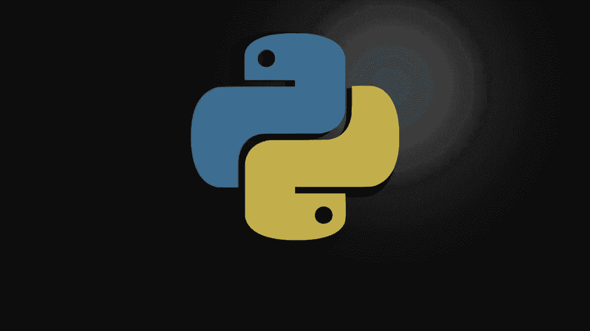
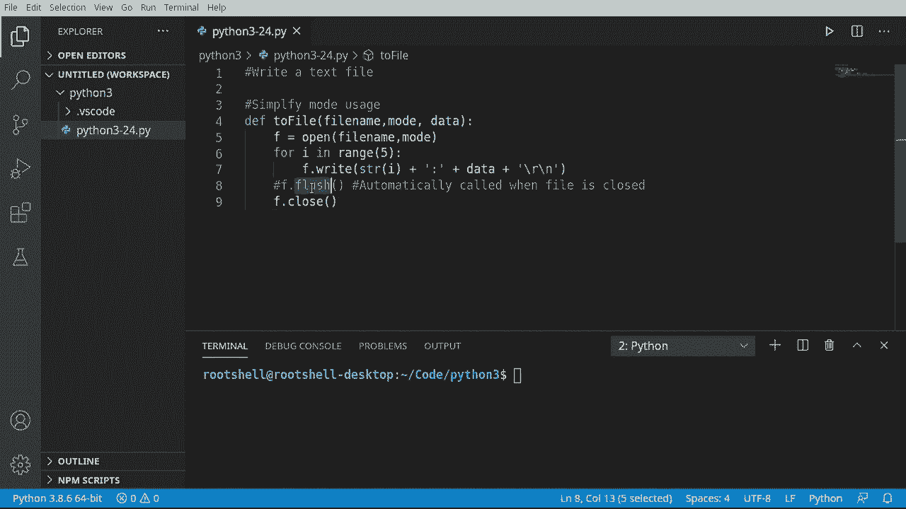
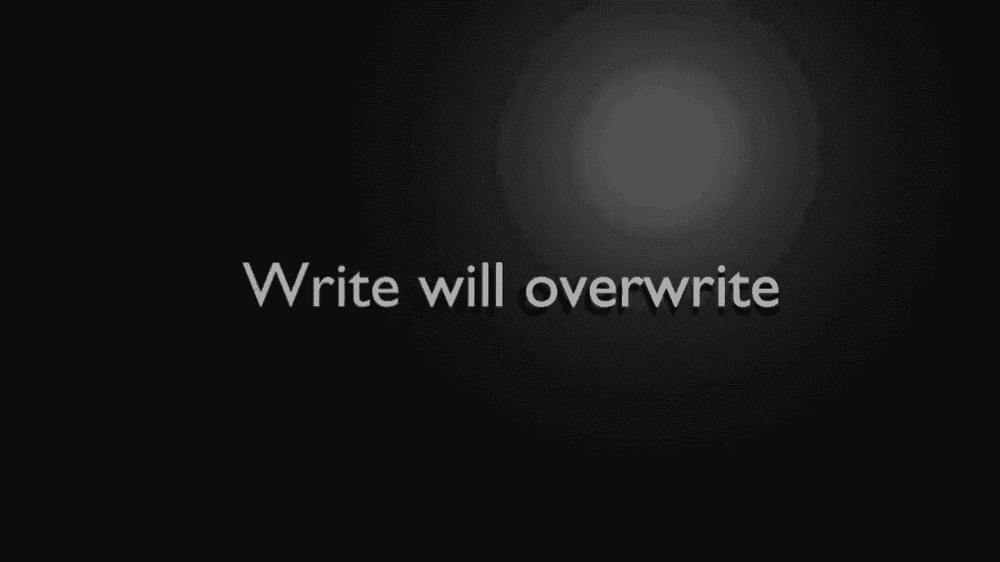
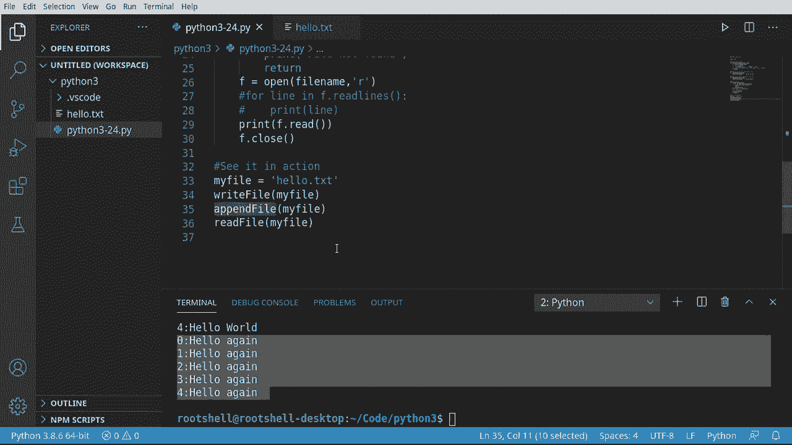
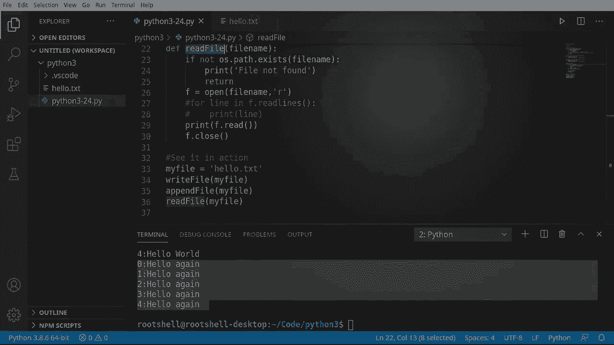

# 【双语字幕+资料下载】Python 3全系列基础教程，全程代码演示&讲解！10小时视频42节，保证你能掌握Python！快来一起跟着视频敲代码~＜快速入门系列＞ - P24：24）二进制文件操作 - ShowMeAI - BV1yg411c7Nw

Welcome back everyone。 My name is Brian， and we're going to continue our journey into Python 3 and we're going to talk about how to write a text file。 This is plain text， not binary。 We're going to talk about writing binary files in a future video。We're going to take what we've learned in the previous video and overly simplify it using functions。 The last video was kind of verbose。 I want to make life much， much simpler。

Our first goal is to simplify mode usage。 Now， what are we talking about here。 We're going to cover two different modes。 We're going to talk about right and a pen。 and they do two totally different things。But we can use the same code。 So let's go ahead and make a function。 I'm going to say to file。And。

Let's go ahead and save file name。Moode。Data， I hear a lawn more behind me。 I apologize that the microphone's picking that up。 It's just kind of。Covid-19。 nothing you can do about it。 My neighbor likes to mow his lawn 100000 times a day。 So I'm going to say open。And we're going to open that file name。And we want the mode。 Now， remember。

 in the last video， we opened it with the read text or the R mode。We're going to work with W and A。 but they can work very， very similarly using the same code。As we're about to demonstrate。 I'm say4 I in range。And we're going to go ahead and say， ring， let's just pick a number 5。And let's go ahead and write this out。And I want to say the string representation of that number。

You're going to get some sort of error message if you don't do that。Go ahead。A little colon in there。Along with the data。And let's go ahead and add in。A carriage return， line feed。/lash R/ and those are our escape characters we talked about that when we're in string La。 so really all we're going to do is we're going to write out the string representation of the number using STR to convert it from an integer to a string。

 and then we're going to add a colon， whatever data we're in and then RN data is going to come to our function。As an argument。Now。There exists this tendency to do something like this。 And you're going to see this blush。I'm going to comment this out。 What does flush do and why do people have it in their code。 When you write to a file。

 you have an invisible buffer in the background。 I should say Python does。 and that buffer will fill up because you can add more to it faster than it can write down to the disk。 especially if you've got a slow， hard disk。 Think about like embedded systems。 how they get really slow。You don't really need to call flush。If you're going to。

Close the file when you're done with the file， you close it。 Ithon calls this automatically when it's closed。 However， if you're doing some sort of。Like sequential rights or something like that and you want to just write to the file in chunks。 you're going to want to flush it periodically to make sure that data gets flushed down to the disc。

I wanted to put that there because I know somebody's going to ask why didn't you flush the contents。 you don't need to because close calls that automatically。And I hate that name， but at the same time。 it makes me chuckle cause you're going to flush it。 And I always think about looking down as disgusting as it is looking at a toilet。

 And you're just going drop data into the toilet and then flush it down。 But that's literally what that does is it flushes all of that buffer down into the hard drive。

So we're going to cover two modes and the first one is right when you hear the word right。Wite will overwrite， meaning it's going to take the existing file completely erase it。And start from scratch。 And you need to be a little bit careful when you do that。 because if you have something sensitive or something you wanted to save。

 it's just going to obliterate that data。 It's just gone。 It will not be in your recycle bin。 It will be gone forever。 So you need to be a little bit careful here。So we're going to write file。And let's go ahead and say。I need some special variable name like IL name， There we go。And we're going to call this two file function， we have a file name mode of data。

So let's just go ahead and grab this。And we're going to call our function here。So we're going to reuse the variable file name， the mode。 we're going to switch this to W for right and the data we're going to say。Hello。Remember。 right will overwrite， it will completely destroy that and start over。

The other mode we're going to talk about is app pen。 Now， append will add。So right we'll overwrite a pen will add Now what this does is it opens the file， Sees。 remember we talked about seeking moving through that file。 it's going to go to the very end of the file， and then it's going to start adding to it。Now。

 this is what I mean by simplify mode usage。 we can literally take this。And just paste it。And then simply change this。To an A for a pent。And then let's change this to ao again。So what's going to happen here is we're going to call right。 it's going to beliterate the file。 start over and then。Up to 5， it's going to say hellello world。 And then we're going to call a pan。

 and it's going to add to it。All right， the immediate goal of this was to write in aend。 but I want to read this file back。So I want to use and import。 and I'm going to put it all the way at the top of the file。Not mandatory。 but it's almost like an industry standard， if you will。To put your imports at the very top。

 rather than just adding it right here， which you actually could。 But let's put it all the way at the top that way。Anything that we've just kind of flubed through and we've used OS will'll get it as well。 and if we decide to go back and modify these functions and use we don't have to accidentally import it multiple times。 so in short， always put your imports at the top of a file。

We're going to say de and let's go ahead and read file。And I need some special variable name。 something that really standss out like， I don't know。 file name。 We could name it fuzzy button。 kitten or whatever we wanted。All right， so we're going to say if not， we want O S。And let's go ahead and say path。That exists。 We're just going to make sure the file we're trying to read actually exists。

Otherwise we're going to get some bad， bad errors。Now， instead of exiting。 I just want to return right out of this function， not kill the entire script。Now， I want to say。We're going to open this up， and this is how just ridiculously simple looking with files and Python can be。G it a mode。And because we've opened something， let's go ahead。 And before we do anything else。

 all'll close。 Now， in between open and close， we can do whatever we want to do。 For example。 I could say4。A line。In F dot。Readed lines。Thing like this。Or if we wanted to really， really。Really over simplifyimplify that。 We could just read the entire file in one line。And we're just going to call。Now， spoiler alert， if you do that on a very large file。

 you're going to have a very bad time because you may run out of memory， your little app may crash。 for example， if you have。3 gigs of memory。 You try to read a 30 gig file。 It's just not going do it。 And it'll sit there for three hours before it crashes， but it'll eventually crash。 That's why we use things like or line in read lines because it reads it one line at a time。

 Not the entire thing。Okay， our warning about reading all of it in one function。 If you had a massive file， notwithstanding。 We're going to leave it like this just for demonstration purposes。 because we're going to work with a very small file。 We're going to see this in action。 I'm going to say my file。 we could name is really anything we want。 Well let's name this。 Ho dot C。

 X T。First things first， we're going to write this file。Just is going to call our function。 Now。 let's go ahead andend the file。And let's go ahead and read the file。There's a reason why we're breaking this up into functions and it's so we can reuse this code。 you're going to hear that term a lot in programming code reuse。

Rather than hard coding the file name and then calling。 or I should say rewriting this function for every single file is just simply to use a variable and reuse the code。So let's go ahead and run this。And you see how it says。0 through 4， Hello world。 And then there are pen kicks in here。 Hello again。Now let's demonstrate this。

So let's get rid of this append。And let's just do right。 notice how we already have a file out there and we can actually open it up。 and this is exactly what it looks like。Let's go ahead and get rid of that append and let's see what I mean by right file will overwrite。 This is why it's so dangerous。Hello worlds，0 through four。 And if we open our file back up。

 you can see。Hello world， all of that hello again， is gone because it obliterated that file and rewrote it。Now we can do this。And it goes right back the way we want it。 Ho again and again。Major takeaway from this is writing will overwrite aend will seek to the end and add to it。 and we can make reading files ridiculously simple。

