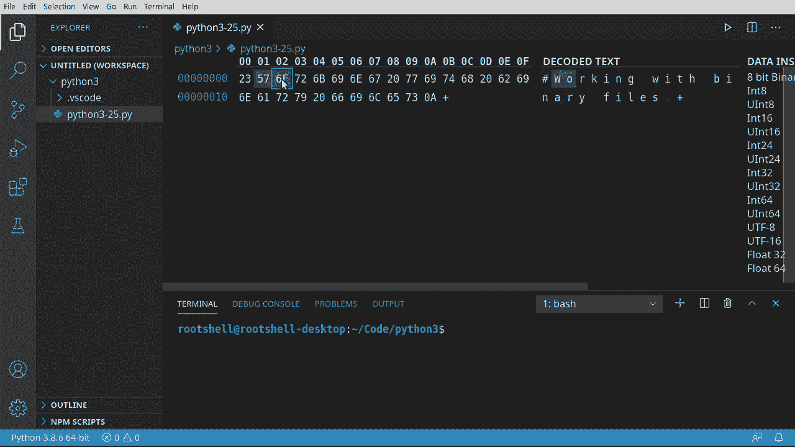
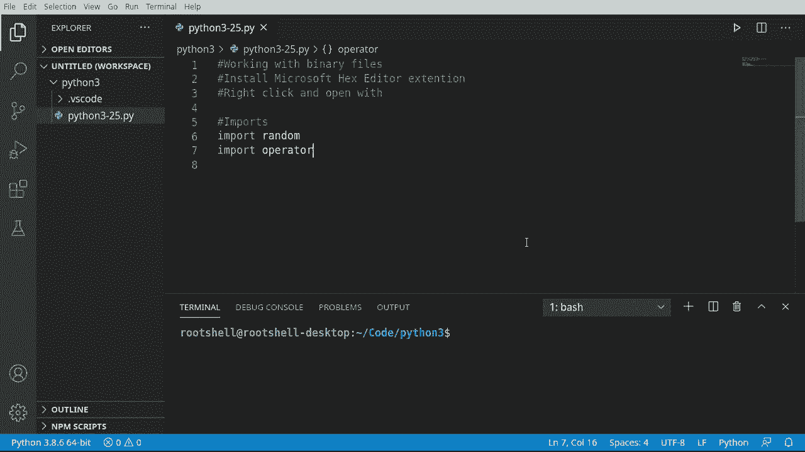
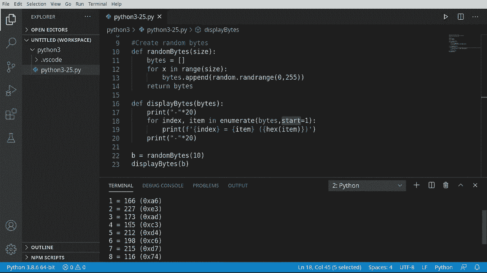
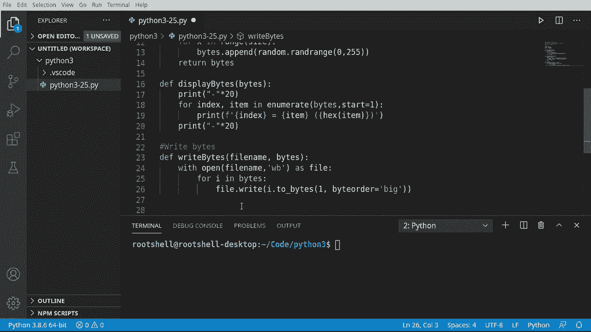
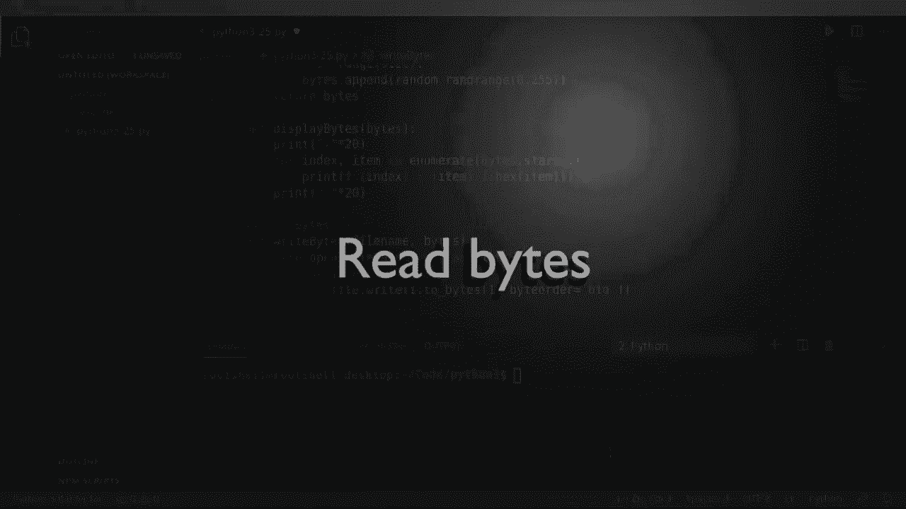
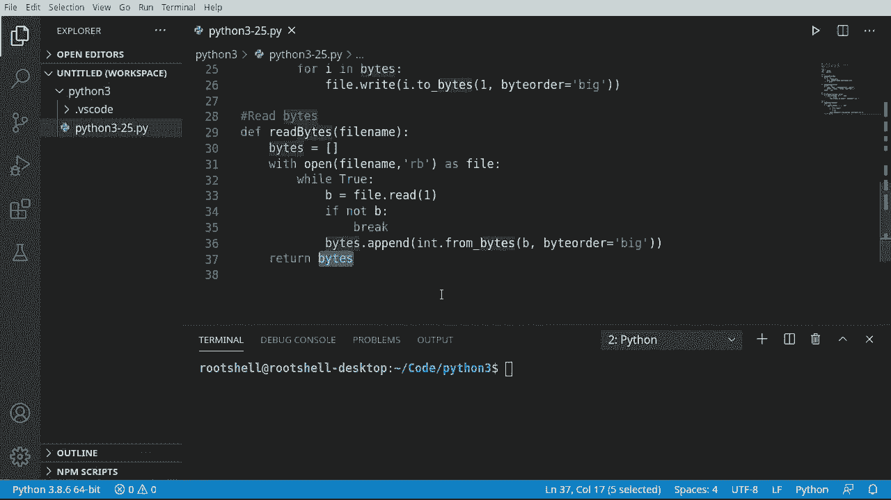
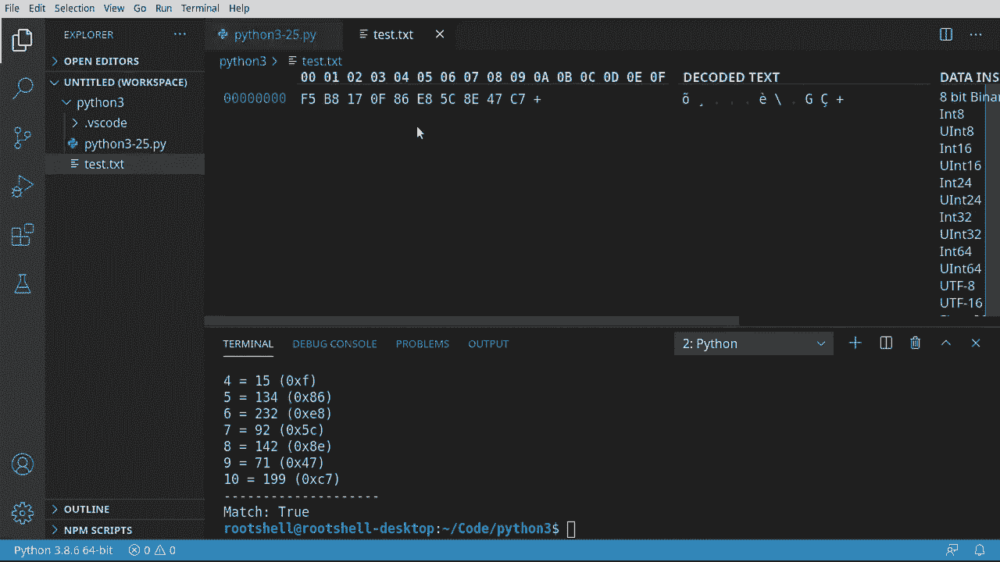
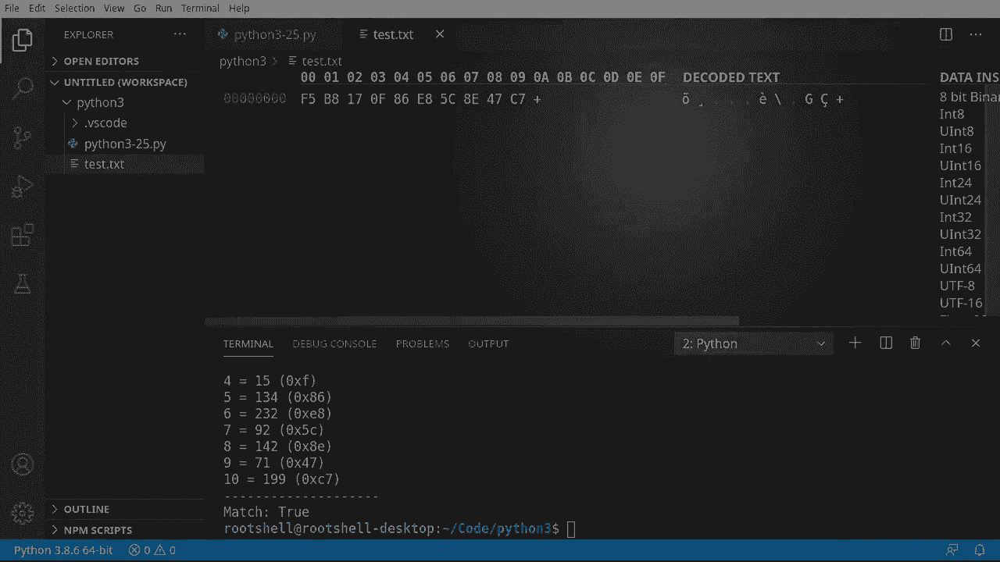

# 【双语字幕+资料下载】Python 3全系列基础教程，全程代码演示&讲解！10小时视频42节，保证你能掌握Python！快来一起跟着视频敲代码~＜快速入门系列＞ - P25：25）读取文本文件 - ShowMeAI - BV1yg411c7Nw

大家好，欢迎回来，我是布莱恩，这是第25集，关于处理二进制文件。首先，什么是二进制？我们之前处理过纯文本，但什么是二进制呢？听起来有点疯狂，几乎像是《黑客帝国》中的东西。残酷的现实是，二进制确实是你不太想直接处理的东西。

我会解释为什么要去扩展选项卡。让我们安装一个十六进制编辑器。现在剧透一下，你并不需要这个特定的十六进制编辑器。你甚至不需要我正在使用的这个 IDE（VS Code），任何旧的十六进制编辑器都可以。十六进制就是十六进制，只要你能查看实际的十六进制表示就行。

一旦安装完成，我们就会返回文件。我们将处理当前的这个文件。我们右键点击。从这里，我们将选择用我们刚安装的十六进制编辑器打开。你可以看到我们有十六进制编码的字节，还有解码的文本。这就是我所说的，解码。

这是计算机处理的内容。这是机器读取的内容。这里是我们通常处理的纯文本。例如，# 的十六进制是 23。然后是 57，对应大写字母 W，6 F。想象一下，试着把你的名字以十六进制方式输入，那会很长也很烦人。所以当我们谈论二进制时。

我们讨论的是计算机处理的原始数据。这并不是我们想直接处理的内容。我们希望处理的是该数据的表示。因此，当我们提到二进制时，这就是我们所说的。我们想给计算机提供二进制数据的表示，让计算机为我们完成所有艰苦的工作。

我们不是在处理纯文本。我们可以处理代表纯文本的单个字节，但我们并不在处理纯文本本身。

好的，我们需要离开二进制的世界，回到文件的世界，这就是我们一直在处理的文件。你会记录一些笔记，它只会说安装微软文本编辑器扩展，实际上不一定需要是微软的那个。

但接下来是一些关于如何处理它的一般说明，以防你在跟随这些视频。现在我们要添加一些导入，在继续其他任何内容之前，我们需要先完成这一步。所以我要导入随机模块。这里的随机是指我们并不是随便导入什么，而是导入一个名为 random 的模块，它将帮助我们生成随机数。

我们将导入操作符模块。这有一个名为 equals 或 EQ 的小函数，我们将用它来比较两个列表，以确保我们生成的信息以及我们保存和加载的信息都一致，且一切按预期工作。

让我们来处理那个随机模块，我们将创建一些随机字节。让我们创建一个函数。我们称之为随机字节。从这里开始。我们将有一个参数叫做 size。让我们创建一个列表。这个列表里什么也没有。现在，我们将说 4 x 在范围内。

我们想要一个范围等于大小。我们从我们的参数中获取这个值。让我们继续附加 Ar less，所以。灯光。现在我们想要实际说随机。我们需要一个范围。所以我必须说 R range。如果你对字节了解一些，它通常从 0 到 55。你可以做一些疯狂的事情。

我们将坚持使用 0 到 255 的标准。非常简单。任何人都能理解，我们不是在讨论某些灰度编码方案或其他任何东西。就是 0 到 255。我们只要这个。从这里开始。我们将返回。字节。所以我们将返回那个列表。所以随机在这里将生成一个随机数。

在 0 到 255 之间的范围内。所以我们将有最多 256 个可能的数字。现在，随机。你可以做种子和所有这些其他花哨的东西。但我们不打算这样做。所以它将使用当前系统时间作为随机数种子。如果你想要一些超级安全的东西，你需要做些不同的事情。

但我们暂时会将一切保留为默认设置。现在让我们打印出来，确保我们得到了，你猜对了某种随机数字列表，所以说 de 并显示字节。继续。我们将在这个视频中介绍几个概念。

有些东西我们还没有讨论过。所以我会创建一个字符串。现在。我想乘以这个。所以我们会说。乘以 20。看起来有点奇怪，但我们要做的是说把这个字符串做 20 次。所以我们说这个字符串乘以 20。现在我们将继续进行。

我们将使用枚举函数来处理这个字节列表。我会说 Thor 索引。那么 item。在。枚举，枚举将把整个对象拆分成多个部分。我们可以使用的东西，你看到那里说的枚举对象会生成包含从开始计数的对，默认为 0。所以我们会告诉它处理那个字节列表并进行枚举。我们不想从 0 开始。

我们想从1开始，因为人不是计算机。我们喜欢从1开始，而不是0。我们只是想让这个可读。现在我们将继续格式化输出，并假设。索引。等于。我们想要这个项目。现在，我们一直在使用十六进制编辑器。

我想给你展示一个简单的小技巧。我们可以简单地说`hex`。我们想要为这个项目制作一个X表示，以便我们可以稍后将其与十六进制编辑器进行比较，确保一切完全按照我们期望的方式对齐。

我将抓取那个小打印函数，回到下方。确保它对齐，这样我们就不必在每个循环中都做，但在for循环完成后。让我们测试一下。所以我将只。抓住我们的随机字节函数。哦，抓得太多了，显然。来了。

现在我们就假设10，仅此而已，没有太疯狂。现在，我想继续显示。那个列表，让我们看看这是什么样子。所以当然，我们得到了一个列表。它是从1到10的人类可读，起始于1，在底层其实是0。但我们使用这个小开始来递增它。

然后我们有该数据的十进制和十六进制表示。

好的，删除了我们的测试，然后我们现在将继续，写一些字节。现在我们必须以稍微不同的方式进行，因为我们一直在处理纯文本，而我们正在处理二进制文件。这不是人类可读的，所以我们必须告诉Python我们不想让人类参与，我们希望计算机来处理。因此，我们将说def。写，字节。

你需要一个文件名和字节列表。现在那个列表只是一个整数列表。所以在字节上说得有点误导。这个函数将把这些整数转换为字节并存储在文件中。我们将引入一些稍微不同的东西。它将是`with`关键字。我们将说`with`。`with`将采用返回变量的一些代码函数。

使用变量。所以让我们去演示一下。所以我们将使用`open`。我们要打开文件名。我们需要给它一个模式，我们希望以二进制写入。如果我们只用了W，它将是纯文本，所以我们需要在其中加上B。正如。Wile。所以我们在这里真正要做的是说。使用。😊，这个函数，运行这个函数。

返回一个变量并称之为文件。所以将一些函数作为文件，读起来就像是这作为这个变量。现在我们得到了那个变量。我们可以直接使用它。我将说4 B。并且上字节。我们可以使用从W语句中获得的变量。对吧。而我们要获取那个单独的小数字。我将说2。下划线灯。

将B表示为字节有点误导。这实际上是一个整数列表。因此，我很容易剪切一组。我叫它什么并不重要。所以我们要将其转换为字节。现在我们想将其转换为一个字节。如果你是计算机专家并理解这一点，我们将给它一个大端序。

所以我会说字节。顺序。等于大端。你不知道那是什么？别担心。我们只是为了演示目的使用它。除非你特别想要一个大端或其他东西，否则这真的无所谓。好了，这就是了，我们完成了。你可能会说，等等，我们有一个文件对象。

我们不需要关闭它吗？难道我们不应该做类似文件关闭的操作？好吧，不。这会导致错误。而那。不会导致错误。但实际上并不需要，因为宽度在完成时会销毁它。当那个变量被销毁时，它会自动调用关闭。所以我们实际上已经完成了。

“你会注意到，随着我们在Python中变得更加高级，尽管我们编写了更高级的代码，但代码实际上变得越来越短。这是Python非常酷的事情之一。如果我们想的话，我们甚至可以进一步缩短它，但我们仍然在初学者阶段。

所以这是我为这个视频所做的最简短的内容。😊。

现在我们已经写入了字节，我们想做完全相反的操作。我们想把那些字节读回来。我会故意让这个函数变得比需要的大。只是因为我们仍处于初学者阶段，我不想让任何人感到困惑。所以我会说de。读取字节，我这样说是因为你会看到评论区有人说。

这很冗长，为什么你这样做，而不可以直接用一行代码？每个看的人都会觉得我不明白他们在说什么。所以我要说字节，我们要创建一个空列表。我们要说与。打开。

我们要获取文件名。这是个技巧。我们需要做相反的操作。我们要读取字节，而不是读取纯文本。我捕捉到了字节，但这是以二进制方式读取的。作为文件。现在。我将进行一个循环，我必须说永远为真。循环对新手来说很大且可怕，所以别担心，我们会告诉它何时停止循环，以免进入无限循环。

我会说B等于文件。读取，我们想读取一个。现在我们不是在读取数字一，而是从那个文件中读取一个字节。如果没有。B。我想我们讨论过不是，或者它与之相同。像这样。不等于，但我们只是说不是。比。我们要继续并中断。

Break将直接跳出那个循环。然而，如果我们仍然在Loopland中，我们想说字节。结束。我们继续取整数。我们在这里做的正好相反，取两个字节，而是从字节中取。所以我们把一个字节转换为整数。这很简单。

我们只是会取出我们从文件中读取的字节。如果我们真的想这样做，我们会设置字节顺序。好的，进入后，我们会回到这里，然后返回。我们的完成列表，看起来又大又吓人。

但实际上，我们只是做了正确操作的反面，我们只是在说，嘿，创建一个空白列表。然后使用打开，获取一个文件。只要我们能逐个读取，就将其附加到我们的整数列表中并返回。

看起来又大又吓人，但实际上，一旦你理解了，这很简单。

现在我们已经把所有部分结合在一起，让我们看看实际效果。这就是我喜欢编程的原因。它很像玩乐高。一旦你把零件组合在一起，就能做出更大更好的东西。所以让我们看看实际效果。我们要做的第一件事是创建。😊，随机字节。

所以我会说输出字节，你可以随便命名，这并不一定要是输出字节。这将是我们的随机字节函数。我们继续，只保持10。我不想要太疯狂的东西，因为我们必须在屏幕上看到它。

让我们继续显示一下，这样我们就能看到输出字节。我会逐步走过这个过程，所以我们继续运行它。我们以前见过这个，我把它分开了。所以每次显示时，它都会有这个整齐的小括号。现在我们要把所有内容写入文件。

所以我会说文件路径。让我们称之为test.dot TXT。这会让一些人生气，因为我们正在违反操作系统的一些基本概念。人们期望一个.dot TXT文件是一个纯文本。而我这样做是为了说明文件名和扩展名与里面的数据完全没有关系。

所以现在我们有了文件名，我会说，好吧，文件名。我们可以简单地将该文件名与输出字节一起取出，并将其转储到文件中。让我们再次运行这个。哦，文件名未找到，哦，我有文件路径。这就是为什么，嗯。令人震惊的是，变量必须对齐。好吧，让我们再试一次。

清除它，运行它，好吧，屏幕上看起来没有发生任何事情。但在这里我们有了这个小的.dot Txt文件，如果我打开它，我得到一些疯狂的字符。这是什么，这看起来像胡言乱语。我们的硬盘损坏了吗？不，让我们继续。

打开我们的十六进制编辑器，看看这里发生了什么。如果我们向上滚动，你可以看到我们有1等于84。但是接着我们进入了一种恐慌，觉得它是54。怎么回事呢？好吧，84的十六进制版本是54。然后我们有F1，F1。或者你可以看到这里发生了什么，有人会问，为什么它说0 x，这有点像我们处理十六进制数据的通用表示。

所以在你心中，稍微忽略掉那个0 x，关注x之后的一切。所以我们有54 F1，4 E1 D3，你可以看到它现在正如预期那样工作。这就是我所说的，很多人当你告诉他们需要处理二进制数据时，会有点慌乱，因为他们并不真正理解这点，他们觉得自己的电脑出了一些可怕的故障，或者他们的程序工作得不太好，因为他们看着数据感到困惑。

哦，哦，它说54，但我应该写84，他们试图弄清楚到底发生了什么。这就是我所说的，我们并不是直接处理二进制数据。我们在处理二进制数据的表示。我们让计算机为我们搞定这一切。继续，快完成了。现在我们只需读取那个文件。

所以我会说在字节中。等于，我们将继续读取字节。我们将读取那个文件。好了，一旦我们有了这个，我们将继续显示它。现在我们需要回到这个视频的开头，当时我们说过要使用运算符导入并进行比较。所以我想说打印。假设我们说匹配，我只是想知道它们是否匹配，就像。

那个约会网站match.com，真的是匹配。那么，我会说运算符。那一q。现在我们需要输入一些列表。所以我想看看。Bs和bys，再次。这些名字其实不重要。现在，因为我们使用的是基于时间的随机数生成器，所以每次运行时，这些数字都会变化，因为时间在不断变化。

只想提醒一下，所以如果你期待的是84，241，4，等等，你将会有一个很大的惊喜。或者现在我告诉你会发生什么，可能不会。让我们运行这个，看看这里发生了什么。它说匹配为真。那么这里发生了什么，让我。向上滚动。我们有我们的输出。在我们的输入中，当然。

每一项都排列整齐，两个列表现在匹配。所以我们所做的事情是这个冗长的版本。向上滚动到这里。我们创建了一个随机整数的列表。它说是随机字节，但其实是整数。然后我们可以显示这些数据，再把它们写入文件，然后作为字节写入。然后我们可以把它们读回来，把这些字节读入整数，并放回列表中返回。

我们实际上可以检查确保所有内容匹配，因此我们写入的内容和现在读取的内容匹配。大问题是，你将如何修改这些信息？

假设你想进行某种工作，你会在将输出写入文件之前对其进行处理。所有的更改都会被写入其中。看，我们的文件就在这里，如果我们用我们的编辑器打开它，就能看到它的漂亮呈现。

