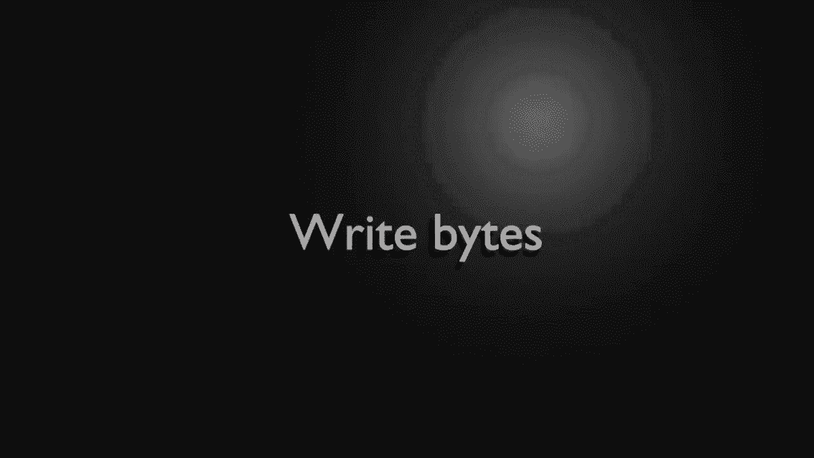
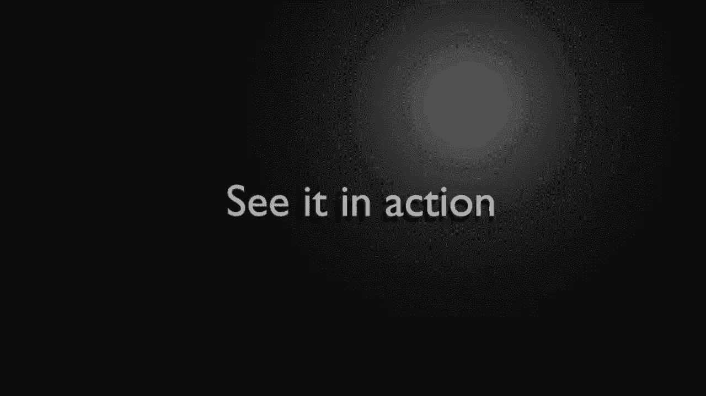

# 【双语字幕+资料下载】Python 3全系列基础教程，全程代码演示&讲解！10小时视频42节，保证你能掌握Python！快来一起跟着视频敲代码~＜快速入门系列＞ - P25：25）读取文本文件 - ShowMeAI - BV1yg411c7Nw

Welcome back everyone， this is Brian， this is episode 25 working with binary files。First things first， what is binary， We've worked with plain text， but what's binary。 it sounds kind of crazy， almost like something from the matrix。The harsh reality is binary is something you're really not going to want to work with directly。

 And I'll explain why go over to the extensions tab。 and let's install a hex editor。Now spoiler alert， you do not need this specific hex editor。 you don't even need this IDE I'm running VS code， you can just use any old hex editor out there。 Hex is hex does not matter as long as you can view the actual hex representation here。

Once that's installed， we're going to flip back over to the files。And we're going to take this file that we're in。We're going to right click。And then from here。 we're going to go open with the hex editor we literally just installed。You can see we have the。Heex encoded bytes， along with the decod text。 This is what I'm talking about here， decod。

This is what the computer works with。 This is what the machine reads。 This over here is what we usually work with the plane text。 So， for example， pound is Hex 23。 Then you have 57， which is a capital W6 F。 I mean imagine trying to type out just like your name in Hex。That would be long and frustrating。So when we're talking about binary。

We're talking about the raw data the computer works with。 It's not something we want to work with directly。 We want to work with a representation of that data。 So that's really what we're talking about when we say binaryaries。 we want to give that computer a representation of binary data and let the computer do all the hard work for us。

 We're not working with plain text。We can work with individual bytes that represent plain text。 but we're not working with the plain text itself。

All right， we need to leave binaryary land here and we're going to go back to Plat land and this is just the file we've been working with。You're going to plo in some notes and it's going to just say install the Microsoft text editor extension don't really need it to be the Microsoft one。

 but then some general instructions on how to work with it in case you're following along with these videos。Now we're going to add some imports， and we need to do this step before we even continue with anything else。 So I'm going to import random。And what I mean by random is we're not just randomly importing something。 we're importing a module name random， which will help us create random numbers。

And we're going to import the operator module。This has a little function here called equals or EQ that we're going to use to compare two lists together just to make sure that the information we're generating and the information we're saving and loading all matches up and everything works as expected。

Let's go ahead and work with that random module and we are going to create some random bytes here。 so let's make a function。 let's call this random bytes。And from here。We're going to just have a parameter called size。 Let's go ahead and make a list。Absolutely nothing in that list。 Now， we're going to say4 x in range。

And we want a range to equal the size。We're getting that from our argument。Let's go ahead and append Ar less， so。Lights。And。And now we want to actually say random。And we want a range。 So I must say R range。And if you know anything about a bite。It typically goes from 0 to55。 You can do some crazy things。

 and we're just going to stick with the norm 0 to 255 here。Very simple。 easy for anybody to understand we're not talking about some graing encoding schemes or anything like that。 just 0 to 255。 That's all we want。From there。We' go ahead， and return。The bytes。 so we're just going to return that list。So random here is going to make a random number。

Within a range between 0 and 255。 so we're going to have up to 256 possible numbers。Now， random。 you can do seeds and all this other fancy stuff。 And then we're not doing any of that。 So what it's going to do is it's going to take the current system time and use that as a random number seed。 if you wanted something super secure， you would have to do something different。

 but we're just going to leave everything as default for now。Now let's go ahead and print that out just to make sure we are getting， well。 you guessed it some sort of random list of numbers， so say de and display bitetes。Going ahead。 and we're going to introduce a few concepts in this video here。

 Some things we really haven't talked about。 So I'm going to just make a string。 Now。 I want to multiply this。 So we're going to say。Times 20。That looks a little funny。 but what we're going to do is we're going to say take this string and do it 20 times。 so we're saying this string times 20。Now we're going to go ahead and rent out。

Our little list of bytes here to do this， we're going to use the enumerate functions。 I going say Thor index。那么 item。In。Enumerate and what enumerate it's going to do is it's going to pull that whole object apart into multiple pieces。 things that we can use， and you see where it says right there enumerate object yields pairs containing a count from start which defaults to0。So we're going to tell it to take that bys list and enumerate it。 And we don't want to start at 0。

 We want to start at one because people are not computers。 We like to start at  one， not 0。We're just going to make this， you know， human readable。Now we're going to go ahead and format out a print， and let's say。Inanddex。Equals。And we want the item。Now， we've been working with a hex editor。

 so I want to show you a simple little trick here。 We can just simply say hex。And we want to make a X representation of this item so that we could later compare it to a he editor and make sure that everything lines up exactly the way we would expect it to。

Gom going to grab that little print function， drop back down。Make sure that lines up so we're not doing it every single for loop。 but after the for loop is completed。And let's test this。 So I'm going to just。Rrab our function random bytes。And whoops。Grabbed too much of that， apparently。There we go。

And let's just say 10， just for now， nothing too crazy。 Now， I want to go ahead and display。That list， let's just see what this looks like。So sure enough， we are getting a list。 It is one through 10 human readable starting at one under the hood it's actually zero。 but we're using this little start here to increment it。

And then we have the decimal and the hex representations of that data。

Okay， deleted our little test there and we are going to now move ahead and we're going to write some bytes here。Now we have to do this a little bit differently， we've been working with plain text and we're working with binary files。 this is not human readable， so we have to tell Python we don't want humans to work with us。 we want computers to do it。So we're going to say deaf。Right， bites。

You want a file name and the list of bytes。Now that list is just going to be a list of integers。 so it's a little misleading where it says bytes。This function is going to convert those integers2 bytes and store them in the file。We're going to introduce something a little bit different here。 It's going to be the with keywords。 we're going to say with。With is going to take some code function that returns a variable。

And use the variable。 So let's go and demonstrate that。So we're going to say with open。 we're going to open the file name。We need to give it a mode and we want to write binaryary。 if we just did W， it's going to be plain text， so we want that B in there。As。Wile。 so what we're really doing here is we're saying。With。😊，This function， run this function。

 return a variable and call it file。 So with some function as file kind of reads like a book with this as this variable。Now that we've got that variable。We can just work with it directly。I'm going to say4 B。And up bites。And we can use that variable we got from our W statement。While， right。And we're going to take that individual little number。 And I'm going to say2。Underscore lights。

It's a little misleading that it's a B representing bytes。 This is actually a list of integers。 so I very easily cut a set I。ItDoesn't really matter what we call it。So we're going to convert that to bytes。 Now we want to convert it to one byte。And if you're a computer expert and you understand this， we're going to give it a big order。

 so I'm going to say byte。Order。Equals big。You don't know what that is。 don't worry about it。 We're just going to use this just for demonstration purposes。 it really doesn't matter unless you're specifically want。A big or something else。All right。 that's it， we're done then you may be going no wait a minute， we have a file object。

 don't we have to close it， shouldnn't we do something like file close。Well， no。That would cause an error。 And that。Would not cause an error。 but it's really not needed because width is going to destroy this when it's done with it。And when that variable is destroyed， it's going to call close automatically。So we're actually done。

' you notice as we get more advanced in Python， even though we're writing more advanced code。 the code actually gets shorter and shorter and shorter。 This is one of the really cool things about Python。 and we could shorten this even more if we wanted to， but we're still in beginner land。

 So this is about as short as I'm going to make it for this video。😊。

Now that we've written the bytes， we want to do the exact opposite。 We want to read those bytes back。 and I'm going to intentionally make this function。A little bit bigger than it needs to be。 just because we're still in beginner land and I don't want to confuse anybody。 So I'm going to say de。Read bytes and I'm I'm saying that because you'll see people down in the comments going well。

 this is very verbose Why are you doing this when you could do and they'll put a little one liner in there and everyone looking at it's going to just be like I don't understand what they're talking about。So I're going to say bytes we're going to make a blank list。We're going to say with。Open。

And we're going to get our file name。 Now this is the trick here。 We need to do the opposite。 We're going to read bytes， not read plain text。And I caught bites， but it's read binary。As file。Now。 I'm going to do a loop， and Im must say while true。Loops are big and scary for nubes。 so don't worry we're going to tell this when to stop looping so it's not going to enter some infinite loop。

I'm going to say B equal file。 read and we want to read just one。Now we're not reading the number one， we're just reading one bitete from that file。If not。B。 and I think we've talked about not or it's the same thing as。Like something like that。 not equals to， but we're just saying not。比。And we're going to go ahead and break。

Break will break right out of that loop。However， if we're still here in Loopland。 we want to say bitetes。Aend。Let's go ahead and take int。Rrum bysSo we're doing the exact opposite here instead of two bytes， we're saying from bytes。 so we're taking a byte and converting it to an integer。And it's pretty simple。

 We're just going to take our B that we read from the file。 and we're going to set the byte order if we really， really want to。So let's just do that。All right。 now once we're in there， we're going to drop back down to this level right here。 and we are going to return。Our finish list。Looks big and scary。

 but really we're just doing the opposite of right bites， we're just saying， hey， make a blanklist。And then with open， get a file。And then as long as we can read one by。Apppend that to our list of integer and return it。

Looks big and scary， but it's actually pretty simple once you wrap your head around it。

Now that we've got all the pieces together， let's see it in action。 This is what I love about programming。 It is a lot like working with Legos。 Once you get the pieces together， you can make something bigger and better。 So let's see it in action。 The first thing we're going to do here is create。😊，The random bites。

So I'm going to say out bites， you can call this whatever you want。 doesn't really have to be out bites。And this is going to be our random a bytes function。 And we're going to ahead and just， let's just keep it at 10。 I don't want anything too crazy because we're going to have to see it on the screen。

 Let's go ahead and display that just so we can see。The out bites。And I'm going to walk through this step by step here， so let's go ahead and run this。And we've seen this before， I've got this kind of split up here。 So every time it displays。 it will have this nice， neat little bracket there。Now we're going to write all that to a file。

 so Im going say file path。And let's call this test dot DX T。Now this will make some people mad because what we're doing is we're violating some fundamental concepts of the operating system。 People expect that a dot TxT file is a plain text。 and I'm doing this for illustrative purposes to show you that the file name and extension have absolutely nothing to do with the data that goes inside them。

So now that we've got a file name， I'm going to go ahead and say， all right， its。And we can just simply take that file name。Along with are out bites。And dump that to a file。Let's go ahead and run this again。UOh， file name is not to find， oh， I've got file path。 that's why hm。Shockingly， the variables have to line up。 All right， let's try that again。

Clear that run it， okay， doesn't look like anything happened on the screen。 but over here now we have this little dot Txt file and if I open it。I get kind of these crazy characters。What is this， This looks like gibberish。 Did we have a corrupt hard drive， No， let's go here。

Open with our Hex editor and see what's going on here。So if we kind of scroll up here。You can see how we have。1 equals 84。 But then we go into a panic and go。 it's 54。 What's wrong， Well。 the hex version of 84 is 54。 Then we have F1， F1。Or or you see what's going on here。 somebodybody out there is going to ask， well， why does it say0 x that's kind of like the universal representation that we're working with hex data。

 So in your mind just kind of blank out that 0 x and just pay attention to everything after x So we have 54 F1。4 E1 D3 and you can see it's just working as expected now。This is what I mean by a lot of people kind of get into a panic when you tell them you have to work with binary data because they don't really understand this and they think that they have some horribly bad screwed up computer or that their program did not work well because they look at it and go。

 oh， oh， it says 54， but I should have put 84， and they try to figure out what's actually going on。 This is what I mean by We're not working with binary directly。 We're working with a representation of the binary data。 We let the computer figure it out for us。 Conti on here。Almost done Now we're just going to take that file and read it back in。

 so I'm going to say in bytes。Equals and we're going to go ahead and read the bytes。And we're going to read that file。Aim， there we go。Once we have that。 we're going to go ahead and display it。And now we need to go all the way back to the beginning of this video when we said we're going to use the operator import and we're going to compare them。So I want to say print。And let's say match， I just want to know if they're a match kind of like。

 what is that dating site match。com， it's a match。All right， so I'm going to say operator。That一q。And now we need to feed it some lists。 So I want to see。Bs and in bys， again。 doesn't really matter what you name these。 Now， because we are using a random number generator that the seed is based on time。 these numbers will change every time I run this because time is constantly changing。

Just wanted to be aware， so if you're expecting 84， 241，4， blah。 blah blah you're in for a very big surprise here。Or maybe not now that I've told you what's going to happen。 let's run this， see what happens here。It says match true。 So what happened here and let me。Scroll this up。We have our output。In our input， and of course。

 they line up every single thing works correctly and the two lists now match。So what we've done。 long winded version of this。Scroll all the way up here。We've created a list of random integers。 it says random bytes， but it's really integers。Then we can display those and then we can pump those out to a file and then write them as bytes。Then we can read them back and read those bytes into integers and put them back into a list and return that。

 and we can actually check to make sure everything matches so what we wrote and what we read now match。The big question is， how would you modify this information？

Let's say you wanted to do some sort of work， you would do that to your out bites before you wrote it to the file。And all of your changes would be written to it。See。 our file is right there and if we go into open with our he editor and we get the nice beautiful representation of it。

