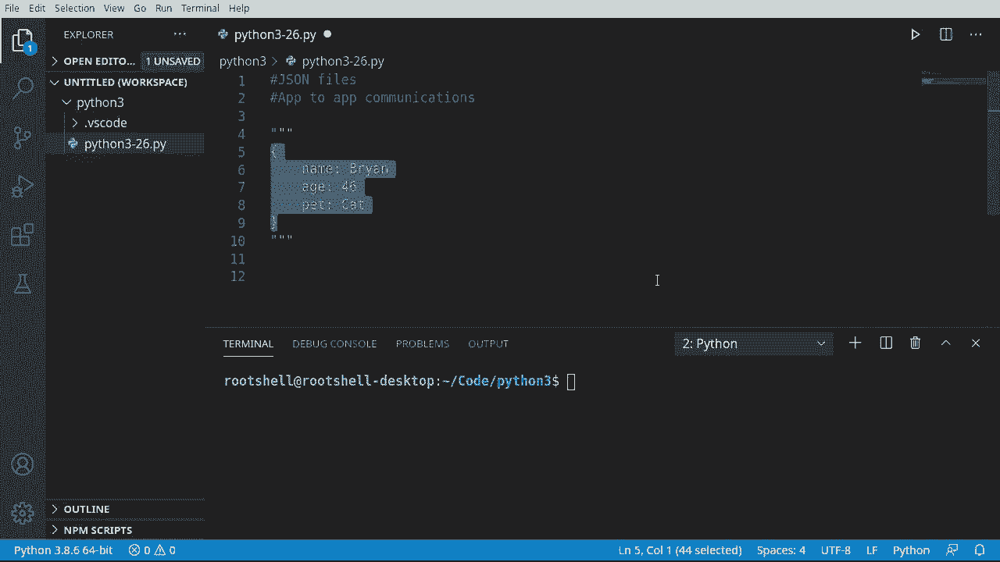
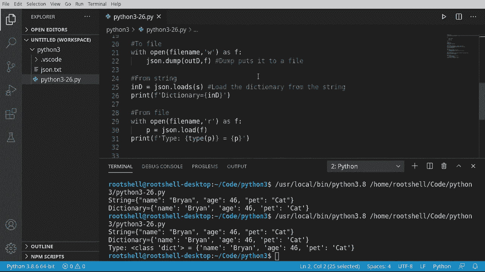

# 【双语字幕+资料下载】Python 3全系列基础教程，全程代码演示&讲解！10小时视频42节，保证你能掌握Python！快来一起跟着视频敲代码~＜快速入门系列＞ - P26：26）使用 JSON - ShowMeAI - BV1yg411c7Nw

Welcome back everyone， this is Brian and this is episode 26 we're continuing our journey into Python 3 and we're talking about JO files that's a little misleading。 it doesn't actually have to be a file What we're talking about is data。And let me just post some JSON data here。And I've got it in these triple quotes that way the IDdeE doesn't get all mad。 but really what we're looking at is this bit here。Everything between the brackets。

 so we have the start and the stop， and then we have key value pairs。Now Jason can get a lot more complex than that， but I wanted to keep it super simple because we're not really trying to learn the complexities of Jason。 we're just trying to learn how to use it with Python。First off， why do you even need Jason。 What is this， What do you need it for， Well， it is for app。To app。Meian occasions。Now。

 when I say communications， this could be anywhere from network to remote calls to just simply writing and reading files。 Jason is meant to be a data format， So it's not necessarily a file format。 you can do all of this。Virtually across networks， across memory， however you want to do it。 but it's going to agreed upon format。So let's say I write a program and you write a program。

And you want to be able to read what I'm creating。 We have to have't agreed upon format。 and that's what Jason really is。

As you might have guessed， Jason can get a little bit complex。 So before we deep dive in。 we need some imports。 Actually， we really only need one。We're an to import。 Jason。 makes it ridiculously simple。 I know it's so complex。 but we need to import this module because we don't want to reinvent the wheel。

 We want to use code that's already written， and we know works。Let's also go ahead and make a variable and I'm going call this file name。 We're going to use this again and again。I'm going to call this Jason。At T X T。

Let's start this off。 Super simple here。 So we're going to。Put some dictionary to adjacent formatted string。 Say that five times real fast。 It's a little confusing， but that's what we're going to be doing here。I'm going to make a variable called outd。 You can name it whatever you want。

 but I just want to know that this is the output dictionary。 This is what we're going to convert。So I'm going to say。Dict function。 And I want to make a dictionary that has key value pairs of name。 Brian。Age 46。And。That。Sa cat。So we're going to take this dictionary here。And we're going to output that to a J format， so let's grab this。A little bit of copy action there。

 I'm going to say S equals。And we want to use the J module。And we want to dump。S。Not just dump。 Now。 if your I DE may show something a little bit different。 You may see both dump and dumps with an S at the end。 We want the S。 which is short version for a string。 So it's going to dump out a string。

I'ing to feed at our variable there。I'm going to， actually。To the magic of copy and paste。 put a little note there just in case somebody's confused about the difference between D and D S。Usually when you get dumped， it's a bad thing。 But in this case， it's going to make us very happy。All right， so that was actually poetically sad。We're going to say， the string。Is going to be。

Our output。Let's just run that and see what it looks like there。So sure off string es。 And look。 it looks like a dictionary。 This is what I love about dictionaries and Python in accord with Jason。 as they look virtually identical。 It's very easy to see that and see exactly what's going on because we have our key value pairs。😊。

Let's go ahead and take that and push it out to a file。Now， remember， I said。 as we get more complex with Python， we actually write less code。 and I found that to be very true。 It's one of the bizarre things about Python。 So I'm going to say with。Open。And where are going to。对。I'll name our little variable there。And we're going to write that。

And we're going to make a variable called app。Now we're going to say Jason。Dump。 notice how there's two of them。 there's D and dump S。 When we see the S， it stands for a string。 we want to dump this。And what we want to dump， We want to output our dictionary。To the file。And I'm going to put some notes in here just in case anybody gets a little confused as to what's going on there。

Very， very simple， very easy to understand。 Let's go ahead and run this。 and it gives the same output。 Now we have this J dot Txt。 And if we open it up， it has the string。I should say stringified Jason or our actual dictionary in a Jason format。It may look exactly like a Python dictionary。 And that's why people often get this confused。 They go。

 oh， you're passing Python back and forth。 Actually， we're passing Jason andd data。 It just looks very strikingly similar to a dictionary object in Python。Now。 let's do the exact opposite。 I want to say from string。 So we're going to go back up here。And we're going to take this S variable right here。

Remember that Jason did a dump as or dump string to this little guy right here。So let's take him。And I want to do the opposite of a dump， which is a load， I want to say indie。一波。Jason。 in a case you're wondering about some of the names like D。 Yes。 Python developers do tend to have a sense of humor。 so bear with me on some of these video。

 and we're going to load S。 Notice it's not load。 It's load S for strain。And we're going to feed at that string。And I'm going to put some notes in here。Just in case anybody gets a little confused， so load the dictionary from a string。I have this named In， you can name this whatever you want doesn't really matter。

And I'm going to to the magic， copy and paste here。Let's go ahead and run this。And you can see our dictionary is now loaded up。Very cool the way that works。 And it looks virtually identical。 So， yes， it will confuse a lot of people。 But rest assured。 we're working with Jason。Now， in the spirit of doing things backwards。

 we are now going to load this from a file， so we're back up here where we said with open file in write text as F。 and then we did a dump and we dump that dictionary out。 we're going to do the exact opposite of that。And must say， with。Open。And I want file name。We're going to just read that as plain text。As F。 And then let's make a variable we haven't used before。

 So it's strikingly obvious that this is loading it。 So I'm going to say file dictionary or F D。Equals。Jason。And we want to。Load， not load S， because that would be a string。 We want load。 which is going to tell it load it from a file source。 And in case you're really curious， no。 variableable name does not matter。 I could actually name this person or。P or Brian。

 whatever I wanted to do does not really matter。So now that we've loaded that。Well。 now comes a complex part。 We just work with it。 It's really， really that simple。I'm going to say when I say complex， I'm joking a little bit。 This is so ridiculously simple， it's。Almost scary。If you're coming from other languages and other frameworks， you're kind of like。

What how is it this simple， it's just mortifying。So I'm going to call the type function here。 just so we can see。What type， what data type P is？

This is one of my little kind of gripes about Python is IDEs are great。 but if you just open this up in like a plain text editor and not an IDE。 you may be looking at this trying to figure out what is load really doing。 what is it returning So the type function is going to print out or I should say give us back the data type there so we can print it out。

And then let's go ahead， Anne。Print out the actual variable。Let's run this again。So， type。Lss di。 So this is a class dictionary。 remember classes are something we're going to cover in the near future。 A class is a blueprint for an object。 So this is a dictionary data type。 and it is equal to you guessed it the information we just loaded back from the file。

 which is now a dictionary。Very simple， very easy。 The main takeaway from this is。Jason is a data format used to exchange data between applications。 this is an app to app communication data standard。People all over the world different countries。 language barriers doesn't matter will say， hey， hand me adjacent file。

 and it's very easy to work with。When you look at it， it is a string。 so it's very simple to just open this up in a notepad or a text editor and just modify it if you need to。 but it's also extremely easy to work with at a programming level。