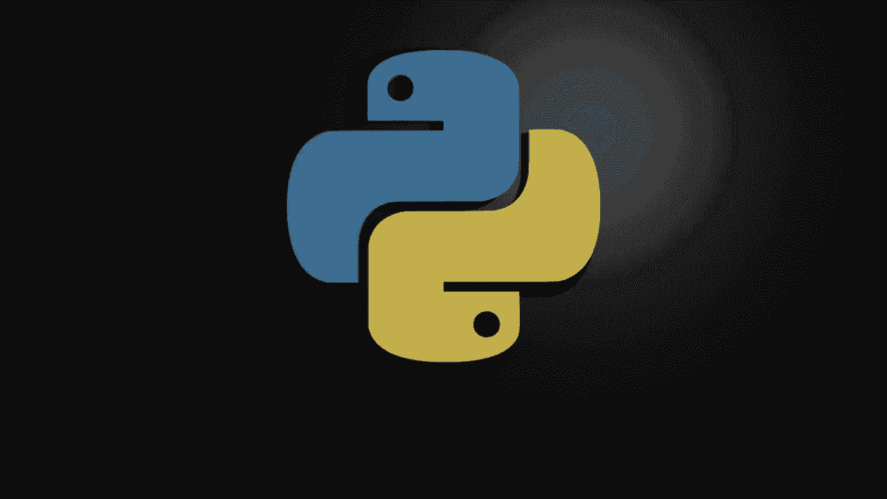
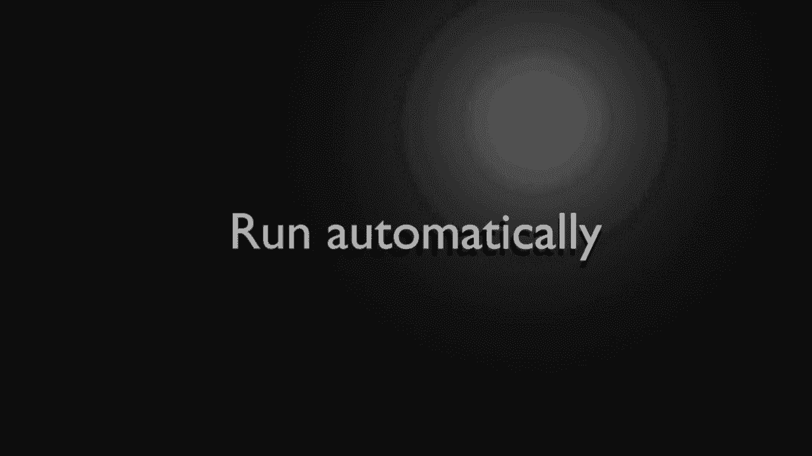
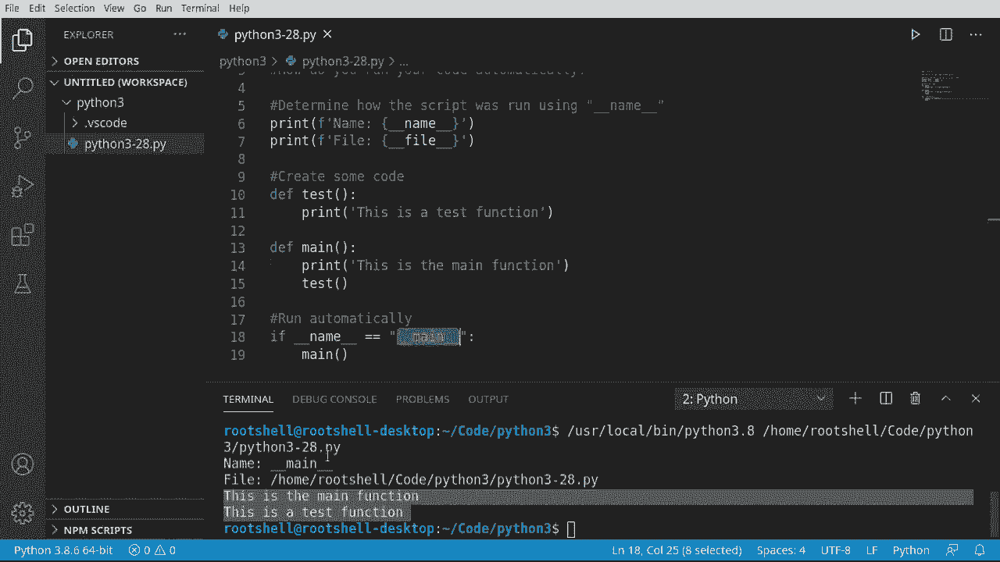
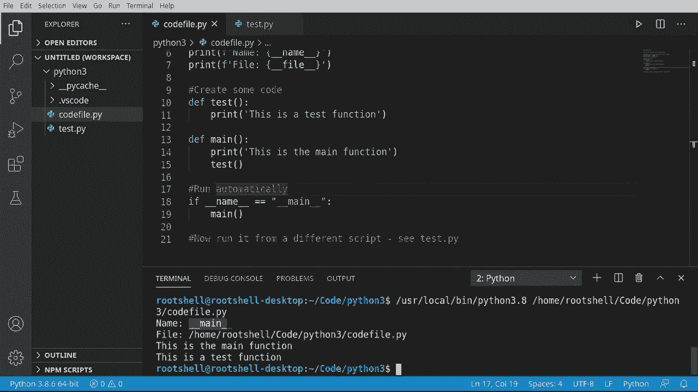

# 【双语字幕+资料下载】Python 3全系列基础教程，全程代码演示&讲解！10小时视频42节，保证你能掌握Python！快来一起跟着视频敲代码~＜快速入门系列＞ - P28：28）主函数 - ShowMeAI - BV1yg411c7Nw

Welcome back， everyone。 This is Brian。 We're going to talk about the main function in Python。 Now。

 in case you're wondering what a main function is in most programming languages。

 you'll have something like this。And all this is is a function literally called main。

 and when your application execute， it's going to be the first function or the entry point to run。

And without a main function， your application simply won't work。 Well， as we've seen with Python。

 you don't need a main function。 This works just fine。

So how do you get your code to run automatically， that's really what we're going to be talking about in this video。

Let's go ahead and take a look at this。 So first thing we need to do is determine how our script is running。

If you've been following this series in the playlist on YouTube。

 you know that you can run your script directly and your script can be imported。

 So we want to make sure we know exactly how this script is being run。

 So let's go ahead and go print。And we're going to say F。

 we're going to format this out and say name equals。Now we're going to use a special variable。

 underscore， underscore name。Whenever you see that double underscore， this is built into Python。

We're going to take this。And print this out。Let's go ahead and change this to file。

And I stated in a previous video this may or may not work。

 so if you have problems with underscore underscore file。

 you're going to want to watch that previous video where I talked about using the system arguments that are handed to your script。

This should just work just fine most of the time。Let's go ahead and run。

You can see how our name is underscore， underscore main， so remember。

 double underscore means it's built into Python。And the file is， well。

 the file name that we're currently running。This spoiler alert could change。 So don't depend on this。

 And what I mean by that is if we are calling our code based off an import in a special way。

 the file name will not actually be the name of the script we're currently in。

 So you got to be a little bit careful there。 But I want to highlight those things。

 The big takeaway from this is our name is underscore underscore main。

 which means we know Python is running this file directly。 This is the main script file。

Now， let's go ahead and create some code here。 Our script really doesn't do anything。

 So we want to do something。 We're just going to make a test function。

I don't really care what it does just as long as it prints something out on the screen so I can see it's running。

Now we're going to make a main function here。Notice the name is mainine。Go ahead and print this out。

And let's just for giggles， go ahead and call our other function here。 So really。

 what we want to do is we want this script to run automatically run this main。

 So we know what we're doing and then call this other function and start some chain of events。

 do some code processing and things like that。 So let's go ahead and。Let's clear all this out。

And let's see what a lot of people who are new to Python make a mistake。 They go， oh。

 I know what I'm doing， and they go ahead and run and nothing happens。That is a bummer。 So， yes。

 in Python， the main function。Really isn't？Halled automatically， we have to call it specifically。

Now， you may be thinking I know what I'll do。 I'll just go down here and then call man directly。

And it will work。 Watch will run it in Ta， it runs。 This is the main function。

 This is a test function， so we are calling it。The problem comes in with this name right here。

 we're going to demonstrate right after this section。

 we're going to show you what happens if we run this from a different script。

 We don't necessarily want this code to execute。Meaning。

 if we take this file and import it as a variable in another file。

 I don't want this function firing off。 So we want this to run automatically。

 but only if a certain condition is set。Go ahead and say Maine。

And we're going to print this code out automatically。 This is my Id。 You may have to type this。

 but we're going to say if underscore underscore name equals main then and pass。

 it's just going to well do nothing。 So I'm going to take this。All are main function directly。

Go ahead， saveve and run。And sure enough。It runs our main function。

 so it's saying the name is equal to main， so we know Python's are running this directly。A main。

 go ahead and call this。

Once you've wrapped your head around the difference between underscore underscore name equals underscore underscore main。

 and you know that means that Python is running this directly。

We can do something a little bit different。 We can actually take this code file。

Let me grab some notes here。And we can run this from a different script just to see the difference here。

So we're going to create a file called test。pyy， and I'm going to make some mistakes just to show you what's going on。

I often make mistakes， but legitimately， this time， I am trying to show you what's going on。

 So the first thing we're going to do is we're going to import this file here。So let's go back here。

And I want to say Kport。Python， and notice how Intelenceense is helping us out。Ass pro。

Now from our previous video， you know that what we're doinging is we're taking this file in its entirety and converting it into a variable which we can use。

Before we go any further， let's run this， notice how we get an invalid syntax。It's got this little。

 It's called a carrot right here is pointing up at this bracket。

 So what it's telling us is it doesn't like this。 It's simply our files naming convention needs to change。

 So what we can do is， let's right click this。And call this code file。pyy。

The functionality has not changed。 So， for example， we'll run code file。

 which used to be the Ithon 3 28。 And you see， it's working as expected just the file name is changed。

 So the functionality hasn't changed just the name。

We're going to have to go back in here and change the name。Clear this out。

And let's run this test do Py。 You can see how right off the bat， what's happening here is name。

 code file， file name， code file。What is going on here， we ran test PY。But it's printing this out。

 so when we hit import。It's going to go through and start reading our file from the top down。

 and it's going to actually take some actions。 So this is a little bit dangerous here。

And just for illustrative purposes， I'm going to grab this。Go in here。And let's say。

Let's about this test name。And test file just to separate those out。Clear this。 and rerun。

Now you see they're both firing off， even though I'm running test at PY。Import is happening first。

 so it's saying importm code fileile， it's going over to code fileile， executing this code。

 it's not executing our functions。And because the name is different， it's not executing this。 See。

 name is code file。So the name is no longer underscore underscore main， the name is well。

 simply the short version of the file name code file doesn't have the directory。

 doesn't have the extension of dot PY。That's why we need this if name equals underscore underscore main。

 So now in here， we can actually call this directly。Save， run and see it in action， sure enough。

This is a test function。 Maine， never fired off。This may seem a little bit confusing， so quick recap。

 you have to be a little careful how you name your files if you're going to use them as an import。

 Some characters are just simply illegal like the dash you saw earlier。

If you're going to run automatically， you want to check the name is equal to underscore underscore main。

 because if we're running this file as an import， it's going to give us the name of the file with no underscores in front of it。

This is not guaranteed to be the name of the file。 Python can send us anything we want。

 The point being underscore， underscore main means that Python is running this directly。

 and just to illustrate that， we're going to run the code file again。And see。

 name is underscore underscore main。

