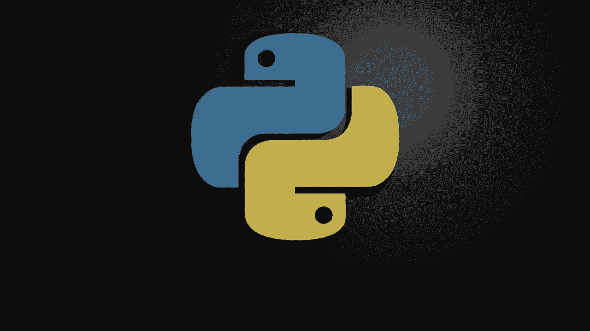
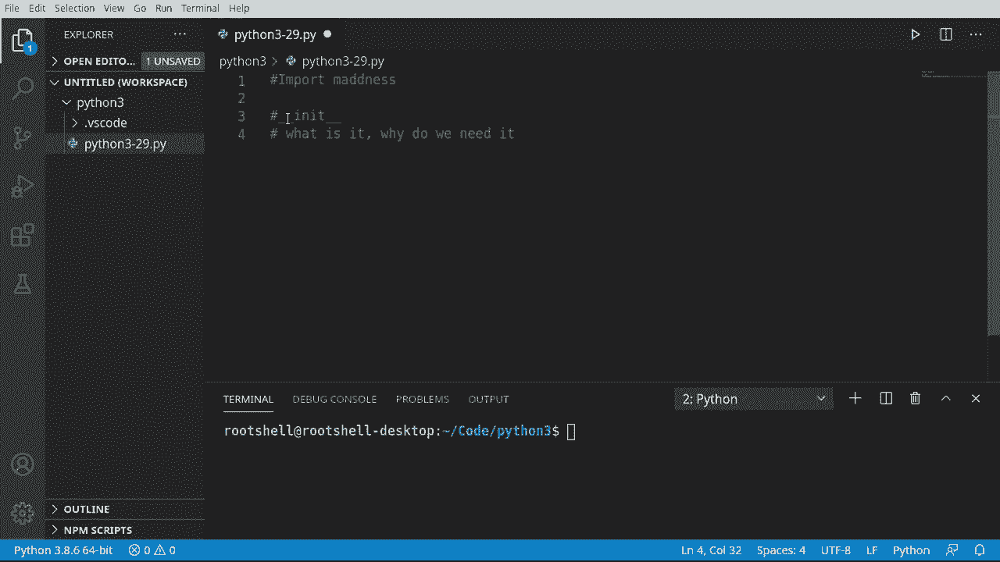
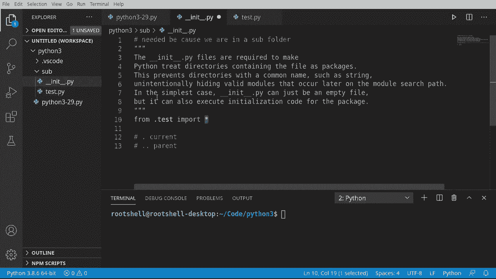
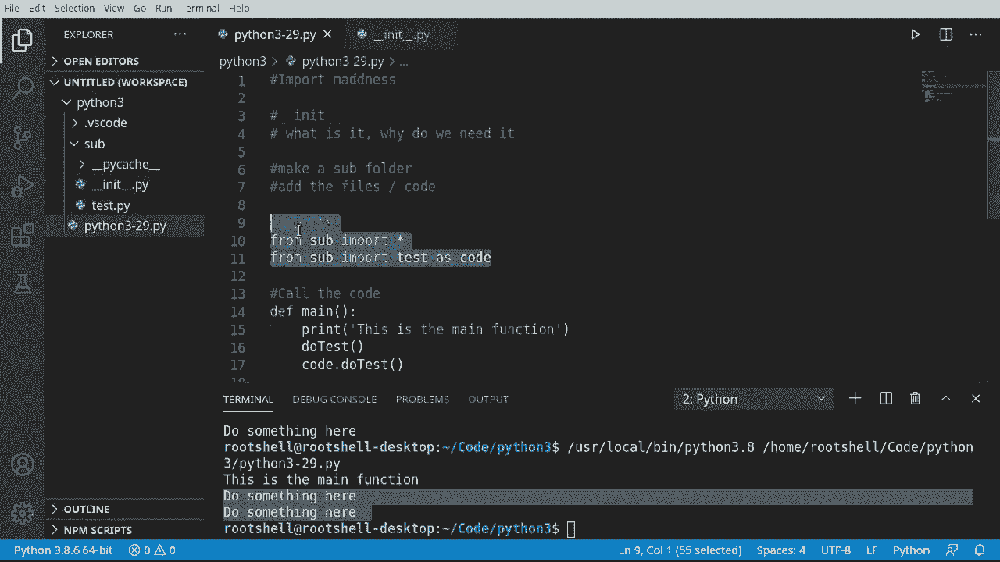

# 【双语字幕+资料下载】Python 3全系列基础教程，全程代码演示&讲解！10小时视频42节，保证你能掌握Python！快来一起跟着视频敲代码~＜快速入门系列＞ - P29：29）导入自建工具库 - ShowMeAI - BV1yg411c7Nw

Welcome back， everyone。 This is Brian。 We're going to talk about import madness in this video。 and。 yes， we are going to deep dive into， well， insanity here。 So what we're talking about is underscore。 underscore in it。 What is it and why do we need it。😊。

First things first， we need to make a sub folderder and add some code to it。 so I'm just going to p some notes in there。We're going to make a folder and let's literally call it sub。 so I'm going to go up here， I'm going to say new folder sub。And inside of our subfold。 got to make sure you got that highlighted。 your IDE may be different depending on what you're working with。

 We're going to add two files。The first file we're going to add is going to be called well。 very simply。Test dot key， Y。And we're going to add some code and just for the sake of time。 I'm going to copy and paste。Just a simple function， do test。 which just prints out do something here， really not award winning code by any means。

Let's also add another file。And this file has to be named。Underscore， underscore。In it。Unders underscore do PY remember， whenever you see the double underscores。 you're thinking something internal to Python。Now， there's a lot of debates out on some forums on whether or not you actually need this in legacy versions of Python。 you actually do more modern versions of Python， It's debatable。

 but I'm putting it in here just so we understand it。I'm going to pay some notes here。 and it's quite a bed of notes。 This is needed because we are in a subfold。 Whenever you see folder。 I want you to think in terms of modules。 Remember， we've talked about modules just a little bit。But a module isn't just simply a file， it's an entire folder structure。

And the problem with creating some sort of folder structure is that Python needs to understand how to work with that folder structure。So in its simplest case， in it。That PY can just be an empty file。 but it can also execute initialization code for the package。That's how complex this can get。 So if we're working with something like a a socket server or a database or something like that。

 we can actually initialize some code。 We could say like port equals 80 or the。User name。 you'd never do this in production， but like the username would be admin or something like that。 you can actually specify all that right in this file。So we are using this very simply because we want to work with this file and we want Python to understand how to work with this file。

So we're going to modify it just a little bit here。 We're going to say from。That test。Import。St。We've seen import before， but we haven't seen this。 What is going on here。 So what we're doing is saying from。Dot test。Import star。 The from is just basically saying。 go out and find this。And we have this little period here if we omit that。

We may have some bad things happen， it may not actually know what we're trying to do here。So we have to put that in there in most cases。 And then magically。 it knows this is the directory if you're ever confused。That is the current。Directorory。And。I that。 is the parent。So basically what we're saying is from the current directory and then take a file name test。

 there's no PY at the end of it。Go ahead and import and then everything。 So we're saying take the entire contents of this file。And put it right into Python。

Let's go ahead and play around with the imports a little bit。 so we're going to flip back to our main file here。And we're going to play with imports。 So let's go ahead and try and import it a couple different ways that we've tried the past。 We're just going to simply say， import。Sub dot test。As code。AndNow， code， dot do test。

 we can actually do this。 Look at this。Now， if we run this， everything works just fine。 but we have skipped over this initialization file。An older version of Pythonss This may may not work。 You might run into some little bit of trouble here。 And if you try saying like from the current directory dot sub do test dot do do， you may。 depending on your Python version， run into something like this invalid syntax。So how do we import this file and if we had other files as well。You guessed it we need this initialization file and there's a special way we have to do this。

 so what we're going to do is jump right back here。Get rid of all that。And we're going to say from。 I remember when you see the from keyword， we're saying go find a location。 So from sub。Sub is the name of the folder。 So from this folder， go ahead and import。Star， so we're saying。From this folder， import everything。Now， that's big and scary because what if there's thousands of files out here。

 That's right， We're going to import thousands of files。 And that's where this underscore underscore init underscore underscore do Py really comes in。 or the initialization file will just call it for short。 because it's going to instruct Python on what to do。

 There may be some files we want to import directly， and there may be some files。 we don't want to import it automatically。 We may want to set some variables or some settings or some file structure。 We would do all of that right here， and we could call functions if we had to。Goes way。 way deeper than that。 Again， we're still in beginner land。 And if we really wanted to。

 we could get a little funky with those。 We could say something like from。S。Import。And then a specific file。 Remember that would be test dot Py， but you don't need the dot Py as O。So we're saying from the folder。Import a file as this variable。Looks a little verbose。 and it seems a little confusing until you really wrap your head around it， but it's super。

 super simple Once you get it down。 A major takeaway here is if you have a subfolder。 you should include this underscore underscore in it， underscore。 underscore do PW or the initialization file。If you skip this step。Older versions of Python will just simply not work。

 and you may have some weird issues and if you want to do any sort of initialization in all this file is pretty much a must。Okay， once we've gotten to this point， really there's only one thing left to do is actually see it in action。 so we're going to call the code here。Let's say D E main。 and if you are with me here and you try to do something。

 the Inence in your editor may betray you' got to be a little careful。So I'm going to say main。And for the moment， I'm just going to say pass。 Remember， pass in Python means do nothing。And if name， it's going to go down here。Equals， equals。Following along from the previous video。 we're saying if the name is equal to main， go ahead and run this function automatically that way。

 if we were to import this file， it's not going to kick off this code。 Lets go ahead and get rid of this。 and we're going to say。Print。This is the main function。 And let's call our imports。 Now， because we've done from sub import star， meaning import everything。It's going to go in here and it's going to read this initialization file and say from test import star。

And it's going to import all of our code。 And we've got to stew stuff out here。 So with the magic of old copy and paste。 I can grab that。 jump back out here and say。est and we can just call it directly and it just works。See， do something here。And because we've done from sub import test as code， we can take this。 and we've just basically said。

 do the same thing， but put it inside of a variable。 Now， I can say code dot。Do test。Very simple。 very easy， works as expected， so which is the correct way， which one of these should you use？

Personally， I tend to lean towards a second line here， simply because。Importing from everything。 What if you have a name collision， What if there is like a test2 file that also has the same do test function。 you want to be able to separate those out into two different variables or two different scopes。 Remember each file is kind of a island in itself as far as scope goes。

 at least it's how you should think about it in your mind。So the major takeaway from this is well。 the initialization file matters and if you omit that you may have a bad time in Python land。 you really need that to initialize how Python does things and there are different ways to import further muddying the waters on import madness。

