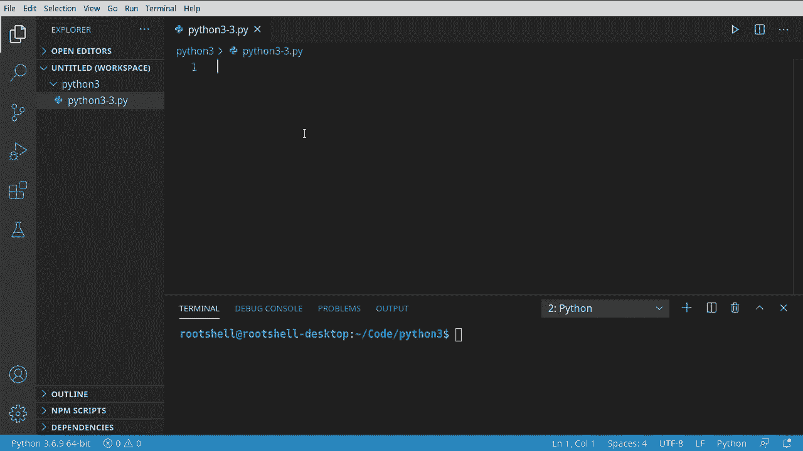
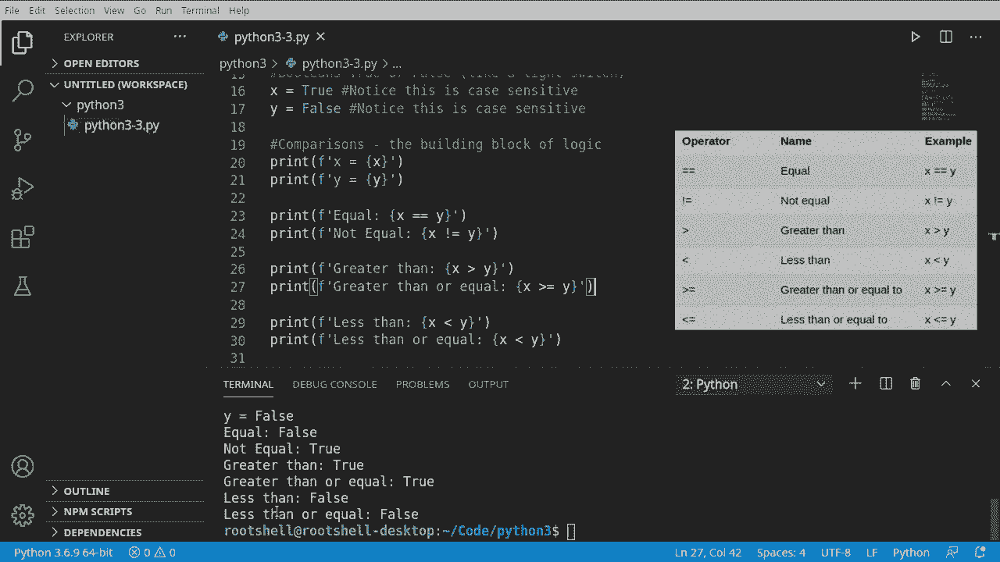

# 【双语字幕+资料下载】Python 3全系列基础教程，全程代码演示&讲解！10小时视频42节，保证你能掌握Python！快来一起跟着视频敲代码~＜快速入门系列＞ - P3：3）Python注释、布尔值和比较 - ShowMeAI - BV1yg411c7Nw

Welcome back， everybody。 This is Brian。 We're going to continue our journey with Python 3。

 Whatever IDE you're using， create a blank file I've got my name Python 33 At this point。

 the name's not important Just have a blank file ready to go。 We're going to cover three key things。

 comments， bulls and comparisons。Let's dive right in。

Okay， comments， you've actually seen them， but we haven't really talked about them。

 What is a comment without writing any code， go ahead and run your script。 You see。

 it does absolutely nothing。We're going to hit the pound sign and just type something。

This is a comment。So really， what does this do well， if we run our program。

 you'll see nothing's changed， it does absolutely nothing。

A comment is just that it's a comment on the code。 It exists solely for you， the programmer。

 so you can keep some sort of notes。 So， for example， you can say。This is our third。这个也有。

And you notice how you can add in letters， numbers， whatever you want。

And it's not going to throw any sort of error message when we run it。 This is strictly for you。

 This is your note。 Now， if you're coming from another programming language。

 you're probably hoping there's a multi line comment。

 meaning if you have a few lines like hello world。I like cats。Oooh， you notice how as I was typing。

 it tried to help me out and it puts what we call Inence in there。

 which is code that's already prewritten for us。Well， we really didn't want that。

 So it just caused all sorts of errors。 Now， if I were typing in a comment， I'd say hello， world。

I like。 And you knows how Inence suddenly is not really popping up。

 I can force it pop up by hitting control in space。

But it doesn't really know what we're doing because we're in a comet。

Multi line comment would be like if you had， and I'm just going to grab some text here。

This is not a comment， even though it says it is a comment， it's really not if we try to run it， oh。

 you see invalid syntax。Because it's trying to interpret this as code。 Now。

 we can put a pound sign in front of each one of these。 For example， let's just go。There's one。

 and there's one。This one， and it's going to get really dull if you got like 100 lines you need to do。

 So what a lot of Python developers will do is。This。

 they'll just have triple quotes and anything inside the triple quotes becomes a string string。

 something we're going to really talk about in depth in another video。

 just know that this is a data type。 We're not truly making a comment。 We're making a string。

 but the string does absolutely nothing。 So if we run that again， there's no error message。

 And let's clear that nasty error out just so you can see。You can run this all day long。

 and there's no error message。But we have created a variable， believe it or not。

 So I do not favor this and be a little careful this might cause issues later。

 especially if you get into like doc strings and things like that。

 which we're going to cover later on in this series。So you may be asking。

What is the functional purpose of a comment？It exists solely for you， the developer as a note。

 you can also enable and disable code using a comment。 So， for example， let's just say x equals1。

Print X。You can see it is now printing one。We could change this too。Hello world。

 which we did in the previous video。 And there's Hello world。 Now， if we comment this out。

This X technically no longer exists。 And you see it's giving us little red squiggly line。

 it's saying undefined variable。 And if we try to run this， you guessed it， boom， name X undefined。

 so we can disable this code by commenting it out。We can re enableable it by simply deleting that downunine。

So let's cover our first real data type here， and this is very fundamental， it's called a bullied。

Some people just call it a bull for short。And it is a true or a false。

 Think of it like a light switch， like physically look at the light switch in your room。

 it's either on or off， and that's really what this data type signifies。So， let's make a few。

I'm going to actually comment out this code。And let's make some。 I'm going to say。X equals true。

Notice how it has a capital T and intelligencetelcentense is trying to help us out by saying， hey。

 it must be capital。And y equals false。Again， capital F。

You may be tempted if you're especially coming from another language to give it a data type like this。

 You do that。 bad things are going to happen。 It's not going to know what you're trying to do。

 We can actually try to run this， and you'll see what I mean。呃。Invalid syntax。

 So it's not understanding what's going on。When we get rid of that， suddenly， magically it works。

Fear that error out so it doesn't confuse anybody。不啦。Again， these are k sensitive。

 so if I change that to a lower case， you see how Intelence no longer has that as blue。

 and we're going to get a nasty little issue if we try to run this。Name true is not defined。

 Remember， when you see is not defined。That's the interpreter's way of saying， hey。

 I have no idea what you're trying to do here。Simply because it does not exist。

SoLet's switch this back to a capital T and life is good。

 so I'm going to just copy and paste some notes in here。

Notice how you can put a comment on its own line or after if you put it before， for example。

 if I move this right here， it turns everything after it on that line into a comment。

 so be very careful doing that。And these comments have absolutely zero impact on our code。

 for example， we can run this all day， there are no error messages。Then clear this out。

Now that we have that， understand that we want to do some fundamental comparisons。

 which is what we're going to talk about next。Okay， let's talk about comparisons。 First off。

 what is a comparison， Well， it's a building block towards programming logic。 So comparison is。

The building block。Of logic。Meaning we want some value。

Take that value and compare it to another value to see what we need to do with the programming logic here。

For example， I'm just going to print out X and Y。 I'm going to do a little bit differently。

I'm going to put the letter F， which stands for formatting。And I'm going to say x equals。Brackets。

And then， X。Looks a little confusing， but really， all we're doing is saying， print out X。

 but do it in a fancy manner。See。X X， now I can change this to y。

And it becomes very simple to understand what's going on。 X is true， Y is false。

 We're going to compare these two now。So the very first comparison we're going to do is equal。

 and it's actually pretty straightforward， so I'm just going to grab this。And let's say， h。Itと。

We're going to do our logic here， and we're going to say。

You have to be a little careful when you're doing equals because if you just do this。

You're actually assigning。 These are called operators。 This is the assignment operator。

 We're now saying x equals y。 We don't want to do that。 We want to compare。

 So we're going to say x is equal to y。We're simply comparing。Then let's say the opposite of that。

 I want the not equal。Notice it's an exclamation， whenever you see the exclamation think exact opposite of what you want。

 so we want。Is this the opposite of equal。Or not equal， let's go ahead and run this。

 see what happens here。You can see x is true， why as false， they are not equal to each other。

 and it is giving us a true when we test for inequality。

It's actually pretty cool that we can do that。 We know virtually nothing about programming at this point in this series。

 but we already have the foundations of computer logic， true and false。

 and we can test for those conditions。😊，Let's take this a step further here。

And what we're going to do is。Greater than and greater than are equal to。

 So I'm going to just grab one of these。And I'm going to say。Greater than。Very， very simple。

We're going to say printout is x greater than y。Now I want to say greater than。Or equal to。

Very similar syntax to the not equals 2， we're saying greater than equal2。

And let's do the exact opposite， let's say less than。And let's flip these around。

Let's go ahead and run this， and you can see there we go greater than true， greater than or equal。

 true， less than false， less than or equal false。

These admittedly won't make a lot of sense to you， right？

