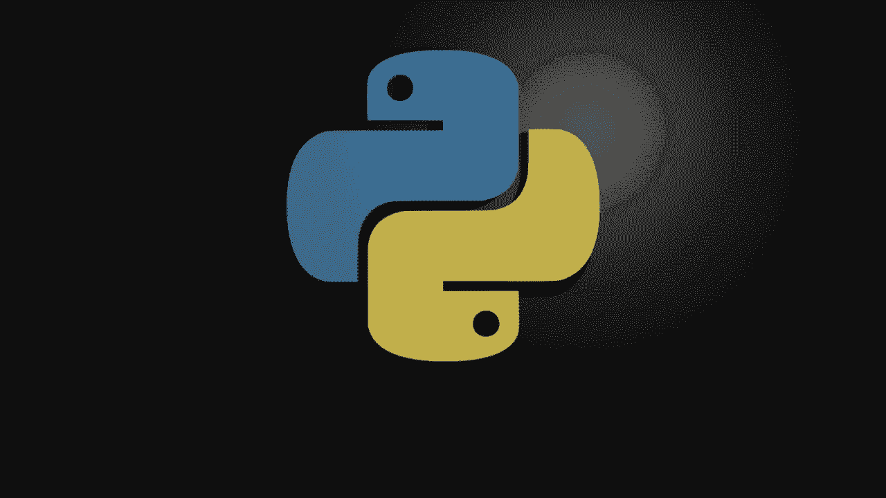
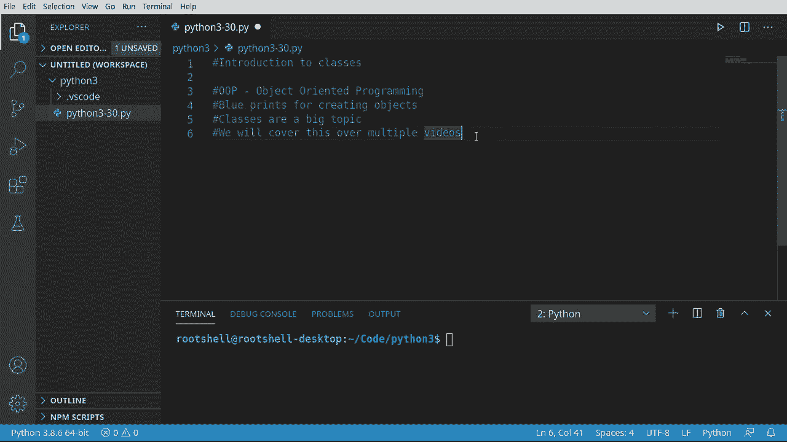
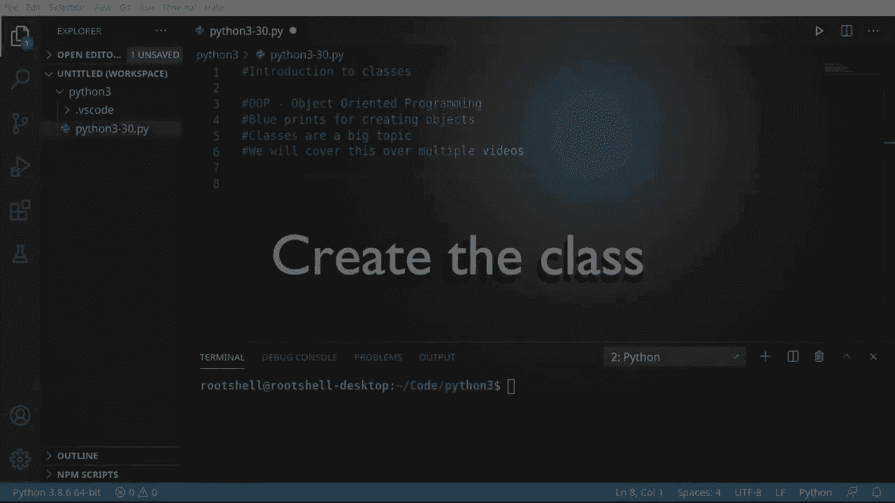
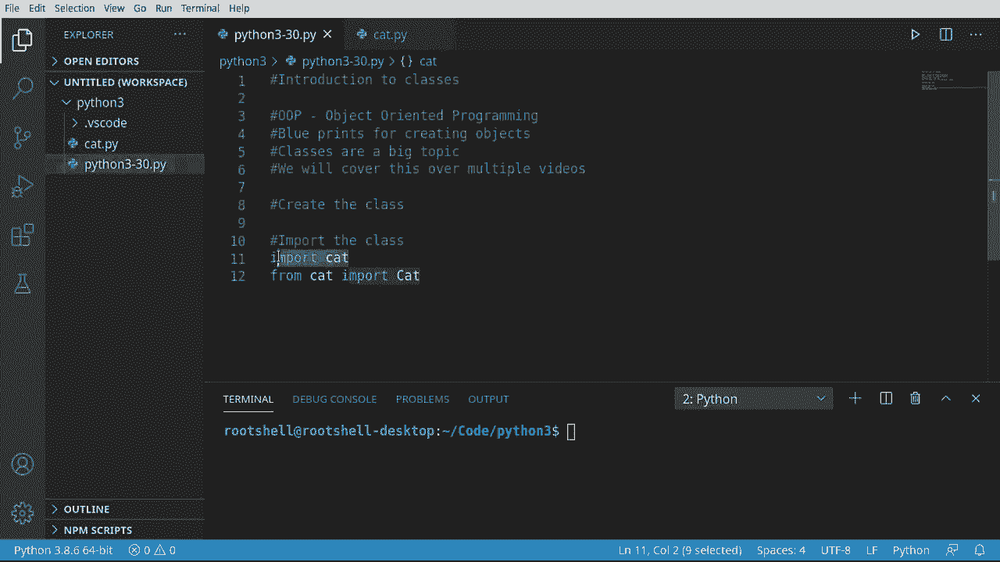
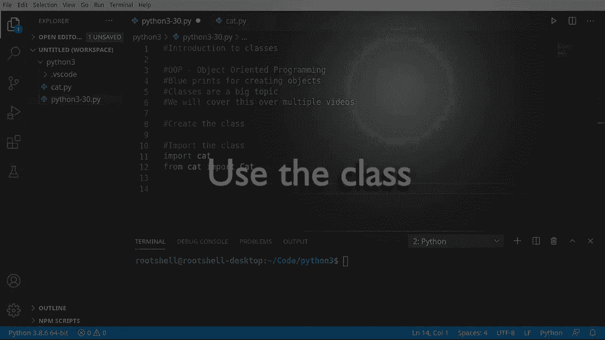
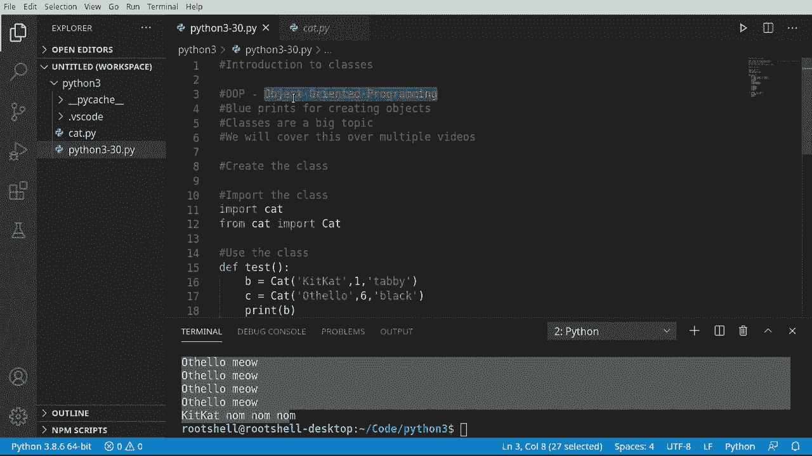
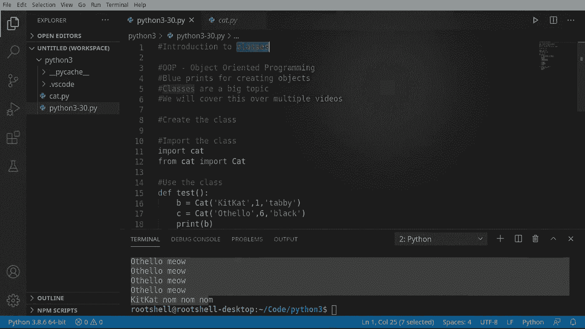

# 【双语字幕+资料下载】Python 3全系列基础教程，全程代码演示&讲解！10小时视频42节，保证你能掌握Python！快来一起跟着视频敲代码~＜快速入门系列＞ - P30：30）类介绍 - ShowMeAI - BV1yg411c7Nw

大家好，欢迎回来，我是布赖恩，我们将继续探索Python3的旅程。我们已经说了30多集，我们要讨论类，今天终于开始讨论类。在深入之前，我们需要覆盖一些基本概念。首先，最重要的是。

你听说过OOP或面向对象编程。这是其基础。基本上，类是一个蓝图，用于创建对象。你会听到人们交替使用类和对象，但它们是两个不同的概念。类是一个蓝图或计划，用于描述对象应该如何被创建。

当Python或其他语言实际创建该类的对象或实例时，就是对象的生成。我们将要创建蓝图。类也是一个非常庞大的主题，远远超出我们在单个视频中能够覆盖的内容。因此，我们将把这个内容分成多个视频。让我们深入了解一下。

好的，类可以变得非常复杂，我们将创建一个简单的类。

所以我将直接粘贴评论，创建一个类。我们将在一个单独的文件中完成这个，但你也可以在一个文件中完成，正如你将在未来的视频中看到的，但我只想展示一下人们在实际工作中是如何做到的，所以我将创建一个新文件。

我们将把这个文件命名为`cat.py`，因为我们将在这里创建自己的猫类。我将粘贴一些笔记。猫类中的`self`是第一个参数。我想把它放在这里，因为人们常常忘记这一点。如果你来自其他语言，它相当于其他语言中的`this`。那么我们在这里讨论什么呢？

这就是人们感到困惑的原因。类和对象的概念很混淆。类是一个蓝图，描述对象将如何被创建。一旦对象被创建，它就成为一个实例。所以我将要提到这一点。如果我们处于一个实例中，因为你可以有多个实例。正如你在这个视频中将看到的，我们会创建多个猫对象，你需要引用当前实例，你需要使用`this`或者在Python中使用`self`。

所以，人们常常认为`self`和类是同一回事，但它们不是。它们是两个不同的概念。每当听到类时，就是蓝图。那么我们来制作蓝图。对。就是这么简单。现在我们需要添加一些属性。所以我将说`name`等于。就留空。而且我们可以说`age`等于。

每个人都有自己处理这个问题的方式。这只是我的做法。随意采用你自己的风格或你所工作的公司的标准。但这就是我的做法。我想知道变量。而每当你看到一个类并且看到这个缩进时，想想作用域。

这些存在于猫的作用域内。每个实例将有独立的变量，不会共享。虽然你可以展示它们，我们将在另一个视频中讨论。我知道你可能已经厌倦了我说，我们将在另一个视频中讨论，但编码有很多内容，无法一次性覆盖。所以现在我们将说de in knit。现在。

记住，双下划线意味着它是Python内置的东西。这就是构造函数。我的意思是，当我们创建这个类的实例时，就会调用它，以便执行代码。把这看作是类的主函数。当Python创建CA的实例时，我们将自动运行这个函数，你可以随意省略它。

这被称为默认构造函数，当你根本没有定义时。或者你可以自己定义它。现在，记住，我说过。Self是第一个参数，所以我们需要说self。它是我们需要的第一个参数，引用当前对象。现在我将粘贴一些笔记。基本上。

显而易见的是，self是必需的，其他参数是可选的。我们继续填写，因为我们想引用当前对象，或者说self.dot。Name等于name参数。从这里开始，这只是复制和粘贴的课程，因为我们想完成其余部分。所以我们只是简单地初始化这些变量。它将复制和粘贴出来。

也许可以这样。所以我们说self.name，这个变量等于参数，或者实际上是参数name。Age，age，color，color变得相当自明。现在我将打印出一些内容，以便我们知道它被构造了。我将说self.name的构造函数。从这里开始，其实相当简单。

我们可以定义任何真实的代码或函数，比如，我们可以说。Deaf Neow。如果你这样做，你会在什么都不起作用时感到非常困惑。记住。你必须将self作为第一个参数。否则。你只会有糟糕的体验。什么都不会正常工作。

缩进可能会让你抓狂。记住，你只需与当前作用域对齐。所以类作用域、函数作用域，依此类推。然后，我将说。Print F。让我们继续说。Self name和meow。我要稍微加快速度，因为我们之前已经讨论过函数。但这里的主要要点是你有一个蓝图，你可以定义这个对象创建后的样子。

完成了。现在注意我如何将它们混合在一起。我们在定义蓝图，同时也在定义对象创建后的行为。这就是人们混淆的原因。继续。制作一个sleep函数。让我们在这里疯狂一点。继续说。Hungry，并且。去掉这个。

或者在范围内的X。我不想做任何太激烈的事情。就5。然后我们将说self.dot miow。所以当我们说self时。记住。我们在获取这个蓝图的当前实例，正在内存中运行的内容。我们将调用这个函数。所以如果你有两只猫，我们在获取其中一只并说。

现在让这只猫叫“Miow”，我们将调用这个函数。所以在你自己的类中工作变得非常简单。现在，从这里开始，我只是想说。继续。再加几个，只是为了展示你可以在这里做一些事情。我想再加一个。我们将说描述。

在这里，我想打印一些东西，所以。我们将打印出颜色，因为我想知道这只猫是什么颜色。说是歌剧英语吗？所以我们说名字是颜色。是。妈妈，谁是。几岁。这个小函数很简单，但我们想展示的是你几乎可以做任何事情。你可以让函数调用函数，做复杂的数学运算。

你实际上可以创建其他类的实例，几乎可以做任何你想做的事情。但现在我们已经完全定义了一个猫的蓝图。这个猫将有一个构造函数，我们正在设置变量，它会叫、睡觉，饿的时候会叫很多次，因为猫就是这样做的，我们可以让它吃东西。

我们还可以获得那只猫的描述。到目前为止，我们的类并没有做任何事情。这是因为我们还没有创建一个实例。记住，类只是一个蓝图。现在我们必须实际创建一个可以工作的对象或实例。所以让我们回到文件中。我们需要做的第一件事是导入它，这样我们才能实际使用它。

现在我们必须导入这个，因为它在另一个文件中。如果它在同一个文件中，我们就不需要导入，但让我们继续。导入。At。现在我们可以直接使用它，或者如果我们真的想的话。我们可以说这样的内容，从。At。导入，然后我们可以导入猫类。

所以现在我们可以说，从猫文件中，导入这段代码。当我们进入这里时，就是猫类。所以如果你在这里有多个类，它只会导入猫。而导入猫则会导入该文件中的所有内容。

所以这就是为什么你会看到这两个在外面出现。

现在重要的部分，让我们继续使用这个类。现在，当我说使用一个类时，我们实际上是在创建这个类的实例。我想做一个名为test的函数。现在你可能会想，为什么这里没有self。你一直在说self，因为我们不在一个类里。

我们没有当前对象。因此没有当前对象或实例。我们在全局范围内运行。我们根本不需要它。如果我们尝试使用它，实际上我们只是创建一个需要传入不存在的对象的参数。所以这没有意义。如果听起来让人困惑。

这是因为在这里放self没有意义。所以我们将说B等于cat。现在。你会注意到从其他语言来看，你需要像new那样的关键字。在Python中不需要这样。它自动处理。你确实需要括号，所以。现在我们需要给它一个名字、一个年龄和一个颜色。如果你在想我如何得到这些。

这是因为我们在构造函数中定义了它，它需要一个名称。年龄和颜色。我们没有调用self，因为Python会自动处理。实际上发生的是，它在说，创建一个猫类的实例，然后在背后隐形地把self放在那里。或者说X，就是那个类的实例。我们不需要自己去做。

Python为我们做了这一切。这是一个隐藏的小陷阱。你可能在想self来自哪里，Python会为你处理。好了，我们有了这个猫。让我们再创建一只猫。我们叫它Beello，这曾是我的一只猫。它是一只非常棒的猫。我非常想念它。它是一只黑猫。

很多人不喜欢黑猫。他们认为黑猫带来厄运。但这是我一生中拥有过的最好的猫。所以我们有了两个实例B和C，它们是两个不同的东西。让我们打印出B的描述和C的描述。如果我们想的话，我们可以进一步展开。

我们可以说C是Miow。如果你在想，是的，你可以给它一个更复杂的变量名。你实际上可以叫它kit cat或Deer或你想要的任何名字。让我们继续调用sleep。C会感到饥饿。因为猫总是很饿。然后我们将说，你知道吗。B不饿，B要吃。如果。名称。等于，我们之前在另一个教程中做过这个。

但以防万一。我们在检查Python是否直接运行这个。如果是的话，我们想运行一些代码。现在，我说这是主函数。我们实际上不需要一个叫main的函数。我们可以做任何我们想做的事情。这就是Python的美妙之处。我将说X。

我们将给这个命名为测试，注意年龄和颜色已经有了默认值。因此我们不需要它们，但必须有一个名称。我们在函数视频中涵盖了所有内容。我接下来将打印出X。我还不打算调用这个测试函数，我想先给你展示一些东西。

Name E White是不对的。我们在这里搞错了什么。让我们进入这里。我们在Cat do Py的第7行。好吧。有趣。Name white没有定义。Aim white没有定义。你觉得这里发生了什么，我们有第12行。color white，这就是我们缺失的。我本来是在处理某种不存在的对象。所以如果你遇到没有定义的情况。

有点即兴解释，这就是为什么我们简单地，而不是一个字符串。我们试图传递一个对象，这个修复非常简单。但有一瞬间。这确实让我感到困惑。好了，现在让我们清理这个，再次运行。好了。所以你会看到这个，你会认为你有一个错误。

但实际上这里发生的事情是在告诉我们。下划线cat是文件名。点。帽子，所以我们可以实际进入这里，看到它到底在做什么，然后对象。所以现在我们有一个正在处理的对象，面向对象编程的一个实例。它位于这个位置。现在，这看起来确实很困惑。

这实际上是一个内存位置。所以如果你来自像C或C++这样的语言，实际上可以直接操作内存。这就是内存位置。这真的很酷。所以现在我们可以知道这里发生了什么。让我们回到这里，实际上。Brenent出。好吧。让我们清理这个，同时调用我们的测试函数。让我们看看这个整个过程。

现在我们知道了。我们代码中的严重错误已经修复。我们知道这个类可以正常工作。我们可以开始创建更多实例。那么，快问一下。我们正在创建多少个这个类的实例？三个，你是对的。1、2和3。让我们运行一下，看看它的实际效果。好的，向上滚动到底部。实际上。

我就要把这整个事情提出来。所以我们有。猫，猫对象在这个位置。然后你会看到构造函数为kittca和Othello触发。所以构造函数被调用。即使我们没有调用，它也是自动调用的。把这看作类的主函数。如果你对那是什么感到困惑。

再次回顾一下，这是一个下划线构造函数。回到输出这里。你现在可以看到我们在这个位置有一个猫对象，在那个位置也有一个猫对象，你不需要记住这些数字。但是如果你看一下最后几个字符，你可以看到它们在不同的位置，这就是你知道它们是不同对象的方式。因为Python在三个不同的内存位置创建了三个不同的对象。

我们可以独立地处理它们。Kit cat是一只1岁大的虎斑猫，而fellow是一只6岁大的黑猫。这是面向对象编程的基石。然后我们可以直接与这些对象进行操作，并几乎可以做任何我们想做的事情。所以，视频的主要要点是，我们正在讨论面向对象编程，并且我们在谈论类。

这些是对象的蓝图。

