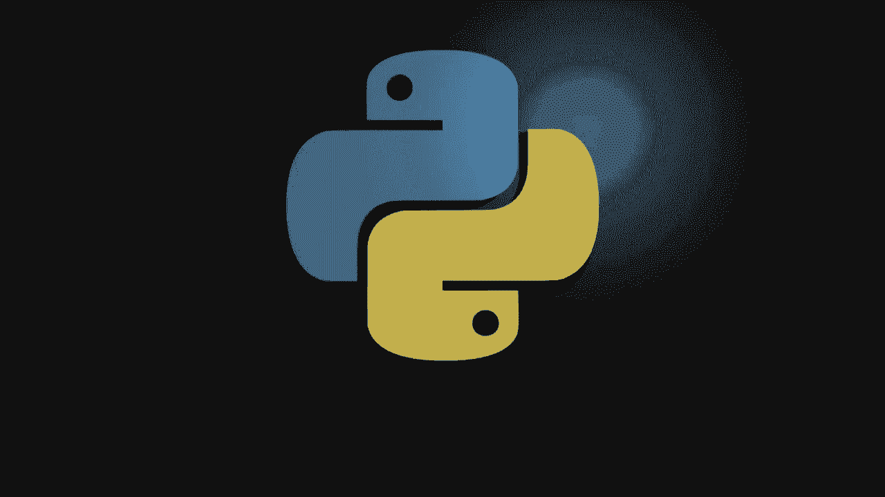
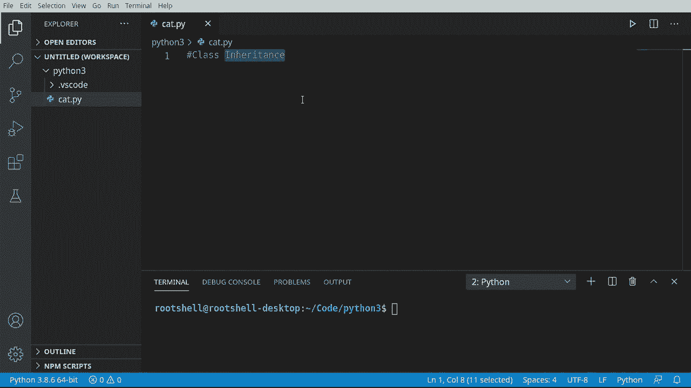
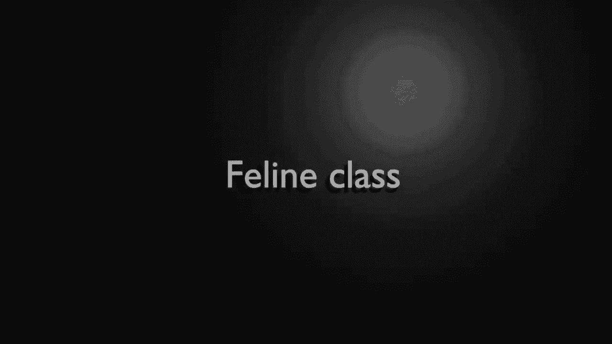

# 【双语字幕+资料下载】Python 3全系列基础教程，全程代码演示&讲解！10小时视频42节，保证你能掌握Python！快来一起跟着视频敲代码~＜快速入门系列＞ - P31：31）类继承 - ShowMeAI - BV1yg411c7Nw

Welcome back， everyone。 This is Brian。 And we're going to continue our journey with Python 3 with class inheritance。 Now， when we talk about inheritance， we're not talking about a loved one dying and leaving us everything they own。 We're talking about how a class can inherit。😊，Or include the attributes of other classes。 So。 for example， you were born into this world。 You have a mother and a father。

 You have a hair color and an eye color， And those came from your mother and father。 You inherited those traits。 That's really what we're talking about with classes。This can get super complex and we're going to look at a few issues that can pop up。

Okay， we're going to go through a lot of this at warp speed just because we've covered this before。 so I don't want to waste a lot of your time。 We're going to make a feline class now remember。Gass is just a blueprint。I'm going to say feline。And then I'm going to go ahead and define our constructor。Self， and let's give it a name。There we go。Notice one thing right off the bat。

 we're saying self name， but we've never actually declared a name variable。Pay special attention to that。 because we're going to find out really。 really hard how that's a bad idea。 And that's why I said I。 I try to declare all my variables at the top That way。

 I know instantly what the class has and it's been declared。 This is going to come back and harness。And I'm going to say。Creating a D line。 So we have a constructor here。Now I'm going to just to speed this up just a bit。 I'm going to put some functions in the feline class。 It can nowow， and we can set the name。So really all we're doing is Mao does print out self name meo and set name。

 you guessed it prints out setting the name。And then we go ahead and set that variable。 Remember。 we haven't declared this。

Now， I want to make another class that inherits the feline class。 You notice how when I mouse over this， it says feline feline。 So it's just a self contained class with no inheritance。We're going to make a class。And I need a snazzy name， let me get my notes here。We're going to make the lion class。

 We're going to say class。Lion。And you may have been wondering why classes would even have a parentheesis here。 well， were about find out。Eline， that's all we're doing here。 as we're saying。 the lion will use everything in the parentheses。 And the first thing it's going to use is the feline class。 That is just simply how we inherit。Now， we say deaf。Rar。Again， we have to have the self in there。

And we can just print something out。There we go。 Looks super， super simple。 And well。 let's go ahead and play around a little bit here with the code。 So we can say C equals B line。And we got to give it a name。 So let's call this kitty。Go ahead and print C out。Andless say see Miow。Go ahead and run this。And it says creating a feline。

 so our constructor of our feline class was called。And we have a。Main。 notice how it's got the underscore main， so we're at the main part。 meaning this is Python at the root。It's created a feline object at this memory location。 and the kitty is me owing。Now， let's go ahead and make a lions。 I must say L equals a lion。

And let's call this Leo。Lets go ahead and print out that object so we can see what's going on under the hood。And let's also say L dot Miow。 Now， you notice something magical just happened。 The lion class does not have a meo function。 It is inheriting it from the feline。So in short。 everything you inherit， you now have access to。This is extremely cool。

And we can also add to this class。 So we're saying the lion is not just a fee line。 all of this class， all this blueprint， but also this additional stuff that we can define。 So now we can say like L dot。Rar。Go ahead and run this。And sure enough。Creating a fe line。 you notice how the constructor for the fe line was called。 and then the lion is created。

 Intering how that works。 We did not define a constructor for lions。 So we're seeing the default constructor for the fe line， interesting。That is going to come back and haunt us here in the next section。 I keep saying we're going to have a bad time and that's coming right up。

 but I want you to understand what's going on here。Hython is creating a fee line and creating a line those two are together into one object at this location。But it's simply going to say main dot line。 Now the main， of course， is this file right here。And then Leo is going to meow and Leo is going to roar and if I just。Go up a little bit。

You can see the kitties meowing， the lions meowing， the lions roaring。 So everything's working as expected。 Now， fasten your seat belts becauseuse things are about to get really。 really bumpy。

Let's go ahead and make another class here。 and we're going to call this the tiger class because we are going to inherit the feline class。Almost said timer。 that would have been interesting。All right， so we've got our feline class。 Now。 one thing I'm going to do here。I I'm going to go up here and just grab this。And I'm drawing your attention to the default constructor， I shouldn't say default。

 the constructor for our feline class， where we have a self and a name。 and remember why I said we did not initialize that variable。 We are doing it right here in this constructor。But what I'm going to do now is I'm going to go to this ti class and guessed it plop that in here。I'm going to get rid of the name， because guess what， We're inheriting。 The feline has a name。

 So I don't really want to mess with it with the tiger。So now I have a different constructor。 even though what you can see is we are constructing a fe line so bad things are about to happen。 All right， let's go ahead and。Say constructstructing a tiger。I want to plop some notes in here。And they may not make a lot of sense at the moment。 Super allows us to access the parent。

 When I say the parent we're talking about this right here。 whatever we are inheriting from or the base class， if you will， if we forget。This will have a bad time later， meaning we can say， super parent。In this case， the feline。Call the constructor with a name。 And we're just going to set no name。 No。

 I'm going to comment that out。And we're just going to say creating a tiger。Oh， boy。 we've got some problems here。 So now let's go ahead and make another function。And we're going to say stop。Now I'm trying to kind of like explain this as we go。 so you understand why this fails because it will fail。What we're doing here。

Is we are trying to rely on Python to do all of this management for us。And we have to make sure。That name is set in the parent。 When we say parent， we're talking about the super or the base class。This is considered look before you leap。 We are dynamically adding the attribute。 and what do I mean by that， dynamically adding the attribute。Right here。

We're adding it in the constructor of the feline if we bypass that constructor using our own in the tiger and we don't call the constructor of the feline class。That variable never exists。 What happens when you call a variable it doesn't exist。 You get a not defined error。 So let's go ahead and print。And we're going to do a formatted print。 and we're going to say。Self not name。 Notice how in telecus saying it's valid because we're working with a blueprint。

 not an object。And to make things even worse， we think this is going to work。Let's go ahead and pop in yet another function。Let's say I want to be able to rename this。We're going to say super because we know there is a concept of a super。 which we're actually accessing the feline class and we're going to call the feline class set name。

In case you're wondering， yes， we could actually call Tiger set name and just set the name directly。 but I wanted to show you that you can go up to the super and call it directly if you wanted to to the feline class。 And if that seems super， super confusing， it's because it's meant to be。 I'm trying to show you that super。Is a separate object from the tiger。

 even though they're merged into one class， it is a separate entity that Python understands and tracks。So the difference between saying super set name and just saying set name。Is very subtle。Set name is setting the name in the ti class where super is saying， hey。Go up to the feline class and call this function in feline。Because remember， when we create a class。

 the first thing that gets created is our parent or the super。Man， that is super， super confusing。 So this is one of the subtle complexities we're going to have here。 So the major takeaway is we have horribly designed Tiger。 We have basically created our own constructor。😊，And I want to plop a note right here override the constructor is a bad idea because we now have this chicken or the egg problem where self dot name does not exist that's not even defined。

Let's go ahead and demonstrate all of this just to show that it will explode。So I'm going to say Tiger。And I want to plop a note right here。Is a feline。But with a different instructor。Where we live。Different constructor。So now there's no name We've deviated from our class design here。 Let's go ahead and print this out。

Save run and creating a tiger。Notice how。Main tiger object is created。 It hasn't exploded。 Now。 go back up to stock。 And remember， we're going to print out self dot name。But we've never said the name。Oh， oh， bad things are going to happen。Let's watch this fail and then understand why it's failed。Oh。

 attribute air ti object has no attribute name。Remember， we are overriding this constructor。 so we have to initialize that， and it's simply because we didn't do it like this。If we had it here。 it'd be initialized right in the feline and its initialized force whenever the feline is constructed。 But because we didn't do that， we're relying on the feline constructor and in the tiger。

 we defined our own constructor， it never gets called up here in feline。That is super confusing。 So the major takeaway here is， unless you have no other choice。 do not override the constructor in a child class。 Always rely on the parent constructor。 Otherwise。 you have to make sure that you are calling。Either the constructor or you're initializing the variables in here。

Oh， that's why this is called look before you leap because we want to make sure that we actually can do something。We want to make sure the name is in the parent that is the before elite elite principle。So this is what we're doing right here is we are making sure it exists and look before you leap there's a lot more to it。 but that's the basis。Now let's go ahead and run this。Suddenly， no name stalking。

 where is it getting no name from？It's getting it from right here， so we're saying Tiger create。And then we're saying， go to the fee line and call that constructor， but we don't have a name。 so we're just going to say no name。We could put anything we want there and it would work just fine。Let's go ahead and rename this now， so I must say t dot rename。And let's go ahead and call this Tony。

And let's just say T meow， just to prove that we are inheriting the attributes of the feline class in。T dot stock。 Let's call that again。I'm going to bring this way up so we can see this in action。 clear that out and run。Okay， so。What is happening here？Creating a feline， creating a tiger。 The tiger is created。 No name is stalking。 We've renamed it to Tony。

 Tony is now meowing and stalking。If we go back into constructor land。And comment this out。We're going to have bad time。 I want to really drill that into The reason why this is crashing is because we are bypassing this constructor and name is never defined。

 Let's watch it fail again。Sure enough， Tiger object has no attribute name。Okay。 so major takeaways from this video is that inheritance is extremely cool， extremely powerful。 but has some hidden issues you really need to pay attention to。Do not override the constructor unless you absolutely know what you're doing and you want to make sure you take ownership of that process if you do。

 easiest ways to call super in it and call the constructor of the parent class。But there are other little gotchas as well， and you need to make sure you look before you leap or you do some sort of error checking or you're going to have some kind of crazy issue。

