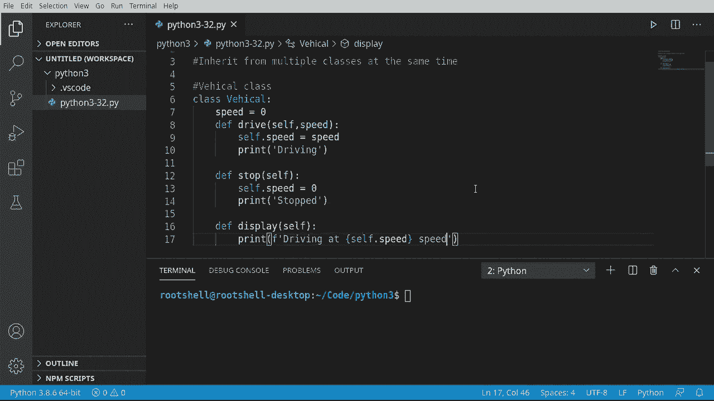
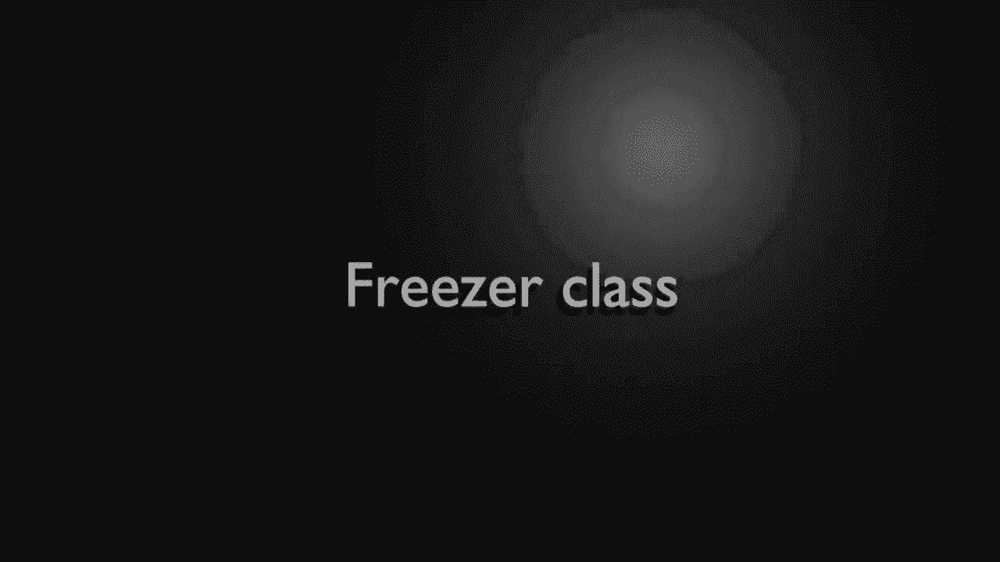
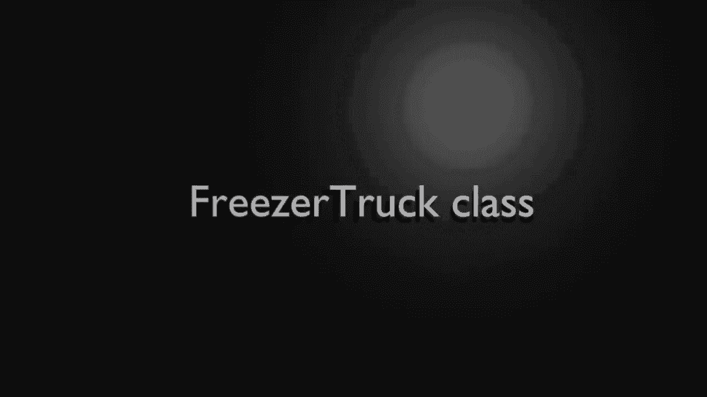

# 【双语字幕+资料下载】Python 3全系列基础教程，全程代码演示&讲解！10小时视频42节，保证你能掌握Python！快来一起跟着视频敲代码~＜快速入门系列＞ - P32：32）多重继承 - ShowMeAI - BV1yg411c7Nw

Welcome back everyone， this is Brian and we're going to talk about multiple inheritance。 we covered classes， we covered inheriting from another class。 but what if you have multiple classes you want to inherit from？

That's exactly what we're going to do。 some languages don't even allow this because it gets so complex。 Let's dive in and take a look。

Let's go ahead and make a class here。 So we're going to make a vehicle class。 or' going say class。别说。And if you remember from the last video， I definitely love to make sure that the instances of the variables are actually created so we don't get that nasty。

 not defined error。We'm going to go ahead and save drive。 Not how we're not putting in a knit here。 We just simply don't need it。 We're going to leave the default constructor。And I'm going to say so。Comma and then speed。We're going to keep those just super ridiculously simple。We're going to say drive， we're going to set the speed， we're going to just copy and paste this。

 and I want another function called stop。We're going to just set the speed to 0。 We don't need。That parameter there。Now let's go ahead and make another function。Allll display。And this is where things are going to get a little bit interesting。 Take special note of this function because we're going to do this function again in another class。

When say print。And we're just going to simply say driving at whatever the speed is speed。

Very simple little self contained class here。

Let's go ahead and make another very， very simple class。 I'm just going to make a freezer class。 And this thing exists solely to well freeze food。Theres a freezer。And let's go ahead and make a variable。 let's call it temp equals 0。 So we're just going to set the temperature20 by default here。Now， I going say tough。Breeze。

So we're going to be able to freeze some food at a specific temperature。E must say， self that temp。Was whatever temperature we just handed it。And let's go ahead and print out。Freezing just so we know that the freezer is actually going to， you know， shockingly freeze the food。Now I'm going to actually grab this right here from the vehicle class， De display self。

 and we're going to modify this， but we're going to put it in our freezer class。You don't have to copy and paste it just as long as the name is the same。 what we're going to do is intentionally create a naming collision between these two classes。So both the vehicle and the freezer have a display function。 I must say freezing。At self dot temp。

 as there is no speed in the freezer class。Very， very simple， very easy to understand。 So what we can do is call these independently called display and see exactly what's going on into the hood。Now let's see what happens if we use multiple inheritance and smash these two together。

Okay， let's go ahead and combine these two together。 we're going to make a freezer truck class。 I'm going to say class。Rraazer truck。And we want a freezer。And a vehicle。We're going to smash those into one giant glass， and initially I'm just going to say pass。So we're just declaring the class and it does nothing else， that's what pass does in Python。

And we're going to go ahead and create it。 I'm going to say T equals。Rraer truck。T dot drive and we want to go at 50 miles per here in the states that's actually relatively fast。And then we're going to say T dot freeze。 I'm going to put this at negative 30。Ca whatever we're carrying， we don't want it to， you know， thawud on the way to the store。

 Then I'm just going to go ahead and print。Now， we are going to print out。Some dashes here。 just to kind of separate。Now， we want to say tea display and pop quiz。We have multiple displays。 we have the freezer class display and the vehicle display。Which one of these is going to be displayed？So we're either going to see freezing at or driving at which one is going to happen here。

 let's find out， save run。Breezing at negative 30。 and we don't get the speed。 We don't see that driving at。So now we've got multiple problems， we want to be able to see。Both of those。But what we've defined， whether we realize it or not， is a new concept called。A method resolution order， or the MRO。And you'll hear this time and time again。

 you'll see people in forums asking how you access or why this is happening。 So the order is very simple。 It's first come first serve。 So we defined freezer first。Therefore。 it's going to display the freezer。 And if we just switch these around。We're still doing the same thing。 We're still inheriting both of these。

 but watch what happens down here。Driving at 50 speed。 So that is the method resolution order。 It first come， first serve。That is frustrating。 So how do we get past this now， let's say deaf。 good display。走。And let's go ahead and let's。Brennt these out， say Prince。F。I want to show you a little trick here。 I want to make sure these are actually subclasses。

 So I'm going to say is a。Re， Sir。I're going to say is。Sb。Basss。And we want freezer truck。So basically we're giving it the current class we're saying。So it's freezer truck。诶。Rreezer。Then we're just going to say， is a。猎好。And grab that。Good on hear bang。Watch what happens when we call display now。Is a freezer true Is a vehicle true。

 So now we are calling our own function， and we can actually determine whether or not it's inheriting a specific class。 The class you want to check is always first。 The class you want to check against is second。So now。Let's go ahead and see。How we would get around this。 I'm going to say super。So we're going to call the parent， the problem is we have two parents now。

 so let's try calling them independently。Say， freezer。Myself。That display。And I'm going to take the same thing。But we're going to use the vehicle。So we're saying super。 call the vehicle， super， call the freezer using the self object， the current object。 and call display directly and see， let's just see what happens here。 Oh， we had a bad time。

So let's look at this in depth here， So on line 42。T display， so this guy down here。And then it's jumping up to line 36， which is this guy right here。Super as。Super object has no attribute display。 Now， wait just a minute。 We do。So if we look at freezer。 it's right there。 What is going on here。 Well， again。

 method resolution order is popping in and saying， nope can't do that。 So just to prove it。Let's comment out freezer those vehicles first， let's run this again。Everything magically works。That is super frustrating。All right。Let's go ahead and just comment these out。 This is not what I consider the correct way to do it。

 but I'm going to put some comments in here just in case somebody grabs the source code here。So what's the best way or the correct way of doing this， Well。 we're going to call that class directly， and there are other ways， probably even better ways。 But this is what we're going to do with our limited knowledge set of Python at this moment。

 We're going to say freezer dot。Display。Remember what I said when we inherit an object。 Python's creating it。 So it knows that the freezer truck has a freezer。In it。So we're going to call freezer display。We're going to call vehicle display。And let's watch this work。Now we can see we are freezing and we are driving。Oh my gosh， super confusing。

 So the major takeaways from this video is Python does allow multiple inheritance。 but it has some gotchas mainly naming collisions。 For example。 we saw that the vehicle and the freezer have a display function。 But once we inherit both of them。 MO steps in and says we're only going to use the first ones。 So if we want to use multiple。

 we have to independently call them。😊，Super challenging， but once we wrap our head around it。 it's also very elegant。